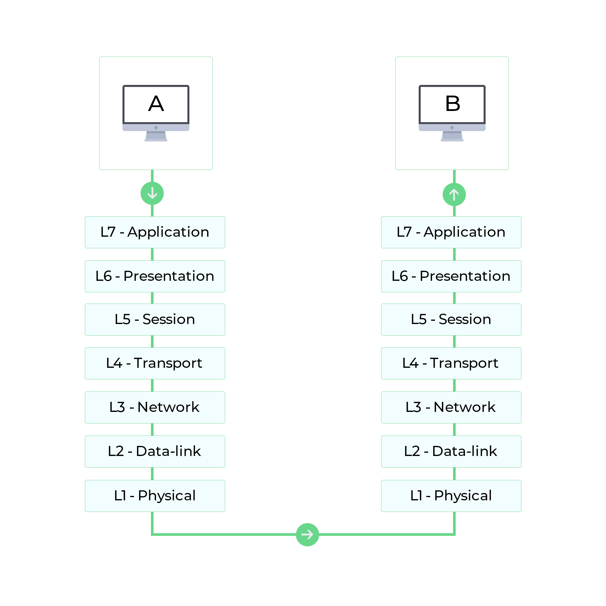
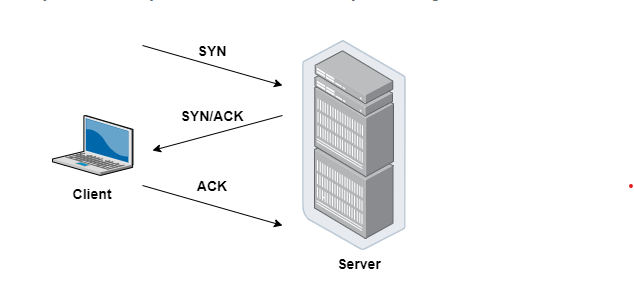

# Web Protocols
- TCP
- HTTP
- TLS/SSL
- SSH
- Websocket

`Web Protocols` là một hệ thống các quy tắc về định dạng dữ liệu và cách thức dữ liệu được trao đổi giữa các máy tính, các thiết bị, các ứng dụng với nhau thông qua Internet.

`Open Systems Interconnection` (OSI) được coi là mô hình kiến trúc chính cho việc truyền dữ liệu trên Internet, phần lớn các giao thức mạng được sử dụng ngày nay có cấu trúc dựa trên mô hình OSI.

    Mô hình OSI chia quá trình giao tiếp giữa hai thiết bị mạng thành 7 lớp. Các nhiệm vụ được định nghĩa cho mỗi lớp trong số 7 lớp này. Tất cả các lớp đều độc lập và các tác vụ của mỗi lớp đều có thể được thực thi một cách độc lập.

| Layers      | Description |
| ----------- | ----------- |
| Layer 7: Application | Giao tiếp trực tiếp với các process của ứng dụng và thực thi các service của các process đó. Gửi các request của service tới Presentation Layer.       |
| Layer 6: Presentation | Bỏ đi sự khác biệt về định dạng dữ liệu giữa các hệ thống với nhau bằng cách mã hóa và giải mã dữ liệu, cũng như nén và giải nén dữ liệu.       |
| Layer 5: Session | Cung cấp một cơ chế để quản lý phiên giao tiếp giữa các tiến trình ứng dụng       |
| Layer 4: Transport | Quản lý việc gửi tin nhắn từ đầu đến cuối trong networks. Renders, delivery các gói tin tuần tự, bảo mật thông qua cơ chế error recovery và flow control       |
| Layer 3: Network | Định tuyến các gói tin theo địa chỉ thiết bị mạng (unique ) và quản lý renders flow tránh tình trạng tắc nghẽn, cạn kiệt tài nguyên mạng        |
| Layer 2:  Data link | Đóng gói các gói tin. Phát hiện và sửa lỗi truyền gói tin.       |
| Layer 1: Physical| Xác định các đặc tính vật lý của thiết bị và là Interface giữa phương tiện mạng với thiết bị.        |

# TCP

`TCP Protocol` - Transmission Control Protocol

- TCP là một giao thức mạng quan trọng cho phép hai Server (hosts) kết nối và trao đổi các dữ liệu, gói tin thông qua data streams.

- TCP đảm bảo việc phân phối dữ liệu và gói tin theo thứ tự như khi chúng được gửi đi.

- Vai trò của TCP: Đảm bảo các gói tin được phân phối một cách đáng tin cậy, không có lỗi. 

- Cơ chế hoạt đông - 3 way handshake:

    + Client gửi cho Server một gói SYN — một yêu cầu kết nối từ port nguồn của nó đến port đích đến của Server.
    + Server phản hồi bằng gói SYN/ACK, xác nhận việc nhận được yêu cầu kết nối.
    + Client nhận gói SYN/ACK và trả lời bằng gói ACK của chính nó.

## HTTP
`HTTP Protocol` - Hypertext Transfer Protocol

- HTTP là một giao thức để fetching HTML resources. 
- Là nền tảng của bất kỳ trao đổi dữ liệu nào trên Web.
- Là một giao thức giữa client-server, các request được khởi tạo bởi client, thường là Browser, để gửi các data: video, image, text v.v tới server và tương tự server response data lại cho client.

## TLS/SSL
`TLS/SSL Protocol`

* SSL Protocol - Secure Sockets Layer
- Là tiêu chuẩn để giữ kết nối internet an toàn và bảo vệ mọi dữ liệu được gửi giữa hai hệ thống với nhau, xác thực giữa hai hệ thống và ngăn tội phạm đọc và sửa đổi bất kỳ thông tin nào được truyền đi.

* TLS Protocol - Transport Layer Security

- Là một updated, more secure version của SSL

## SSH
`SSH Protocol` - Secure Shell

- Là một phương pháp để đăng nhập từ xa an toàn từ máy tính này sang máy tính khác. 
- Cung cấp một số optional để xác thực và nó bảo vệ tính toàn vẹn và bảo mật thông tin liên lạc bằng việc mã hóa. 
- Là một giải pháp thay thế an toàn cho các giao thức đăng nhập không được bảo vệ (chẳng hạn như telnet, rlogin) và các phương thức truyền tệp không an toàn (chẳng hạn như FTP).
- Example: [Connecting to GitHub with SSH](https://docs.github.com/en/authentication/connecting-to-github-with-ssh)

## Websocket
`Websocket protocol`

- Hỗ trợ giao tiếp hai chiều giữa client và server để tạo một kết nối trao đổi dữ liệu. 
- Giao thức này không sử dụng HTTP mà thực hiện nó qua TCP. 
- Mặc dù được thiết kế để chuyên sử dụng cho các ứng dụng web, lập trình viên vẫn có thể đưa chúng vào bất kì loại ứng dụng nào.
- Có độ trễ thấp và dễ xử lý lỗi. Websocket thường được sử dụng cho những trường hợp yêu cầu real time như chat, hiển thị biểu đồ hay thông tin chứng khoán.

## Reference
1. [MDN Web Docs](https://developer.mozilla.org/)

2. [Network Protocols](https://www.manageengine.com/network-monitoring/network-protocols.html)

3. [SSH protocol](https://www.ssh.com/academy/ssh/protocol)

4. [Connecting to GitHub with SSH](https://docs.github.com/en/authentication/connecting-to-github-with-ssh)

5. [Websocket Protocols](https://datatracker.ietf.org/doc/html/rfc6455)

6. [tcp-3-way-handshake](https://www.guru99.com/tcp-3-way-handshake.html)