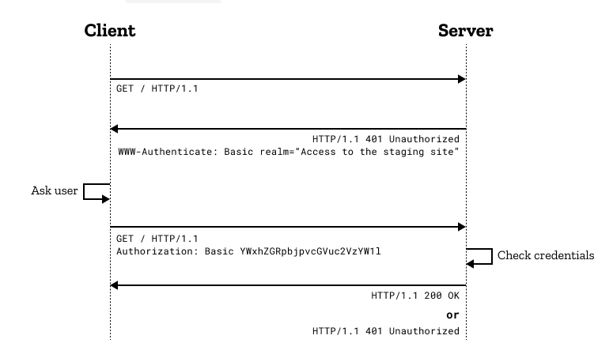

# HTTP Protocol
- Request headers and methods
- Response headers and status
- CORS
- Authentication
- Cookie, Cache

## Overview
- `Hypertext Transfer Protocol` (HTTP) là một giao thức thuộc tầng Application dùng để truyền các hypermedia documents, chẳng hạn như HTML. 

- HTTP tuân theo mô hình client-server, với client mở kết nối để thực hiện request, sau đó đợi cho đến khi nhận được respone từ server.

- `HTTP Headers`: Được sử dụng để mô tả tài nguyên hoặc hành vi của client/server. 

- Một số Header fields phổ biến:
    - Request headers: `authority`, `method`, `path`, `scheme`, `accept`, `accept-encoding`, `accept-language`, `cookie`, `user-agent` ...

    - Response headers: `access-control-allow-origin`, `content-length`, `content-type`, `date`, `server`, `set-cookie` ...

Header fields được mô tả trong [IANA registry](https://www.iana.org/assignments/message-headers/message-headers.xhtml#perm-headers)
hoặc [HTTP Headers - MDN Web Docs](https://developer.mozilla.org/en-US/docs/Web/HTTP/Headers)

## Request headers and methods

### Concepts

- `Request headers` là một HTTP Headers, dùng trong 1 HTTP Request để cung cấp thông tin về request context, để server tiếp nhận, xử lý và gửi các Response về cho clinet. 

- Không phải tất cả các headers xuất hiện trong một request đều được là Request headers. Ví dụ: Content-Type header được gọi là [representation header](https://developer.mozilla.org/en-US/docs/Glossary/Representation_header).

### Example
HTTP message dưới đây minh họa cho một Request headers sau khi gửi một GET mothod request:
```
GET /home.html HTTP/1.1
Host: developer.mozilla.org
User-Agent: Mozilla/5.0 (Macintosh; Intel Mac OS X 10.9; rv:50.0) Gecko/20100101 Firefox/50.0
Accept: text/html,application/xhtml+xml,application/xml;q=0.9,*/*;q=0.8
Accept-Language: en-US,en;q=0.5
Accept-Encoding: gzip, deflate, br
Referer: https://developer.mozilla.org/testpage.html
Connection: keep-alive
Upgrade-Insecure-Requests: 1
If-Modified-Since: Mon, 18 Jul 2016 02:36:04 GMT
If-None-Match: "c561c68d0ba92bbeb8b0fff2a9199f722e3a621a"
Cache-Control: max-age=0

```
### Methods
Một trong những mục tiêu chính của phương pháp RESTful API là sử dụng HTTP như một giao thức ứng dụng để tránh định hình một API tự chế.
Do đó, chúng ta nên sử dụng các động từ HTTP một cách có hệ thống để mô tả những hành động nào được thực hiện trên các tài nguyên và thuận lợi cho việc phát triển khi xử lý các hoạt động CRUD lặp lại.

[_Demo_](https://jsonplaceholder.typicode.com/guide/)

__1. GET__

- Phương thức GET được sử dụng để truy xuất thông tin từ server thông qua một URI nhất định. Các request sử dụng GET method chỉ nên truy xuất dữ liệu và không có tác dụng, ảnh hưởng nào khác đối với dữ liệu.
- Syntax: `GET /index.html`

__2. POST__
- Phương thức POST được sử dụng để gửi dữ liệu đến máy chủ, ví dụ: thông tin khách hàng, tải lên tệp, v.v. bằng cách sử dụng các HTML forms và dẫn đến thay đổi trên server. 

- Type of the body của POST methods request được mô tả trong Content-Type header:
    + `application/x-www-form-urlencoded`: các key và value trong key-value pair được mã hóa, phân tách bằng `&`, với dấu `=` giữa key và value. Ngoài ra ký tự không phải chữ và số đều được mã hóa theo `%`.

    + `multiart/form-data`: mỗi values được gửi dưới dạng một block of data. Còn các key được kèm trong Content-Disposition header. => Dùng cho tải tệp.

    + `text/plain`: Là một kiểu trong HTML 5, dữ liệu gửi lên mà ko có mã hóa.

- Syntax: `POST /test`
- Example: 
    + Form sử dụng `application/x-www-form-urlencoded` content type:

    ```
    POST /test HTTP/1.1
    Host: foo.example
    Content-Type: application/x-www-form-urlencoded
    Content-Length: 27

    field1=value1&field2=value2
    ```

    + Form sử dụng `multipart/form-data` content type:

    ```
    POST /test HTTP/1.1
    Host: foo.example
    Content-Type: multipart/form-data;boundary="boundary"

    --boundary
    Content-Disposition: form-data; name="field1"

    value1
    --boundary
    Content-Disposition: form-data; name="field2"; filename="example.txt"

    value2
    --boundary--
    ```

__3. PUT__

- Tạo mới hoặc thay thế giá trị hiện tại của tài nguyên dựa trên các nội dung được gửi.

- Sự khác biệt giữa `PUT` và `POST`:


    + POST method được dùng để gửi các request kèm theo một entity đến server request tạo một tài nguyên mới dựa trên entity được cung cấp.

    + PUT method thường kèm theo một định danh (thường là ID) cùng với một entity. Nếu một tài nguyên được tìm thấy bởi mã định danh kèm theo thì tài nguyên này sẽ được thay thế bởi các giá trị trong entity kèm theo. Ngược lại, PUT method sẽ tạo một tài nguyên dựa trên entity đã cung cấp.

    + Nếu gọi PUT method nhiều lần thì sẽ nó tạo hoặc cập nhật cùng một tài nguyên (dựa vào mã định danh). Còn với POST thì việc chúng ta thực thi nhiều lần với cùng một enity thì nó sẽ tạo ra nhiều tài nguyên ở phía server có giá trị tương tự nhau.

- Syntax: PUT /new.html HTTP/1.1

- Example: Gửi một PUT method request:
    ```
    PUT /new.html HTTP/1.1
    Host: example.com
    Content-type: text/html
    Content-length: 16

    <p>New File</p>
    ```
    Response sẽ có 2TH:
    + Target resource không có thì tạo mới:
    ```
    HTTP/1.1 201 Created
    Content-Location: /new.html
    ```
    + target resource có thì cập nhật:
    ```
    HTTP/1.1 204 No Content
    Content-Location: /existing.html
    ```


__4. PATCH__
- Được sử dụng để thực hiện các cập nhật nhỏ đối với các tài nguyên và nó không bắt buộc phải là tài nguyên
- So sánh `PATCH` với `PUT`:
    + Khi sử dụng `PUT` để update, ta phải gửi 1 record đầy đủ các field để request cập nhật. Nếu chỉ gửi 1 số field nhất định thì những field còn lại sẽ bị null.
    + `PATCH` giống `PUT` về ý nghĩa là để update resource nhưng khác nhau về cách làm việc, nó chỉ thay đổi những field được request thay vì thay đổi toàn bộ record.

- Syntax: `PATCH /file.txt HTTP/1.1`

- Example: Gửi request:
    ```
    PATCH /file.txt HTTP/1.1
    Host: www.example.com
    Content-Type: application/example
    If-Match: "e0023aa4e"
    Content-Length: 100

    [description of changes]
    ```

__5. DELETE__
- Loại bỏ tất cả các tài nguyên được chỉ định ( trên URI).

- Syntax: `DELETE /file.html HTTP/1.1`

- Example: Gửi request:

    ```
    DELETE /file.html HTTP/1.1
    Host: example.com
    ```
    Nếu DELETE được áp dụng thành công, có thể có một số response status codes sau:

    + `202` (`Accepted`): Delete acctions có khả năng thành công nhưng chưa được thực thi.
    + `204` (`No content`): Delete acctions đã được thực hiện và không có thêm thông tin nào được cung cấp.
    + `200` (`OK`): Delete acction đã được thực hiện và thông báo phản hồi thành công.

__6. HEAD__

- Phương thức HTTP `HEAD` gần giống với `GET`, tuy nhiên nó không có response body. Do không có response body nên thời gian phản hồi nhanh hơn so với phương thức Get

- Syntax: `HEAD /index.html`

- Example: 
    + Dùng để kiểm tra API có hoạt động không. 
    + Sử dụng để kiếm tra trước khi download file do cứ gọi đến api dowload sẽ download file nên thêm phương thức head vào nó kiểm tra xem api có đang hoạt động tốt không tránh down nhiều.

__7. CONNECT__
- Phương thức HTTP `CONNECT` bắt đầu giao tiếp hai chiều với tài nguyên được request. Thường được sử dụng để mở một tunnel.

- Syntax: `CONNECT www.example.com:443 HTTP/1.1`

- Example: Connect tới proxy servers: 
    ```
    CONNECT server.example.com:80 HTTP/1.1
    Host: server.example.com:80
    Proxy-Authorization: basic aGVsbG86d29ybGQ=
    ```

__8. OPTIONS__

- Mô tả các tùy chọn giao tiếp cho resource.

- Syntax: 
    ```
    OPTIONS /index.html HTTP/1.1
    OPTIONS * HTTP/1.1
    ```

- Example: 
    ```
    curl -X OPTIONS https://example.org -i
    ```
    Sau đó response các phương thức có thể dùng để giao tiếp với resource:
    ```
    HTTP/1.1 204 No Content
    Allow: OPTIONS, GET, HEAD, POST
    Cache-Control: max-age=604800
    Date: Thu, 13 Oct 2016 11:45:00 GMT
    Server: EOS (lax004/2813)
    ```

__9. TRACE__

- Thực hiện một bài test loop - back theo đường dẫn đến resource.

- Syntax: `TRACE /index.html`

## Response headers and status

__1. Concepts__

- Sau khi nhận và phân tích Request Header, Server sẽ gửi Response Header với cú pháp:
```
<http-version> <status> <reason-pharse>
<headers>
<body>
```
+ `HTTP-version`: phiên bản HTTP cao nhất mà server hỗ trợ.
+ `Status-Code`: mã của kết quả trả về
+ `Reason-Phrase`: mô tả về Status-Code.

__2.HTTP response status codes__

HTTP response status codes cho biết trạng thái của một HTTP request cụ thể đã được hoàn tất thành công hay chưa. Các câu trả lời được nhóm thành năm lớp:

- 1xx: `Thông tin`. Mã này nghĩa là request đã được nhận và tiến trình đang tiếp tục.
- 2xx: `Thành công`. Mã này nghĩa là hoạt động đã được nhận, được hiểu, và được chấp nhận một cách thành công.
- 3xx: `Điều hướng`. Mã này nghĩa là actions tiếp theo phải được thực hiện để hoàn thành request.
- 4xx: `Lỗi Client`. Mã này nghĩa là request chứa cú pháp không chính xác hoặc không được thực hiện.
- 5xx: `Lỗi Server`. Mã này nghĩa là Server gặp lỗi trong quá trình thực hiện, xử lý một request.

__3.The mostly used status codes__
- `200 – OK`: Mọi thứ OK, ko có lỗi lầm gì
- `201 – CREATED`: Một resource mới đã được tạo thành công
- `204 – NO CONTENT`: Tài nguyên đã được xóa thành công, không có response body.
- `304 – NOT MODIFIED`: Dữ liệu đã lưu trong bộ nhớ đệm (dữ liệu không thay đổi).
- `400 – BAD REQUEST`: Request không hợp lệ hoặc không thể được phục vụ. 
- `401 – UNATHORIZED`: Request cần xác thực người dùng.
- `403 – FORBIDDEN`: Máy chủ đã hiểu request nhưng đang từ chối xử lý hoặc không được phép truy cập. 
- `404 – NOT FOUND`: Không tìm thấy resource từ URI.
- `500 – INTERNAL SERVER ERROR`: Lỗi từ phía Server.

## CORS
- `Cross-Origin Resource Sharing` (CORS) là một cơ chế dựa trên HTTP Header cho phép máy chủ định nghĩa nhiều tài nguyên khác nhau (fonts, Javascript, v.v…) của một trang web có thể được truy vấn từ domain khác với domain của trang đó.

- CORS được sinh ra là vì same-origin policy, là một chính sách liên quan đến bảo mật được cài đặt vào toàn bộ các trình duyệt hiện nay. Chính sách này ngăn chặn việc truy cập tài nguyên của các domain khác một cách vô tội vạ. Khi đó, CORS sử dụng các HTTP header để “thông báo” cho trình duyệt rằng, một ứng dụng web chạy ở origin này (thường là domain này) có thể truy cập được các tài nguyên ở origin khác (domain khác).

-  CORS giúp thúc đấy quá trình trao đổi dữ liệu giữa trình duyệt và máy chủ. CORS hoàn toàn không có liên quan gì đến việc trao đổi trực tiếp giữa ứng dụng web mà một máy chủ web khác, ví dụ backend của ứng dụng đó truy cập đến tài nguyên trên một origin khác, nó cũng không cần đến CORS.

**2. CORS in HTTP Headers**

1. `Access-Control-Allow-Origin`: Cho biết liệu response có thể được chia sẻ hay không.

    ```
    Access-Control-Allow-Origin: *
    Access-Control-Allow-Origin: <origin>
    Access-Control-Allow-Origin: null
    ```

2. `Access-Control-Allow-Credentials`: Cho biết liệu response cho request có thể được hiển thị hay không khi credentials flag bằng true.

    ```
    Access-Control-Allow-Credentials: true
    ```
3. `Access-Control-Allow-Methods`: Chỉ định các phương thức được phép khi truy cập tài nguyên để đáp ứng request.

    ```
    Access-Control-Allow-Methods: <method>, <method>, ...
    Access-Control-Allow-Methods: *
    ```
4. `Access-Control-Expose-Headers`: Liệt kê tên các thành phần của header có thể được hiển thị như một phần của response.

    ```
    Access-Control-Expose-Headers: [<header-name>[, <header-name>]*]
    Access-Control-Expose-Headers: *
    ```
5. `Origin`: Cho biết nơi fetch origins (domain, hostname. schema, port).
    ```
    Origin: null
    Origin: <scheme>://<hostname>
    Origin: <scheme>://<hostname>:<port>
    ```
6. `Timing-Allow-Origin`: Chỉ định thời gian cho phép truy cập tới origins
    ```
    Timing-Allow-Origin: *
    Timing-Allow-Origin: <origin>[, <origin>]*
    ```

## Authentication

- Giao thức HTTP cung cấp một khuôn khổ chung để kiểm soát và xác thực quyền truy cập tài nguyên gọi là `HTTP Basic Authentication`.

- Example:




## Cookie, Cache

**1. Cookie**

- Được dùng để lưu những thông tin tạm thời
-  Cookie sẽ được truyền từ server tới browser và được lưu trữ tại đó. Mỗi khi người dùng access ứng dụng, browser sẽ gửi request kèm theo cookie, giúp hạn chế việc server response về nhiều lần cùng 1 resource.
- Tồn tại có thời hạn.

_a. Creating cookies_

Một HTTP response header gồm filed `Set-Cookie` sẽ gửi cookie từ server đến client theo cú pháp:

```
Set-Cookie: <cookie-name>=<cookie-value>
```
Ví dụ: Server response về browser kèm theo `Set-Cookie`:
```
HTTP/2.0 200 OK
Content-Type: text/html
Set-Cookie: yummy_cookie=choco
Set-Cookie: tasty_cookie=strawberry

[page content]
```

Sau đó, với mỗi request tiếp theo đến server, browser sẽ gửi tất cả các cookie đã lưu trữ trước đó trở lại server bằng cách sử dụng title `Cookie`:

```
GET /sample_page.html HTTP/2.0
Host: www.example.org
Cookie: yummy_cookie=choco; tasty_cookie=strawberry
```

_b. Define the lifetime of a cookie_

Ta có thể set thời gian tồn tại của cookie theo hai cách:

 - `Session cookies` bị xóa khi session giữa client-server hiện tại kết thúc. 

- `Permanent cookies` sẽ bị xóa vào một ngày được chỉ định bởi thuộc tính `Expire`s hoặc sau một khoảng thời gian được chỉ định bởi thuộc tính `Max-Age`. Ví dụ:
```
Set-Cookie: id=a3fWa; Expires=Thu, 31 Oct 2021 07:28:00 GMT;
```

**2. Cache**
- Cache là bộ nhớ đệm, vùng lưu trữ tạm thời trong máy tính. Nó khác với cookie ở chỗ thông tin lưu trữ ở đây là các tài liệu web, các hình ảnh, các video, HTML,

- Cache bao gồm bản sao các bit của trang Web được lưu trữ trên ổ đĩa cứng. Browser sẽ tải các bit khi user truy cập một trang Web nào đó, tốc độ truy cập sẽ nhanh hơn và tiết kiệm được băng thông khi download. 

- Bộ nhớ cache sẽ được lưu trữ cho đến khi user xóa nó đi.

_a. Types of caches_
- `Private browser caches`: Dành riêng cho một user. Lưu giữ tất cả các tài liệu mà người dùng tải xuống qua HTTP. Cache này được sử dụng để cung cấp các tài liệu mà người dùng đã truy cập để điều hướng mà không cần gửi request tới server. 
- `Shared proxy caches`: Lưu trữ các response để nhiều người dùng sử dụng lại. Ví dụ: Nhà cung cấp dịch vụ Internet (ISP) hoặc công ty của bạn có thể đã thiết lập proxy web như một phần của cơ sở hạ tầng mạng cục bộ để phục vụ nhiều người dùng để các tài nguyên phổ biến được sử dụng lại một số lần, giảm lưu lượng mạng và độ trễ.

_b. Controlling caching_

HTTP Header có một field là `Cache-Control` được sử dụng để chỉ định cơ chế bộ nhớ đệm trong cả request và response.

- `No caching`: Không lưu trữ bất kỳ thứ gì về request của client hoặc response của server. 

    ```
    Cache-Control: no-store
    ```
- `Cache but revalidate`: Cache sẽ gửi request đến máy chủ gốc để xác thực trước khi được lưu.

    ```
    Cache-Control: no-cache
    ```
- `Private and public caches`:
    -  Public caches: Response có thể được lưu vào bộ đệm ẩn bởi bất kỳ bộ đệm nào. 
    - Private caches: chỉ ra rằng response chỉ dành cho một người dùng duy nhất và không được lưu trữ bởi bộ nhớ đệm dùng chung.

    ```
    Cache-Control: private
    Cache-Control: public
    ```

- `Expiration`: Thời hạn tồn tại của cahe nếu chưa được người dùng xóa.

    ```
    Cache-Control: max-age=31536000
    ```

- `Validation`:  Cahe phải xác minh trạng thái của tài nguyên cũ trước khi sử dụng chúng. Tài nguyên đã hết hạn không nên được sử dụng.

    ```
    Cache-Control: must-revalidate
    ```

## Reference

1. [HTTP Protocols](https://www.w3.org/Protocols/rfc2616/rfc2616-sec5.html)
2. [HTTP Headers](https://developer.mozilla.org/en-US/docs/Web/HTTP/Headers)
3. [Message Headers](https://www.iana.org/assignments/message-headers/message-headers.xhtml#perm-headers)
4. [Request Header](https://developer.mozilla.org/en-US/docs/Glossary/Request_header)
5. [Response Header](https://developer.mozilla.org/en-US/docs/Glossary/Response_header)
6. [HTTP Headers - MDN Web Docs](https://developer.mozilla.org/en-US/docs/Web/HTTP/Headers)
7. [CORS](https://developer.mozilla.org/en-US/docs/Web/HTTP/CORS)
8. [Authentication](https://developer.mozilla.org/en-US/docs/Web/HTTP/Authentication)
9. [Cookies](https://developer.mozilla.org/en-US/docs/Web/HTTP/Cookies)
10. [Caching](https://developer.mozilla.org/en-US/docs/Web/HTTP/Caching)