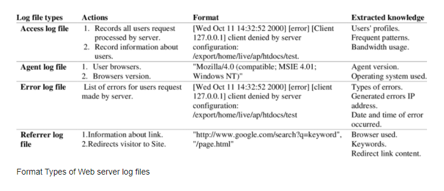

# Web server and proxy
- Nginx
- Reverse proxy / Forward Proxy
- PHP-FPM / Node
- Log

## Nginx
### 1. Concepts

Trích dẫn định nghĩa về NGINX trên [nginx.com](https://www.nginx.com/resources/glossary/nginx/)

```
NGINX is open source software for web serving, reverse proxying, caching, load balancing, media streaming, and more. It started out as a web server designed for maximum performance and stability. In addition to its HTTP server capabilities, NGINX can also function as a proxy server for email (IMAP, POP3, and SMTP) and a reverse proxy and load balancer for HTTP, TCP, and UDP servers.
```


- NGINX là một web server mã nguồn mở:

    + `Reverse proxying`: Reverse proxy là một loại proxy server trung gian giữa một máy chủ và các client gửi tới các request. Nó kiểm soát request của các client, nếu hợp lệ, sẽ luân chuyển đến các server tương ứng.

    + `Caching`: Caching proxy là một server lưu các files tĩnh để phục vụ cho việc gửi trả lại các response cho các request phổ biến. Nó sẽ tiếp nhận các request thông thường và nhanh chóng gửi response. Caching proxy sẽ giúp máy chủ chính của bạn không phải xử lý các request này, do đó giảm gánh nặng cho phía server.

    + `Load balancing`: Phân phối lưu lượng truy cập của nhiều users đến một nhóm backend servers, hay còn được gọi là server farm hoặc server pool.

    + `Media streaming` : Streaming server là máy chủ được dùng trong truyền phát Audio và Video. Một số máy chủ Streaming chỉ có thể làm việc với các định dạng cụ thể và số khác có khả năng xử lý nhiều kiểu File khác nhau.

    _and more..._

### 2. Features

__Basic HTTP server features__

- Serving cho các static files, tự động lập index

- Tăng tốc reverse proxy bằng bộ nhớ đệm (cache), cân bằng tải đơn giản và khả năng chịu lỗi.

- Hỗ trợ tăng tốc với bộ nhớ đệm của FastCGI, uwsgi, SCGI, và các máy chủ memcached.

- Kiến trúc modular, tăng tốc độ nạp trang bằng nén gzip tự động.

- Hỗ trợ mã hoá SSL và TLS.

- Cấu hình linh hoạt; lưu lại nhật ký truy vấn (logging)

- Giới hạn số kết nối đồng thời hoặc truy vấn từ 1 địa chỉ


__Other HTTP server features__

- Máy chủ ảo dựa trên tên và dựa trên IP

- Chuyển hướng mã lỗi 3XX-5XX

- Truy cập tới các định dạng ghi log, buffered log , fast log và system log.

- Rewrite URL (URL rewriting) dùng regular expressions

- Hạn chế tỷ lệ đáp ứng truy vấn

- Khả năng nhúng mã PERL

- Hỗ trợ và tương thích với IPv6

- Hỗ trợ WebSockets

- Hỗ trợ truyền tải file FLV và MP4

__Mail proxy server features__

- Chuyển hướng người dùng đến máy chủ IMAP hoặc POP3 bằng máy chủ external HTTP authentication;

- Xác thực người dùng bằng máy chủ external HTTP authentication và chuyển hướng kết nối đến máy chủ SMTP nội bộ;

- Hỗ trợ các phương pháp xác thực người dùng:

    + POP3: USER/PASS, APOP, AUTH LOGIN/PLAIN/CRAM-MD5;
    + IMAP: LOGIN, AUTH LOGIN/PLAIN/CRAM-MD5;
    + SMTP: AUTH LOGIN/PLAIN/CRAM-MD5;

- Hỗ trợ SSL, STARTTLS và STLS

__TCP/UDP proxy server features__

- Dùng chung Generic proxying cho cả TCP và UDP

- Hỗ trợ SSL và TLS SNI cho TCP

- Cân bằng tải và khả năng chịu lỗi

- Định vị địa lý dựa trên IP

- Kiểm soát truy cập dựa trên client address; Thực thi các chức năng khác nhau tùy thuộc vào client address

- Giới hạn số lượng kết nối đồng thời đến từ một địa chỉ (client address)

- Truy cập tới các định dạng ghi log, buffered log , fast log và system log.


## Reverse proxy / Forward Proxy

### 1. Reverse proxy


#### a. Concepts
- `Reverse Proxy` đóng vai trò làm cầu nối giữa client và server. Nó nhận request của client và chuyển lên server và nhận response từ server để chuyển tới client, cho nên response từ nó giống như là một máy chủ.

- Client và server liên tục trao đổi thông tin. Thông thường, reverse proxies được dùng như là một web server. Reverse proxy hay gateway được client coi như là một máy chủ web, không cần cấu hình gì đặc biệt. Client sẽ gửi các lệnh truy vấn resource và reverse proxy sẽ quyết định nơi chuyển thông tin đến server và nơi response thông tin về cho client.

#### b. Fetures

- Đơn giản để triển khai, tạo tính bảo mật cao giúp ngăn chặn tấn công web server như DDoS và DoS

- Nginx Reverse proxy giúp tạo cân bằng tải giữa nhiều server hạ tầng và là giải pháp caching cho những server chậm.

- Nginx không đòi hỏi thiết lập mới cho từng request từ client. Nó mặc định dùng một process trên mỗi CPU.

- Reverse proxy hỗ trợ nhiều giao thức đa dạng: HTTP, HTTPS, TCP, UDP, SMTP, IMAP, và POP3

- Có thể xử lý hơn 10000 kết nối nhưng chiếm ít dung lượng bộ nhớ. Giúp cho Nginx server có thể vận hành nhiều web server khác nhau chỉ từ 1 IP và vẫn có thể response đúng kết quả tới đúng server trong mạng LAN.

- Reverse Proxy Nginx Server là một trong các web server tốt nhất cải thiện tốc độ load cho nội dung tĩnh. Hơn nữa, nó cũng hữu dụng khi đóng vai trò cache nội dung để thực hiện mã hóa SSL để giảm tải cho web server chính

- Nó cũng hữu dụng để tối ưu nội dung và nén chúng để giảm thời gian tải.

### 2. Forward proxy


#### a. Concepts

- `Forward Proxy` là loại proxy server được dùng phía client (thay vì ở server như `Reverse Proxy`), nó có thể được đặt ở trong mạng nội bộ hoặc trên internet.

- Khi sử dụng forward proxy, các requests phía client sẽ tới  forward proxy server và forward proxy server này sẽ chuyển tiếp các requests này tới Internet
#### b. Fetures
- Ẩn địa chỉ IP của client khi truy cập tới các website trên internet do phía các website chỉ có thể biết được địa chỉ của forward proxy server.

- Dùng trong công ty, tổ chức để chặn các website không mong muốn, quản lý truy cập và chặn các content độc hại.

- Có thể được dùng để Bypass firewall restriction để truy cập các website bị chặn bởi công ty, chính phủ, v. v...

- Sử dụng làm caching server để tăng tốc độ.

## PHP-FPM / Node
### 1. PHP-FPM

#### a. Concepts

- `PHP-FPM` viết tắt của `PHP - FastCGI Process Manager` là chương trình có chức năng phiên dịch PHP khi chạy trang web cho web server. PHP-FPM được hình thành dựa trên sự mở rộng của `CGI` và có cộng đồng sử dụng, support lớn.

- `CGI - Common Gateway Interface` là một phần mềm lập trình có chức năng kết nối giữa máy chủ và chương trình, dựa trên các định dạng đặc tả thông tin.

- `CGI` là một phần mềm lập trình, có nhiệm vụ xây dựng chương trình từ các trang web. Sau khi nhận dữ liệu từ các trang web dưới định dạng HTML, phần mềm này sẽ truyền dữ liệu đó qua cổng thông tin Internet đến máy tính của người dùng.

- `FastCGI`: là một giao thức phát triển mở rộng từ CGI. Mục đích chính của FastCGI là để web server tối ưu trong việc xử lý. Đồng thời giúp máy chủ có thể xử lí nhiều request từ trang web trong cùng một lúc.

#### b. Features

- Về cơ bản, PHP-FPM có chức năng tối ưu quá trình xử lý thông tin của các máy chủ web, hỗ trợ việc xử lý thông tin từ nhiều trang web trong cùng một khoảng thời gian một cách nhanh nhất.

- Với tốc độ xử lý PHP script nhanh cùng tính năng tối ưu hoá cho những trang web có kích thước lớn, giúp tăng lượng truy cập, PHP-FPM trở nên phổ biến và có cộng đồng người dùng lớn.

- Upside:
    + Tính năng vượt trội nhất của PHP-FPM là hiệu suất cao, 
    
    + Sự ổn định và tính bảo mật cao hơn nhiều so với CGI. 
    
    + Phần mềm này có thể chạy PHP Script dưới quyền sở hữu PHP Scripts đó.

    + Khai thác rất ít tài nguyên CPU khi chạy chương trình &rarr; Giúp tốc độ tải trang nhanh hơn, việc truy cập của người dùng trở nên dễ dàng &rarr; Lưu lượng truy cập trang web sẽ tăng cao hơn.

- Downside:
    + Tiêu tốn dung lượng RAM. 

### 2. Node
#### a. Concepts
- `NodeJS` là một mã nguồn mở, đa nền tảng, chạy trên môi trường JavaSript, được xây dựng trên V8 JavaScript engine của Chrome - V8 thực thi mã JavaScript bên ngoài trình duyệt. 

- `Asynchronous programming`: Về bản chất, nó thực hiện các request đồng thời, ngay cả khi chúng ở các chức năng khác nhau. Một single thread sẽ được handle multiple-requests trong `event-loop`. Vì vậy, việc một request bị reject sẽ không ảnh hưởng đến request khác.NodeJS cho phép thực hiện lập trình bất đồng bộ. Khi bất đồng bộ thực thi tất cả dòng code cùng một lúc.

- `Synchronous programming`: Tải tài nguyên một cách đơn lẻ và tuần tự, như vậy khi tài nguyên trong hệ thống có phân cấp không tải được, thì những tài nguyên bên dưới nó sẽ không tải được luôn. Với NodeJS, ở chế độ đồng bộ thực thi từng dòng và tiến hành thực thi dòng tiếp theo khi dòng hiện tại đã thực thi xong.

- NodeJS sử dụng I/O Model lập trình theo event, non-blocking &rarr; NodeJS khá gọn nhẹ và hiệu quả &rarr; Công cụ hoàn hảo cho các ứng dụng chuyên sâu về dữ liệu realtime chạy trên các Distributed control system.

- NodeJS là môi trường runtime mã nguồn mở đa nền tảng  &rarr; Sử dụng để phát triển các ứng dụng mạng và ứng dụng server-side  &rarr; có thể chạy trên OS X, Microsoft Windows và Linux.
#### b. Features

- `Asynchronous and Event Driven`: Lập trình bất đồng bộ hướng sự kiện. Toàn bộ API trong thư viện NodeJS đều bất đồng bộ, hay non-blocking. Có nghĩa là một server sử dụng NodeJS sẽ không phải chờ một API response về data. Server có thể chuyển sang API khác sau khi gọi API trước đó và cơ chế thông báo của Events trong NodeJS giúp server nhận được response từ lần gọi API trước.

- `Very Fast`: Được xây dựng trên Công cụ JavaScript V8 của Google Chrome, thư viện NodeJS có khả năng xử lý mã vô cùng nhanh.

- `Single Threaded but Highly Scalable `: NodeJS sử dụng single threaded model với event looping. Cơ chế event cho phép máy chủ response non-blocking và cũng cho phép khả năng mở rộng cao hơn so với các server truyền thống hỗ trợ giới hạn các thread để xử lý các request. 

- `No Buffering`: Các ứng dụng NodeJS không có vùng nhớ tạm thời (buffer) cho bất kỳ dữ liệu nào. Các ứng dụng này chỉ đơn giản xuất dữ liệu theo dạng block.

- `License`: NodeJS được phát hành theo giấy phép MIT.

## Web Server Logs

### 1. Concepts

- `Web Server Logs` là các tệp ghi lại nhật ký của một web server, được web server tự động tạo và đọc, ghi lại `list of activities` mà web server đã thực hiện. 
- `W3C` công bố một định dạng chuẩn cho việc ghi logs của web server [The Common Log Format](https://www.w3.org/Daemon/User/Config/Logging.html) và [Extended Log File Format](https://www.w3.org/TR/WD-logfile.html)

```
#Version: 1.0
#Date: 12-Jan-1996 00:00:00
#Fields: time cs-method cs-uri
00:34:23 GET /foo/bar.html
12:21:16 GET /foo/bar.html
12:45:52 GET /foo/bar.html
12:57:34 GET /foo/bar.html
```

- Nội dung của 1 file log thường gồm index nằm ở cuối tệp, thông tin về request, bao gồm địa chỉ IP máy client, ngày/giờ của request, URL của trang được request,  HTTP code, bytes served, user agent và các referrer. Ngoài ra, các dữ liệu này có thể tách thành các log riêng biệt như `AccessLog`, `ErorLog` hoặc `ReferrerLog`.

- User thông thường không thể truy cập được những log files, chỉ admin được phân quyền mới truy cập được. Và thường admin sẽ xem phân tích, thống kê của server log để kiểm tra các lưu lượng access theo thời gian, xem các referrer hoặc user agent, error. Các phân tích này sẽ hỗ trợ cho việc quản trị trang web hiệu quả, tài nguyên lưu trữ đầy đủ và điều chỉnh các lỗi hệ thống.

### 2. Common values usually found in a Web Server Log
- Apache server log file:
```
192.168.198.92 - - [22/Dec/2002:23:08:37 -0400] "GET 
   / HTTP/1.1" 200 6394 www.yahoo.com 
   "-" "Mozilla/4.0 (compatible; MSIE 6.0; Windows NT 5.1...)" "-"
192.168.198.92 - - [22/Dec/2002:23:08:38 -0400] "GET 
   /images/logo.gif HTTP/1.1" 200 807 www.yahoo.com 
   "http://www.some.com/" "Mozilla/4.0 (compatible; MSIE 6...)" "-"
192.168.72.177 - - [22/Dec/2002:23:32:14 -0400] "GET 
   /news/sports.html HTTP/1.1" 200 3500 www.yahoo.com 
   "http://www.some.com/" "Mozilla/4.0 (compatible; MSIE ...)" "-"
192.168.72.177 - - [22/Dec/2002:23:32:14 -0400] "GET 
   /favicon.ico HTTP/1.1" 404 1997 www.yahoo.com 
   "-" "Mozilla/5.0 (Windows; U; Windows NT 5.1; rv:1.7.3)..." "-"
192.168.72.177 - - [22/Dec/2002:23:32:15 -0400] "GET 
   /style.css HTTP/1.1" 200 4138 www.yahoo.com 
   "http://www.yahoo.com/index.html" "Mozilla/5.0 (Windows..." "-"
192.168.72.177 - - [22/Dec/2002:23:32:16 -0400] "GET 
   /js/ads.js HTTP/1.1" 200 10229 www.yahoo.com 
   "http://www.search.com/index.html" "Mozilla/5.0 (Windows..." "-"
192.168.72.177 - - [22/Dec/2002:23:32:19 -0400] "GET 
   /search.php HTTP/1.1" 400 1997 www.yahoo.com 
   "-" "Mozilla/4.0 (compatible; MSIE 6.0; Windows NT 5.1; ...)" "-"
```
- IIS (Internet Information Service) server log file:
```
02:49:12 127.0.0.1 GET / 200
02:49:35 127.0.0.1 GET /index.html 200
03:01:06 127.0.0.1 GET /images/sponsered.gif 304
03:52:36 127.0.0.1 GET /search.php 200
04:17:03 127.0.0.1 GET /admin/style.css 200
05:04:54 127.0.0.1 GET /favicon.ico 404
05:38:07 127.0.0.1 GET /js/ads.js 200
```
Từ những log files này, có thể thống kê được các values:

- Số lượt truy cập và số lượng client truy cập
- Thời lượng truy cập và lượt truy cập cuối cùng
- User được xác thực và lượt truy cập được xác thực gần đây nhất
- Domains/countries - IP Address của client
- Danh sách các host
- Số lượt page views
- Các page được access nhiều và ít nhất
- Các loại tập tin
- Hệ điều hành được sử dụng của các user
- Các trình duyệt đã sử dụng
- Search engines: key phrases và keywords được sử dụng nhiều
- Xem các HTTP status code, cụ thể là HTTP errors code

### 3. Types of Web Server log files



[Source](https://www.researchgate.net/figure/Format-Types-of-Web-server-log-files_tbl1_308114719)
### 4. NGINX Access Logs and Error Logs
#### a. Logs in NGINX

Theo mặc định, NGINX ghi các events của nó trong hai loại logs là `Access Logs` và `Error Logs`. Trong hầu hết các distro của Linux phổ biến như Ubuntu, CentOS hoặc Debian, cả bản ghi Access Logs và Error Logs đều có thể được tìm thấy trong `/var/log/nginx`.

#### b. NGINX Access log
- NGINX ghi lại các activities của tất cả những user truy cập vào trang web trong `Access Logs`. Từ file `Access Logs` này, ta có thể tìm thấy `tệp nào được truy cập`, cách `NGINX phản hồi request`, `browser của client` đang sử dụng, `địa chỉ IP` của ứng dụng khách và hơn thế nữa. 

- Có thể sử dụng thông tin từ `Access Logs` để phân tích lưu lượng truy cập, có thể phát hiện ra các trường hợp người dùng gửi một số request bất thường, từ đó ngăn chặn sớm các hành vi tấn công mạng.

- Enable NGINX access log trong http context:

```nginx

http {
      ...
      ...
      access_log  /var/log/nginx/access.log;
    
         server {
                  listen 80; 
                  server_name domain1.com
                  access_log  /var/log/nginx/domain1.access.log;
                  ...
                  ...
                }
}

```

```nginx
# tail -f /var/log/nginx/domain1.access.log
47.29.201.179 - - [28/Feb/2019:13:17:10 +0000] "GET /?p=1 HTTP/2.0" 200 5316 "https://domain1.com/?p=1" "Mozilla/5.0 (Windows NT 6.1) AppleWebKit/537.36 (KHTML, like Gecko) Chrome/72.0.3626.119 Safari/537.36" "2.75"
```
#### c. NGINX Error log
- Mặt khác, nếu NGINX gặp bất kỳ trục trặc nào thì nó sẽ ghi lại event đó vào `Error Logs`. 
- Nếu có một số lỗi trong tệp configuration dẫn tới NGINX không thể khởi động hoặc stopped running thì ta nên check `Error Logs` để tìm nguyên nhân và xử lý nó.
- Ngoài ra ta cũng có thể tìm thấy một vài warning trong nhật `Error Logs` từ đó tránh được các sự cố có thể xảy ra.

- Enable NGINX error log trong http context:
```nginx

http {
       ...
       ...
       error_log  /var/log/nginx/error_log;
       server {
	        	listen 80;
		        server_name domain1.com;
       		        error_log  /var/log/nginx/domain1.error_log  warn;
                        ...
	   }
       server {
	        	listen 80;
		        server_name domain2.com;
      		        error_log  /var/log/nginx/domain2.error_log  debug;
                        ...
	   }
}
```

- Các mức độ nghiêm trọng của Nginx Error Log:

    + `emerg`: Thông báo khẩn cấp khi hệ thống có thể không ổn định.
    + `alert`: Alert messages về các vấn đề nghiêm trọng.
    + `crit`: Critical issues quan trọng cần được quan tâm ngay lập tức.
    + `error`: Đã xảy ra lỗi, xảy ra sự cố khi xử lý một request.
    + `warn`: Warning messages mà ta nên xem xét.
    + `notice`: Notice đơn giản, có thể ignore.
    + `info`: Chỉ là 1 information messages mà ta có thể muốn biết.
    + `debug`: Thông tin về Debugging được sử dụng để xác định vị trí của error.

## Reference

1. [NGINX/About](https://nginx.org/en/)
2. [What Is a Reverse Proxy Server?](https://www.nginx.com/resources/glossary/reverse-proxy-server/)
3. [Reverse Proxy vs Forward Proxy](https://www.imperva.com/learn/performance/reverse-proxy/)
4. [FastCGI Process Manager (FPM)](https://www.php.net/manual/en/install.fpm.php)
5. [Synchronous vs. Asynchronous Programming](https://www.makeuseof.com/synchronous-asynchronous-programming-different/)
6. [Nodejs Features](https://www.tutorialspoint.com/nodejs/nodejs_introduction.htm)
7. [Server log](https://en.wikipedia.org/wiki/Logging_(software)#Server_log)
8. [Web Server logs](https://thirdeyedata.io/web-server-logs/)
9. [ Types of Web Server log files](https://www.researchgate.net/figure/Format-Types-of-Web-server-log-files_tbl1_308114719)
10. 