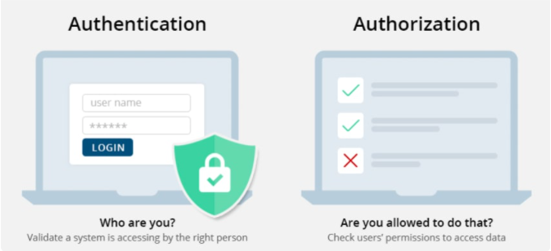

# Authentication - Authorization
- Authentication - Authorization
- Oauth2
- JWT
## Authentication - Authorization
### Concepts
- `Authentication` - `Xác thực`: là một quá trình kiểm tra danh tính của một tài khoản đang vào trong hệ thống hiện tại thông qua một hệ thống xác thực. Đây được xem là bước ban đầu của mọi hệ thống có yếu tố người dùng. Bản chất của Authentication chính là thực hiện xác nhận `HTTP request` được gửi đến từ client. 

- `Authorization` - `Ủy quyền`: là quá trình để xác định xem người dùng đã được xác thực có quyền truy cập vào các tài nguyên nào của hệ thống. Thườn là bước tiếp theo sau khi bước xác thực user thành công.



- `Classification of Authentication`:
    + `HTTP Basic Authentication`: Client sẽ gửi info được mã hóa dưới dạng Base64 trong header của request. 
        ```
        Authorization: Basic bG9sOnNlY3VyZQ==
        ```
    + `Multi - factor Authentication (MFA)`: Xác thực đa nhân tố, tăng tính xác thưc + bảo mật: `Security token`, `Biometric verification`.
    + `Password - based Authentication`: xác thực dựa trên mật khẩu: strong password, hashed password, OTP, PIN

### Authentication vs. Authorization

| Authentication      | Authorization |
| ----------- | ----------- |
| Bạn là ai? &rarr; Xác nhận danh tính, cấp quyền truy cập vào hệ thống | Bạn có những quyền gì? &rarr; Xác định xem bạn có được phép truy cập tài nguyên không |
| Bước đầu tiên | Diễn ra sau khi authentication thành công |
| Trả về lỗi `401` | Trả về lỗi `403` |
| Dùng password, OTP, PIN, 2FA/MFA, ... | Dùng tùy thuộc vào mức độ bảo mật, để xác định permissions, thường là `JWT` |
| Transmits info thông qua `ID Token` | Transmits info thông qua `Access Token` |
| Thường được quản trị bởi giao thức `OpenID Connect (OIDC)` | Thường được quản trị bởi `OAuth 2.0 framework` |

## 4 Most Used REST API Authentication Methods

1. `HTTP Authentication Schemes (Basic & Bearer)` 

Giao thức HTTP cung cấp các `Authentication Schemes` như: `Basic`, `Bearer`, `Digest`, `OAuth` v. v...

+ `Basic Authentication`: Client sẽ gửi username, password được mã hóa dưới dạng Base64 trong header của request. 
    ```
    Authorization: Basic bG9sOnNlY3VyZQ==
    ```

+ `Baear Authentication `:  "Cấp quyền truy cập cho user mang (bearer) token này". `Bearer token` sẽ cho phép truy cập đến một số tài nguyên hoặc url nhất định và thường là một chuỗi string được mã hóa, sinh ra bởi server trong lần response cái request login.
    ```
    Authorization: Bearer <token>
    ```

2. `Api Keys`
- `API Keys` bổ sung các vấn đề xác thực của `HTTP Authentication`. Trong phương pháp này, một key: `api-key` duy nhất được tạo ra và assigned cho mỗi user trong lần đầu tiên access tới API. Giá trị `api-key` thường được tạo từ sự kết hợp phần cứng và dữ liệu user-agent, IP của user.

    


3. `OAuth (2.0)`

- `OAuth2` kết hợp `Authentication` và `Authorization` để cho phép kiểm soát danh tính, phạm vi truy cập của người dùng hợp lệ phức tạp hơn.

- Có các phiên bản OAuth 1.0 và 1.0a, phức tạp hơn so với OAuth 2.0. Thay đổi lớn trong phiên bản 2.0 là không còn bắt buộc cái `hashed-key` trong mỗi lần request nữa, thay vào đó dùng:

    + `access token`: Được gửi giống như `api-key`, cho phép ứng dụng truy cập vào dữ liệu của người dùng, `có thể hết hạn`.

    + `refresh token`: Để lấy một token mới, nếu `access token` hết hạn.


4. `OpenID Connect`

- `OpenID Connect` là một tiêu chuẩn mở và là một giao thức Authentication phân cấp, Cho phép user có thể được authen bởi  nhiều website sử dụng service của bên thứ 3 &rarr; Giảm được việc phải thiết lập riêng logic sign-up/login cho mỗi website, cho phép các user có thể login tới nhiều webstie ko hề liên quan tới nhau mà ko cần phải có những định danh và password riêng cho mỗi site.

- Cơ chế OpenID, dùng duy nhất `identity provider` từ bên thứ 3, hoặc server chuyên auth để quản lý password, và `provider` này sẽ `confirm identity` của user tới các website, ko có một website nào có thể biết được password của `user` &rarr; yếu tố bảo mật rất cao.

- Trong cơ chế `OpenID Connect`, khi provider thứ 3 hoặc authentication server xác thực user thành công, nó sẽ trả về cho client một cái `token` để client dùng cái `token` này gửi kèm với các request trong header tới server, server sẽ giải mã `token` này và biết được user đó có những permission gì, từ đó serve chuẩn. &rarr; dùng `JWT`

## Oauth2
- OAuth là viết tắt của Open với Authentication hoặc Authorization, là sự kết hợp giữa kết hợp `Authentication` và `Authorization`.
- OAuth 2.0  - là một giao thức cho phép người dùng có thể cấp quyền truy cập ứng dụng hoặc trang web của bên thứ ba vào các tài nguyên được bảo vệ của của họ mà không nhất thiết phải tiết lộ thông tin đăng nhập hoặc thậm chí danh tính của họ.

### 1. Roles
Trong `OAuth2` định nghĩa 4 vai trò:

- `Resource owner` (or the End User): Là những user có khả năng cấp quyền truy cập, chủ sở hữu của tài nguyên mà ứng dụng muốn lấy.

- `Resource server` (or API Gateway): Nơi lưu trữ các tài nguyên, có khả năng xử lý các request truy cập đến các tài nguyên được bảo vệ.

- `Client Application` (or the Client): Là những ứng dụng bên thứ 3 muốn truy cập vào phần tài nguyên được chia sẻ với tư cách của người sở hữu (resource owner) và trước khi truy cập ứng dụng cần được `sự ủy quyền của user`.

- `Authorization server`: Làm nhiệm vụ xác thực, kiểm tra thông tin mà user gửi đến từ đó cấp quyền truy cập cho ứng dụng bằng việc sinh ra các `access token`. Đôi khi `authorization server` cũng chính là `resource server`.

### 2. Authorization Grant Types
- Khi `Client Application` yêu cầu ủy quyền để truy cập vào `Resource Server` thông qua `Resource owner`. Nếu `Resource owner` ủy quyền cho yêu cầu trên, Application sẽ nhận được `giấy ủy quyền` - `Authorization Grant` từ phía `Resource owner`.
Có 4 loại `Authorization Grant`:

    + `Authorization Code`: Đây là loại `giấy ủy quyền` được sử dụng như là một `access tokens ` (và optional là `refresh token`). Thường được sử dụng với các server-side Application.  Tối ưu hóa cho `confidential clients`.

    + `Implicit`: Được sử dụng với các Mobile App (ứng dụng chạy trên thiết bị của User) hoặc Web App (có thể hiểu là Browser App, vd Chrome Extension). Tối ưu hóa cho `public clients`.

    + `Client Credentials:` Sử dụng với các ứng dụng truy cập thông qua API. Tối ưu hóa cho `client-only authentication`

    + `Resource Owner Password Credentials`: Sử dụng với các Trusted Application, kiểu như những ứng dụng về Security. Khi đó `Resource Owner` có mối quan hệ tin cậy với `Client Application` và `Client Application` có khả năng lấy thông tin đăng nhập của `Resource Owner`.

### 3. API Gateway 

- `API Gateway` có thể coi là một cổng trung gian, cổng vào duy nhất tới hệ thống `microservices`, khi đó `API Gateway` sẽ nhận các requests từ phía client, `xác thực` và `điều hướng` chúng đến các API cụ thể trên các behavior services.

- `API Gateway` có thể được sử dụng như một `Authorization server` và một `Resource server`.

#### a. API Gateway as a Resource Server

- Khi `API Gateway` đóng vai trò là một `Resource server`, nó lưu trữ các `protected resources`, đồng thời tiếp nhận và phản hồi các yêu cầu của `Client Application` trong đó bao gồm mã `access token`. `Client Application` sẽ gửi `access token` trong Header của Request với cái field là `Authorization` sử dụng `Bearer authentication scheme`. Sau đó `Resource server` tiến hành xác thực `access token`, nếu `access token` hợp lệ thì `Client Application` có quyền truy cập `protected resources`, nếu không hợp lệ, cái request sẽ bị rejects.

#### b. API Gateway as an Authorization Server

- Khi `API Gateway` hoạt động như một `Authorization Server`, nó sẽ nhận các yêu cầu ủy quyền từ `Client Application` và xử lý các tương tác giữa `Client Application`, `Resource server` và `Resource owner` để approve cho cái request ủy quyền đó.
- Cụ thể: `API Gateway` sẽ cấp 1 `access token` cho các `Client Application` thay mặt cho `Resource owner` để sử dụng trong việc xác thực các lệnh gọi API tới `Resource server`. `Resource server` tiếp nhận `access token` từ phía `Client Application` và xét:

    + Nếu `Client Application` được phép truy cập `protected resources`, `Resource server` sẽ thực thi cái request này. Và `Authorization Server`, khi này đang là `API Gateway` sẽ giữ lại thông tin về các `access token` mà nó phát hành, bao gồm cả thông tin người dùng (`Resource owner`). Khi `Resource owner` xuất trình `access token` cho `Resource server`, `Resource server` sẽ gửi `access token` đến `Authorization Server` để đảm bảo rằng `access token` hợp lệ và cái khả năng service cho cái request này nằm trong  `scope` của `access token`. `Scope ` là định nghĩa của các tài nguyên mà `Client Application` có thể truy cập thay mặt cho `Resource owner`.

    + Nếu `Client Application` không có quyền truy cập tài nguyên, `Resource server` sẽ từ chối yêu cầu.
### 4. OAuth 2.0 Workflow
Workflow của OAuth 2.0 thông qua 4 bước, được mô tả như sau:


1. End-user đăng nhập,`Client Application` gửi yêu cầu xác thực ( kèm `id token`) đến máy chủ ủy quyền để lấy `access token`.
2. `Authorization Server` xác thực yêu cầu và tạo `access token` cho `Client Application`
3. `Client Application` sử dụng `access token` này để gửi các yêu cầu HTTP đến `API Gateway`.
4. `API Gateway` sau đó thực hiện như sau:
    a. Xác định danh tính của `Client Application` bằng `clientId`.
    b. Tiến hành verify cái `access token` (locally hoặc remotely)
    c. Kiểm tra xem tài nguyên được yêu cầu trong cái request thuộc `scope` của `access token` hay không.
    d.Kiểm tra các đối tượng đi kèm trong request.
    
Nếu tất cả những điều trên được xác thực, API Gateway sẽ cung cấp quyền truy cập vào `protected resources`. Trong trường hợp `access token` hết hạn, `Authorization Server` sẽ trả về phản hồi lỗi cụ thể. Sau đó, ứng dụng khách có thể sử dụng `refresh token` để yêu cầu một `access token` mới. `Authorization Server` sẽ trả về `access token` mới để tiếp tục dùng cho việc truy cập `protected resources`.

## JWT
### 1. Concepts
```

JSON Web Token (JWT) is an open standard (RFC 7519) that defines a compact and self-contained way
for securely transmitting information between parties as a JSON object. This information can be verified
and trusted because it is digitally signed. JWTs can be signed using a secret (with the HMAC algorithm)
or a public/private key pair using RSA or ECDSA.

```
[Source](https://jwt.io/introduction/)

- `JWT` - `JSON Web Token` là một tiêu chuẩn mở dựa trên `JSON (RFC 7519)`, phương tiện đại diện cho một `tập hợp thông tin` được truyền một cách `an toàn` giữa client-server dưới dạng  `JSON object`. 

- Tập hợp thông tin này được đại diện bởi JWT và nó `được xác minh`, `bảo mật` và `đáng tin cậy` vì nó được `digitally signed`. 

- `digitally signed` bằng cách sử dụng một `secret-key` (đối với thuật toán HMAC) hoặc `public/private key pair` dùng chuẩn RSA hoặc ECDSA.

_Tóm lại là:_

- Dùng để truyền thông tin một cách an toàn.

- Có phần chữ ký nên đảm bảo dữ liệu không bị thay đổi, chỉnh sửa trên đường đi.

### 2. JWT Structure

Một JWT sẽ có cấu trúc kiểu:
```
asdfasdfasdf.aDádaSDasd.FdfSDFsdfSDF
```

- `Header`: Gồm có 2 phần là: loại mã token, và thuật toán được sử dụng để sinh ra phần `Signature`. 2 phần này được define như là 1 json object và sau đó, JSON này được mã hóa Base64Url để tạo thành phần đầu tiên của JWT.

- `Payload`: Chứa các `claims`. `Claims` thường chứa các thuộc tính như `typically`, `thông tin user` và các dữ liệu bổ sung. Có 3 loại claims: `registered`, `public`, và `private` claims. Danh sách đầy đủ các `Claims` xem tại [JSON Web Token Claims](https://www.iana.org/assignments/jwt/jwt.xhtml). Phần này cũng được định nghĩa và mã hóa tương tự `Header`.

- `Signature`: Một chuỗi được mã hóa bởi `header`, `payload` cùng với thuật toán mã hóa được chỉ định trong header. `Signature` được sử dụng để xác minh data trong `payload` không bị thay đổi trong quá trình đi từ client-server và trong trường hợp token được `sign` bằng `private key`, nó cũng có thể xác minh được danh tính của người gửi `JWT`.


[Demo](https://jwt.io/)


### API Gateway & JWT Usecase

- `API Gateway` sử dụng JWT dựa trên `RSA` để cung cấp khả năng bảo vệ mạnh mẽ hơn cho `JWT` khi `API Gateway` là nhà phát hành `token`. 

- JWT chứa 1 hoặc nhiều `claims` nằm trong `Payload` của JWT.

- `API Gateway` trích xuất các yêu cầu từ `JWT`, định danh cho application và sau đó cho phép application truy cập vào `protected resources`.

#### _JWT Authorization Workflow_

Workflow giữa `requests` và `responses ` được ủy quyền, giữa `end-user`, `client-app`, nơi phát hành `JWT` và `resource server` như được mô tả trong hình sau:


1. `End-user` đăng nhập, `Client app` gửi yêu cầu xác thực đến API Gateway hoặc đến bất kỳ bên thứ ba nào để lấy mã `JWT`.

2. Nếu thông tin đăng nhập của `End-user` được gửi từ  `Client app` hợp lệ, API Gateway sẽ tạo mã `JWT` bằng các logic, thuật toán sẽ tìm hiểu bên dưới và gửi `JWT` đã tạo đến `Client app`. Nếu thông tin xác thực của người dùng không hợp lệ, `API Gateway` trả về một phản hồi lỗi cụ thể.

3. `Client app` gửi `JWT` đã tạo chứa trong `Header` của `request` header dưới dạng `HTTP Bearer Authorization token` để truy cập tới `protected resources` được bảo vệ trong API Gateway.

4. `API Gateway` sẽ xác thực `client-app` trước, dựa trên thông tin lấy từ JWT, sau đó xác thực JWT bằng các thuật toán, logic và cung cấp quyền truy cập vào các `protected resources`. Nếu xác thực không thành công, API Gateway trả về phản hồi lỗi cụ thể.


## Reference
1. [AUTHeNtication VS AUTHoriZation - dev.to](https://dev.to/caffiendkitten/authentication-vs-authorization-25lc)
2. [Difference between Authentication and Authorization](http://www.differencebetween.net/technology/difference-between-authentication-and-authorization/)
3. [Authentication vs. Authorization - auth0.com](https://auth0.com/docs/get-started/identity-fundamentals/authentication-and-authorization)
4. [4 Most Used Authentication Methods](https://blog.restcase.com/4-most-used-rest-api-authentication-methods/)
5. [OAuth2 Authentication Use case and Workflow](https://documentation.softwareag.com/webmethods/api_gateway/yai10-5/10-5_API_Gateway_webhelp/index.html#page/api-gateway-integrated-webhelp%2Fco-oauth_usecase_workflow.html%23wwconnect_header)
6. [JWT Authentication Use case and Workflow](https://documentation.softwareag.com/webmethods/api_gateway/yai10-5/10-5_API_Gateway_webhelp/index.html#page/api-gateway-integrated-webhelp/co-jwt_usecase_workflow.html)
7. [JWT Structure](https://developer.okta.com/blog/2020/12/21/beginners-guide-to-jwt)