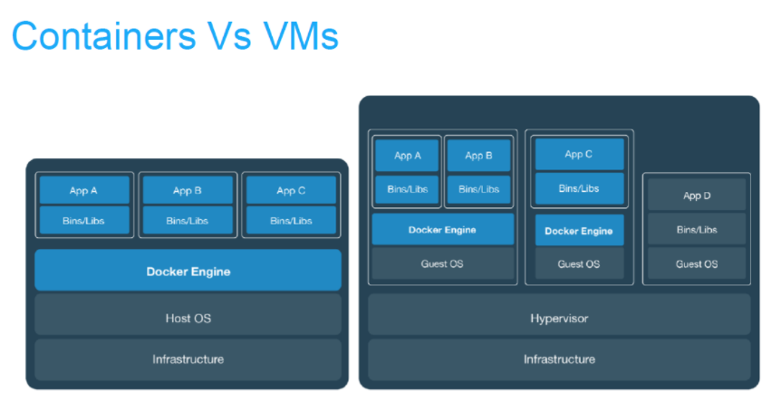
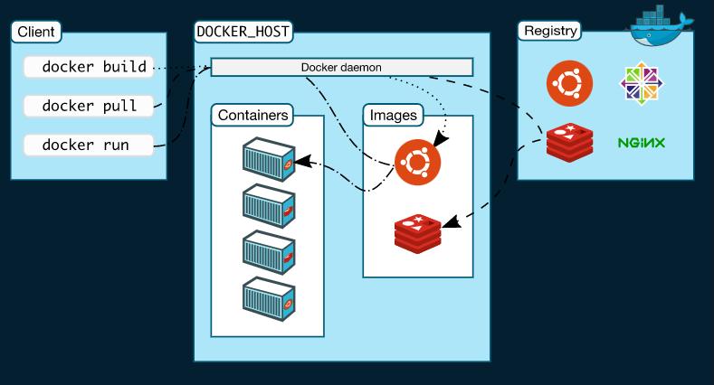

# Docker Architecture
- Overview
- Docker architecture: daemon, client, desktop registries

## Overview

- `Docker` là một dự án `open-source`, cho phép tự động hóa việc triển khai các ứng dụng bên trong các `Container` (Linux), cung như cung cấp chức năng đóng gói các thành phần cần để chạy ứng dụng bên trong Container. Docker cung cấp công cụ CLI (Command Line Interface) để quản lý vòng đời của các container. Sử dụng Docker là cách nhanh chóng để phát triển, triển khai, bảo trì các ứng dụng.

- `Containers` và `Virtual machines` có sự cách ly và phân bổ tài nguyên tương tự nhau, nhưng có chức năng khác vì các container ảo hóa hệ điều hành thay vì phần cứng. Các container có tính portable và hiệu quả hơn.

- Container là một sự trừu tượng hóa ở lớp ứng dụng và code phụ thuộc vào nhau. Nhiều container có thể chạy trên cùng một máy và chia sẻ kernel của hệ điều hành với các container khác, mỗi máy đều chạy như các quá trình bị cô lập trong không gian người dùng. Các container chiếm ít không gian hơn các máy ảo (container image thường có vài trăm thậm chí là vài MB), và start gần như ngay lập tức.

- Máy ảo (VM) là một sự trừu tượng của phần cứng vật lý chuyển tiếp từ một máy chủ sang nhiều máy chủ. Hypervisor cho phép nhiều máy ảo chạy trên một máy duy nhất. Mỗi máy ảo bao gồm một bản sao đầy đủ của một hệ điều hành, một hoặc nhiều ứng dụng, các chương trình và thư viện cần thiết - chiếm hàng chục GB. Máy ảo cũng có thể khởi động chậm.

- Một số ưu điểm của Docker Container so với công nghệ ảo hóa:

    + Tạo và hủy container rất nhanh và dễ dàng, Máy áo thì cần cài đặt đầy đủ mọi thứ và cần nhiều tài nguyên hệ thống hơn.
    + Container nhỏ gọn, vì vậy mà trên một máy Host số container chạy song song với nhau nhiều hơn số máy áo chạy song song.

- Lợi ích của Docker bao gồm:
    + Sử dụng được trên: Windows, Linux và Mac OS.
    + `Very Fast` trong việc triển khai, di chuyển, khởi động container
    + Bảo mật
    + Lightweight (tiết kiệm disk & CPU)
    + Mã nguồn mở
    + Hỗ trợ APIs để giao tiếp với container
    + Phù hợp trong môi trường làm việc đòi hòi phải `CIDI` (Continuous Integration –  Continuous Delivery) các dịch vụ, phát triển cục bộ, các ứng dụng microservices.

## Docker architecture

- Docker sử dụng kiến trúc `client-server`. `Docker client` sẽ giao tiếp với `Docker daemon` để thực hiện các công việc `building`, `running` và `distributing` các `Docker Container`.

- Docker client và Docker daemon có thể chạy cùng trên một hệ thống hoặc ta có thể kết nối một Docker client tới một remote Docker daemon. Docker client và Docker daemon liên lạc với nhau bằng việc sử dụng `REST API` thông qua `UNIX sockets` hoặc `network interfaces`.

- Một Docker client khác là `Docker Compose`, cho phép ta định nghĩa và run `multi-container `cho `Docker application`

### Docker daemon

- `Docker daemon` (dockerd ) sẽ listens các request từ `Docker API` và quản lý `Docker objects` bao gồm `images`, `containers`, `networks` và `volumes`. Một `Docker daemon` cũng có thể liên lạc với các daemons khác để quản lý `Docker services`.

### Docker client

- `Docker client` (docker ) là nơi để Docker users tương tác, giao tiếp, làm việc với Docker. Khi sử dụng mộ câu lệnh chẳng hạn như `docker run` thì client sẽ gửi câu lệnh tới `dockerd` để thực hiện câu lệnh đó. Các câu lệnh từ `Docker client` sử dụng `Docker API` và có thể giao tiếp với nhiều `Docker daemon`.

### Docker desktop 

- `Docker Desktop` là một ứng dụng cho môi trường Mac hoặc Windows, cho phép xây dựng và chia sẻ các `containerized applications` và `microservices`. Docker Desktop bao gồm Docker daemon (dockerd), Docker client (docker), Docker Compose, Docker Content Trust, Kubernetes và Credential Helper.

### Docker registries

- `Docker Registry` là nơi lưu trữ các Docker Image, nó có thể là máy chủ online được cung cấp bởi các nhà cung cấp hoặc do chính các công ty tự dựng và đều được lưu trữ trên [DockerHub](https://hub.docker.com/) với hai chế độ là `private` và `public`.

- Là nơi cho phép chia sẻ các image template để sử dụng trong quá trình làm việc với Docker. Cụ thể, khi sử dụng lệnh `docker pull` hoặc `docker run`, các image cần thiết sẽ được pull về từ Docker Registry. Và khi sử dụng lệnh `docker push`, imagesẽ được push lên Docker Registry.

## Reference

1. [Docker overview](https://docs.docker.com/get-started/overview/#the-docker-platform)

2. [Difference between VM vs Docker](https://dockerlabs.collabnix.com/beginners/difference-docker-vm.html)