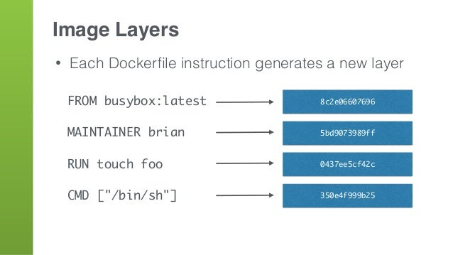
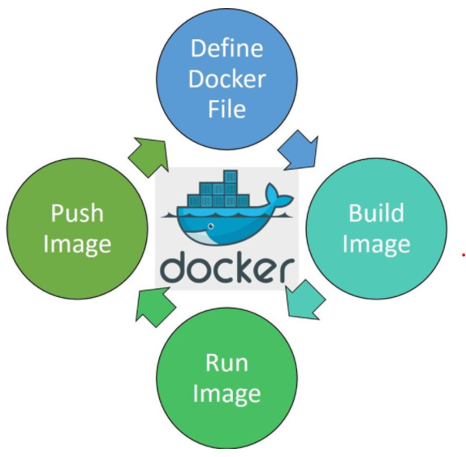
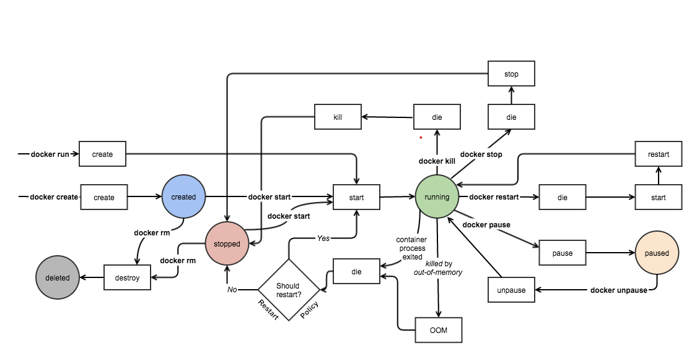

# Docker Objects
- Docker Image and Dockerfile
- Docker Container

## Docker Images and Dockerfile

```
An image is a read-only template with instructions for creating a Docker container. Often, an image is based on another image, with some additional customization
```

- Dùng để instructions cho việc tạo nên một `Docker Container`. Thông thường, một `Docker Image` sẽ dựa trên một Docker Image khác cộng với một số tùy chỉnh về cấu hình.


- Nói ngắn gọn là chúng ta có thể gói các cài đặt môi trường, OS, package, source code, libraries, dependencies, tools và các files khác cần thiết cho một ứng dụng để chạy lại thành 1 cục duy nhất - một file bất biến, đó chính là Docker Image. `Docker Image` đại diện cho một `application` và `virtual environment` của nó tại một thời điểm cụ thể. Khi đã có Docker image, ta có thể khởi tạo một hoặc nhiều cDocker container có môi trường bên trong chúng giống hệt nhau từ Docker Image này. 

- Docker Image lưu trữ dưới dạng `read-only template`, do tính chất read-only của chúng, những images này đôi khi được gọi là `snapshots`

- Docker Image được tạo ra bằng cách viết và build `Dockerfile`. `Dockerfile` là một script, trong đó chứa các dòng lệnh gồm các `instruction` để Docker đọc và chạy theo các lệnh đó và build ra Docker Image theo từng layers




- Image sau đó được sử dụng như 1 `template` để chạy ứng dụng. Ứng dụng cần 1 môi trường độc lập để chạy container. Môi trường này không chỉ là 1 virtual "space". Nó hoàn toàn dựa trên image tạo ra nó. Source code, files, dependencies, và binary libraries, tất cả đều được chứa trong Docker image, từ Docker Image này sẽ tạo nên các `Docker container`.

- Image đã được build có thể được `push` lên `DockerHub`. Từ DockerHub này, ta có thể `pull` đến nơi mong muốn deploy Docker Image này.




## Docker Container


- `Docker Container` là một thể hiện của `Docker Image` như một `run-time environment`, users có thể chạy ứng dụng với những thao tác cơ bản qua CLI như `start`, `stop`, `restart` hay `delete`, ... Những container này rất gọn nhẹ và chạy ứng dụng trong đó rất nhanh chóng và dễ dàng.


- Các container đóng vai trò quan trọng trong việc triển khai hệ thống `microservice` nhờ những đặc điểm sau của một Docker Container:
    + `Easy`: Dễ tạo, dễ hủy. Các container dễ dàng tạo, dừng , hủy, tạo lại , hay triển khai lại với ít bước thiết lập và cài đặt nhất.

    + `Fast`: Các container có thời gian khởi động cực kì nhanh nếu tối ưu hóa được các service bên trong nó.

    + `Portable`: Docker tạo ra những tiêu chuẩn cho các container để chúng có thể sử dụng ở mọi nơi 

    + `Lightweight`: Các container dùng chung kernel với máy chủ do vậy các ứng dụng trong mỗi container không đòi hỏi một hệ điều hành riêng, qua đó tăng hiệu quả sử dụng server, tiêu tốn ít tài nguyên phần cứng hơn nên giảm được số lượng server và giảm giá thành của việc mua license cho các server.

    + `Secure`: Docker cung cấp khả năng cô lập mạnh mẽ giữa các ứng dụng chạy bên trong và ngoài docker container, do vậy giúp các ứng dụng an toàn hơn khi chạy bên trong các container.

    + `Scalable` Các container được chạy từ một docker image là hoàn toàn giống nhau, do vậy  hệ thống microservice có thể được mở rộng bằng cách khởi chạy thêm các container từ docker image.

- Hình dưới đây mô tả `Docker life cycle`, từ lúc `create`, `run` cho đến `delete`:

    


    + `Created`: Container được tạo nhưng chưa được khởi chạy 
    + `Running`: Container chạy tất cả processes bên trong nó
    + `Paused`: Container tạm ngưng các processes
    + `Stopped`: Container ngưng hẳn các processes nhưng chưa bị xóa
    + `Deleted`: Container bị khai tử
## Reference

1. [Docker Objects](https://docs.docker.com/get-started/overview/#docker-objects)

2. [A Beginner’s Guide to Understanding and Building Docker Images](https://jfrog.com/knowledge-base/a-beginners-guide-to-understanding-and-building-docker-images/)

3. [Docker Container Lifecycle Management](https://k21academy.com/docker-kubernetes/docker-container-lifecycle-management/#:~:text=Docker%20Container%20Lifecycle%20Management%3A%20Create,Run%2C%20Pause%2C%20Stop%20And%20Delete&text=Docker%20is%20a%20containerization%20platform,simultaneously%20on%20a%20given%20host.)