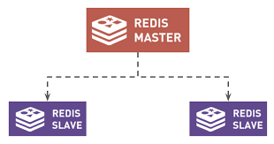
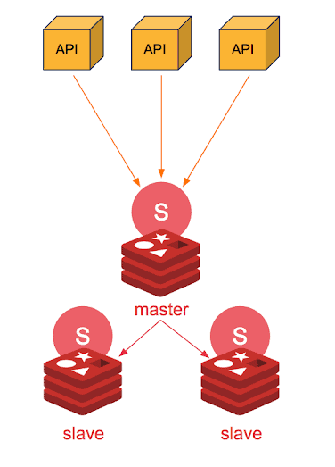
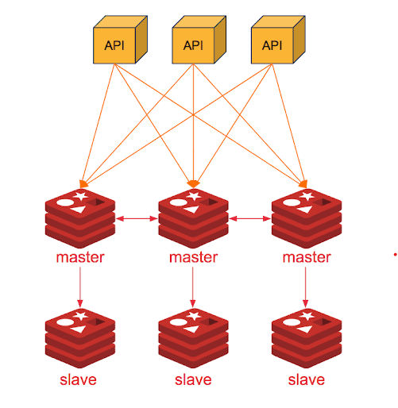
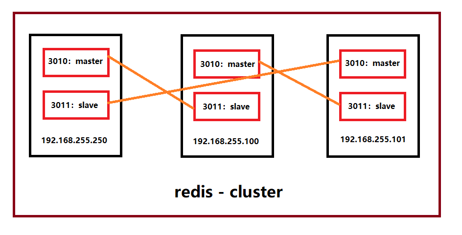

# Redis
- Overview
- Redis data types
- Redis Clusters
- Redis Pub/Sub
## Overview

- `Redis` - REmote DIctionary Server:  là một open-source được dùng để lưu trữ dữ liệu có cấu trúc và lưu dưới dạng `key-value`, có thể sử dụng như một `database`, bộ nhớ `cache` hay một `message broker`.

- Redis hiện cung cấp thời gian phản hồi `chưa đến một mili giây`, giúp thực hiện `hàng triệu` yêu cầu mỗi giây cho các ứng dụng realtime trong những ngành như trò chơi, công nghệ quảng cáo, dịch vụ tài chính, chăm sóc sức khỏe và IoT. 

- `Do hiệu suất nhanh`, Redis thường được chọn sử dụng cho bộ nhớ đệm, quản lý phiên, trò chơi, bảng xếp hạng, phân tích theo realtime, ứng dụng không gian địa lý, đặt xe, trò chuyện/nhắn tin, phát trực tiếp nội dung đa phương tiện cũng như các ứng dụng cơ chế pub/sub.

- Redis có hiệu suất nhanh như thế là nhờ nó là một hệ thống cơ sở dữ liệu NoSQL, lưu trữ dữ liệu với dạng KEY-VALUE trên bộ nhớ RAM của máy chủ. Ngoài ra, nó cũng có cơ chế sao lưu dữ liệu xuống ổ cứng, vẫn đảm bảo được dữ liệu không bị mất đi dù truy xuất nhanh. 

- Redis mang lại những lợi ích sau:

    + `Hiệu suất`: Redis lưu trữ dữ liệu trên RAM cộng với cơ chế Replication, từ đó Redis mang tính `high availability`, nâng cao performance rất nhiều so với cơ sở dữ liệu lưu phần lớn dữ liệu trên ổ đĩa hoặc ổ SSD.

    + `Cấu trúc dữ liệu linh hoạt`: Redis sở hữu rất nhiều cấu trúc dữ liệu để đáp ứng nhu cầu cho ứng dụng của bạn. 

    + `Đơn giản và dễ sử dụng`: Redis đơn giản hóa mã bằng cách cho phép bạn viết ít dòng lệnh hơn để lưu trữ, truy cập và sử dụng dữ liệu trên ứng dụng của bạn

    + `Khả năng sao chép và độ bền`: Redis sử dụng kiến trúc `master-slave` và hỗ trợ sao chép không đồng bộ, trong đó có thể sao chép dữ liệu sang nhiều máy chủ khác. Về độ bền, Redis hỗ trợ `backup` dữ liệu tại một thời điểm nào đó (chép tập dữ liệu Redis sang ổ đĩa).

    + `Độ khả dụng cao và quy mô linh hoạt`: Redis tổ chức mô hình master-slave theo kiến trúc `Redis Cluster`, kiến trúc này cho phép xây dựng những giải pháp có độ khả dụng cao - khi cần thì Cluster có thể mở rộng hoặc thu gọn, đảm bảo hiệu suất ổn định và bảo mật.

    + `Mã nguồn mở`

- Trường hợp sử dụng phổ biến của Redis:

    + `Cache`: Redis là kho dữ liệu chứa các `key-value ` có thể hoạt động như bộ nhớ đệm, tự động xóa bỏ dữ liệu cũ khi thêm một dữ liệu mới. Khi đó bộ nhớ đệm này có thể hoạt động theo thuật toán LRU (Least Recently Used) và cả LFU (Least Frequently Used) kể từ phiên bản 4.0. Cơ chế `Redis cached` sẽ hỗ trợ nhiều kiểu cấu trúc dữ liệu phổ biến (hash, list, set, sorted set, string) cùng với công nghệ đọc ghi dữ liệu được thiết kế và tối ưu hiệu suất tốt (hơn `Memcached`). Đồng thời, Redis còn có thể cho phép `scripting` bằng ngôn ngữ `Lua` - Lua scripting. Do đó, Redis thường được sử dụng làm hệ thống lưu trữ bộ nhớ đệm cho các ứng dụng cần truy xuất dữ liệu với tốc độ phản hồi nhanh.

    + `Database`: Bản chất Redis là một server cấu trúc dữ liệu. Người dùng có thể dùng Redis đơn lẻ như một server chứa dữ liệu bình thường. Hoặc kết hợp với một database khác như MySQL để tăng tốc độ xử lí của nó. Bên cạnh cơ chế lưu trữ backup trên ổ đĩa cứng như các hệ quản trị dữ liệu khác, độ bảo mật và sửa lỗi cao là điểm đặc biệt của cơ sở dữ liệu đặc biệt này.

    + `Message broker`: Redis hiện cung cấp thời gian phản hồi ở tốc độ chưa đến một mili giây. Chính vì thế, hàng triệu yêu cầu mỗi giây cho các ứng dụng thời gian thực trong lĩnh vực Trò chơi, Công nghệ quảng cáo, Dịch vụ tài chính, Chăm sóc sức khỏe và IoT được đáp ứng rất nhanh gọn.

Ngoài ra, Redis thường còn được sử dụng cho hoạt động `Session store`, `Gaming leaderboards`, `Rich media streaming`, `Geospatial`, `Machine Learning` và `Real-time analytics`.

## Redis data types

Khác với RDMS như MySQL, hay PostgreSQL, Redis không có table. Redis lưu trữ data dưới dạng `key-value`. Cobf so với memcached thì memcached cũng làm vậy, nhưng kiểu dữ liệu của memcached bị hạn chế, không đa dạng được như Redis, do đó không hỗ trợ được nhiều thao tác từ phía người dùng. Dưới đây là sơ lược về các kiểu dữ liệu Redis dùng để lưu value:

### Strings

- `Strings` là kiểu dữ liệu cơ bản nhất của Redis. 

- `Redis string` được lưu dưới dạng nhị phân nên có thể chứa bất kì loại dữ liệu nào như ảnh dạng `JPEG` hay `Ruby object`. 

- Độ dài giá trị của 1 string tối đa là 512MB.

- Danh sách các command trên Redis để thao tác với string type: [commands/#string](https://redis.io/commands/#string)

- Ví dụ bên dưới với việc sử dụng lệnh `SET` để set value cho key và lệnh `GET` để truy xuất value của key.

```sh
$ set username Harry
OK
$ get username
"Harry"
```

### List

- `List` là danh sách các `string` được sắp xếp theo thứ tự chèn vào list. 
- Ta có thể thêm các phần tử vào đầu hoặc cuối 1 list sử dụng `LPUSH` hoặc `RPUSH`. Một list được tạo ra khi chúng ta thực hiện thao tác `LPUSH` `hoặc` RPUSH với một key rỗng. Tương tự, key sẽ được xóa khỏi key space khi các thao tác trên biến danh sách trở về rỗng. Ví dụ:

```sh
LPUSH mylist a   # now the list is "a"
LPUSH mylist b   # now the list is "b","a"
RPUSH mylist c   # now the list is "b","a","c" (RPUSH was used this time)
```

Danh sách các command với lists tại [commands#list](https://redis.io/commands#list)

### Sets
- `Sets` là tập hợp các `string` không được sắp xếp. 

- `Sets` hỗ trợ các thao tác `thêm` phần tử, `đọc`, `xóa` từng phần tử, `kiểm tra sự tồn tại` của phần tử trong `set` với thời gian mặc định là O(1) bất kể số lượng phần tử của `set` đó là bao nhiêu. Ngoài ra Redis còn hỗ trợ các phép toán giữa các `sets` với nhau, gồm `intersect`, `union`,`difference`. 

- Số lượng phần tử tối đa trong 1 set là `2^32 - 1` (`4294967295`, nhiều hơn 4 tỉ phần tử trong mỗi set). 

- Danh sách các command với sets tại [commands#set](https://redis.io/commands#set)

### Hashes

- `Hashes` là kiểu dữ liệu lưu trữ `hash table` của các cặp `key-value`, trong đó, key được sắp xếp ngẫu nhiên, không theo thứ tự nào cả. 

- Hash thường được sử dụng để lưu các object (user có các filed như name, age, address,...). Mỗi hash có thể lưu trữ `2^32 - 1` cặp key-value. 

- Redis hỗ trợ các thao tác `thêm`, `đọc`, `xóa` từng phần tử, cũng như `đọc tất cả giá trị` trong hash.

- Danh sách các command với Hashes tại [commands#hash](https://redis.io/commands#hash)

### Sorted Sets

- `Sorted Sets` cơ bản là `Sets` các `string` được sắp xếp sao cho các `string` trong `set` đều là `duy nhất `.

- Mỗi phần tử của `Sorted Sets` là map của 1 `string` (member) và 1 `floating-point number` (score), Sorted Sets sẽ được sắp xếp theo `score` này, các phần tử là duy nhất nhưng các score có thể ngang bằng nhau. 

- Redis hỗ trợ các thao tác tác `thêm`, `sửa`, `xóa` phần tử một cách rất nhanh (thời gian tỉ lệ với logarit của số phần tử).

- Danh sách các command với Hashes tại [commands#sorted-set](https://redis.io/commands#sorted-set)

### Bitmaps and HyperLogLogs

`Redis` cũng hỗ trợ `Bitmap` và `HyperLogLogs` và đều dựa trên kiểu `strings` nhưng có `semantics` riêng của chúng:

- `Bitmap`-  kiểu dữ liệu tập hợp các bit và được Redis hỗ trợ thực hiện các tác vụ quy mô bit.

- `HyperLogLogs`: `Redis HyperLogLog` là một thuật toán sử dụng phương pháp ngẫu nhiên để tạo ra một số lượng phần tử là duy nhất trong một tập hợp chỉ sử dụng một lượng bộ nhớ nhỏ và không đổi. HyperLogLog cung cấp một xấp xỉ rất tốt về tính chính xác của một tập hợp ngay cả khi sử dụng một lượng bộ nhớ rất nhỏ `khoảng 12 kbyte` mỗi key với sai số chuẩn là `0,81%`. Không có giới hạn về số lượng phần tử, trừ khi bạn cần một số lượng lớn hơn `264 phần tử`.

## Redis Clusters

### Master-Slave Architecture



- Master Node: Process chính, chạy và xử lý các kết nối với client.

- Slave Node: process phụ, chạy cùng process chính và giám sát process chính. Process phụ cũng thực hiện việc ghi (dump) dữ liệu định kỳ vào ổ cứng để backup.

### Redis Cluster vs. Redis Sentinel
Redis cũng giống các cơ sở dữ liệu khác, Redis cần cấu hình để đảm bảo tính sẵn sằng và hoạt động của nó, với `Redis Cluster` và `Redis Sentinel`.


- `Redis Sentinel`: là một hệ thống được thiết kế để giúp quản lý các `Redis instances`. Mục đích chính của việc sử dụng `sentinel` là cung cấp một hệ thống có tính `high availability` bằng cách `monitoring`, `notifying`, và `providing` và `Replication` - Replication theo mô hình master-slave (một vài Redis instances đóng vai trò slave là bản sao chính xác của một Redis instance giữ vai trò master). Khi một master không thể `serve`, Sentinel đảm nhiệm nhiệm vụ giám sát sẽ tự lựa chọn một master mới trong các slaves.



- `Redis Cluster`:Là một giải pháp cho `data sharding` với tính năng quản lý, và cũng có cơ chế replication. Redis Cluster giúp Redis hoạt động theo mô hình phân tán, chia một instance thành nhiều cluster, khác với Replication + Sentinel đó là các cluster đều được coi như master.




&rarr; `Redis Cluster` cung cấp tính khả dụng cao, hoạt động tương tự như  `Redis Sentinel` nhưng cho phép chia sẻ nhiều dữ liệu hơn giữa các instances trong Cluster. Do đó, Redis Cluster cải thiện khả năng mở rộng ứng dụng của khi dữ liệu scale-up.

### Concepts and Redis Cluster master-replica model



`Redis Cluster provides a way to run a Redis installation where data is automatically sharded across multiple Redis nodes.`

`Redis Cluster also provides some degree of availability during partitions, that is in practical terms the ability to continue the operations when some nodes fail or are not able to communicate.`

-  Dữ liệu được tự động chia nhỏ trên nhiều `Redis Node` và có thể tự động chia sẻ dữ liệu với nhau trong Cluster.

- Duy trì khả năng hoạt động liên tục của Cluster, khi một Node con gặp sự cố hoặc không thể giao tiếp với phần còn lại của Cluster, Redis Cluster sẽ tiến hành thay thế Node đó bằng nhân bản của nó, đảm bảo nhân bản này hoạt động đúng như Node cũ dựa trên  chế Replication như trên. Cụ thể:

    + Khi process chính - `Master Node` bị treo hay thoát, một trong các process phụ - `Slave Node` trở thành `Master Node` và xử lý tất cả các yêu cầu trong khi chờ `Master Node` được khởi động lại. 
    
    + Khi `Master Process` hoạt động trở lại, nó sẽ lấy tệp kết xuất từ ​​Master tạm thời và sử dụng nó làm cơ sở. Quá trình chính được khởi tạo lại dưới dạng Master, trong khi Master Node tạm thời quay trở lại làm việc như một `Slave Node`.

## Pub/Sub

- Redis `Pub`/`Sub` được áp dụng trong các hệ thống cần `gửi`/`nhận` message từ sender - `publisher` gửi message đến receiver `subscriber`. Liên kết mà các message được chuyển được gọi là `Chanel`. Trong Redis, một client có thể subscribe nhiều chanel .

    

- Dưới đây là các Command cơ bản, xem full tại [commands/#pubsub](https://redis.io/commands/#pubsub):

| Command      | Description |
| ----------- | ----------- |
| PSUBSCRIBE pattern [pattern ...] | Đăng ký (subscibe) channel |
| PUBSUB subcommand [argument [argument ...]] | Cho biết trạng thái của hệ thống Pub / Sub. Ví dụ, client nào đang hoạt động trên máy chủ. |
| PUBLISH channel message | Gửi message tới channel |
| PUNSUBSCRIBE [pattern [pattern ...]] | Dừng nhận message của channel theo pattern |
| SUBSCRIBE channel [channel ...] | Nhận message của channel |
| UNSUBSCRIBE [channel [channel ...]] | Dừng việc nhận message từ channel |

 
## Reference
1. [What is Redis - AWS](https://aws.amazon.com/redis/?nc1=h_ls)
2. [Redis Data types](https://redis.io/topics/data-types)
3. [redis-sentinel-vs-cluster](https://cloudinfrastructureservices.co.uk/redis-sentinel-vs-cluster/)
4. [Redis Master-Slave Replication](https://redisson.org/glossary/redis-master-slave-replication.html#:~:text=the%20master%20database.-,Master%2Dslave%20replication%20in%20Redis,%2Drelational%20key%2Dvalue%20databases.&text=By%20default%2C%20master%2Dslave%20replication,majority%20of%20Redis%20use%20cases.)
5. [Redis cluster tutorial](https://redis.io/topics/cluster-tutorial#:~:text=Redis%20Cluster%20provides%20a%20way,are%20not%20able%20to%20communicate.)
6. [Redis pubsub topic](https://redis.io/topics/pubsub)
7. [Publish/Subscribe pattern example (Redis, Kafka)](https://dev.to/ronnymedina/publish-subscribe-pattern-example-redis-kafka-1gd9)