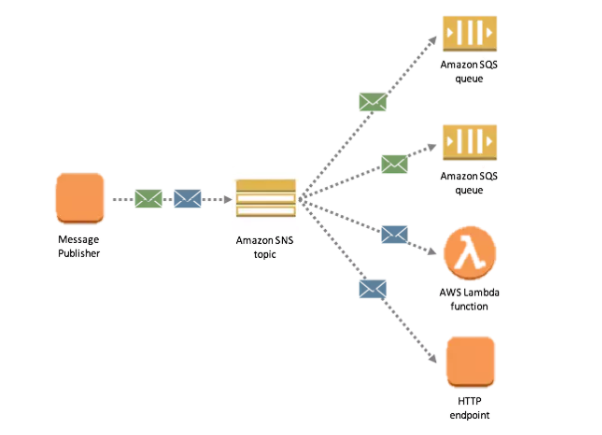
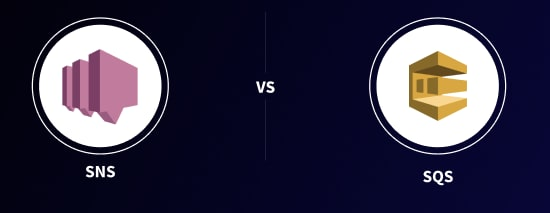

# SNS/SQS

## SNS - Simple Notification Service

- `SNS` là một dịch vụ gửi các `Notifications` nhanh chóng, linh hoạt, được quản lý đầy đủ cho phép gửi từng message riêng lẻ hoặc gửi message hàng loạt tới số lượng lớn người nhận. 

- Amazon cung cấp một dịch vụ SNS là `Amazon SNS`, dùng trong việc `push notifications` số lượng lớn đến client thông qua một topic. Client ở đây có thể là một `web server`,  `mobile app`, `email` hoặc thậm chí gửi `message` đến các dịch vụ phân tán khác một cách đơn giản và tiết kiệm chi phí 

- SNS là  `distributed publish-subscribe system`. Publisher sẽ xuất bản các message và SNS vẽ push các message này đến Subscriber.

## SQS - Simple Queue Service

- `SQS` là `distributed queuing system` Message sẽ không được push trực tiếp đến Consumer mà Consumer phải `order` từ SQS để nhận message và nhiều Consumer không thể nhận message cùng một lúc. 

Bất kỳ Consumer nào cũng có thể nhận được message, xử lý và xóa nó. Những Consumer khác không nhận được message tương tự sau đó.

- Việc `order` message này gây ra một số độ trễ nhất định trong việc gửi message, không giống như SNS, message được push ngay lập tức đến Subscriber.

- Amazon cung cấp một dịch vụ SQS là `Amazon SQS`, chủ yếu được sử dụng để tách các ứng dụng hoặc tích hợp các ứng dụng. Message có thể được lưu trữ trong SQS trong thời gian ngắn (tối đa 14 ngày). Cụ thể, Amazon SQS cung cấp giải pháp migration dữ liệu giữa các thành phần trong hệ thống phân tán để thực hiện các nhiệm vụ khác nhau. Với SQS, ta có thể giảm tải gánh nặng cho hệ thống và có thể dễ dàng mở rộng khả năng lưu trữ các message với chi phí thấp.

## SNS vs. SQS

- Phân loại:

    + SQS : distributed queuing system
    + SNS : distributed publish-subscribe system

- Cơ chế:

    + SQS : Cơ chế pull - Consumer order message từ SQS và pull message về
    + SNS : Cơ chế push - SNS push message đến consumer

- Cách sử dụng

    + SQS : Tách hai ứng dụng và cho phép xử lý không đồng bộ song song
    + SNS : Cho phép xử lý cùng một notification theo nhiều cách

- Thời gian tồn tại của message

    + SQS: message vẫn tồn tại trong một số khoảng thời gian (có thể định cấu hình) khi không có Consumer nào sử dụng

    + SNS: message sẽ bị xóa tồn tại ngắn, sẽ bị xóa khi không có Consumer nhận message hoặc Consumer đã nhận được message.

- Consumer :

    + SQS: Consumer giống nhau và xử lý message theo 1 cách duy nhất.

    + SNS: Tất cả những consumer có cách xử lý các message theo những cách khác nhau.

Nói chung, SNS sẽ được sử dụng để gửi các notifications mỗi khi có thông báo gửi đến client. Tuy nhiên Client không phải lúc nào cũng available để nhận thông báo hoặc trường hợp một lượng lớn thông báo gửi đến 1 client, đều dẫn đến kết quả không mong muốn là bị lack các notification. Khi đó ta sẽ cần dùng SQS để lưu trữ các notification đó. Phía Client sẽ order cho việc nhận notifications, khi họ available thì Server sẽ chủ động request lên SQS để nhận các notifications và gửi về cho Client &rarr; tránh sự quá tải cho server và tránh được việc mất các notification từ chỗ client.

## Reference

1. [What is Amazon SNS](https://docs.aws.amazon.com/sns/latest/dg/welcome.html)

2. [Simple Queue Service](https://aws.amazon.com/vi/sqs/)

3. [SNS vs SQS - hevodata ](https://hevodata.com/learn/sns-vs-sqs/#s1)

4. [AWS SNS vs SQS – Whats The Difference](https://www.beabetterdev.com/2021/08/08/aws-sns-vs-sqs-whats-the-difference/)

5. [ stackoverflow.com - questions 13681213](https://stackoverflow.com/questions/13681213/what-is-the-difference-between-amazon-sns-and-amazon-sqs#:~:text=SNS%20is%20a%20distributed%20publish,are%20not%20pushed%20to%20receivers.)