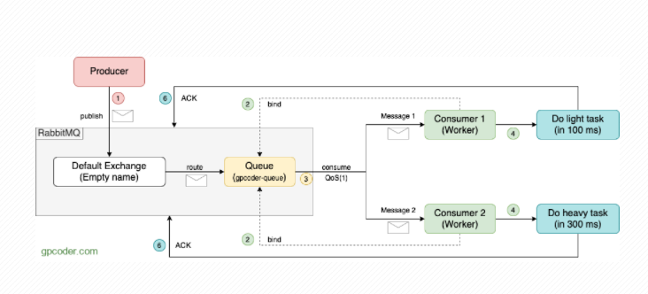
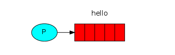
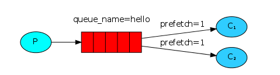

# Work Queues
- Concepts
- Example

## Concepts

- Ý tưởng chính của `Work Queues` (hay `Task Queues`) là tránh việc thực hiện ngay lập tức một work/task tốn nhiều tài nguyên và phải chờ nó hoàn thành. Thay vào đó chúng ta sẽ lên lịch (`schedule`) và các work/task này sẽ được thực hiện dựa trên schedule mà mình lập ra.

- `Work Queues` sẽ gói gọn (encapsulate) một task dưới dạng `Message` và gửi nó đến Queue. Sau đó có một `worker` chạy background một process để lấy các task từ Queue ra thực thi chúng. Có thể tạo nhiều worker để thực hiện các task và các task này đều được chia sẻ giữa các worker với nhau.

## Example



1. `Producer` có nhiệm vụ tạo các task và đưa vào RabbitMQ Broker, đi từ Exchange tới Queue

2. `Consumer` - đóng vai trò như Worker có nhiệm vụ lấy các task từ Queue về xử lý.

3. `Consume Qos(1)` : Mặc định, RabbitQM sử dụng Round-robin để gửi Message đến Consumer kế tiếp một cách tuần tự. Mỗi Consumer có thời gian xử lý mỗi task khác nhau. Để tránh một Consumer nhận quá nhiều task mà không có thời gian xử lý, một Consumer quá rãnh không có thời gian thực hiện task nào hết. Ta sử dụng option `basicQos()` để buộc RabbitMQ chỉ gửi 1 Message cho 1 Consumer, khi nào Consumer xử lý xong task thì mới gửi tiếp 1 Message cho nó xử lý. Nhờ vậy thời gian hoàn thành sớm hơn.

4. Các Consumer tiếp hành xử lý cái task mà nó được giao. Ở đây ví dụ Producer để tạo ra `10 Tasks` và 2 Consumer để thay phiên nhau xử lý các task này. `Consumer 1` sẽ xử lý `1 task trong 100 milliseconds`, `Consumer 2` sẽ xử lý `1 task trong 300 milliseconds`. Nếu theo cơ chế Round-robin dispatching của RabbitMQ thông thường thì mỗi Consumer sẽ xử ý 5 Tasks, thời gian xử lý mỗi Task của Consumer 2 lâu hơn nên Consumer 1 sẽ rỗi rảnh trong khi Consumer 2 vẫn còn việc phải xử lý. Tuy nhiên, mình đã sử dụng `basicQos()` nên sẽ không có chuyện một Consumer rỗi rảnh và một Consumer có nhiều Task cần làm.

5. Consumer sẽ gửi một ACK message đến RabbitMQ để báo rằng một Message đã được Consumer nhận, xử lý và Rabbit có thể xoá nó. Để tránh trường hợp nếu một Consumer xử lý Task trong một thời gian dài, chỉ một phần của Task được hoàn thành và nó die. Message đã bị xoá bởi RabbitQM và Task sẽ bị mất. Để giải quyết vấn đề này, chúng ta sẽ không auto gửi Message, mà chúng ta sẽ gửi một ACK message đến RabbitMQ khi nó hoàn thành xử lý Message. 


## Implement with Python

Ví dụ này dựa trên [tutorial của RabbitMQ](https://www.rabbitmq.com/tutorials/tutorial-one-python.html), Sử dụng thư viện pika 0.10.1 Python client

```
python -m pip install pika --upgrade
```

### Hello World!

Ví dụ về một hệ thống gửi, nhận `message` và hiển thị nó lên màn hình.  Chúng ta cần viết 2 chương trình, một chương trình `gửi` và một dùng để `nhận và in` thông tin ra màn hình.

Toàn bộ quá trình được biểu diễn qua sơ đồ sau:


*Producer gửi các message tới "hello" queue và Comsumer sẽ nhận thông tin từ queue này.*

#### Sending




Ta sẽ viết chương trình gửi message trong file `send.py` để gửi một `message` tới `queue`. Đầu tiên, chúng ta khởi tạo một kết nối tới máy chủ RabbitMQ.

```python
#!/usr/bin/env python
import pika

connection = pika.BlockingConnection(pika.ConnectionParameters('localhost'))
channel = connection.channel()
```

Như vậy là chúng ta đã kết nối tới broker ở `localhost`, nếu broker nằm ở trên máy khác hãy thay thế bằng địa chỉ IP của nó.

Tiếp theo, chúng ta phải chắc chắn một điều là phải có một `queue` đã tồn tại, nếu chúng ta gửi `message` vào `queue` chưa có sẵn, các `message` này sẽ được RabbitMQ* cho vào trash. Tạo mới một `queue` cho các `message`, đặt tên của cho `queue` là "hello"

```python
channel.queue_declare(queue='hello')
```

Trong RabbitMQ, một `message` có thể không được xếp vào `queue`. Nó phải được thông qua một `exchange` và `exchange` mặc định là empty. Đây là một `exchange` đặc biệt, nó cho phép chúng ta xác định chính xác `queue` nào mà muốn gửi `message` đến. Tên của `queue` được chỉ rõ trong tham số `routing_key`:

```python
channel.basic_publish(exchange='', routing_key='hello', body='Hello World!')
print(" [x] Sent 'Hello World!'")
```

Cuối cùng là chúng ta ngắt kết nối tới server.

```python
connection.close()
```

**Lưu ý:** Nếu quá trình gửi không thành công, chúng ta phải kiểm tra lại dung lượng trống của ổ đĩa lưu trữ, cấu hình mặc định của **RabbitMQ** là 1GB. Xem lại log và tăng dung lượng nếu cần. Kiểm tra tại file cấu hình ở trường `disk_free_limit`.

#### Receiving


Chương trình thứ 2 là `receive.py` sẽ nhận `message` từ `queue` và in nó ra màn hình.

Đầu tiên chúng ta cần phải kết nối tới máy chủ `RabbitMQ` như đã hướng dẫn ở phần trên. 

Tiếp theo, chúng ta cũng phải xác định `queue`. Để chọn `queue`, chúng ta sử dụng dòng code sau:

```python
channel.queue_declare(queue='hello')
```

Để nhận `message`, chúng ta tạo một hàm tên `callback` để giao tiếp với `queue`. Nội dung của hàm là nhận `message` và hiển thị nó ra màn hình.

```python
def callback(ch, method, properties, body):
    print(" [x] Received %r" % body)
```

Tiếp theo, chúng ta xác nhận lại với server rằng đã nhận được `message` từ `hello`. 

```python
channel.basic_consume(callback, queue='hello', no_ack=True)
```

Để cho code trên chạy, chúng ta phải chắc chắn rằng `queue` mà chúng ta muốn nhận `message` phải tồn tại, và chúng ta đã chọn nó ở phía trên `queue_declare`.

Cuối cùng, chúng ta thêm đoạn code để chờ, lắng nghe `message` từ `queue`.

```python
print(' [*] Waiting for messages. To exit press CTRL+C')
channel.start_consuming()
```

#### Demo

Ta chạy file `send.py` trên một máy đã cài sẵn python pika và trỏ IP về máy chủ RabbitMQ thay thế cho trường `localhost` ở trong file, file này sẽ dừng sau mỗi lần chạy thành công:

```bash
$ python send.py
# =>> [x] Sent 'Hello World!'
```

Trên một máy nhận, chúng ta sửa IP của máy chủ RabbitMQ trong file và chạy:

```bash
$ python receive.py
[*] Waiting for messages. To exit press CTRL+C
[x] Received 'Hello World!'
```

Chương trình sẽ listen các `message` cho đến khi nào các ta bấm CTRL+C để thoát.

### Work Queues

Ta đã có các chương trình để gửi và nhận các `message` từ một `queue` đã được định danh. Giờ ta sẽ tạo một *Work Queue*, được sử dụng để điều phối các tác vụ cần nhiều thời gian xử lý giữa nhiều `worker` với nhau.

Đầu tiên ta cần sửa lại file `send.py` một chút để cho phép bất kỳ nội dung nào có thể được gửi qua file. Nó sẽ đặt lịch vào các `queue` và đặt tên nó là `new_task.py`:

```python
import sys

message = ' '.join(sys.argv[1:]) or "Hello World!"
channel.basic_publish(exchange='',
                      routing_key='task_queue',
                      body=message,
                      properties=pika.BasicProperties(
                         delivery_mode = 2, # make message persistent
                      ))
print(" [x] Sent %r" % message)
```

Còn đối với file `receive.py` cũng có một vài thay đổi, là đếm số dấu `.` trong `message`. Nó sẽ nhận các `message` từ `queue` và thực thi tác vụ. Hãy đặt tên cho nó là `worker.py`

```python
import time

def callback(ch, method, properties, body):
    print(" [x] Received %r" % body)
    time.sleep(body.count(b'.'))
    print(" [x] Done")
```

#### Round-robin dispatching

Một lợi thế của việc sử dụng *Work Queue* là khả năng làm việc song song. Nếu chúng ta xây dựng một phần dự trữ của các *work*, ta có thể thêm nhiều các `worker` và khả năng mở rộng nó là tương đối dễ dàng.

Đầu tiên, chúng ta sẽ chạy script `worker.py` trên 2 máy khác nhau cùng một thời điểm.

```bash
shell1$ python worker.py
 [*] Waiting for messages. To exit press CTRL+C
```

```bash
shell2$ python worker.py
 [*] Waiting for messages. To exit press CTRL+C
```

Tiếp theo, chúng ta publish một số `message` như sau:

```bash
shell3$ python new_task.py First message.
shell3$ python new_task.py Second message..
shell3$ python new_task.py Third message...
shell3$ python new_task.py Fourth message....
shell3$ python new_task.py Fifth message.....
```

Kết quả hiển thị ở 2 cửa sổ console bên trên như sau:

```bash
shell1$ python worker.py
 [*] Waiting for messages. To exit press CTRL+C
 [x] Received 'First message.'
 [x] Received 'Third message...'
 [x] Received 'Fifth message.....'
```

```bash
shell2$ python worker.py
 [*] Waiting for messages. To exit press CTRL+C
 [x] Received 'Second message..'
 [x] Received 'Fourth message....'
```

Mặc định, RabbitMQ sẽ gửi mỗi `message` tới một `consumer` theo tính tuần tự. Kiểu này được gọi là Round-robin, hãy thử lại tình huống này với 3 hoặc nhiều hơn 3 `consumer`.

#### Message acknowledgment

Một tác vụ được thực thi sẽ phải mất đến vài giây. Sau khi gửi xong, RabbitMQ sẽ xoá bỏ tác vụ đó ngay khỏi `queue`. Trong trường hợp một `worker` vì một lý do nào đó mà không thể hoạt động, chúng ta sẽ chuyển các tác vụ mà nó đảm nhận sang một `worker` khác. Để tránh việc thất lạc các `message`, RabbitMQ cung cấp cơ chế ack. Ack là một bản tin được gửi từ `consumer` tới server để thông báo rằng nó đã nhận và xử lý `message` và RabbitMQ có thể xoá nó trên `queue`.

Nếu `consumer` bị lỗi và không thể nhận được `message`, điều này đồng nghĩa với việc bản tin ack chưa được gửi đến server, lúc này RabbitMQ sẽ đưa `message` đó vào lại `queue`. Tại thời điểm này, nếu một `consumer` khác online RabbitMQ sẽ gửi lại `message` cho nó. Điều này giúp bạn yên tâm rằng, sẽ không có bản tin nào bị mất trong quá trình một `worker` nào đó bị lỗi.

Bản tin ack mặc định được bật. trong ví dụ lần trước, chúng ta đã tắt nó đi ở tuỳ chọn `no_ack=True`. Ở đoạn code dưới đây, chúng ta sẽ bỏ tuỳ chọn đó đi và ack sẽ được gửi từ `worker`.

```python
def callback(ch, method, properties, body):
    print " [x] Received %r" % (body,)
    time.sleep( body.count('.') )
    print " [x] Done"
    ch.basic_ack(delivery_tag = method.delivery_tag)

channel.basic_consume(callback, queue='hello')
```

Khi sử dụng đoạn code trên, khi bạn có bấm CTRL+C để thoát khỏi chương trình thì sẽ không nhận được `message` từ server do vậy bản tin ack sẽ không được gửi đi cho đến khi nào bạn bật chương trình trở lại. Điều này giúp cho chúng ta không bị thất lạc bất cứ bản tin nào.

#### Message duralibity

Ở phần trên, chúng ta đã biết cách giải quyết khi `consumer` gặp sự cố. Nhưng khi RabbitMQ bị dừng đột ngột, tất cả các `message` sẽ bị mất hết. Để tránh sự việc này, RabbitMQ cung cấp cơ chế lâu bền hãy sử dụng đoạn code sau:

```python
channel.queue_declare(queue='hello', durable=True)
```

Tuy nhiên, đoạn code trên sẽ không được áp dụng với những `queue` đã có sẵn. Để thực hiện việc này, chúng ta phải tạo ra một `queue` mới có tên là `task_queue`.

```python
channel.queue_declare(queue='task_ queue', durable=True)
```

Việc này phải được thay đổi trên cả *producer* và `consumer`. Và tại thời điểm này, chúng ta chắc chắn rằng sẽ không có `message` nào bị thất lạc khi RabbitMQ bị khởi động lại. Bây giờ, để thêm tính ổn định cho nó, chúng ta thêm thuộc tính `delivery_mode` với giá trị bằng `2`.

```python
channel.basic_publish(exchange='',
                      routing_key="task_queue",
                      body=message,
                      properties=pika.BasicProperties(
                         delivery_mode = 2, # make message persistent
                      ))
```

#### Fair dispatch

Tuy nhiên việc điều phối các `message` đôi khi không như chúng ta nghĩ. Ví dụ chúng ta có 2 `worker`, một `worker` phải làm việc bận rộn còn *work* kia thì hầu như không. RabbitMQ không hề biết điều đó và vẫn điều phối các `message` đều.

Điều đó xảy ra vì RabbitMQ chỉ điều phối `message` khi chúng ở trong một `queue`. Nó chỉ việc gửi `message` đến `consumer` đã chỉ định mà không quan tâm đến bất cứ việc gì.



Để khắc phục điều đó, chúng ta sử dụng phương thức `basic.qos` với tùy chọn `prefetch_count=1` để nói với RabbitMQ chỉ gửi một `message` tới 1 `worker` một lúc và sau khi nhận được ack từ `worker` vừa gửi là đã xử lý xong. Và đương nhiên, nó sẽ gửi tới `worker` kế tiếp.

```python
channel.basic_qos(prefetch_count=1)
```

Sử dụng cách này, chúng ta có thể thiết lập được các công việc được sắp xếp theo hàng đợi. Một số tùy chọn bên trên giúp RabbitMQ có thể hoạt động khi nó vừa bị khởi động lại.

### Source code

- [send.py](https://github.com/rabbitmq/rabbitmq-tutorials/blob/master/python/send.py)

- [receive.py](https://github.com/rabbitmq/rabbitmq-tutorials/blob/master/python/receive.py)

## Reference

1. [Work Queues in RabbitMQ](https://gpcoder.com/6912-work-queues-trong-rabbitmq/)
2. [RabbitMQ - tutorial-one-python](https://www.rabbitmq.com/tutorials/tutorial-one-python.html)
3. [RabbitMQ - tutorial-two-python](https://www.rabbitmq.com/tutorials/tutorial-two-python.html)


