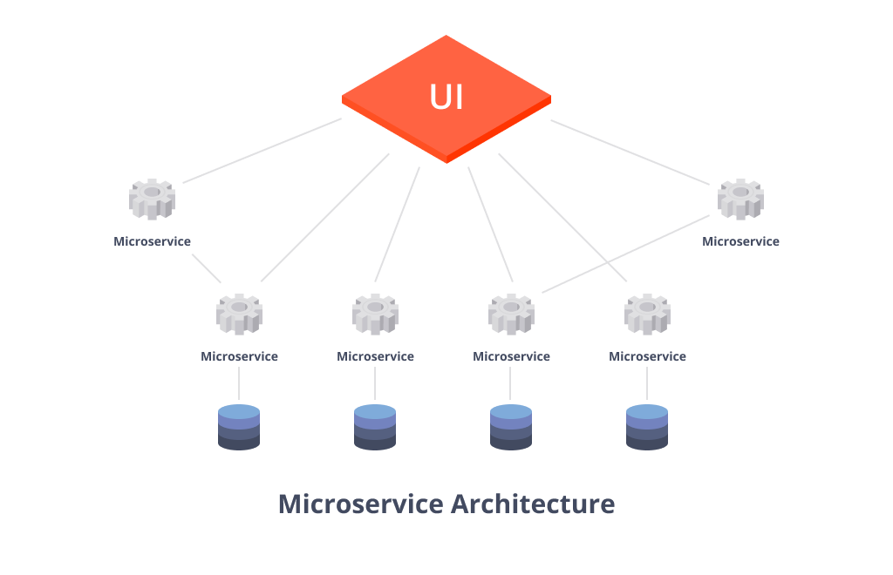
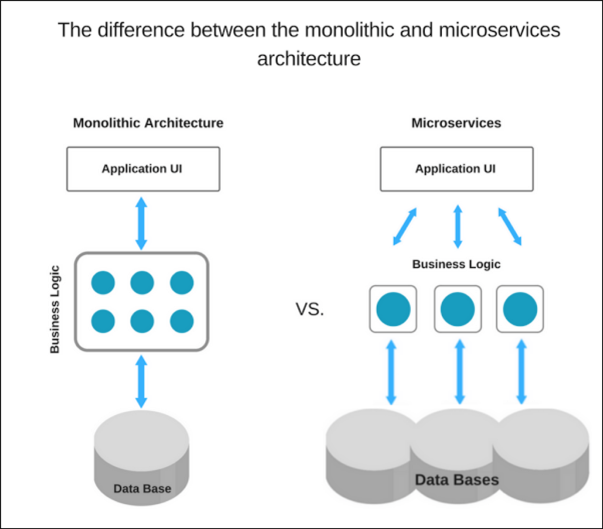
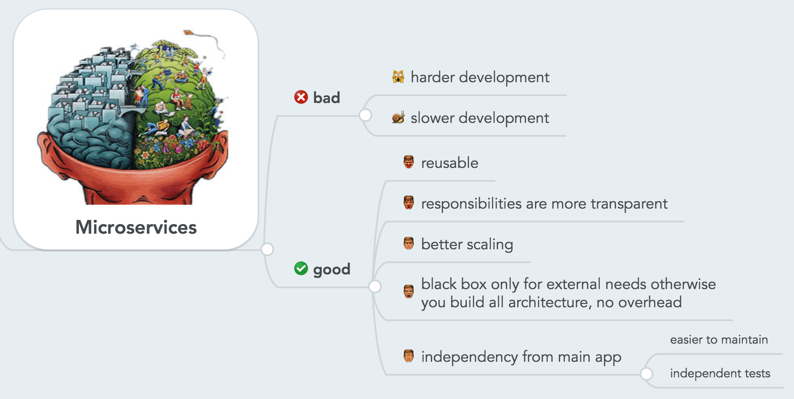
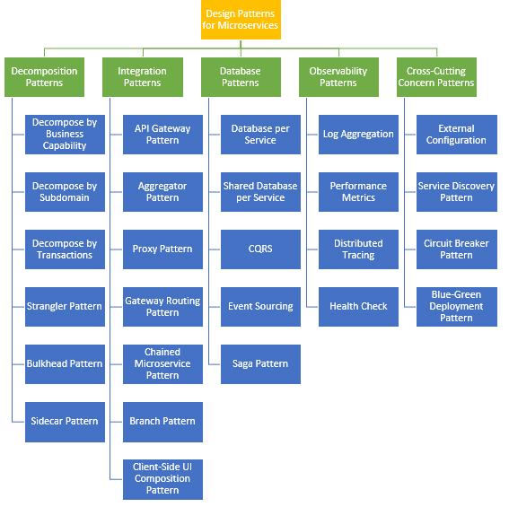

# Microservices

## Overview

`Microservices` cũng là một pattern trong `Software architecture` và rất phổ biến trong những năm gần đây nhờ khả năng module hóa và khả năng mở rộng. Khác biệt với Monolith, thay vì gom tất cả module thành một khối thì ta tách các module thành những service siêu nhỏ. Mỗi service sẽ được đặt trên một server riêng và giao tiếp với nhau thông qua Internet (HTTP Protocols; Message Queue v.v...)

Theo [Martin Fowler](https://martinfowler.com/):

???+ info "Microservice"
    The microservice architectural style is an approach to developing a single application as a suite of small services, each running in its own process and communicating with lightweight mechanisms, often an HTTP resource API.

  
## Microservices Architecture

Bên trong kiến trúc của Microservices thì các services sẽ tồn tại độc lập nhau về xử lý, lưu trữ dữ liệu và cả HTTP request/response. 

Microservice có thể cung cấp hầu hết các tính năng của một ứng dụng Monolith. Ngoài ra, nó cung cấp nhiều tính năng và linh hoạt hơn, do đó nó là sự lựa chọn ưu việt cho ứng dụng phức tạp. 

Không giống như Monolith, khá khó để khái quát hóa kiến trúc microservices vì nó có thể thay đổi nhiều tùy thuộc vào trường hợp sử dụng và triển khai. Nhưng nhìn chung thì chúng cũng có một số đặc điểm như sau:

- Các component trong kiến trúc microservices liên kết theo kiểu `loose coupling` và có context riêng cho mỗi service, tiện cho quá trình development.

- Các component có thể được phát triển, test, deploy và scale độc lập mà không ảnh hưởng đến các component khác.

- Các component không cần phải được phát triển cùng một stack công nghệ. Tức là một component có thể chọn stack công nghệ và ngôn ngữ lập trình của riêng nó.
Chúng thường sử dụng các tính năng nâng cao như truy tìm dịch vụ `service discovery`, `circuit breaking`, `load balance` v.v...

- Các component chủ yếu là nhẹ và chúng đảm nhiệm từng chức năng riêng biệt. Ví dụ dịch vụ xác thực sẽ chỉ quan tâm xác thực người dùng vào hệ thống.

- Thường mỗi service sẽ kèm theo một `monitor` để giám sát và xử lý sự cố.

### Microservices vs Monolithic

## Benefits

Microservices được sử dụng ngày càng phổ biến nhờ mang lại vô số lợi ích như: 

- Source code rất tinh gọn: Bởi vì hệ thống được cấu thành từ các dự án nhỏ, và mỗi dự án đều rất đơn giản cũng như tập trung vào 1 hoặc 1 vài nghiệp vụ chính. Vì vậy, các code base và độ phức tạp của chúng đều không cao. Nhờ vậy, nó sẽ giúp mang lại tính gọn nhẹ, dễ bảo trì cũng như mở rộng hơn. 

- Tối ưu hóa việc bảo mật cho source code: Khi nhân viên làm việc ở các dự án thì chỉ truy cập được vào một source code của dự án đó. 

- Services tồn tại độc lập: Một service nào đó chết thì các service khác vẫn sẽ hoạt động một cách bình thường. 

- Scale độc lập: Tùy thuộc vào nhu cầu sử dụng của hệ thống mà bạn có thể scale riêng cho service đó. Có thể như service đơn hàng mà sử dụng thường xuyên nên chạy từ 2 đến 3 server để gia tăng performance. 

- Microservices cho phép dễ dàng continuous delivery và deployment các ứng dụng lớn và phức tạp. 

- Có thể cải thiện khả năng bảo trì vì các service tương đối nhỏ nên dễ hiểu và dễ thay đổi.

- Khả năng test và deploy đơn giản, độc lập nhờ các services nhỏ, các component tách biệt trong một hệ thống.
 
- Cho phép các services được phát triển nhanh chóng bởi những team khác nhau. Khi đó, mỗi team đều sẽ được phát triển và thử nghiệm để triển khai cũng như mở rộng được quy mô của dịch vụ của mình một cách độc lập nhất với tất cả các team. 

- Nếu như có lỗi xảy ra trong một service thì chỉ có service đó bị ảnh hưởng và các service khác sẽ thực hiện xử lý các yêu cầu cần thiết. Trong khi đó, thì mỗi một thành phần nếu như hoạt động sai của kiến trúc một khối thì nó sẽ làm ảnh hưởng đến toàn bộ hệ thống. 

- Lập trình viên có thể thay đổi dễ dàng bằng cách sử dụng công nghệ mới khi triển khai các service. Tương tự như khi có thay đổi lớn thì các service đều có thể thực hiện và bạn dễ dàng thay đổi được công nghệ hơn. 

- Những issue, ví dụ liên quan đến memory leak một trong các service, bị cô lập và có thể không làm sập ứng dụng.

- Việc áp dụng các công nghệ mới dễ hơn. Các component có thể được nâng cấp độc lập với nhau.

- Thích hợp để áp dụng Agile.
## Drawbacks

- Phức tạp hơn về mặt tổng thể vì các component khác nhau có các stack công nghệ khác nhau nên buộc team phải tập trung đầu tư thời gian để theo kịp công nghệ.

- Khó thực hiện test end-to-end và integration test vì có nhiều stack công nghệ khác nhau.

- Deploy toàn bộ ứng dụng phức tạp hơn vì có nhiều container và nền tảng ảo hóa liên quan.

- Ứng dụng được scale hiệu quả hơn nhưng thiết lập nâng cấp sẽ phức tạp hơn vì nó sẽ yêu cầu nâng cao nhiều tính năng như truy tìm dịch vụ (service discovery), định tuyến DNS,…

- Yêu cầu một team-size lớn để maintain ứng dụng vì có nhiều component và công nghệ khác nhau.

- Các thành viên trong team chia sẻ các skill khác nhau dựa trên component họ làm nên sẽ tạo ra sự khó khăn khi thay thế và chia sẻ kiến thức.

- Thời gian phát triển ban đầu là chậm nên thời gian để có thể làm marketing lâu hơn.

- Yêu cầu cơ sở hạ tầng phức tạp. Thông thường sẽ yêu cầu nhiều container (Docker) hoặc nhiều VM để chạy.

- Cần phải implement việc communication giữa các inter-services

- Việc Handle partial failure rất phức tạp bởi vì luồng xử lý cần phải đi qua nhiều service khác nhau.
## When to use Microservice Architecture?

Người ta thường sử dụng kiến trúc microservice khi:

- Các module giao tiếp qua mạng nên có thể tốc độ không cao bằng monolith. Ngoài ra, mỗi module phải tự giải quyết các vấn đề về bảo mật, transaction, lỗi kết nối, quản lý log files.

- Việc đảm bảo tính đồng nhất trong dữ liệu sẽ trở nên phức tạp hơn

- Sử dụng nhiều service nên việc tích hợp, theo dõi, quản lý các service này sẽ phức tạp &rarr; Cần một team đa năng, có đủ thành viên để phát triển các component riêng lẻ một cách hiệu quả

- Ứng dụng có phạm vi lớn và bạn xác định các tính năng sẽ được phát triển rất mạnh theo thời gian. Ví dụ: cửa hàng thương mại điện tử trực tuyến, dịch vụ truyền thông xã hội, dịch vụ truyền phát video với số lượng người dùng lơn, dịch vụ cung cấp API ...

- Tiềm năng về người dùng lớn và kỳ vọng số lượng người dùng sẽ phát triển. Ví dụ một mạng xã hội nhắm mục tiêu là người dùng trên toàn thế giới.

## Design Pattern for Microservice

Để tận dụng tối đa lợi ích và hạn chế các nhược điểm như trên, Microservices được xây dựng dựa trên những nguyên tắc:

- Independent & Autonomous Services
- Scalability
- Decentralization
- Resilient Services
- Real-Time Load Balancing
- Availability
- Continuous delivery through DevOps Integration
- Seamless API Integration and Continuous Monitoring
- Isolation from Failures
- Auto - Provisioning

Hình dưới đây tổng hợp các Design Pattern cho Microservice

## Reference

1. [Monolithic vs. Microservices Architecture - articles.microservices.com](https://articles.microservices.com/monolithic-vs-microservices-architecture-5c4848858f59)

2. [Microservices in Practice - Key Architectural Concepts of an MSA  -wso2.com](https://wso2.com/whitepapers/microservices-in-practice-key-architectural-concepts-of-an-msa/)

3. [Pattern: Microservice Architecture - microservices.io](https://microservices.io/patterns/microservices.html)

4. [Introduction to Microservices - nginx.com](https://www.nginx.com/blog/introduction-to-microservices/)

5. [20 Characteristics of MicroServices Architecture - medium.com](https://medium.com/@anilkkurmi/20-characteristics-of-microservices-architecture-fbd3da151384)