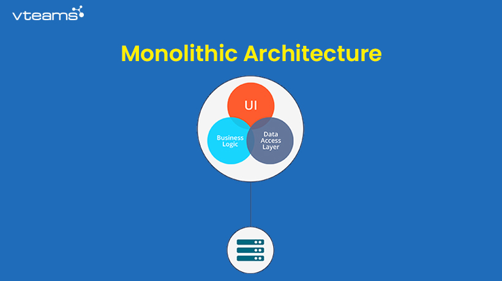
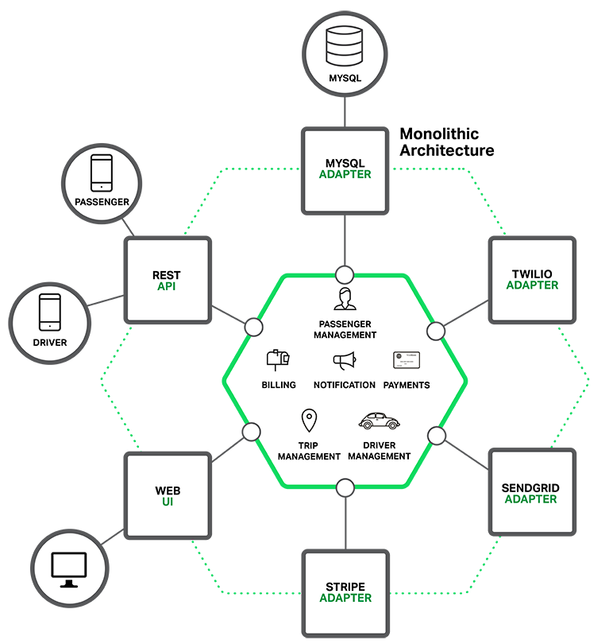

# Monolith

## Concepts

`Software architecture` là việc tổ chức hệ thống phần mềm thành nhiều thành phần như Web Server, Database, bộ nhớ, giao diện v.vv và các layer thực hiện việc giao tiếp giữa các thành phần này với nhau. Mục tiêu chính của thiết kế `Software architecture` là giải quyết vấn đề của Bussiness Logic của phần mềm. 

`Monolith` là một từ chỉ một khối đá khổng lồ &rarr; `Monolith means composed all in one piece`. Trong công nghệ phần mềm, `Monolith` là một `pattern` đề cập đến việc chia phần mềm thành các đơn vị phần mềm - đơn vị này là được tổ chức thành một khối đóng vai trò cụ thể trong một phần mềm, không thể phân tách. 

Thông thường thì một phần mềm được thiết kế dựa trên `Monolith` bao gồm cơ sở dữ liệu, giao diện người dùng phía client và ứng dụng phía máy chủ. Tất cả các thành phần của phần mềm được hợp nhất lại và tất cả các chức năng của phần mềm được quản lý ở cùng một nơi - tức là không phân tán.

## Monolithic Architecture

`Monolithic application` là một hệ thống phần mềm áp dụng `Monolithic Architecture` để xây dựng ứng dụng thành một `single-tiered software application`, trong đó các `components` của phần mềm là một `single program` được xây dựng từ một `single platform`. Components này có thể là:

- `Authorization` — Đóng vai trò authorizing cho các users

- `Presentation` — Đóng vai trò xử lý các HTTP requests/response

- `Business logic` — Business logic của ứng dụng

- `Database layer` —  Chịu trách nhiệm cho việc truy cập tới database của các data access objects.

- `Application integration` — Integration của các services với nhau trong ứng dụng

- `Notification module` — Chịu trách nhiệm cho việc sending notifications khi cần

Dưới đây là một ví dụ về Monolithic Architecture

Nhìn vào phần lõi của ứng dụng, ta thấy các thành phần business logic được thể hiện bởi các khối dịch vụ (services), đối tượng cho từng vùng nghiệp vụ (domain objects) và các sự kiện (events). Xung quanh phần lõi là các adapter để kết nối vào cơ sở dữ liệu, gửi nhận message, web service hoặc front-end web application.

Mặc dù có cấu trúc module hợp lý, nhưng ứng dụng kiểu này sẽ đóng gói và cài đặt thành một khối (monolithic). Cách để triển khai gói ứng dụng tùy thuộc vào ngôn ngữ lập trình hay thư viện framework mà các bạn sử dụng. Ví dụ ứng dụng sử dụng Spring framework, đóng trong file WAR, triển khai trên application server như Tomcat hay Jetty. Dùng framework khác, ví dụ Spring Boot thì ứng dụng Java là một file tự đóng gói để chạy là JAR, ứng Rails hay Node.js đóng gói theo cấu trúc thư mục phân cấp.

Ứng dụng viết kiểu này cực kì phổ biến. Chúng hoàn toàn dễ phát triển, đặc biệt cùng với sự phát triển của IDE và những công cụ khác tập trung vào xây dựng những ứng dụng dựa trên template sẵn có.

Lập trình viên chỉ cần New Project, ấn nút Build & Run là ứng dụng chạy được ngay và luôn. Ta có thể dễ dàng thực hiện testing bằng cách chạy ứng dụng và thực hiện test UI bằng Selenium. Ứng dụng một khối như thế này khá dễ triển khai. Đơn giản là chỉ cần copy gói được build ra lên server.

Thêm nữa, trong giai đoạn đầu sau khi triển khai, chúng hoạt động vô cùng tốt và những ứng dụng dạng này cũng có thể dễ dàng scale bằng cách chạy nhiều instance được phân tải bằng load balancer.

## Benefits

Có 4 cái `simple to` đề cập đến lợi ích của việc dùng Monolithic Architecture cho ứng dụng:

- `Simple to develop`: development đơn giản và làm trực tiếp trên một project cụ thể, centralized managenment và những bước phát triển cơ bản thì sẽ không lặp đi lặp lại. Effort dành cho việc development được giảm thiểu: tất cả mọi quá trình development đều nằm trên 1 project. Development flow đơn giản chỉ là submit changes, review, merge code và continue. Ngoài ra thì nó dễ development ở việc các tech stack thống nhất ở tất cả các layer của hệ thống.

- `Simple to test`: Dễ test do toàn bộ project được đóng gói trong một package &rarr; dễ dàng chạy integrantion test, UI test và end-to-end test.

- `Simple to deploy`: Deploy đơn giản và nhanh chóng nếu ứng dụng chỉ có một hoặc ít package. Ngoài ra thì yêu cầu cơ sở hạ tầng đơn giản, thậm chí một container đơn giản cũng đủ để chạy ứng dụng.

- `Simple to scale horizontally`: Dễ scale vì chúng ta có thể có nhiều instance cho load banlancer. Yêu cầu team size nhỏ cho việc maintain app. Phát triển ban đầu nhanh hơn do đó có thể đem sale hoặc marketing nhanh hơn. 

## Drawbacks

- Các component được liên kết chặt chẽ với nhau dẫn đến side effect không mong muốn như khi thay đổi một component ảnh hưởng đến một component khác.

- Theo thời gian thì project trở nên phức tạp và lớn dần. Các tính năng mới sẽ mất nhiều thời gian hơn để phát triển và tái cấu trúc các tính năng hiện có sẽ nhiều khó khăn hơn.

- Toàn bộ ứng dụng cần được triển khai lại khi có bất kỳ thay đổi nào.

- Khó khăn trong việc hiểu project do các module liên quan chặt chẽ lẫn nhau. Cũng vì liên kết chặt chẽ như vậy nên nếu có một issue nhỏ trong hệ thống cũng có thể làm system crashed.

- Áp dụng công nghệ mới khó khăn vì toàn bộ ứng dụng phải thay đổi. Do đó nhiều ứng dụng dùng Monolith thường phụ thuộc vào một vài công nghệ cũ và lỗi thời.

- Các service quan trọng không thể scale riêng dẫn đến lãng phí tài nguyên vì toàn bộ ứng dụng phải scale theo.

- Các ứng dụng Monolith lớn sẽ có thời gian khởi động lâu và tốn tài nguyên CPU cũng như bộ nhớ.

- Các team tham gia vào dự án phải phụ thuộc lẫn nhau và tất khó để mở rộng quy mô team.
## When to use Monolithic Architecture?

Người ta thường sử dụng Monolithic Architecture khi:

- Phạm vi ứng dụng là nhỏ và được xác định rõ. Khi đó ta phải chắc chắn ứng dụng sẽ không phát triển mạnh về các tính năng. Ví dụ: blog, web mua sắm trực tuyến đơn giản, ứng dụng CRUD đơn giản...

- Team size nhỏ

- Mặt bằng kỹ năng của các thành viên trong team thường không cao.

- Thời gian để có thể marketing là quan trọng.

- Không muốn mất thời gian cho cơ sở hạ tầng, monitoring, ...

- Khi số lượng người dùng nhỏ và ít, và khả năng là sẽ không tăng nhiều. Ví dụ các ứng dụng doanh nghiệp nhắm đến mục tiêu là một nhóm người cụ thể

Mặc dù có những hạn chế nhất định và mỗi ứng dụng sẽ được triển khai theo những cách khác nhau, nhưng nhìn chung thì khi ứng dụng được lập trình theo kiến trúc Monolith này thì thường `vẫn có thể` đạt được các kết quả như sau:

- Ứng dụng có thể hỗ trợ nhiều loại client như browser hay các app native trên cả desktop và mobile.

- Ứng dụng có thể expose API cho bên thứ ba.

- Ứng dụng có thể tích hợp với các ứng dụng khác thông qua REST/SOAP web service hoặc các message queue.

- Ứng dụng có thể xử lý các HTTP request, implement được các business logic, truy cập cơ sở dữ liệu và có thể trao đổi dữ liệu với các hệ thống khác.

- Ứng dụng có thể chạy trên các container như Tomcat, JBoss,..

- Ứng dụng có thể scale theo chiều ngang (vertical scalability) bằng cách tăng sức mạnh của phần cứng hoặc scale theo chiều dọc (horizontal scalability) bằng cách load balancers.

Do đó, Monolith không phải là không dùng được nữa, nếu tận dụng đúng các khả năng và cân nhắc các hạn chế của Monolith thì lợi ích mà nó mang lại cũng rất đáng kể. Có một bài viết trả lời cho câu hỏi : [Monolithic Architecture Is Still Worth at 2021?](https://medium.com/design-microservices-architecture-with-patterns/monolithic-architecture-is-still-worth-at-2021-98bfc112dc24) cũng khá hay, và `the short answer is YES`, đọc qua bài viết này để thấy được Monolithic Architecture chưa phải là lỗi thời nếu ta tận dụng được tối đa khả năng cũng như lợi ích mà nó mang lại.
## Reference

1. [Pattern: Monolithic Architecture - microservices.io](https://microservices.io/patterns/monolithic.html)

2. [Monolithic vs. Microservices: a guide to application architecture - talend.com](https://www.talend.com/resources/monolithic-architecture/)

3. [The Comparison of Microservice and Monolithic Architecture - Wojciech Zabierowski - DOI: `10.1109/MEMSTECH49584.2020.9109514`](https://www.researchgate.net/publication/341956559_The_Comparison_of_Microservice_and_Monolithic_Architecture)

4. [Introduction to Monolithic Architecture and MicroServices Architecture - medium.com](https://medium.com/koderlabs/introduction-to-monolithic-architecture-and-microservices-architecture-b211a5955c63)

