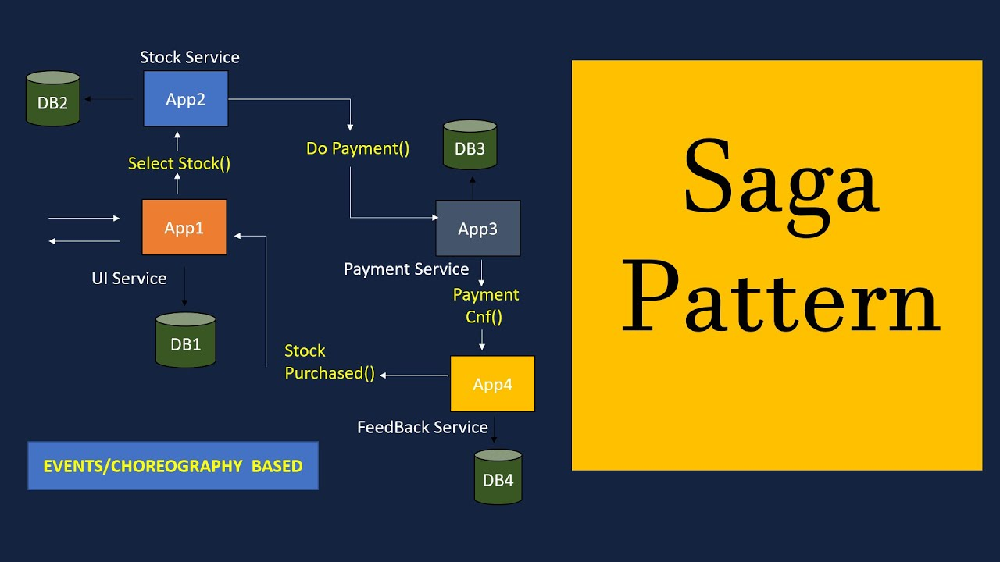

# Database Patterns for Microservice
## Related concepts

Microservice có thể chia hệ thống thành từng services, và Database trong Microservice cũng được chia nhỏ ra thành từng `Database per service`. `Distributed transaction` là một transaction tương tự như `Database transaction`, cũng có ACID và được thực hiện trên Distributed System, vai trò là implement các transactions trong database và các transactions giữa các `Database per service` với nhau trong Microservice.

Trong `Distributed transaction`, có một khái niệm là `Idempotent` là một đặc điểm của một operation cho phép có thể thực hiện operation đó nhiều lần mà không làm thay đổi kết quả. Ý tưởng này thường được dùng trong thiết kế các dịch vụ webservice hoặc event-stream. Ví dụ với Restful service, một operation request là idempotent nếu sau vô số lần gọi, nó vẫn trả về kết quả như nhau. Ví dụ request gọi tới GET là idempotent vì nó không thay đổi giá trị nhưng request gọi đến POST, DELETE, PUT, PATCH thì tùy trường hợp có thể idempotemt hoặc không.

`Compensation transaction` là một transaction cho việc đảo ngược lại những thao tác đã thực hiện trong `Distributed transaction`. Ví dụ một distributed transaction thực hiện một loạt các bước, nếu một bước trong số đó bị lỗi, thì không thể thực hiện rollback lại database như hệ thống monolith, mà sẽ thực hiện một compensation transaction để quay ngược lại các thay đổi mà các service đã thực hiện.

## Database in Microservice

Một ví dụ về một hệ thống thương mại điện tử với Microservice Architecture. Ta cần có một Database như sau:

- Các services cần đảm bảo tính loosing-couple để việc deploy, development và scale được độc lập.

- Một số business transactions cần truy vấn data thuộc sở hữu của các services khác nhau.

- Một số business transactions cần thực thi tính nhất quán và bất biến trên nhiều services. VD: Place Order cần xác minh rằng đơn hàng mới sẽ không vượt quá giới hạn tín dụng của khách hàng. Một số business transactions khác, phải cập nhật data thuộc sở hữu của của các services khác nhau.

- Một số queries cần join data thuộc sở hữu của các services khác nhau.

- Database đôi khi phải được nhân rộng hoặc phân chia để mở rộng quy mô.
Các services khác nhau có yêu cầu lưu trữ dữ liệu khác nhau. Đối với một số services, SQL là sự lựa chọn tốt nhất. Các services khác có thể cần một cơ sở dữ liệu NoSQL như MongoDB.

### Shared database

`Shared database` là dạng một Database được chia sẻ cho nhiều services. Các services được tự do truy cập các bảng của nhau để đảm bảo ACID transaction.

Lợi ích của việc dùng Shared database là trong Microservice chỉ có một single database,đơn giản hơn để hoạt động. Các developers dễ dàng sử dụng ACID transaction để thực thi tính nhất quán dữ liệu.

Tuy nhiên việc dùng Shared database có những hạn chế như:

- `Development time coupling`. Ví dụ: Sự thay đổi schema của DB sẽ gây ảnh hưởng đến nhiều services do chúng truy cập trực tiếp vào các tables, và trong khi các lập trình viên cho mỗi service là khác nhau thì rõ ràng coupling này làm chậm quá trình development.

- `Runtime coupling`: tất cả các services truy cập vào cùng một cơ sở dữ liệu, chúng có khả năng can thiệp lẫn nhau. Ví dụ: nếu một CustomerService transaction chạy mất nhiều thời gian và lock ORDER table thì OrderService sẽ bị chặn.
Thực tế đối với các hệ thống lớn, một DB đơn lẻ không thể đáp ứng đủ yêu cầu về lưu trữ và truy cập dữ liệu của tất cả các services.

### Database per service

Đây là dạng Database giành riêng cho mỗi serivce. Các services khác nếu muốn thao tác với DB này thì cần phải thông qua API của service quản lý DB đó.

Với ví dụ ban đầu, ta có sơ đồ cho cấu trúc của pattern này như sau:

Lợi ích của việc dùng Database per service là giúp đảm bảo tính chất loose-coupleing của services. Việc thay đổi cơ sở dữ liệu của một service không làm ảnh hưởng đến bất kỳ services nào khác. Ngoài ra, mỗi services có thể sử dụng loại Database Driver phù hợp nhất với nhu cầu của nó. Ví dụ: service tìm kiếm có thể sử dụng ElasticSearch. Trong khi đó các services khác có thể sử dụng MySQL, MongoDB.

Việc thực hiện các transaction trải rộng trên nhiều serivces là không hề đơn giản. Các distributed transaction nên được quản lý để đảm bảo ACID trong một transaction. 
và việc thực hiện các queries cần join data có trong nhiều cơ sở dữ liệu rất phức tạp.

Để khắc phục sự phức tạp và hạn chế của `Database per service` thì có nhiều patterns/solutions khác nhau để giải quyết bài toán query và transaction trên nhiều services:

- Để thực hiện transaction trên nhiều services ta có thể sử dụng `Saga pattern`.

- Để thực hiện query trên nhiều serivces ta có thể sử dụng: `API Composition` hoặc `Command Query Responsibility Segregation (CQRS)`

## Saga Pattern

Đối với các hệ thống lựa chọn mô hình `Database per Service`, mỗi service sẽ có một Database riêng. Tuy nhiên một số transaction cần trải rộng trên nhiều serivces và cần một cơ chế để đảm báo tính thống nhất của dữ liệu trên các serivces. Vấn đề trên thực sự quan trong trong hệ thống microservices. Nếu không thì không có cách để biết được transaction đã thực hiện thành công hay chưa. Để giải quyết vấn đề trên thì người ta có hai pattern thường được sử dụng gồm: 2-phase commit và Saga Pattern

### 2-phase commit and why Saga Pattern

Nói về `2-phase commit` thì 2-phase commit - 2PC thường được sử dụng trong các hệ CSDL hơn là sử dụng cho microservices. Đúng như tên gọi, 2PC bao gồm 2 phases: một `prepare phase` và một `commit phase`. Trong prepare phase, tất cả các microservices cần tham gia sẽ được yêu cầu chuẩn bị cho việc thay đổi dữ liệu. Khi tất cả các miroservices tham gia đã chuẩn bị xong thì phase commit sẽ yêu cầu các service thực hiện thay đổi.

Vì 2PC là synchronous (blocking) - giao thức này cần block các đối tượng sẽ bị thay đổi trước khi transaction hoàn thành. Trong `Distributed transaction`, các transactions thường diễn ra rất nhanh, nếu là synchronous thì các microservices sử dụng RPC hoặc HTTP call có thể bị delay cao và có khả năng hai transaction thực hiện lock lẫn nhau dẫn tới deadlock.

Giải pháp được đưa ra như sau: Ta sẽ coi mỗi một transaction trải rộng trên nhiều services là một `Saga`. Và mỗi một Saga là một chuỗi các transaction cục bộ trên từng serivce khác nhau. Nếu một transaction cục bộ thất bại thì Saga sẽ thực hiện một loạt các transactions để rollback lại các thay đổi đã được thực hiện trước đó.

`Saga pattern` là một pattern được sử dụng rộng rãi trong distributed transaction. Saga pattern thực hiện các transaction kiểu `asynchronous` và `reactive`. Trong Saga, một distributed transaction thực hiện các asynchronous local transaction trên tất cả các related microservices. Các microservices giao tiếp với nhau thông qua một `event bus`.

### Implement the `Saga pattern`

Có hai cách để triển khai `Saga pattern`:
#### Events/Choreography-based saga

Service đầu tiên thực hiện transaction và sau đó publish một event. Event này được listen bởi một hoặc nhiều services thực hiện các transactions cục bộ và publish (hoặc không) các event mới.

Distributed transaction kết thúc khi service cuối cùng thực hiện local transaction  của nó và không publish bất kỳ event nào hoặc event được publish không được listen bởi bất kỳ services nào của saga.

Phương pháp này là phổ biến nhất trong Saga Pattern và đảm bảo được loose-coupling giữa các services. Nếu 1 transaction chỉ có từ 2 đến 4 bước thì đây sẽ là sự lựa chọn tuyệt vời. Tuy nhiên, chúng sẽ trở nên khó khăn khi bạn muốn bổ sung, mở rộng transaction. Nó cũng gây khó khăn cho testing vì bạn phải chạy tất cả các services.

#### Command/Orchestration-based saga

Sẽ có một service mới chịu trách nhiệm điều phối các logic của Saga. Nó chịu trách nhiệm duy nhất là nói cho mỗi service phải làm gì và khi nào. Saga service giao tiếp với từng service theo kiểu command/reply để cho chúng biết thực hiện thao tác nào.

## CQRS Pattern

### Concepts

`CQRS` là viết tắt của `Command and Query Responsibility Segregation`, là một pattern hỗ trợ việc phân tách các thao tác với dữ liệu thông qua model

### READ and WRITE model

CQRS tiến hành phân tách các lần read và write thành các model khác nhau gọi là `READ and WRITE model`, sử dụng `commands` để cập nhật dữ liệu và các `query` để đọc dữ liệu. Các model này sẽ tách biệt nhau.

Thông thường, để thực hiện ghi một model bằng cách publish một event tới `Evenentbus` mỗi khi update database, update database và publish event sẽ chỉ diễn ra trên một transaction duy nhất.

### Why to use CQRS Pattern

Triển khai CQRS giúp ứng dụng có thể tối đa performance, scalability, và security. Sự linh hoạt khi chuyển sang CQRS giúp hệ thống phát triển tốt hơn theo thời gian và ngăn sự xung đột giữa các domain level.

Ngoài ra còn có các lợi ích như:

- `Independent scaling`: CQRS cho phép xử lý read và write có thể scale độc lập, hạn chế lock contentions.

- `Optimized data schemas`: Read side có thể sử dụng schema tối ưu cho query, trong khi write side sử dụng schema tối ưu cho update.

- `Separation of concerns`:  Phân tách read side và write side giúp cho model dễ dàng bảo trì và linh hoạt.

- `Simpler queries`: Ứng dụng tránh việc thực hiện các query phức tap.

## Reference

1. [Distributed Transaction - hazelcast.com/](https://hazelcast.com/glossary/distributed-transaction/)

2. [Using Saga Pattern in Microservices - enlear.academy](https://enlear.academy/using-saga-pattern-in-microservices-3a638979e830)

3. [Pattern: Saga - microservices.io](https://microservices.io/patterns/data/saga.html)

4. [Pattern: Command Query Responsibility Segregation (CQRS)](https://microservices.io/patterns/data/cqrs.html)

5. [CQRS Design Pattern in Microservices Architectures](https://medium.com/design-microservices-architecture-with-patterns/cqrs-design-pattern-in-microservices-architectures-5d41e359768c)