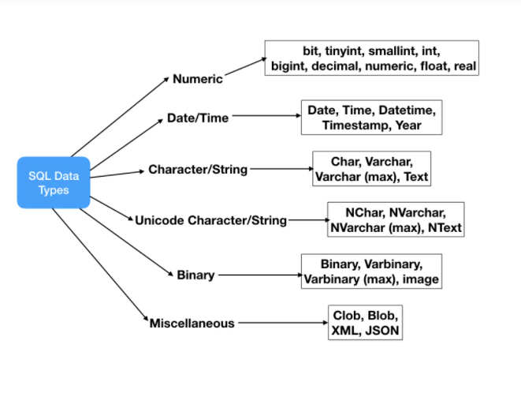

# Data types

- Khi create table, ta cần chỉ định kiểu dữ liệu cho mỗi cột. Mỗi kiểu dữ liệu có một định dạng lưu trữ nhất định, phạm vi giá trị hợp lệ và các ràng buộc.

## Data Types important points

- Không phải tất cả các kiểu dữ liệu ở dưới đây đều được hỗ trợ bởi mọi nhà cung cấp Relational Database. Ví dụ: Oracle không hỗ trợ `DATETIME` ( chỉ dùng `DATE`) và MySQL không hỗ trợ kiểu dữ liệu `CLOB` ( dùng `LONGTEXT`). Vì vậy, khi thiết kế `Database Schema` và viết `SQL queries` thì cần đảm bảo kiểm tra xem các kiểu dữ liệu cụ thể có được hỗ trợ hay không.

- Các kiểu dữ liệu được liệt kê ở dưới không bao gồm tất cả các kiểu dữ liệu trong Database, đây là những loại dữ liệu được sử dụng phổ biến nhất. Một số nhà cung cấp cơ sở dữ liệu quan hệ có kiểu dữ liệu riêng của họ. Ví dụ: Microsoft SQL Server có các loại dữ liệu `money` và `smallmoney` nhưng vì nó không được các nhà cung cấp cơ sở dữ liệu phổ biến khác hỗ trợ nên nó không được liệt kê ở đây.

- Mỗi nhà cung cấp cơ sở dữ liệu quan hệ đều có giới hạn kích thước tối đa riêng cho các loại dữ liệu khác nhau, ta không cần phải nhớ cái giới hạn này mà quan trọng là có kiến ​​thức về kiểu dữ liệu nào sẽ được sử dụng trong một trường hợp cụ thể nào.

- Theo mình tìm hiểu, có sự khác biệt về data types giữa [T-SQL](https://docs.microsoft.com/en-us/sql/t-sql/data-types/data-types-transact-sql?view=sql-server-ver15) và [PL/SQL](https://www.databasestar.com/oracle-data-types/), nhưng nhìn chung đều là SQL và có thể group các Data Types theo hình sau:

## Numeric Data Types

`Numeric Data Types` dùng để lưu trữ các giá trị số

| Datatype | From |	To |
| ------ | ------ | ------ |
| bit	| 0 |	1 |
| tinyint |	0 |	255 |
| smallint |-32,768 | 32,767 |
| int |	-2,147,483,648 | 2,147,483,647 |
| bigint |	-9,223,372,036, 854,775,808	| 9,223,372,036, 854,775,807 |
| decimal |	-10^38 +1 | 10^38 -1 |
| numeric | -10^38 +1 | 10^38 -1 |
| float | -1.79E + 308 |1.79E + 308 |
| real | -3.40E + 38 | 3.40E + 38 |

## Character Data Types

`Character Data Types` kiểu dữ liệu lưu trữ các giá trị `alphanumeric values`, hoặc `strings`. Chúng lưu trữ dữ liệu dựa trên bộ ký tự của cơ sở dữ liệu - [database’s character set](https://www.databasestar.com/oracle-character-sets/),điển hình là bộ mã [ASCII](https://www.asciitable.com/).

Trong SQL Data types, Character Data có thể chia làm 2 loại là `Character/String data types` như `char`, `varchar`, `text` và `Unicode Character/String data types` để chứa các ký tự [Unicode](https://unicode.org/standard/WhatIsUnicode.html)

### Character/String data types

| Data Type | Description |
| ------| ------ |
| NCHAR | Cấp bộ nhớ cố định dựa trên `size`- số ký tự lưu trữ. Tối đa 4000 ký tự. Thêm dấu cách về bên phải để bù phần trống cho đủ số kí tự. |
| NVARCHAR/NVARCHAR(max) | Bộ nhớ có thể thay đổi, size là số kí tự lưu trữ. Tối đa 4000 ký tự. Nếu set max thì có thể lưu trữ tối đa 2GB bộ nhớ |
| NTEXT | Bộ nhớ có thể thay đổi, lưu trữ tối đa 2GB bộ nhớ |

### Unicode Character/String data type

| Data Type | Description |
| ------| ------ |
| NCHAR | Cấp bộ nhớ cố định dựa trên `size`- số ký tự lưu trữ. Tối đa 4000 ký tự. Thêm dấu cách về bên phải để bù phần trống cho đủ số kí tự. |
| NVARCHAR/NVARCHAR(max) | Bộ nhớ có thể thay đổi, size là số kí tự lưu trữ. Tối đa 4000 ký tự. Nếu set max thì có thể lưu trữ tối đa 2GB bộ nhớ |
| NTEXT | Bộ nhớ có thể thay đổi, lưu trữ tối đa 1GB bộ nhớ |

- Kiểu dữ liệu CHAR và VARCHAR là giống nhau, nhưng khác nhau ở cách chúng được lưu trữ và truy xuất. Chúng cũng khác nhau về chiều dài tối đa và giữ lại hay không khoảng trắng phía trước (trailing spaces).

## Date and Time Data Types

| Data Type | Description |
| ------| ------ |
| DATE	| Lưu trữ `date` theo format `YYYY-MM-DD`
| TIME	| Lưu trữ `time` theo format `HH:MI:SS`
| DATETIME | Lưu trữ `date` và `time` theo format `YYYY-MM-DD HH:MI:SS`
| TIMESTAMP | Lưu trữ cả hai thông tin ngày tháng và thời gian. Giá trị này sẽ được chuyển đổi từ múi giờ hiện tại sang UTC trong quá trình lưu trữ, và sẽ chuyển trở lại múi giờ hiện tại khi lấy dữ liệu ra. Phạm vi  `'1970-01-01 00:00:01' UTC` tới `'2038-01-19 03:14:07' UTC`|
| YEAR(2)/YEAR(4) |	Với YEAR(4), hiển thị giá trị YEAR theo format `YYYY` trong phạm vi 1901 tới 2155, hoặc 0000. Với YEAR(2), hiển thị giá trị YEAR theo 2 số cuối của YEAR trong khoảng từ `'0' tới '99'`, trong đó `'0' tới '69'` tương đương với giá trị YEAR từ 2000-2069, và `'70' tới '99'` tương đương với YEAR từ 1970 tới 1999. |

- Sự khác biệt chính của DATETIME và TIMESTAMP là giá trị của TIMESTAMP được chuyển đổi từ múi giờ hiện tại sang UTC trong khi lưu trữ, và chuyển ngược trở lại từ UTC sang múi giờ hiện tại trong lúc lấy ra. Còn kiểu dữ liệu DATETIME thì không có gì thay đổi.

## Binary Data Types

| Data Type | Description |
| ------| ------ |
| BINARY | Lưu giá trị nhị phân. Cấp bộ nhớ cố định. Tối đa 8000 bytes |
| VARBINARY/VARBINARY(max) | Bộ nhớ có thể thay đổi, tối đa 8000 bytes. Nếu set max thì có thể lưu trữ tối đa `max bytes` bộ nhớ |
| IMAGE | Dữ liệu nhị phân, bộ nhớ cấp có thể thay đổi, tối đa lưu 2GB binary data |

- Các kiểu dữ liệu BINARY và VARBINARY tương tự như CHAR và VARCHAR, ngoại trừ việc chúng có chứa các chuỗi nhị phân chứ không phải là chuỗi non-binary.

## Miscellaneous Data Types

| Data Type | Description |
| ------| ------ |
| CLOB | Lưu trữ `characters large objects`, có kính thước lớn hơn 2GB |
| BLOB | Lưu trữ `binary large objects` |
| XML | Lưu trữ XML data |
| JSON |Lưu trữ JSON data |

## Reference

1. [SQL Data Types](https://www.journaldev.com/16774/sql-data-types)

2. [Database SQL Reference - Oracle](https://docs.oracle.com/cd/B19306_01/server.102/b14200/sql_elements001.htm#i54330)

3. [MySQL Datatypes](https://dev.mysql.com/doc/refman/5.7/en/data-types.html)

4. [SQL Datatypes - W3C](https://www.w3schools.com/sql/sql_datatypes.asp)

5. [PostgreSQL 9.5.25 Documentation - Chapter 8. Data Types](https://www.postgresql.org/docs/9.5/datatype.html)

6. [data-types-sql](https://whatisdbms.com/data-types-sql/)