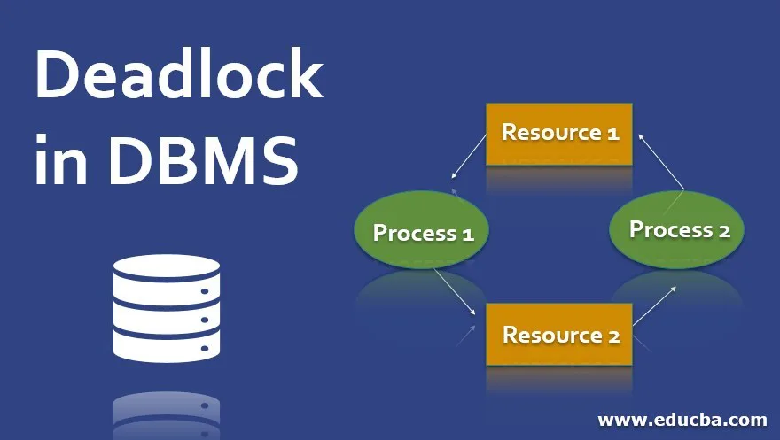
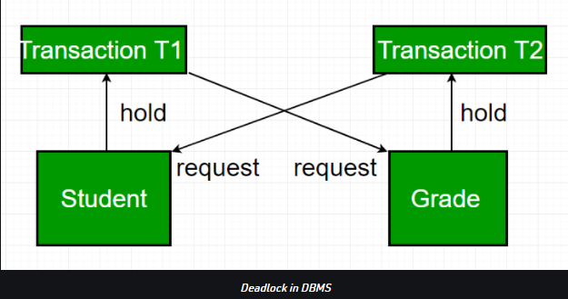
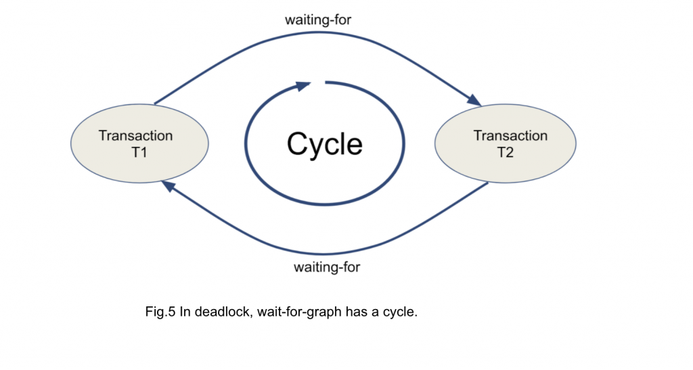

# Deadlock
- Consistency and Lock in Relational Database
- Deadlock
- Deadlock Detection
- Deadlock Avoidance
- Deadlock Prevention

## `Consistency` and `Lock` in Relational Database

- Relational database là dạng database có độ nhất quán dữ liệu cao nhất. Dữ liệu trong database luôn ở dạng `Consistency` tại mọi thời điểm. Nghĩa là với cùng một dữ liệu thì không thể có việc ghi (update, insert, delete) tại cùng một thời điểm. Relational database đảm bảo tính consistency của dữ liệu thông qua cơ chế `Lock` dữ liệu lại khi dữ liệu đang in progress.

- Lock để đảm bảo tính consistency data là một trong các ưu điểm nổi bật của cơ sở dữ liệu quan hệ. Vì vậy nếu đã dùng cơ sở dữ liệu quan hệ thì phải biết tận dụng nó. Tránh tối đa việc sử dụng các chế độ bỏ lock như mode nolock vì có thể dẫn tới hiện tượng đọc sai lệch dữ liệu.

    

_Cơ chế Lock trong Database:_

- Trong trường hợp có nhiều hơn 1 transaction đồng thời xử lý trên cùng 1 table, sẽ rơi vào 1 số trường hợp sau, lấy ví dụ 2 transaction: T1 & T2:

- TH1: 2 transaction đó không xử lý trên cùng 1 row:

    + Nếu config cho database đó đang để là `lock table`: table sẽ bị lock cho đến khi T1 xử lý xong và được commit thì mới unlock. Sau đó T2 mới được xử lý tiếp. T2 sẽ được xử lý khi T1 chạy xong, trường hợp T1 chạy mãi không xong thì T2 sẽ trả về `timeout exception `

    + Nếu config cho database đó đang để là `lock row:` row đang được xử lý ở 2 transaction sẽ bị lock, tuy nhiên 2 transaction xử lý 2 row khác nhau nên cả 2 đều được xử lý đồng thời.

- TH2: 2 transaction đó xử lý vào cùng 1 row: row được xử lý sẽ lock, T1 xử lý xong, commit thì lúc này T2 mới thực thi, nếu T1 xử lý chậm thì T2 sẽ trả về `timeout exception`.

Đó là trường hợp Lock, nó chỉ ảnh hưởng một phần tới performance khi các Transaction đồng thời phải chờ và thực hiện một cách tuần tự. Nhưng, sẽ có trường hợp các Transaction đó bị `conflict` với nhau, dẫn tới không một Transaction nào thực hiện được. Trường hợp như vậy được gọi là `DeadLock`

## Deadlock

_Concepts_

`Deadlock` là tình trạng 2 hoặc nhiều transactions khác nhau không thể tiếp tục xử lý vì mỗi transaction đều đang Lock các tài nguyên mà các transaction khác cần để xử lý và `Release Lock`. Dẫn đến các transactions không bao giờ có thể release lock các tài nguyên mà nó đang giữ.

_Example_

Transaction T1 đang lock một record trong bảng `Students` và cần cập nhật một số thông tin trong record của bảng `Grade`. Đồng thời, Transaction T2 lock trên chính các record mà T1 cần cập nhật trong bảng Grades, nhưng T2 cũng cần cập nhật các record trong bảng `Students` do Transaction T1 lock. 

Trường hợp này gây ra `Deadlock`. Transaction T1 sẽ chờ Transaction T2 giải phóng tài nguyên và tương tự Transaction T2 sẽ chờ Transaction T1 giải phóng. Kết quả là, mọi hoạt động đều dừng lại và tồn tại mãi mãi trừ khi hệ quản trị cơ sở dữ liệu phát hiện ra deadlock và hủy bỏ một trong các Transaction.

## Deadlock Detection

Các Relational database đều có phương pháp để có thể phát hiện ra khi nào deadlock xảy ra, tránh dẫn đến việc hệ thống bị Deadlock quá lâu. Thậm chí Relational database theo dõi các Transaction lock dữ liệu như thế nào bất kể nó có dẫn đến deadlock hay không.

`Wait-for Graph` là một trong những phương pháp để phát hiện deadlock. Trong phương pháp này, một biểu đồ được vẽ dựa trên Transactions và lock status của từng Transactions. Nếu đồ thị này tạo thành một chu kỳ thì tức là đang có một deadlock.

Ví dụ về 1 biểu đồ khi xảy ra deadlock dựa trên phương pháp Wait-for graph:

## Deadlock Avoidance

Một phương pháp để tránh deadlock là áp dụng tính `Consistency` lên các Table trong Database. Trong ví dụ đã cho ở trên, các Transaction truy cập `Student` và `Grade` phải luôn truy cập vào các table theo một thứ tự nhất định.  Giả sử như thứ tự truy cập cố định của 2 bảng là `Student` &rarr; `Grade`. Trong trường hợp này thì T2 sẽ phải chờ T1 giải phóng tài nguyên tại bảng `Student` xong thì mới bắt đầu (tức là T2 sẽ chưa lock tài nguyên của bảng `Grade`) do đó T1 sẽ thực hiện 1 cách bình thường rồi T2 mới thực hiện và deadlock sẽ không xảy ra.

Ngoài ra còn có các `Deadlock Avoidance` như sau:

- Hạn chế sử dụng transactions nếu không thật sự cần thiết. Để làm được điều này, thì chúng ta cần phải hiểu ý nghĩa của việc sử dụng transaction và tránh lạm dụng.

- Giảm thiểu số lượng bảng cần tác động trong một transactions, transactions có số bảng tham gia càng ít thì khả năng xảy ra deadlock càng thấp.

- Giữ cho các transactions luôn có workloads và thời gian xử lý càng ít càng tốt, tối ưu query, clean code v.vv

- Khi sửa đổi nhiều table trong một transactions hoặc các row khác nhau trong cùng một table, nên thực hiện các thao tác đó theo thứ tự nhất quán.

## Deadlock Prevention

Deadlock Avoidance thôi chưa đủ. Đối với một cơ sở dữ liệu lớn thường sẽ dùng phương pháp `Deadlock Prevention` để ngăn chặn tình trạng Deadlock bằng cách phân bổ các resource một cách hợp lý sao cho không thể xảy ra tình trạng Deadlock. Các Database sẽ phân tích các hoạt động của Transactions xem chúng có xác suất Deadlock hay không, nếu có, Transaction đó có thể không bao giờ được phép thực hiện.

Cơ chế `Deadlock Prevention` đề xuất hai phương án:

-  `Wait-Die Scheme`: Nếu một Transaction yêu cầu một tài nguyên đang bị lock bởi một Transaction khác, thì DBMS chỉ cần check cái `timestamp` của cả hai Transaction và cho phép Transaction có timestamp trễ hơn hơn đợi cho đến khi tài nguyên available.

- `Wound Wait Scheme`: Tương tự như trên, DBMS cũng sẽ check cái timestamp để phân biệt `older transaction` và `younger transaction`. Khác biệt là thay vì bắt `younger transaction` đợi thì nó sẽ kill `younger transaction` luôn. `younger transaction` sẽ được bắt đầu lại với độ trễ hơn timestamp ban đầu của nó. 

## Reference

1. [Deadlock in DBMS - geeksforgeeks](https://www.geeksforgeeks.org/deadlock-in-dbms/)

2. [ What is the difference between "wait-die" and "wound-wait" deadlock prevention algorithms? - stackoverflow - questions 32794142 ](https://stackoverflow.com/questions/32794142/what-is-the-difference-between-wait-die-and-wound-wait-deadlock-prevention-a)

3. [Deadlocks - docs.oracle](https://docs.oracle.com/javadb/10.6.2.1/devguide/cdevconcepts28436.html#:~:text=In%20a%20database%2C%20a%20deadlock,the%20Orders%20table%20to%20finish.)

4. [Deadlock in DBMS - educba](https://www.educba.com/deadlock-in-dbms/)