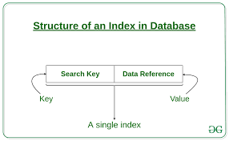
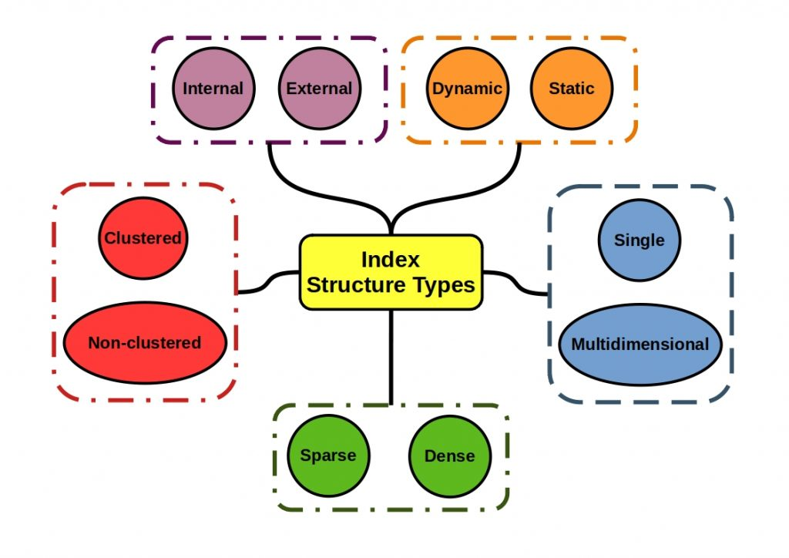
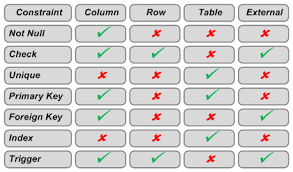
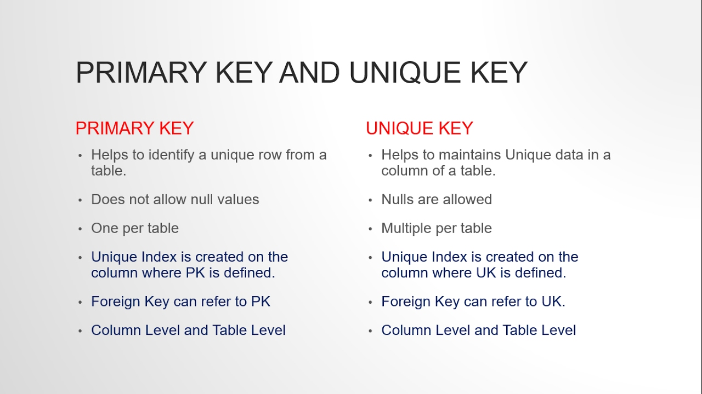

# Index, Constraints, Unique

## Index


### Concepts

- `Index` là một Database Optimization Techniques, nó như một cấu trúc dữ liệu mà Database Search Engine có thể sử dụng để tăng nhanh thời gian và tối ưu hiệu suất truy vấn database bằng việc giảm lượng truy cập vào bộ nhớ khi thực hiện các câu truy vấn. Hiểu đơn giản, một `Index` là một con trỏ tới dữ liệu trong một bảng (tương tự như Mục lục của cuốn sách).

- Giả sử ta có một bảng User lưu thông tin của người dùng, ta muốn search thông tin của người dùng có field `Name` là “NguyenVanA” . Ta có truy vấn SQL sau: 

```
SELECT * FROM User WHERE Name = 'NguyenVanA';
```

- Khi không có Index cho cột Name, Database Search Engine sẽ phải search qua tất cả các Row của bảng User để so sánh và lấy ra những Row thỏa mãn điều kiện WHERE. Vì vậy, khi số lượng record trong 1 table cực lớn, việc search từng record như thế sẽ tốn performance rất nhiều.

- Index được sinh ra để giải quyết vấn đề này. Index trỏ tới `địa chỉ dữ liệu` trong một bảng, nó giúp Database Search Engine thực hiện các câu truy vấn nhanh chóng bằng cách tìm tới đúng địa chỉ dữ liệu để lấy nó ra thay vì phải đi nhìn mặt từng thằng dữ liệu 😄

- Index có thể được tạo cho một hoặc nhiều cột trong database. Index thường được tạo mặc định cho Primary key, Foreign key. Ngoài ra, ta cũng có thể tạo thêm index cho các cột nếu cần.

### Structure of a Database Index



Index là một cấu trúc dữ liệu key-value pair gồm:

1. `Search Key`: chứa bản sao các giá trị của cột được tạo Index ( thường gồm primary key)

2. `Data Reference`: chứa con trỏ trỏ đến địa chỉ của record có giá trị cột index tương ứng

### Indexing methods

Có nhiều phương pháp lập index khác nhau, tùy trường hợp cụ thể sẽ có các cách lập index tối ưu. Hình bên dưới là `Index data structure types`, người ta dựa vào các tiêu chí đó để chọn cách lập index tối ưu nhất cho hệ thống của mình.



Phạm vi truy cập dữ liệu là Internal/External, search theo kiểu Dynamic search/Static search, database Cluster/Non Cluster, Sparse hay Dense. Điều quan trọng nhất là ta muốn lập index các mối quan hệ dữ liệu một chiều hay nhiều chiều.


## Constraints


### Concepts

- `Constraint` là những quy tắc được áp dụng trên các cột dữ liệu, trên bảng. Được sử dụng để kiểm tra tính hợp lệ của dữ liệu vào, đảm bảo tính chính xác, tính toàn vẹn của dữ liệu. 

- Constraint có các sau level:
    + `Column/Row level` là các ràng buộc áp dụng cho các cột, các dòng trong 1 table 
    + `Table level`: là các ràng buộc áp dụng cho toàn bộ table.
    + `External level`: là các ràng buộc áp dụng cho các table với nhau.

### Types of Constraints

| Constraints |	Description |
| ------ | ------ |
| NOT NULL |	Sử dụng để đảm bảo dữ liệu của cột không được nhận giá trị NULL
| DEFAULT | Gán giá trị mặc định trong trường hợp dữ liệu của cột không được xác định.
| UNIQUE | Sử dụng để đảm bảo dữ liệu của cột là duy nhất, không trùng lặp giá trị trên cùng 1 cột.
| PRIMARY KEY | Dùng để thiết lập khóa chính trên bảng, xác định giá trị trên tập các cột làm khóa chính phải là duy nhất, không được trùng lặp. Việc khai báo ràng buộc khóa chính yêu cầu các cột phải NOT NULL.
| FOREIGN KEY |	Dùng để thiết lập khóa ngoại trên bảng, tham chiếu đến bảng khác thông qua giá trị của cột được liên kết. Giá trị của cột được liên kết phải là duy nhất trong bảng kia.
| CHECK |	Bảo đảm tất cả giá trị trong cột thỏa mãn điều kiện nào đó. Đây là hình thức sử dụng phổ biến để kiểm tra tính hợp lệ của dữ liệu (validate data)
|TRIGGER| kiểm tra ràng buộc (check constraints) trên nhiều quan hệ (nhiều bảng/table) hoặc trên nhiều dòng (nhiều record) của bảng. Ngăn chặn việc xóa những dữ liệu quan trọng. (có thể dùng back up các dữ liệu quan trọng sang table khác phòng khi …bị xóa ngoài ý muốn)|

- Hình dưới đây là phạm vi áp dụng theo level của các Constraints



## UNIQUE Constraints
`UNIQUE Constraints` đảm bảo rằng tất cả các giá trị trong một cột là duy nhất.

Cả ràng buộc `UNIQUE` và `PRIMARY KEY` đều đảm bảo tính duy nhất cho một cột trong bảng.`Ràng buộc PRIMARY KEY tự động có một ràng buộc UNIQUE constraint`. Tuy nhiên có thể có nhiều UNIQUE constraints trên mỗi bảng, nhưng chỉ có một PRIMARY KEY cho một bảng.

### SQL UNIQUE Constraint on CREATE TABLE
- SQL sau tạo UNIQUE Constraint trên cột "ID" khi bảng "Persons" được tạo:

```sql
CREATE TABLE Persons (
    ID int NOT NULL,
    LastName varchar(255) NOT NULL,
    FirstName varchar(255),
    Age int,
    UNIQUE (ID)
);
```

- Để đặt tên cho một UNIQUE Constraint hay để xác định một UNIQUE Constraint trên nhiều cột, sử dụng cú pháp SQL sau:

```sql
CREATE TABLE Persons (
    ID int NOT NULL,
    LastName varchar(255) NOT NULL,
    FirstName varchar(255),
    Age int,
    CONSTRAINT UC_Person UNIQUE (ID,LastName)
);
```

### SQL UNIQUE Constraint on ALTER TABLE

- Để thêm UNIQUE Constraint vào cột "ID" khi bảng Persons đã được tạo, sử dụng SQL sau:

```sql
ALTER TABLE Persons
ADD UNIQUE (ID);
```

- Để đặt tên cho UNIQUE Constraint và để xác định UNIQUE Constraint trên nhiều cột, sử dụng cú pháp SQL sau:

```sql
ALTER TABLE Persons
ADD CONSTRAINT UC_Person UNIQUE (ID,LastName);
```

### DROP a UNIQUE Constraint
- Xóa UNIQUE Constraint
```sql
ALTER TABLE Persons
DROP INDEX UC_Person;
```
### Primary key vs Unique key
Hình dưới đây so sánh điểm giống, khác giữa Primary key và Unique key




## Reference

1. [Indexing in Databases](https://www.geeksforgeeks.org/indexing-in-databases-set-1/)

2. [Database Optimization Techniques #1: Indexing](https://optimizdba.com/database-optimization-techniques-1-indexing/)

3. [4 Index Data Structures a Data Engineer Must Know](https://starship-knowledge.com/index-data-structures#Index_data_structure_types)

4. [Constraints in SQL](https://www.wikitechy.com/tutorials/sql/constraints-in-sql.php)

5. [SQL UNIQUE Constraint](https://www.w3schools.com/sql/sql_unique.asp)

6. [Difference between Primary key and Unique key](https://www.geeksforgeeks.org/difference-between-primary-key-and-unique-key/)

