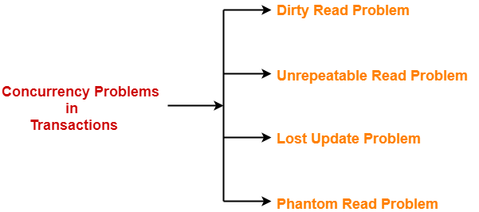
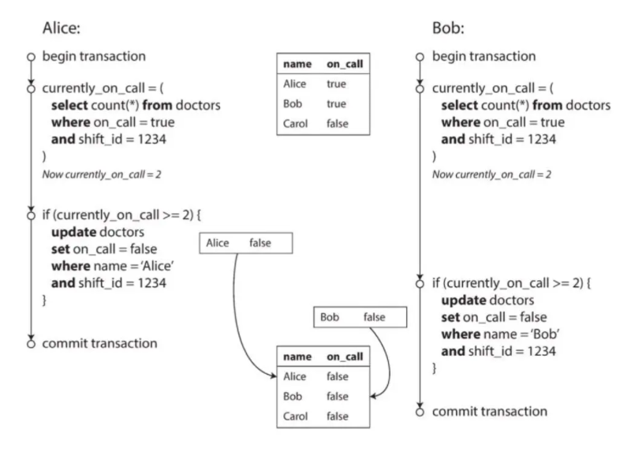
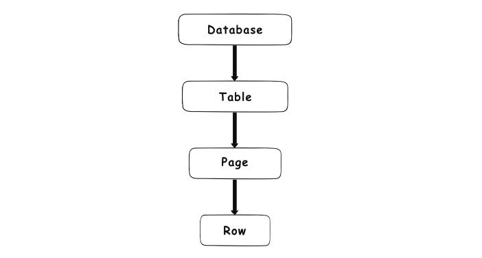
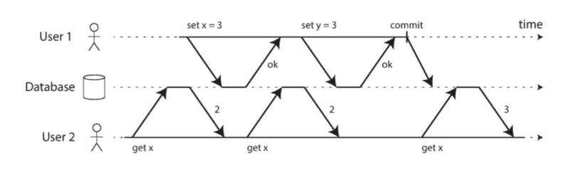

# Locking / Isolation Level

_Note:_

`Data unit`. Vì các phương thức Locks được thiết lập trên một đơn vị dữ liệu cụ thể, nên để hiểu được và các phương thức khóa trước tiên cần tìm hiểu về khái niệm đơn vị dữ liệu: Đơn vị dữ liệu có thể được chia thành nhiều cấp độ sau: 
    - Một dòng dữ liệu. 
    - Một trang (page) (8KB) 
    - Một bảng (table) trong cơ sở dữ liệu. 
    - Một cơ sở dữ liệu (database)

## Concurrency Control Problem
Những tình huống `Race condition` hay gặp trong Database: 

### 1. Dirty read

- `Uncommitted data`/`Dirty read` - Tình trạng mà Database read ra giá trị chưa được commit. Xảy ra khi một transaction thực hiện đọc trên một đơn vị dữ liệu mà đơn vị dữ liệu này đang bị cập nhật bởi một transaction khác nhưng việc cập nhật chưa được commit. 

- Tương tự với `Dirty read` là `Dirty write`. Là tình huống mà transaction xảy ra trước chưa kịp commit, thì cái tới sau đã ghi đè lên, dẫn tới việc kết quả bị xáo trộn, database không biết dữ liệu nào là dữ liệu đúng nhất, làm mất đi `Consistency` - tính nhất quán của Transaction.

- Một Transaction được coi là `no dirty write` khi mà Database chỉ write lên những record đã được commit trước đó. Nếu 2 transaction cùng muốn ghi đồng thời, thì cái nào tới sau sẽ phải chờ đợi transaction trước đó commit success hoặc rollback.

- Việc đảm bảo `no dirty read` giúp cho end user của Database tránh được những trường hợp khó hiểu như là:

    + Có thông báo mới nhưng số badge thì vẫn chưa nhảy +1

    + Lấy ra dữ liệu đã bị rollback.

Tuy nhiên việc sử dụng `no-dirty read` hay `no dirty write` đều tiềm ẩn những vấn đề bên dưới

### 2. Unrepeatable

- `Unrepeatable data`/`Read Skew`/`Non-repeatable Read`:  Tình trạng này xảy ra khi một transaction T1 vừa thực hiện xong thao tác ghi trên một đơn vị dữ liệu (nhưng chưa commit) thì transaction khác (T2) tiến hành đọc trên đơn vị dữ liệu này. Điều này làm cho lần đọc của T2 không nhận được dữ liệu đã ghi từ T1. 

- Lỗi này thường xuất hiện đối với những `read-only transaction`, nó vẫn đảm bảo eventually consistency miễn là user reload lại app ngay sau đó (hay còn gọi là repeated read). Vì chỉ gây ảnh hưởng tới kết quả read nên nó không được xếp vào loại lỗi nghiêm trọng.

- Tuy nhiên, trong một số trường hợp như sau thì ta cần đòi hỏi kết quả phải 100% consistency vào thời điểm thực thi transaction:

    + Truy vấn thống kê trên 1 đoạn dữ liệu lớn: thời điểm bắt đầu truy vấn cách thời điểm kết thúc lên tới vài giây, thậm chí tận vài phút.

    + Backup dữ liệu: có thể kéo dài lên tới hàng tiếng đồng hồ. Chắc chắn chúng ta sẽ không muốn dữ liệu sao lưu sẽ bị lẫn lộn giữa cả version cũ và version mới.

### 3. Lost update

- `Lost update` - Mất dữ liệu khi update: Tình trạng này xảy ra khi có nhiều hơn một transaction cùng thực hiện cập nhật trên 1 đơn vị dữ liệu. Khi đó, transaction thực hiện sau sẽ cập nhật đè lên thao tác cập nhật trước. 

- Lỗi này được xếp vào hàng nghiêm trọng vì có thể gây sai sót logic trong quá trình ghi vào Database. Có nhiều cách để giải quyết nó, trong số đó bao gồm việc bổ sung lock cho cả read operation. Tuy nhiên, cách này không giải quyết được triệt để, vì nó chỉ đảm bảo transaction cho 1 row, chứ không đảm bảo được trên nhiều row.

### 4. Phantom Read

- `Phantom Read`: Là tình trạng mà một transaction đang thao tác trên một tập dữ liệu nhưng transaction khác lại chèn thêm các dòng dữ liệu vào tập dữ liệu mà transaction kia đang tháo tác.

- Đây chính là phiên bản nâng cấp của lỗi `Lost Update`: thường xảy ra khi truy vấn search rồi check 1 số điều kiện và save lại vào Database (không cùng modify 1 object nên không bị lock write). Kết quả của câu lệnh write sẽ làm thay đổi kết quả trả về của truy vấn search trước đó.

- Giải thích cho trường hợp của hình vẽ minh họa bên trên: Trong một bệnh viện, luôn phải có tối thiểu 1 bác sĩ trực. Bác sĩ Alice và Bob cùng gửi yêu cầu xin về nhà vào cùng thời điểm vì buồn ngủ/mệt/lý do gia đình. Số lượng bác sĩ đang trực là 2 (thỏa mãn lớn hơn 1), nên yêu cầu của cả 2 đều được chấp thuận. Kết quả là không còn bác sĩ nào trực ở bệnh viện cả.

## Locking Level

### Database locking

- Giả sử có 2 transaction T1, T2 đang truy xuất đồng thời trên 1 Data unit. Có tất cả 4 trường hợp sau:

| T1 | T2 | Kết quả |
| ------------ | ------------ | ------------ |
| Đọc | Đọc | Không có tranh chấp
| Đọc | Ghi | Xảy ra tranh chấp 
| Ghi | Đọc | Xảy ra tranh chấp 
| Ghi | Ghi | Database chỉ cho phép có đúng 1 transaction được ghi trên đơn vị dữ liệu tại một thời điểm.

Như vậy, khi có 2 transaction (của 2 connection khác nhau) có ít nhất 1 thao tác ghi trên cùng một đơn vị dữ liệu sẽ xảy ra tình trạng tranh chấp. Nếu để tình trạng tranh chấp này xảy ra sẽ dẫn đến những sai sót trên CSDL.

Để giải quyết các vấn đề tranh chấp nêu trên, Database cần sử dụng các phương pháp locks, gọi là `Database locking`. Nhờ vậy mà khi có tranh chấp xảy ra, Database có thể quyết định transaction nào được thực hiện và transaction nào phải chờ. 

`Database lock` thực tế có thể được thực hiện ở nhiều level khác nhau - còn được biết đến như là `lock granularity` - bên trong cơ sở dữ liệu. Đây là danh sách của các cấp độ lock và kiểu dữ liệu hỗ trợ:

- `Database level locking`
- `Table level locking`
- `Page or block level locking`
- `Row/Column level locking`

### Lock modes and compatibility

Trong Database locking có các `Lock modes` cơ bản: 

- Exclusive (X)
- Shared (S)
- Update (U)
- Intent (I)
- Schema (Sch)
- Bulk Update (BU)

#### 1. Shared Locks / Read Locks

- Khi đọc 1 đơn vị dữ liệu, Database tự động thiết lập Shared Lock trên đơn vị dữ liệu đó (trừ trường hợp sử dụng No Lock)

- Shared Lock có thể được thiết lập trên 1 bảng, 1 trang, 1 key hay trên 1 dòng dữ liệu. 

- Nhiều transaction có thể đồng thời giữ Shared Lock trên cùng 1 đơn vị dữ liệu. 

- Không thể thiết lập `Exclusive Lock` trên đơn vị dữ liệu đang có Shared Lock. 

- Shared Lock thường được giải phóng ngay sau khi sử dụng xong dữ liệu được đọc, trừ khi có thiết lập giữ shared lock cho đến hết transaction.

#### 2. Exclusive Lock / Write Lock

- Khi thực hiện thao tác ghi (insert, update, delete) trên 1 đơn vị dữ liệu, Database tự động thiết lập Exclusive Lock trên đơn vị dữ liệu đó. 

- Exclusive Lock luôn được giữ đến hết transaction. 

- Tại 1 thời điểm, chỉ có tối đa 1 transaction được quyền giữ Exclusive Lock trên 1 đơn vị dữ liệu. 

- Không thể thiết lập Exclusive Lock trên đơn vị dữ liệu đang có Shared Lock.

#### 3. Update Locks / Intent-to-update Lock

- Update Lock sử dụng khi đọc dữ liệu với dự định ghi trở lại sau khi đọc trên đơn vị dữ liệu này. 

- Update Lock là chế độ khóa trung gian giữa Shared Lock và Exclusive Lock

- Tại 1 thời điểm, có tối đa 1 Update Lock trên 1 đơn vị dữ liệu

- Update Lock không ngăn cản việc thiết lập các Shared Lock khác trên cùng 1 đơn vị dữ liệu => Update Lock tương thích với Shared Lock 

- Update Lock giúp tránh hiện tượng deadlock khi có yêu cầu chuyển từ Shared Lock lên Exclusive Lock trên 1 đơn vị dữ liệu nào đó (Do tại 1 thời điểm chỉ có tối đa 1 Update Lock trên 1 đơn vị dữ liệu)

Tóm lại, ta có bảng tương thích giữa các loại Lock như sau:

Lock Type |	Shared |	Update |	Exclusive
 ------------ | ------------ | ------------ | ------------ 
Shared	| Yes |	Yes |	No
Update | Yes | No |No
Exclusive |	No | No | No

## Isolation Level

Mỗi Database đều sử dụng phương pháp Isolation khác nhau. Thậm chí cũng có chuyện cùng một ý tưởng nhưng mỗi người lại triển khai khác nhau: cái thì chạy nhanh hơn, cái thì lại tốn ít bộ nhớ hơn, thậm chí cái còn có bug... Về cơ bản thì hiện nay có 4 tiêu chuẩn Transaction Isolation trong Database, và mỗi chúng nó sẽ giải quyết được các độ khó `Concurrency Control Problem` khác nhau:

| | Dirty Write | Dirty Read | Read Skew | Lost Update | Write Skew | Phantoms
| ------ | ------ | ------ | ------ | ------ | ------ | ------ |
| `Read Uncommitted` | ✓ | ✕ | ✕ | ✕ | ✕ | ✕ |
| `Read Committed` | ✓	| ✓	| ✕	| ✕	| ✕ | ✕ |
| `Repeatable Read` | ✓	| ✓	| ✓	| —	| —	| — |
| `Serializable` |	✓	| ✓	| ✓	| ✓	| ✓	| ✓ |

- `✓` : không bị lỗi

- `✕` : bị lỗi

- `—` : tùy từng trường hợp và giải pháp sử dụng

Trên đây là tiêu chuẩn chung và đã được thống nhất. Tuy nhiên, mỗi Database nó lại có những cái tên khác nhau. Chẳng hạn SQL Server có tới tận 6 mức độ isolation. Chi tiết hơn xem tại đây: [github.com/ept/hermitage](https://github.com/ept/hermitage)

### 1. Read Uncommitted

- Đây là level cơ bản nhất, có thể dùng để chống lỗi `Dirty Write`. Nó có các đặc điểm là `lightweight`, chỉ acquire lock khi gọi Write Operation, và release lock khi transaction kết thúc (được commit hoặc rollback). Điều này đồng nghĩa với việc mỗi row trong 1 thời điểm chỉ có 1 transaction được quyền write tới nó.

- Không thiết lập Shared Lock trên những đơn vị dữ liệu cần đọc. Do đó không phải chờ khi đọc dữ liệu (kể cả khi dữ liệu đang bị lock bởi giao tác khác) 

– Tạo Exclusive Lock trên đơn vị dữ liệu được ghi còn Exclusive Lock được giữ cho đến hết giao tác.

- **Ưu điểm**: 
    – Tốc độ xử lý rất nhanh 
    – Không cản trở những giao tác khác thực hiện việc cập nhật dữ liệu 
    
- **Khuyết điểm**: Giải quyết được `Dirty Write` nhưng lại có khả năng xảy ra `Dirty Reads`, `Read Skew`, `Write Skew`, `Phantoms`, `Lost Update`

- Nhìn chung thì Read Uncommitted cũng không quá tệ nếu ta biết cách sử dụng đúng lúc đúng chỗ, vì đối với các hệ thống lớn thì việc Write đúng quan trọng hơn Read đúng rất nhiều. Một sai sót nhỏ trong việc ghi có thể dẫn tới việc dữ liệu không thể khôi phục chính xác lại được, còn Read sai thì chỉ cần refresh lại giao diện hoặc fix code là được.

### 2. Read Committed

- `Đọc dữ liệu khi đã Commit`

- Đây là mức độ cô lập mặc định của SQL Server 

- Một phương pháp chia làm 2 cách tiếp cận

#### 2.1. Shared Lock

- Cách tiếp cận này dùng `Shared Lock`, cải tiến từ Read Uncommited và bổ sung thêm acquire lock kể cả khi gọi Read Operation (nhưng chỉ là shared lock). Khác với exclusive lock, shared lock sẽ được release ngay khi hoàn thành Operation. Cách tiếp cận này giúp cho ta đảm bảo những thay đổi của row sẽ phải chờ được commit/rollback thì mới được phép sẵn sàng available to read.

#### 2.2. Consistent Read

- Cách tiếp cận này sử dụng `multi-version concurrency control`: Ngoài giá trị đã được commit là  `stable version`, level này lưu thêm cả giá trị chưa được commit nữa nếu có, gọi là `latest version`. Vì tối đa trong một thời điểm sẽ chỉ có 1 transaction được quyền write vào row cho nên ta sẽ chỉ có 1 `latest version` thôi. Tổng cộng là có 2 version.

- Như vậy, khi 1 transaction tiến hành ghi vào row, nó sẽ acquire lock và đánh dấu version mới cho bản ghi. Trong lúc transaction chờ được commit/rollback thì các thread khác hoàn toàn vẫn có thể vô tư read stable version của row mà không phải chờ mở lock nữa.

- **Ưu điểm** 
    + Giải quyết vấn đề Dirty Reads
    
    + Shared Lock được giải phóng ngay, không cần phải giữ cho đến hết giao tác nên không cản trở nhiều đến thao tác cập nhật của các giao tác khác. 
    
- **Khuyết điểm**: 
    + Chưa giải quyết được vấn đề `Unrepeatable Reads`, `Phantoms`, `Lost Updates`

    + Phải chờ nếu đơn vị dữ liệu cần đọc đang được `Exclusive lock` lock lại.

### 3. Repeatable Read

- Level này đề xuất những phương pháp có khả năng giải quyết được bài toán `Read Skew` hay `Non-repeatable Read`. Ngoài ra nếu dùng đúng cách, nó cũng phần nào xử lý được các vấn đề phức tạp hơn như Lost Update, Phantom Read, Write Skew (tùy theo giải pháp mà mình chọn)
- Repeatable Readchia làm 2 trường phái: 
    + Sử dụng Lock - `Repeatable Read`, trùng với tên của Isolation Level luôn. Nó cải tiến từ cái cách xử lý sử dụng Shared Lock của Read Committed. Giải pháp này sẽ lock lại bất cứ row nào mà nó đi qua cho tới khi transaction được kết thúc kể cả là read operation (thay vì ngay khi kết thúc read operation như Read Committed).
    
    + Không sử dụng Lock - `Snapshot Isolation`: Phương pháp này cải tiến từ `Consistent Read` của Read Committed. Trong quá trình query, có rất nhiều row đã được update bởi các transaction khác, thậm chí còn bị update nhiều lần. Thay vì chỉ lưu 2 version, thì ta sẽ lưu toàn bộ các version từ trước tới nay, và chỉ lấy ra version được commit trước khi transaction hiện tại được bắt đầu.

### 4. Serializable

`Serializable` được định nghĩa là: với mỗi thứ tự thực hiện các transaction, sẽ chỉ có 1 kết quả duy nhất xảy ra. Không thể nào có 2 hay nhiều khả năng kết quả xảy ra được.

Đây là level cao nhất của Isolation, nhưng sử dụng nó thì sẽ phải trả giá rất lớn cho hiệu suất của chương trình. Cho nên không có Database truyền thống nào cài đặt mức này làm cấu hình mặc định cả. Hiện đang có 3 cách xử lý phổ biến nhất

Serializable dựa trên guyên lý giết nhầm còn hơn bỏ sót, không cần biết cái operation này có gây vi phạm isolation với transaction khác hay không, cứ lock nó lại cho an toàn. Và chia ra làm 2 hướng tiếp cận

#### 4.1. Actual Serial Execution

- Ý tưởng ở đây là `Cách tốt nhất để tránh khỏi các vấn đề về bất đồng bộ đó là hãy xử lý chúng nó lần lượt trên cùng 1 thread`.

- Điển hình có thể kể đến `Redis` áp dụng `Actual Serial Execution`. Ngoài ra còn nhiều Database khác nữa (VoltDB, H-Store, Datomic ...) cũng sử dụng cách này nhưng ít phổ biến hơn. Những Database sử dụng single-thread kiểu này thậm chí còn nhanh hơn cả các Database truyền thống khác, nhờ vào việc không cần sử dụng `Database locking`.

- Nhược điểm của phương pháp này: Transaction phải đủ nhỏ và đủ nhanh, để không block các operation khác. Đây là lý do mà hầu hết các Database như Redis sử dụng phương pháp này đều lưu data trực tiếp trên memory, thay vì truy cập xuống disk.

#### 4.2 Two-Phase Locking (2PL)

Được sử dụng trong MySQL (InnoDB) và SQL Server. Kỹ thuật này cải tiến từ phương pháp Repeatable Read, full nội dung như sau:

- Nếu transaction A đã đọc 1 row và transaction B muốn ghi vào row đó: B phải chờ cho tới khi A kết thúc (commit hoặc abort) thì mới được tiếp tục.

- Nếu transaction A đã ghi vào 1 row và transaction B muốn đọc row đó: B phải chờ cho tới khi A kết thúc (commit hoặc abort) thì mới được tiếp tục.

- Ban đầu khi transaction A muốn đọc 1 row, nó sẽ acquire lock và hold nó cho tới khi kết thúc transaction. Tuy nhiên lock này ở chế độ share mode (tức là nhiều transaction cùng có thể cùng acquire và hold nó).

- Khi transaction B muốn ghi vào row, lock sẽ upgrade lên chế độ exclusive mode. Quá trình upgrade này chỉ được diễn ra khi tất cả các transaction khác đã release khỏi lock đã. Sau đó B sẽ acquire exclusive lock.

- Không transaction nào khác được phép acquire exclusive lock trong lúc vẫn còn transaction chưa release.

- Khi transaction C vừa đọc rồi ghi lại vào row: lock đang được hold sẽ được upgrade từ share mode lên exclusive mode. Tương tự như trên: quá trình upgrade cũng phải chờ tất cả các transaction release khỏi lock.

- Tương tự Repeatable Read, sẽ có trường hợp bị Deadlock. Database cần phải có 1 cơ chế để detect được vấn đề này và abort transaction để retry lại (có thể tự động retry hoặc mình chủ động làm bằng tay).

###  Serializable Snapshot Isolation (SSI)

Hầu hết 4 Isolation Level trên đều được cái này thì mất cái kia, tuy nhiên gần đây đã có nghiên cứu mới về 1 phương pháp có thể dung hòa được tất cả yếu tố bên trên. Thuật toán có tên là `Serializable Snapshot Isolation (SSI)`, được đánh giá rất triển vọng, được ra mắt vào năm 2008 trong luận án tốt nghiệp tiến sĩ của Michael Cahill. SSI hiện đang được sử dụng trong PostgreSQL bắt đầu từ phiên bản 9.1. Thuật toán SSI khá phức tạp và tuổi đời còn trẻ nên vẫn còn nhiều thứ phải phát triển tiếp. Về cơ bản, nó được implement dựa trên ý tưởng của phương pháp Snapshot Isolation. Vì thế nên nó mới có cái tên là Serializable Snapshot Isolation.

## Reference

1. [ Transaction Isolation - dogy.io](https://dogy.io/2021/01/01/transaction-isolation-part-2/)

2. [The Read Uncommitted Isolation Level - sqlperformance.com](https://sqlperformance.com/2015/04/t-sql-queries/the-read-uncommitted-isolation-level)

3. [Comprehensive Understanding of Transaction Isolation Levels - alibabacloud.com](https://www.alibabacloud.com/blog/comprehensive-understanding-of-transaction-isolation-levels_596894)

4. [Databases 101: ACID, MVCC vs Locks, Transaction Isolation Levels, and Concurrency - ithare.com](http://ithare.com/databases-101-acid-mvcc-vs-locks-transaction-isolation-levels-and-concurrency/)

5. [Isolation levels and locking in relational databases - retool.com](https://retool.com/blog/isolation-levels-and-locking-in-relational-databases/)

6. [Locking and Isolation Levels - docs.actian.com](https://docs.actian.com/psql/psqlv13/index.html#page/adonet/isolation.htm)

7. [Locking, concurrency, and isolation - docs.oracle.com](https://docs.oracle.com/javadb/10.6.2.1/devguide/cdevconcepts30291.html)

8. [Transaction Isolation Levels in DBMS - geeksforgeeks.org](https://www.geeksforgeeks.org/transaction-isolation-levels-dbms/)

9. [All about locking in SQL Server - sqlshack.com](https://www.sqlshack.com/locking-sql-server/)

10. [Isolation levels behavior in SQL Server Always On Availability Groups - sqlshack.com](https://www.sqlshack.com/isolation-levels-behavior-in-sql-server-always-on-availability-groups/)