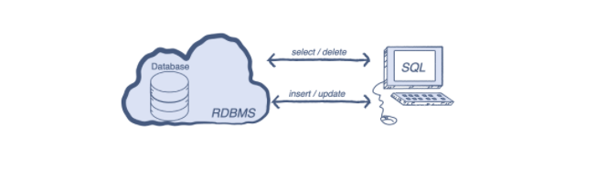
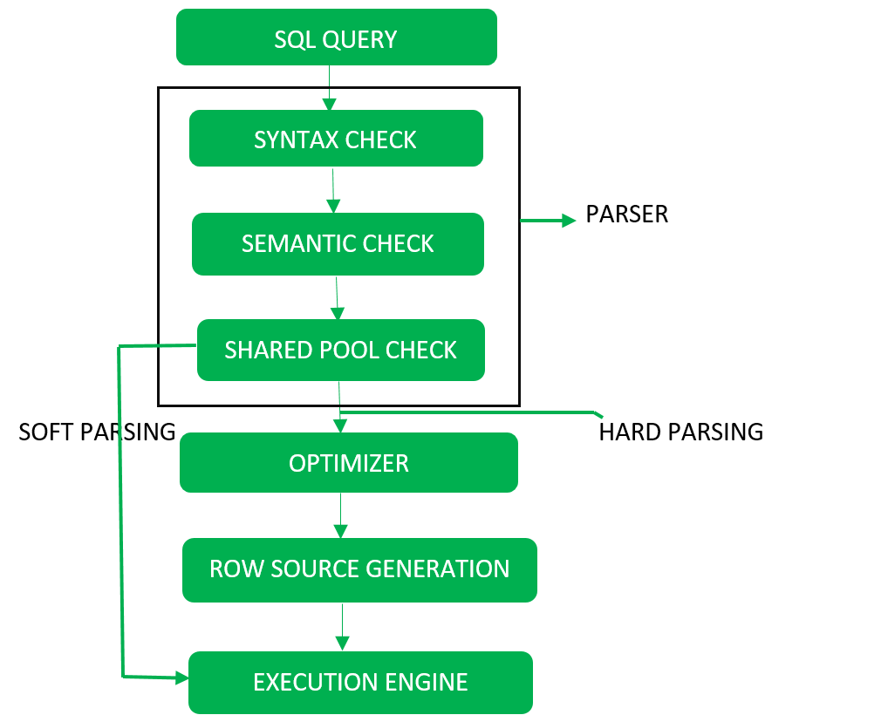

# Queries
-  What is a database query?
- Languages for database querying
- Query Processing in DBMS

## What is a database query?

- Query trong `database query` là truy vấn thông tin trích xuất từ một database. Query dùng để thực hiện các thao tác lên dữ liệu đó `data manipulation`, dựa vào đó có thể chia Queries thành 2 loại:

    + `Select Query`: Dùng để lấy dữ liệu, tìm kiếm, lọc, đếm v.vvv và không làm thay đổi dữ liệu trong database. 

    + `Action Query`: Lấy dữ liệu ra, thay đổi hoặc thực hiện các CRUD trên dữ liệu của database.

## Languages for database querying

Có nhiều cách để truy vấn dữ liệu trong database như `Using available parameters`, `Query by example (QBE)`, `Installing database plugins`, nhưng cơ bản nhất là dùng `Query language`

- `Query language` - Ngôn ngữ truy vấn: Là loại ngôn ngữ giao tiếp với máy tính, cho phép chúng ta thực hiện các `data manipulation` như đã kể trên bằng các câu truy vấn tới cơ sở dữ liệu.

- `Structured Query Language` (SQL) là ngôn ngữ truy vấn nổi tiếng nhất. Với SQL, chúng ta có thể lưu trữ, truy xuất và thao tác dữ liệu bằng cách sử dụng các đoạn code, được gọi là câu truy vấn trong RDBMS 

- Dưới đây là một số lệnh truy vấn phổ biến nhất tương ứng với các chức năng của chúng:

    + `SELECT` – fetch data từ database. Đây là một trong những lệnh phổ biến nhất, vì mọi request tới database đều bắt đầu bằng một select query.

    + `AND` – combine data từ một hoặc nhiều bảng

    + `ORDER BY` – sắp xếp dữ liệu trả về theo số hoặc theo thứ tự bảng chữ cái.

    + `SUM` – tổng hợp dữ liệu từ một cột cụ thể.

    + `UPDATE` – thay đổi dữ liệu từ một dòng trong bảng

    + `INSERT` – thêm mới dữ liệu vào bảng

    + `WHERE` – lọc dữ liệu và lấy giá trị của nó dựa trên các điều kiện

    _and more_

- Truy vấn dữ liệu SQL có thể chia thành 4 nhóm:
    + `DQL - Data Query Language` - Nhóm truy vấn dữ liệu: gồm các lệnh truy vấn Select để lấy thông tin nhưng không làm thay đổi dữ liệu trong các bảng

    + `DDL – Data Definition Language` - Nhóm định nghĩa dữ liệu: Gồm các lệnh tạo, thay đổi các bảng dữ liệu (Create, Drop, Alter, …)

    + `DML – Data Manipulation Language`- Nhóm thao tác dữ liệu - DML: Gồm các lệnh làm thay đổi dữ liệu lưu trong các bảng (Insert, Delete, Update,…)

    + `DCL – Data Control Language` - Nhóm quản lý dữ liệu: Gồm các lệnh quản lý quyền truy nhập vào dữ liệu và các bảng (Grant, Revoke, …)

## Query Processing in DBMS

`Query Processing` là quá trình từng bước chuyển ngôn ngữ cấp cao thành ngôn ngữ cấp thấp mà máy có thể hiểu và thực hiện các actions từ phía người dùng yêu cầu. Bộ xử lý truy vấn - `Query Processor` trong DBMS có nhiệm vụ thực hiện tác vụ này.

### 1. Parsing and translation
Ở bước này, database sẽ tiến hành kiểm tra câu lệnh SQL về các mặt `syxtax`, `semantic`, và `shared pool`. Khi quá trình này hoàn tất, câu lệnh SQL sẽ được chuyển sang dạng `relational algebra` ( có thể là tree, graph).

- `Syntax check` – Kiểm tra cú pháp của SQL.

- `Semantic check` – Kiểm tra về mặt ngữ nghĩa của câu SQL. Ví dụ câu truy vấn chứa tên của một bảng không chứa trong database.

- `Shared pool check` – Mọi câu truy vấn đều chứa một mã băm trong quá trình thực thi, việc kiểm tra này cho phép database kiểm tra nếu đã tồn tại mã băm này đã tồn tại trong shared pool hay chưa, nếu đã có thì database chỉ việc thực thi mà không cần quan tâm đến bước khác trong quá trình xử lý truy vấn của database, được gọi là `soft parse`, ngược lại gọi là `hard parse`.

### 2. Optimizer

Trong giai đoạn tối ưu hoá, database phải thực hiện ít nhất một lần `hard parse` cho một `DML statement` duy nhất và tối ưu hoá trong quá trình này. Cơ sở dữ liệu này không bao giờ tối ưu hóa DDL trừ khi nó bao gồm một thành phần DML như truy vấn con yêu cầu tối ưu hóa.

Nó là một quá trình trong đó nhiều kế hoạch thực thi truy vấn để đáp ứng một truy vấn được kiểm tra và kế hoạch truy vấn hiệu quả nhất được đáp ứng để thực thi

Database catalog lưu trữ các kế hoạch thực thi và sau đó trình tối ưu hóa chuyển kế hoạch chi phí thấp nhất để thực hiện.

### 3. Evaluation
Cuối cùng câu truy vấn sẽ được thực thi và trả về kết quả cho người dùng.

## Reference

1. [SQL | Query Processing](https://www.geeksforgeeks.org/sql-query-processing/)

2. [SQL | DDL, DQL, DML, DCL and TCL](https://www.geeksforgeeks.org/sql-ddl-dql-dml-dcl-tcl-commands/)

3. [What is a database query? SQL and NoSQL queries explained](https://www.educative.io/blog/what-is-database-query-sql-nosql#examples)

4. [Query Processing in DBMS](https://www.tutorialcup.com/dbms/query-processing.htm)

5. [What is a Query? Database Query Explained](https://www.hostinger.com/tutorials/what-is-a-query)
