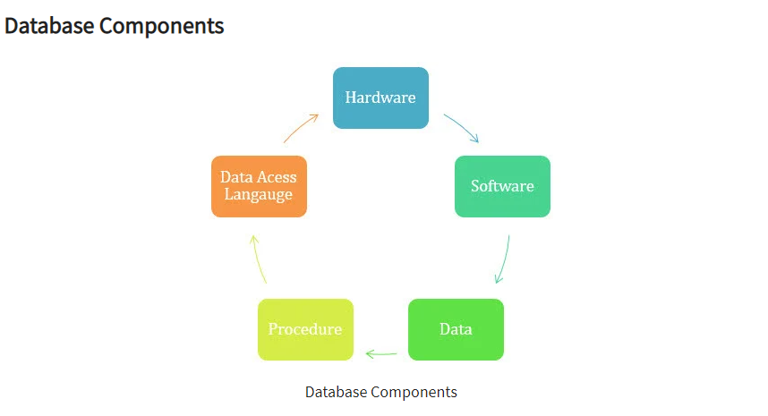
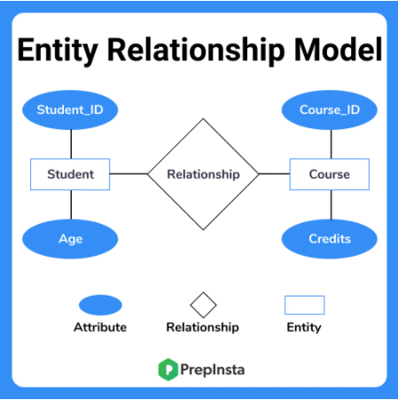
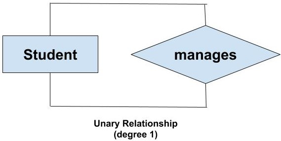
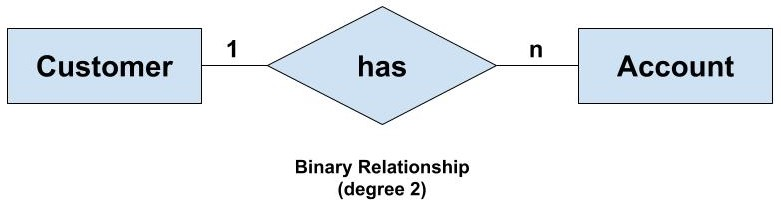
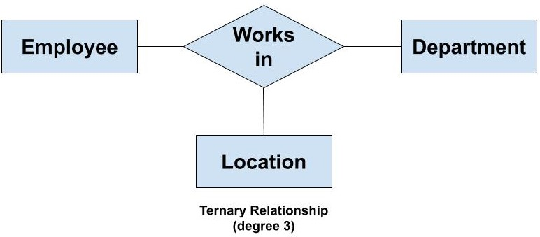
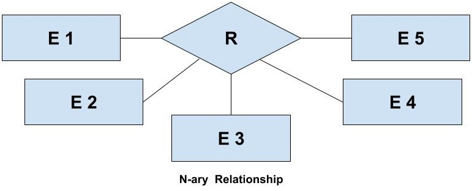
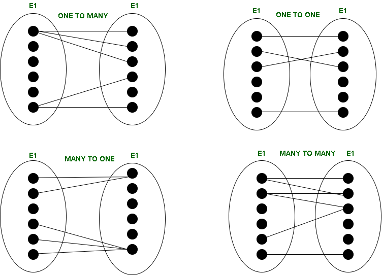

# Relationship, Keys, Cascade
- Relationship: Concepts, Degrees of Relationship Types, Structural Constraints of Relationships in ER Model
- Keys: Types of Keys - Primary/Foreign keys
- Cascade

`Database` là một tập hợp của dữ liệu được tổ chức sao cho dễ dàng truy cập cũng như cập nhật, chỉnh sửa. Một `cơ sở dữ liệu` thường sẽ được tổ chức thành các bảng, các bảng lưu trữ thông tin theo cấu trúc riêng của nó.

## Relationship

- `Relationship`:  Dùng để chỉ `mối quan hệ` giữa hai hay nhiều Entity (Entity) khác nhau. Ví dụ: Student (A) tham gia khóa học (X). Những Relationship có cùng một kiểu được nhóm lại gọi là kiểu `RelationshipType`

- Trong ER Model, người ta sử dụng hình thoi và bên trong ghi tên kiểu Relationship để ký hiệu kiểu Relationship.

### Degrees of Relationship Types
- `Degrees of Relationship Types` Thể hiện số lượng các kiểu Entity có cùng Relationship. Có các mức độ sau:

    + `The Unary (recursive) relationship type` - bậc 1: Mối quan hệ giữa cùng 1 Entity.

        

    + `The Binary relationship type` bậc 2 - Mối quan hệ giữa 2 Entity với nhau

        

    + `The Ternary relationship type`- bậc 3: Mối quan hệ giữa 3 Entity

        

    + `N-ary (n degree)` - bậc n: Mối quan hệ giữa N Entity.

        

### Structural Constraints of Relationships in ER Model

Relationships thường có một số ràng buộc (`Constraints`) nào đó về các Entity để thể hiện các Entity có thể kết hợp với nhau thông qua một số ràng buộc nhất định. Các ràng buộc này được xác định từ các tình huống thực tế của mối quan hệ giữa các Entity với nhau. 

- `One to one (1:1) relationship`: Một Entity A có liên kết với một Entity B và ngược lại.

- `One to many (1:N) relationship`: Một Entity A có liên kết với nhiều Entity B1, B2, B3, B.... Nhưng ngược lại một Entity B1, B2 B chấm chấm đó lại có liên kết duy nhất với Entity A.

- `Many-to-one (N:1) relationship`: Nhiều Entity A1, A2, A3, A... có cùng mối quan hệ với duy nhất một Entity B.

- `Many to many (N:N) relationships`: Một Entity A có liên kết với nhiều Entity B và ngược lại.

## Keys

`Keys` trong DBMS - hệ quản trị cơ sở dữ liệu, là một hay một tập hợp các thuộc tính giúp xác định một đơn vị dữ liệu (`row-col`/data records) trong một quan hệ (`table`/collections). Các Keys cho phép tìm kiếm mối quan hệ giữa hai `table`/collections với nhau và tìm kiếm dữ liệu dựa trên các mối quan hệ này.

### Types of Keys
- `Super key`
- `Primary key`
- `Candidate key`
- `Alternate key`
- `Foreign key`
- `Composite key`

Trong đó, `Primary key` và `Foreign key` là hai khóa phổ biến và quan trọng nhất.

- `Primary key` - `Khóa chính`: Là *một cột hoặc nhóm các cột* trong bảng *xác định* duy nhất mỗi *hàng* trong bảng. Khóa chính *không được phép trùng lặp* và giá trị của khóa chính *không được có giá trị NULL*. Một bảng chỉ *duy nhất một khóa chính*.

Ví dụ: Trong bảng học sinh bên dưới, ID chính là khóa chính của bảng.

| ID | Tên | Họ | Lớp |
|--- | --- | --- | --- |
| 1 | A | Nguyễn | 1 |
| 2	| B	| Trần | 1 |
| 3	| C	| Hoàng | 3 |
| 4	| D | Lê | 4 |

-  `Foreign keys` - `Khóa phụ`: là một thuộc tính trong một bảng tham chiếu đến khóa chính trong một bảng khác HOẶC có thể là giá trị NULL. Cả Foreign keys và Primary key phải có cùng kiểu dữ liệu.

Ví dụ: Trong bảng học sinh bên trên, `ID` là `Primary key`  và trong bảng 1 bên dưới, `Email` là `Primary key`. Xét bảng 2 bên dưới, `ID` là `Primary key` và `Email` là `Foreign key`, dùng để tham chiếu đến khóa chính của bảng 1.

*Table 1*

| Email | Số điện thoại| Tên
|--- | --- | --- |
| Anguyen@gmail.com	| 0123456789 | A |
| Btran@gmail.com	| 9876543210 | B |
| Choang@gmail.com	| 0321456790 | C |
| Dle@gmail.com	| 0321456790 | D |

*Table 2*

| ID | Email | Tên | Họ | Lớp |
|--- | --- | --- | --- | --- |
| 1 | Anguyen@gmail.com	| A | Nguyễn | 1 |
| 2	| Btran@gmail.com	| B	| Trần | 1 |
| 3	| Choang@gmail.com	| C	| Hoàng | 3 |
| 4	| Dle@gmail.com	| D | Lê | 4 |

## Cascading

- `Cascade`: Là một `optional` trong việc thiết lập các Primary/Foreign keys trong table. Nếu chọn option này, với ví dụ trên, khi ta `cập nhật` - `ON UPDATE` giá trị của cột Email của _Table 1_, thì giá trị đó bên bảng _Table 2_ sẽ tự động được cập nhật theo. Trường hợp khi ta `xóa` - `ON DELETE` 1 email bên _Table 1_ thì giá trị đó bên _Table 2_ sẽ bị xóa.

- Trong SQL, có 5 option cho việc sử dụng  `ON DELETE`, `ON UPDATE` trong Cascade, được gọi là `referential actions`. Gọi A là table tham chiếu đến table B, khi đó A là `referenced/parent table` , B là `referencing/children table`,ta có:

    - `ON DELETE CASCADE` | `ON UPDATE CASCADE`: Nếu 1 hàng trong A bị xóa hay cập nhật, thì tất cả các hàng ở bên B mà matching với cái hàng bị xóa đó sẽ bị xóa, cập nhật theo.

    - `ON DELETE SET NULL` | `ON UPDATE SET NULL`: Tương tự như trên, xóa 1 hàng bên A đi, nhưng thay vì các hàng matching ở bên B bị xóa hay cập nhật theo bên A, thì ở đây sẽ set cho nó giá trị null

    - `ON DELETE SET DEFAULT` | `ON UPDATE SET DEFAULT`: Dữ liệu bên B sẽ được set giá trị mặc định nếu dữ liệu bên A bị xóa, cập nhật.

    - `ON DELETE RESTRICT` | `ON UPDATE RESTRICT`:  không được xóa, cập nhật dữ liệu bên B nếu dữ liệu đó matching tới bảng A.

    - `ON DELETE NO ACTION` | `ON UPDATE NO ACTION`, (the default): không có action nào từ bên B nếu thay đổi dữ liệu ở bên A, thường dùng để constraint check.

## Reference

1. [Introduction to database](https://www.guru99.com/introduction-to-database-sql.html)

2. [Chapter 8 - Entity Relationship Model - opentextbc](https://opentextbc.ca/dbdesign01/chapter/chapter-8-entity-relationship-model/)

3. [What is the degree of relation in DBMS](https://afteracademy.com/blog/what-is-the-degree-of-relation-in-dbms)

4. [Structural Constraints of Relationships in ER Model](https://www.geeksforgeeks.org/structural-constraints-of-relationships-in-er-model/)
