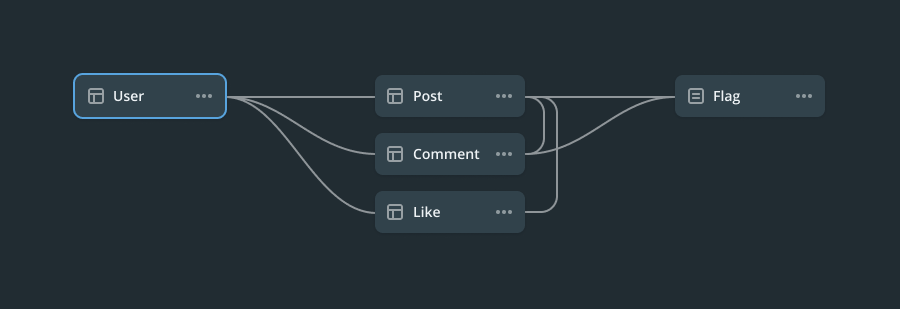
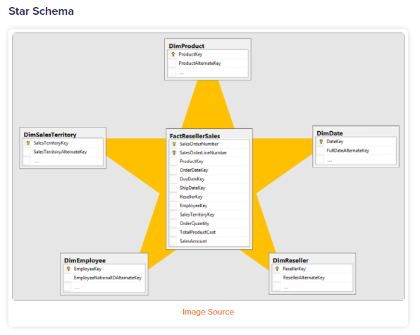
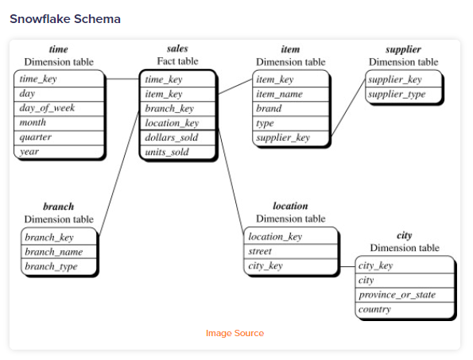
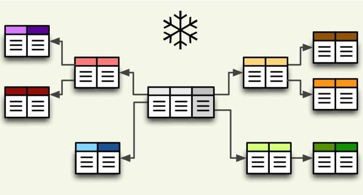
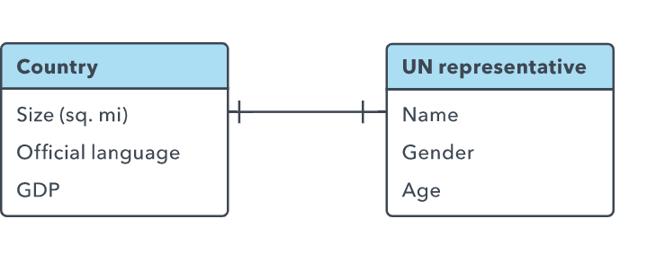
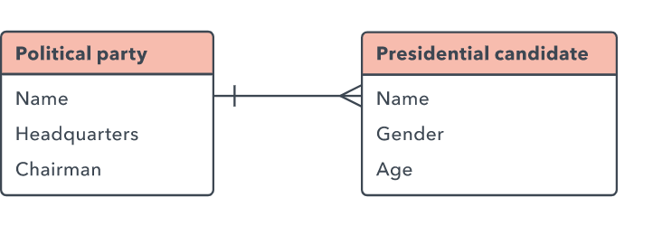
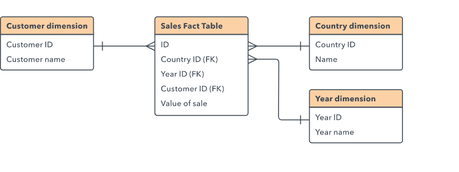

# Database Schema
- Overview
- Features
- Database schema types
- Database Schema Design
- Best Practices of Design Schema
- Relationships between Entities
- Schema Example: E-Commerce Transaction

## Overview

- `Database Schema` - Lược đồ cơ sở dữ liệu: Cho chúng ta biết database sẽ có những table nào, có thuộc tính gì và mối quan hệ của những table này ra sao. 

- Có thể coi `Schema` là một namespace, dùng để gom nhóm các table có chung một đặc điểm nào đó lại với nhau đễ dễ dàng quản lý. Trong SQL Server, nếu không dùng Schema trong CSDL thì nó sẽ lấy Schema mặc định là `dbo`.

## Features

- `Management`: Khi ta nhóm các table lại thì sẽ rất dễ dàng quản lý cũng như ta có thể phân quyền quản lý từng schema cho từng user khác nhau, đây chính là điểm mạnh của schema.

- `Visualize`: Một Database Schema đủ xịn sẽ cho ta biết được trong relational database bao gồm những gì, schema định nghĩa `tables`, `fields`, `relationships`, `views`, `indexes`, `packages`, `procedures`, `functions`, `queues`, `triggers`, `types`, `sequences`, `materialized views`, `synonyms`, `database links`, `directories`, `XML schemas`, _and other elements_.

- `Database Search Engine`

    + Ví dụ với chuỗi ký tự `“Moonlight”`, có thể hiểu là đang đề cập đến nghĩa `ánh trăng` hoặc `tên một bộ phim`. Tùy theo ngữ cảnh mà từ “Moonlight” sẽ mang một ý nghĩa khác. Điều này sẽ gây cản trở cho Search Engine khi phải hiển thị các kết quả liên quan cho người dùng.

    + Do đó, để search engine hiểu và phân loại thông tin chính xác hơn, ta cần sắp xếp dữ liệu logic. Và Schema chính là nơi cung cấp những công cụ, dữ liệu cụ thể để search engine hiểu được user đang muốn search nội dung gì, thuộc thể loại nào, chủ đề gì...

- `SEO`: Việc sắp xếp dữ liệu có cấu trúc trong website đem lại rất nhiều lợi ích khi SEO:
    - Công cụ tìm kiếm hiểu nội dung website dễ dàng hơn
    - Website nổi bật hơn trên trang kết quả tìm kiếm

    

## Database schema types

Database schemas được chia thành 5 loại, trong đó 3 loại đầu là phổ biến nhất:

- `Physical Database Schema`: Thể hiện cách dữ liệu được lưu trữ trên disk storage hoặc data target, sự phân bổ bộ nhớ (xác định theo GB hoặc TB). Đóng vai trò là nền tảng để các loại lược đồ khác tạo ra các relationships và indexes. 

- `Logical Database Schema`: xác định tất cả các ràng buộc, logic cần được áp dụng cho việc lưu trữ dữ liệu. Nó định nghĩa các table, views và các constraints giữa chúng với nhau.  

- `View Database Schema`: là bản design của database tại view level. Mô tả chung về tương tác của end user với Database. Ở view level này, user có thể tương tác với hệ thống bằng giao diện.

- `Star Schema`: là một mô hình đa chiều được sử dụng trong data warehouses để hỗ trợ phân tích nâng cao. Ở giữa ngôi sao là một bảng dữ liệu trung tâm được kết nối với n bảng - tương ứng với n chiều. Chiếm rất nhiều không gian, hạn chế khả năng mở rộng của dữ liệu.

- `Snowflake Schema`: Tương tự như `Star Schema`, Snowflake cũng là một Schema đa chiều được sử dụng trong data warehouses để hỗ trợ các phân tích nâng cao. Ưu điểm của Snowflake Schema là lưu trữ ít dữ liệu trùng lặp hơn so với Star Schema.

## Database Schema Design

- Việc Design một Database Schema chuẩn là cực kỳ quan trong. Một Schema tốt cần tổ chức dữ liệu thành các Table với các Attributes thích hợp, hiển thị được mối quan hệ qua lại giữa Table và Columns, đồng thời áp đặt các constraints như Data types. Từ đó giúp các nhà phát triển làm việc với Database dễ dàng hơn

- Ngược lại, một Schema thiếu sót nhiều thứ sẽ ảnh hưởng đến việc phân tích dữ liệu, phải thực hiện thêm mô hình hóa và truy vấn tốn nhiều thời gian và tài nguyên hệ thống hơn, làm tăng chi phí và khó lấy số liệu phân tích.

- Quá trình Design một Database Schema trải qua các bước cơ bản sau:

    + `Determine the purpose of your database`: Xác định mục đích của database giúp ta chuẩn bị cho các bước còn lại tốt hơn

    + `Find and organize the information required`: Thu thập tất cả các loại thông tin cần thiết ghi lại trong database

    + `Divide the information into tables`: Chia cá thông tin mình thu thập được thành các major entities or subjects, từ đó xác định các Table trong database.

    + `Turn information items into columns`: Quyết định thông tin gì cần lưu trữ trong mỗi Table. Mỗi thông tin sẽ trở thành một field và được hiển thị dưới dạng một Column trong Table.

    + `Specify primary keys`: Chọn primary key và các keys khác cho từng table

    + `Set up the table relationships`: Tạo các relationships cho các table

    + `Refine your design`: Phân tích bản Design để tìm lỗi. Tạo bảng và thêm một vài record dữ liệu mẫu xem liệu mình có thể nhận được kết quả mong muốn hay không. Thực hiện các điều chỉnh đối với design nếu cần.

    + `Apply the normalization rules`: Áp dụng các quy tắc chuẩn hóa dữ liệu để xem liệu các Table của mình có cấu trúc chính xác hay không. Thực hiện các điều chỉnh đối với table nếu cần.

## Best Practices of Design Schema

Việc tạo ra một `Database Schema Design` như trên có thể dùng tool để gen ra Schema, tuy nhiên cần có một số `Principles of Database Schema Design` mà mình cần nắm được:

### 1. `Have Good Naming Standards`: 

Đặt tên phù hợp giúp cho các Database Schema trở nên hiệu quả nhất có thể. Tên cho phép bạn xác định mục đích của entities và đơn giản hóa việc truy cập tới entity đó. Một số nguyên tắc:

+ Tên của các bảng phải thống nhất với nhau về cấu trúc.

+ Cố gắng không sử dụng các từ dành riêng cho SQL Server trong tên bảng, tên cột và trường vì nó có thể dẫn đến lỗi cú pháp.

+ Không sử dụng dấu gạch ngang, dấu ngoặc kép, dấu cách và các ký tự đặc biệt vì nó không hợp lệ.

+ Tránh các tiền tố hoặc hậu tố không cần thiết cho tên của bảng

### 2. `Use Normalization to Tackle Redundancy`

Redundancy là điều thường thấy trong các thiết kế cơ sở dữ liệu. Phần khó ở đây là những phần dư thừa này có thể tốt hoặc xấu tùy thuộc vào trường hợp sử dụng. Đây là lúc sử dụng `Normalization to Tackle Redundancy`. 

Việc chuẩn hóa cơ sở dữ liệu là quá trình xây dựng cơ sở dữ liệu dưới một loạt các hình thức Normalization để giảm thiểu việc dư thừa dữ liệu.Việc quyết định sẽ duy trì hoặc loại bỏ các dữ liệu dư thừa, không quan trọng được quyết định bằng cách so sánh cost of operations và dung lượng lưu trữ dữ liệu đó.

### 3. `Fix the Right Number of Tables`

Tối ưu hóa số lượng bảng trong một Database, việc giữ số lượng các bảng ở mức độ 1 bảng đại diện cho một "thứ" được coi là có hiệu quả nhất.

### 4. `Avoid Nulls`

Tránh việc cho phép data có giá trị null, chỉ sử dụng chúng khi thực sự cần thiết.

### 5. `Have Proper Documentation`

Documentation giúp cho việc cộng tác giữa các nhóm hiệu quả hơn và hỗ trợ các thành viên mới tham gia dự án dễ dàng. Documentation tốt bao gồm các định nghĩa trên bảng, cột, mối quan hệ và cả các ràng buộc.

### 6. `Protect Data Integrity`

Các quy tắc kinh doanh cơ bản nên được áp dụng trong cơ sở dữ liệu hay Các quy tắc như tính nullability, độ dài chuỗi, gán khóa ngoại, v.v., tất cả đều phải được định nghĩa trong cơ sở dữ liệu. 

Khi các quy tắc trên được xác định rõ ràng, chúng không bao giờ bị bỏ qua và các truy vấn có thể được viết mà không bao giờ phải lo lắng liệu dữ liệu có tuân thủ các quy tắc nghiệp vụ hay không. 

### 7. `Use Stored Procedures to Access Data`

Các Procedures này cung cấp cho các chuyên gia phân tích cơ sở dữ liệu khả năng thay đổi các đặc tính của mã cơ sở dữ liệu mà không tốn nhiều chi phí. Ngoài ra, họ cũng có thể cung cấp quyền truy cập chi tiết vào hệ thống

## Relationships between Entities

***One to One Relationship***

***One to Many Relationship***

***Many to Many Relationship***

***Multi-dimensional Data***

Trong nhiều trường hợp có thể cần truy cập nhiều dimensions của một loại dữ liệu. Ví dụ, ta cần biết về `Values of sale` theo `Customer`, `Country` và `Year`. Cách giải quyết là xây dựng một bảng `core table`  mà các bảng `Customer`, `Year` và `Country` có thể tham chiếu tới như sau:

## Schema Example: E-Commerce Transaction

## Reference

1. [What are database schemas - educative](https://www.educative.io/blog/what-are-database-schemas-examples)

2. [What is a database schema - lucidchart](https://www.lucidchart.com/pages/database-diagram/database-schema)

3. [Database design basics - Microsoft](https://support.microsoft.com/en-us/office/database-design-basics-eb2159cf-1e30-401a-8084-bd4f9c9ca1f5)

4. [5 Database Design Schema Examples: Critical Practices and Designs - hevodata](https://hevodata.com/learn/schema-example/#imp)

5. [Database Schema Design: Best Practices for Integration and Analysis - fivetran](https://www.fivetran.com/blog/database-schema-design-best-practices-for-integration-and-analysis)