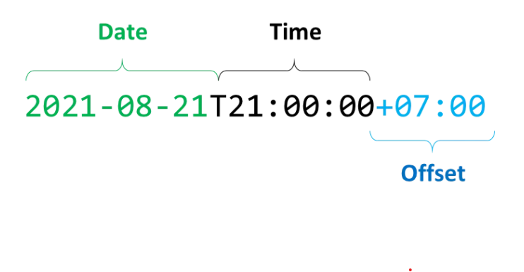
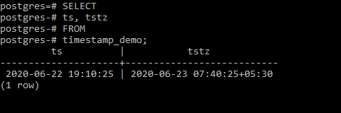
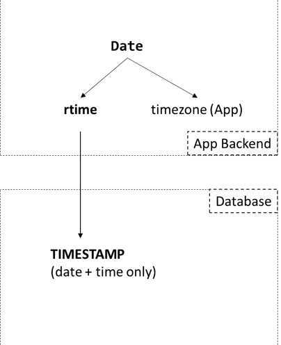
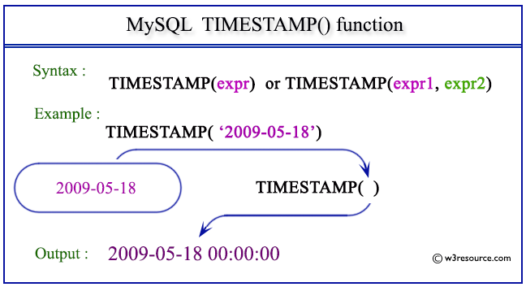

# Time stamp

## Time Concepts

- `moment`: Thời gian tuyệt đối. Khi nói về thời gian tuyệt đối, cần có đủ hai thành phần: `ngày giờ` + `ngữ cảnh`. Ngữ cảnh ở đây chính là múi giờ (`zone`). Các múi giờ được đặc trưng bởi một độ lệch thời gian (offset) so với giờ quốc tế `UTC` - `Coordinated Universal Time`. Độ lệch được biểu diễn dưới dạng `±hh:mm`. Trong máy tính, moment được biểu diễn dưới dạng `Epoch Seconds`, [Unixtime](https://en.wikipedia.org/wiki/Unix_time) - số giây trôi qua kể từ 00:00:00 ngày 1 tháng 1 năm 1970 theo giờ UTC.

- `rtime` - relative/represent time: thời gian tương đối, không bao gồm ngữ cảnh múi giờ.

- `offset`: độ lệch

- `zone`: múi giờ

&rarr; `moment = rtime + (zone or offset)`

- [ISO 8601 — Date and time format](https://www.iso.org/iso-8601-date-and-time-format.html): Được công bố vào năm 1988, ISO-8601 là một tiêu chuẩn quốc tế mô tả một quy tắc chung để viết ngày giờ, tiện cho việc liên lạc & trao đổi thông tin liên quan đến thời gian. Dưới đây là một moment được viết theo tiêu chuẩn ISO-8601, bao gồm ngày, giờ và offset

- [IANA Time Zone Database](https://www.iana.org/time-zones): Gọi tắt là `tz database`, là một bộ database tổng hợp thông tin của toàn bộ múi giờ trên thế giới, được quản lý bởi tổ chức `ICANN`. Trong tz database, một múi giờ sẽ có tên gọi dựa trên vị trí địa lý của nó, theo dạng `Area/Location`, trong đó area là tên của lục địa hoặc đại dương, location là tên của thành phố hoặc hòn đảo.

    + Chuẩn hóa lại tên gọi của các múi giờ (các múi giờ luôn viết tắt, điều này có thể gây hiểu nhầm - AST là Arabia Standard Time, Arabia Summer Time hay Atlantic Standard Time?)

    + Mỗi múi giờ sẽ chứa 2 `offset`, một dành cho `độ lệch chuẩn thông thườn`g, một dành cho thời điểm [Daylight Saving Time - DST](https://en.wikipedia.org/wiki/Daylight_saving_time). Nếu một múi giờ không sử dụng Daylight Saving, 2 offset này có giá trị bằng nhau.

- Unix timestamp: Là hệ thống diễn tả một điểm trên trục thời gian Unix. Trục thời gian sử dụng số giây kể để xác định thời điểm, với điểm gốc từ thời điểm `00:00:00 ngày 1/1/1970 (UTC)`. Ví dụ lúc `00:00:00 - 1/1/2017` có giá trị timestamp là `1483228800`; Có nghĩa là tính từ `00h:00m:00s ngày 1/1/1970` đến `00h:00m:00s ngày 1/1/2017` là `1483228800` giây.

## DATETIME and TIMESTAMP

- Kiểu dữ liệu DATETIME được sử dụng khi ta cần lưu trữ cả hai thông tin ngày tháng và thời gian. DATETIME thường sẽ được hiển thị theo định dạng  `YYYY-MM-DD HH:MM:SS`. Hỗ trợ phạm vi từ `1000-01-01 00:00:00` tới `9999-12-31 23:59:59`.

- Kiểu dữ liệu TIMESTAMP cũng được sử dụng khi ta muốn lưu trữ cả hai thông tin ngày tháng và thời gian. TIMESTAMP có phạm vi `1970-01-01 00:00:01 UTC` tới `2038-01-19 03:14:07 UTC`

- Sự khác biệt chính của DATETIME và TIMESTAMP là giá trị của TIMESTAMP được chuyển đổi từ múi giờ hiện tại sang UTC trong khi lưu trữ, và chuyển ngược trở lại từ UTC sang múi giờ hiện tại trong lúc lấy ra. Còn kiểu dữ liệu DATETIME thì không có gì thay đổi.

## TIMESTAMP in Database

Ứng với mỗi Database Provider (Postgres, MySQL...), chúng ta phải tuân theo một kiểu mapping các data types khác nhau. Mặc dù vậy, việc đưa về hệ quy chiếu `rtime/moment` như trên là tương đối dễ. Xét 2 ví dụ với Postgres và MySQL.

### Postgres: TIMESTAMP / TIMESTAMPZ 

Postgres cung cấp 2 kiểu timestamp là có timezone (`TIMESTAMPZ`) và không timezone (`TIMESTAMP`). Thoạt nhìn chúng ta sẽ cho rằng timestamp luôn là moment. Tuy nhiên, Postgres Tutorial giải thích:

- `TIMESTAMP`: Khi một moment được lưu xuống, Postgres sẽ loại bỏ phần timezone và chỉ lưu phần hiển thị (ngày và giờ). Nếu thay đổi timezone của database-server, giá trị timestamp luôn giữ nguyên không thay đổi.

- `TIMESTAMPZ`: là một `zone-aware timestamp`

    + Khi một moment được lưu xuống, Postgres sẽ convert về giờ UTC ( tức convert về timezone của App backend) và lưu như kiểu TIMESTAMP ở trên, nghĩa là chỉ lưu phần rtime (đây là lý do cả 2 kiểu dữ liệu đều chỉ chiếm 8 bytes bộ nhớ). Tuy nhiên, nhờ thao tác convert về UTC, nên có thể xem đây là một moment ở timezone UTC.

    + Khi đọc lên, Postgres làm thao tác ngược lại: giá trị timestamp được convert từ UTC về timezone của database-server và trả về cho backend một moment hoàn chỉnh.

    

Tóm lại, khi lưu xuống ngày-giờ ở timezone nào thì đọc lên vẫn là ngày-giờ đó, ở timezone đó.

&rarr; `TIMESTAMP` chính là `rtime`, còn `TIMESTAMPZ` chính là `moment`.

### MySQL: DateTime / Timestamp

- Timestamp của MySQL và Postgres không giống nhau.

- Tài liệu của MySQL mô tả: `Khi lưu Timestamp, giá trị sẽ được convert từ timezone hiện tại về UTC. Khi đọc lên sẽ đi qua bước ngược lại. Quy trình này không áp dụng đối với kiểu DateTime.`

&rarr; Như vậy có thể kết luận, `DateTime` chính là `rtime`, còn `Timestamp` là `moment`. 

- Giới hạn lưu trữ của Timestamp trong MySQL là `2038-01-19 03:14:07.999999`, được biết đến với tên gọi Sự cố năm 2038 - Year 2038 Problem, là vấn đề xảy ra khi chúng ta lưu moment dạng Epoch Time bằng một số nguyên 32-bit (vấn đề này không gặp ở Postgres).

`
Sự cố "năm 2038" là một vấn đề kỹ thuật của hầu hết các thiết bị xử lý, tính toán đồng hồ thời gian dưới dạng số nhị phân 32-bit. Nói một cách khái quát, thời gian hiển thị trên hệ thống được mã hóa theo dạng đồng hồ UNIX, dưới dạng các số nguyên và số nhị phân. Số nguyên lớn nhất hệ thống có thể xử lý là 2.147.483.647, tương đương với số nhị phân là 01111111 11111111 11111111 11111111 và ngày tháng thực là 03:14:07 UTC, 19/01/2038. Do đó, khi bước sang giây thứ 08, hệ thống đồng hồ sẽ tự động trở về 0, tức là quay lại thời điểm 00:00:00 UTC ngày 1/1/1970. Sự cố này đã trở thành vấn đề nan giải với ngành Công nghệ thông tin toàn cầu. Hiện tại vẫn chưa có bất kỳ giải pháp triệt để nào cho sự cố "năm 2038".[cần dẫn nguồn]
`

_trích từ [wikipedia](https://vi.wikipedia.org/wiki/S%E1%BB%B1_c%E1%BB%91_n%C4%83m_2038)_

## Reference

1. [PostgreSQL – Timestamp Data Type - geeksforgeeks](https://www.geeksforgeeks.org/postgresql-timestamp-data-type/)

2. [MySQL TIMESTAMP - mysqltutorial](https://www.mysqltutorial.org/mysql-timestamp.aspx#:~:text=The%20MySQL%20TIMESTAMP%20is%20a,%3A14%3A07'%20UTC%20.)

3. [Datetime - viblo](https://viblo.asia/s/co-mot-noi-so-mang-ten-datetime-z45bx8DqZxY)

4. [Datetime - dev.mysql](https://dev.mysql.com/doc/refman/8.0/en/datetime.html)