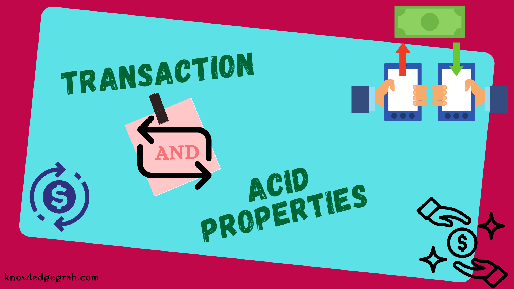
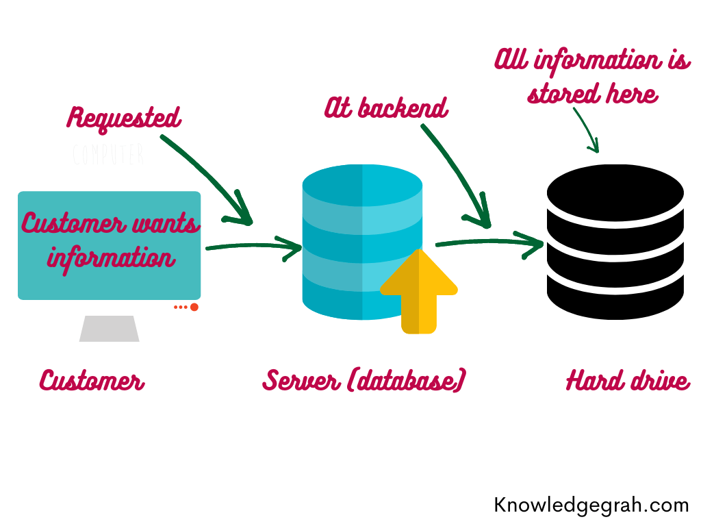
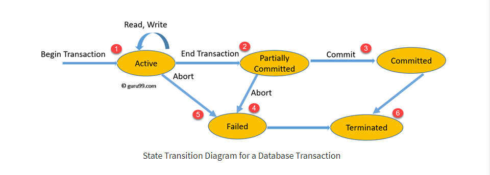
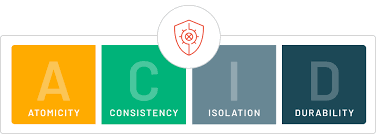
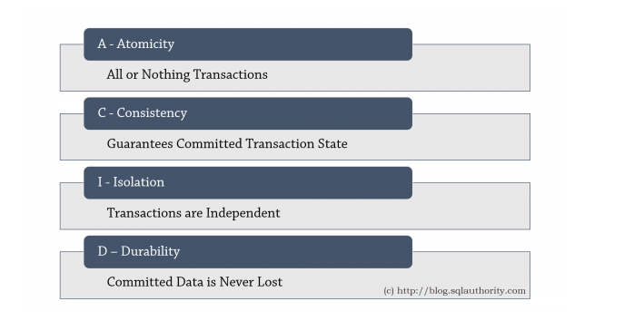
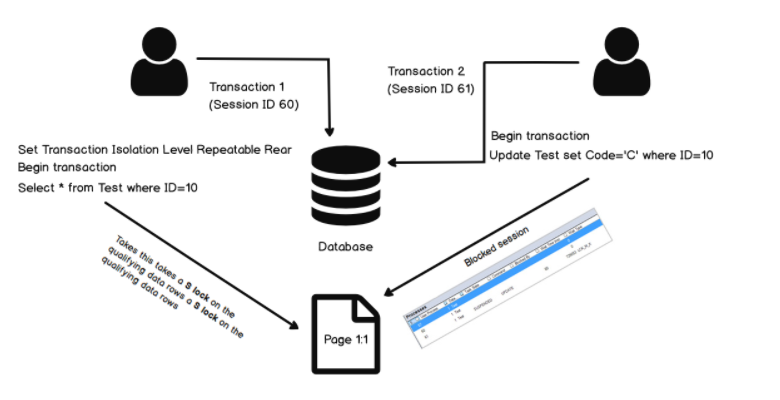
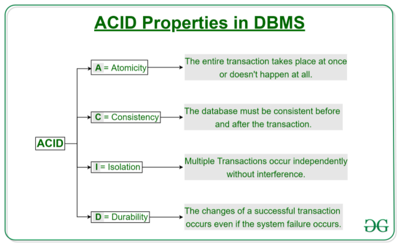

# Transactions, ACID

## Transactions

### Definition of DBMS Transaction Processing

`DBMS Transaction Processing` là một `unit of data processing` của Database trong process xử lý các hoạt động truy cập tới database. Có thể hiểu `Transaction` như một phương tiện phân phối `quá trình xử lý thông tin`. 

`Transaction` là cái chữ cái T ở trong thuật ngữ OLTP (`Online transaction processing`). Hầu hết các mô hình Database hiện nay đều phục vụ cho mục đích OLTP: từ thanh toán mua sắm, đặt hàng, giao hàng cho tới đăng bài viết, cập nhật profile trên mạng xã hội… còn 1 loại khác là OLAP thì dùng cho mục đích thống kê, không cần liên tục cập nhật realtime, xấp xỉ là đủ.

Quá trình xử lý thông tin này là một tập hợp các `thao tác với dữ liệu` (group of `Database Operations`), chứa một hoặc nhiều `database actions` như `retrieve`, `insert`, `update`. 

_Note_

- `Transaction` là một tập hợp các `operations`.
- Một Transaction đại diện cho sự truy cập, thay đổi dữ liệu trong database.
- Transactions chỉ cho ra hai kết quả: hoặc là tất cả các operations được thực hiện thành công; hoặc là không một operations nào được thực hiện thành công cả - `All or nothing`
- Transaction hoạt động với database dựa trên 3 thao tác chính : `Read`, `Write`, `Commit`.
- Operations được thực hiện trong `RAM` hoặc `CPU` &rarr; performance của một transaction phụ thuộc vào các process của `RAM`, `CPU`.

### Concurrency in Transactions

Việc truy cập tới resource của database dựa trên cơ chế `shared resource`, tức là các `resource` sẽ được sử dụng bởi nhiều người dùng và xử lý đồng thời. Ví dụ như hệ thống ngân hàng, hệ thống đặt chỗ đường sắt và đường hàng không, giám sát thị trường chứng khoán, kiểm kê siêu thị và thanh toán, v.v.

Nếu không quản lý quyền `concurrent access` trong từng Transactions của database có thể tạo ra các vấn đề như:

- Lỗi phần cứng và sự cố hệ thống
- Thực hiện đồng thời cùng một giao dịch, `deadlock` hoặc hiệu suất chậm

### States of Transactions

Để dễ hình dùng quá trình chuyển State của Transactions, ta có thể tham khảo diagram dưới đây:

1. Khi bắt đầu một Transaction, Transaction sẽ được thực thi và nằm trong trạng thái `Active State`. Trong trạng thái này, các `READ or WRITE operation` có thể được thực hiện.

2. Khi các Operation thực thi xong, transaction sẽ chuyển sang trạng thái này

3. Cơ chế `recovery` hoạt động để đảm bảo lỗi hệ thống sẽ không dẫn đến việc vĩnh viễn không thể ghi lại các thay đổi trong transaction. Nếu `recovery` cho kết quả `success`, transaction sẽ được commit và chuyển sang `Committed State`

4. Trong trường hợp `recovery` cho kết quả `fail`, transaction thất bại và sẽ được chuyển sang `Failed State`.

5. Trong trường hợp một transaction đang ở `Active State` và đang thực thi các operations, nhưng bị cancel bởi hệ thống hay bất cứ lý do gì thì sẽ được chuyển sang `Failed State` (hoặc gọi là `Rollback`).

6. Transaction rời khỏi hệ thống, kết thúc một Transaction.

_Tóm lại_

| State	| Description
| ------ | ------ |
Active State | Bắt đầu một Transaction, trong trạng thái này, các `READ or WRITE operation` có thể được thực hiện.
Partially Committed | Transaction sẽ chuyển sang trạng thái này sau khi kết thúc quá trình thực thi các Operations.
Committed State	| Nếu các Operations được thực thi THÀNH CÔNG, transaction sẽ chuyển sang trạng thái này. Tất cả các thay đổi của Operations được ghi lại vĩnh viễn vào cơ sở dữ liệu.
Failed State | Nếu các Operations được thực thi THẤT BẠI, hoặc một transaction bị cancel khi đang ở Active State, transaction sẽ chuyển sang trạng thái này
Terminated State | Chấm dứt Transaction.

## ACID

- `ACID` là 1 tập hợp các `thuộc tính` mà 1 transaction thao tác với database phải đạt được nhằm bảo đảm tính `toàn vẹn`, `hợp lệ`, `an toàn`, tính `bền vững`… của dữ liệu ở database.

- Nếu 1 transaction không thoả mản 1 trong các thuộc tính này thì sẽ không thể thao tác với database thành công, bị rollback ngay lập tức.

- `ACID` là cụm từ viết tắt của 4 thuộc tính sau: *Atomicity*, *Consistency*, *Isolation* và *Durability*:

### Atomicity

Từ Atom trong tiếng Anh có nghĩa là nguyên tử, tượng trưng cho 1 thứ mà không thể chia nhỏ hơn được nữa. Đứng từ góc độ người sử dụng Database, ta chỉ có thể quan sát được trạng thái trước khi Transaction diễn ra hoặc sau khi Transaction đã hoàn thành. Nếu bị thất bại hoặc từ chối, các trạng thái tạm thời cần phải được trả lại nguyên vẹn như khi chưa hề diễn ra Transaction.

Atomicity giúp cho người sử dụng có thể dễ dàng retry lại khi gặp lỗi, không phải lo nghĩ về việc bị duplicate hoặc dữ liệu không chính xác. Một số người đề xuất từ Abortability thì hợp lý hơn, vì từ Atomicity dễ gây nhầm lẫn với chữ I (Isolation).

Dựa vào rule `All or nothing` kể trên, khi một chuỗi các operations lần lượt thao tác với database trong 1 transaction, nếu 1 operation đang trong xử lý mà xảy lỗi ở database, hay crash hệ thống, v.v… thì toàn bộ transaction sẽ bị hủy bỏ và bị rollback, dữ liệu ở database vẫn giữ như cũ trước khi có sự thay đổi. Nếu như không xảy ra lỗi hay vấn đề gì trong quá trình xử lý các operations thì transaction đó sẽ commit thành công, dữ liệu phía database cũng được cập nhật thành công luôn.

Theo `State Transaction Diagram` ở trên, một transaction chỉ có 2 kết quả:

- `Abort`: Tất cả các thay đổi của transaction sẽ không được đồng bộ xuống database.

- `Commit`: Tất cả các thay đổi của transaction được đồng bộ xuống database.

Lấy ví dụ chúng ta có một giao dịch của ngân hàng chuyển 100tr đồng từ tài khoảng X sang tài khoản Y. 

    

    Nếu transaction thực thi thành công tại bước T1 nhưng khi đến bước T2 thì hệ thống bị lỗi. Lúc này nếu những thay đổi này được đồng bộ xuống database thì vô tình tài khoản X bị mất 100tr đồng mà tài khoản Y lại không nhận được đồng nào. Đây là ví dụ kinh điển mà Atomicity có thể đảm bảo các hệ thống sẽ không xảy ra sai xót như trên.

### Consistency

Consistency là tính nhất quán: dữ liệu cần phải nhất quán với những rule đã đặt ra, chẳng hạn như:

- username A đã tồn tại trong unique index nên transaction cần phải abort, nếu thành công (tức chưa tồn tại) thì phải lập tức bổ sung A vào index username.

- họ và tên không dài quá 100 ký tự

Tuy nhiên, đa phần database sẽ không thể thay ta validate được hết tất cả các rule, nên cái việc Consistent hay không còn phụ thuộc vào code, ví dụ như validation form từ phía người dùng.

Tóm lại, một transaction phải đảm bảo tính `hợp lệ` của dữ liệu khi cập nhật vào database. Nếu dữ liệu đưa vào database mà như kiễu dữ liệu không phù hợp, không thỏa mãn constraint, rule, trigger, query nhầm table,… thì transaction đó sẽ bị rollback, dữ liệu ở database vẫn được giữ nguyên lúc chưa thay đổi. Chính vì vậy dữ liệu từ transaction buộc phải hợp lệ, đúng đắn, nhất quán với những constraint, cấu trúc table, rule… đã được định nghĩa hay khai báo từ phía database.

### Isolation

Mọi thao tác của 1 transaction đều phải được cô lập, tránh sự tác động, phụ thuộc hay ảnh hưởng đến các transaction khác. Một transaction A thì không thể đọc dữ liệu ở database trong khi transaction B đang update dữ liệu đó. 

Nếu có 2 transaction đang làm việc bất đồng bộ với nhau thì sẽ có cơ chế chia `session` như hình dưới, để các transaction làm việc tuần tự với database theo từng session, 1 transation này sẽ chờ cho đến khi transaction kia commit thành công thì mới bắt đầu làm nhiệm vụ của nó.

### Durability

Khi transaction đã commit thành công rồi thì kể cả có sự cố về điện hay lỗi phần cứng gì thì cũng phải đảm bảo dữ liệu không bị mất mát. Ví dụ khi 1 transaction update dữ liệu thành công, thì thay đổi của dữ liệu đó phải được đảm bảo lưu trữ ở trạng thái bền vững, vĩnh viễn,... Và ngay cả khi database bị crash, lỗi hay hệ thống restart thì dữ liệu ở database vẫn luôn ở trạng thái thay đổi mới nhất, chính xác.

___Tóm lại:___

## Reference

1. [ACID Properties in DBMS - geeksforgeeks](https://www.geeksforgeeks.org/acid-properties-in-dbms/)

2. [Transaction Management in DBMS - guru99](https://www.guru99.com/dbms-transaction-management.html)

3. [What is ACID Property in Database - sqlauthority](https://blog.sqlauthority.com/2016/04/10/acid-properties-database-interview-question-week-066/)

4. [DBMS Transaction Processing - educba](https://www.educba.com/dbms-transaction-processing/)

5. [ DBMS Transaction and ACID Properties - knowledgegrah](https://knowledgegrah.com/dbms-transaction-and-acid-properties/)