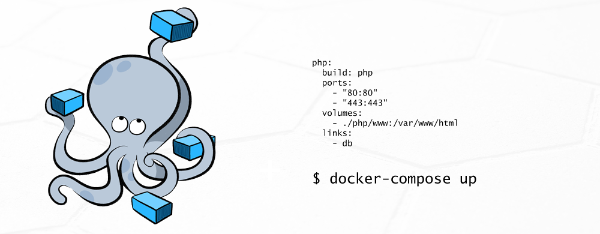

# Docker Compose
- Overview
- Common Use Case
- Benefits
- Features

## Overview

- `Docker Compose` là một công cụ để `defining` và `running` `multi-container Docker applications`. Docker-compose giúp tạo ra các service một cách tự động, dùng cho development, testing, staging environments, và còn ứng dụng trong CICD workflows. 



- Việc sử dụng Docker Compose được tóm lược trong 3 bước cơ bản sau:

    1. Khai báo app’s environment với `Dockerfile`.
    2. Khai báo các services cần thiết để chạy app trong `docker-compose.yml`.
    3. Run `docker-compose up` để Compose start và run app.

- Dưới đây là một ví dụ về file `docker-compose.yml`:

```yml
version: "3.9"  # optional since v1.27.0
services:
  web:
    build: .
    ports:
      - "5000:5000"
    volumes:
      - .:/code
      - logvolume01:/var/log
    links:
      - redis
  redis:
    image: redis
volumes:
  logvolume01: {}
```

- Một số guidelines, syntax hay file format về `docker-compose.yml` có thể xem full tại [Compose file docs](https://docs.docker.com/compose/compose-file/)

- `Compose` có các commands dùng cho việc quản lý lifecycle của application:
    + `start`, `stop`, và `rebuild` services
    + `view` tất cả status của các services đang hoạt động
    + `Output` steam cho việc ghi log các services đang hoạt động
    + Mỗi service chỉ cần chạy command một lần

## Common Use Cases

- `Automated testing environments`: Compose hỗ trợ kiểm thử tự động, là một phần thiết yếu của CICD workflows vì nó có thể dễ dàng `create` và `destroy` môi trường kiểm thử. 

- `Development Environments.` Compose là một cách nhanh chóng và đơn giản để tạo ra các môi trường development để bắt đầu phát triển các dự án

## Benefits of Docker Compose

- `Fast and simple configuration`: Nhờ cấu hình dựa trên YAML file và các biến môi trường, bạn có thể dễ dàng định cấu hình hoặc sửa đổi các service của ứng dụng.

- `Secure internal communication.` Compose tạo ra một mạng cho tất cả các service cùng nhau chia sẻ resource. Điều này bổ sung một lớp bảo mật chung cho ứng dụng vì không thể truy cập các service từ bên ngoài.

- `Portability and CI/CD support` Vì tất cả các service đều được định nghĩa trong Docker-Compose file, các nhà phát triển có thể dễ dàng truy cập và chia sẻ toàn bộ cấu hình của ứng dụng, góp phần thiết lập và kích hoạt CI/CD hiệu quả.

- `Efficient use of resources` Docker Compose cho phép lưu trữ nhiều môi trường biệt lập trên một máy chủ. Chạy mọi thứ trên một phần cứng duy nhất, từ đó giúp ta tiết kiệm rất nhiều tài nguyên. Ngoài ra, tính năng cho phép lưu vào bộ nhớ `cache` các cấu hình và sử dụng lại các container hiện có cũng góp phần vào hiệu quả sử dụng tài nguyên.

## Features

- `Multiple isolated environments on a single host` - Tạo ra nhiều môi trường độc lập (isolated environments) trong một host: Compose cô lập môi trường của các project để đảm bảo chúng không bị xung đột lẫn nhau, cũng như dễ dàng tạo những bản sao của một môi trường nào đó.

- `Only recreate containers that have changed` - Chỉ tạo lại các container đã thay đổi: Compose sẽ nhận biết được các service chưa thay đổi và sử dụng lại các container tương ứng với service đó.

- `Preserve volume data when containers are created` - Bảo toàn dữ liệu khi các container được tạo: Compose lưu giữ tất cả các `volume` đang được sử dụng. Khi chạy lệnh `docker-compose up`, nếu Compose tìm thấy các container từ các lần chạy trước, nó sẽ sao chép các volume từ container cũ sang container mới. Quá trình này đảm bảo bất kỳ dữ liệu nào được tạo trong các lần chạy trước sẽ không bị mất.

- `Variables and moving a composition between environments` Điều chỉnh các biến sử dụng cho các môi trường: Compose sử dụng các biến trong Compose file để định nghĩa các môi trường. Vì vậy với môi trường hay người dùng khác nhau, có thể điều chỉnh các biến khi sử dụng Compose để thiết lập các service.

## Reference

1. [Overview of Docker Compose](https://docs.docker.com/compose/)

2. [Compose file docs](https://docs.docker.com/compose/compose-file/)

3. [What is Docker Compose](https://phoenixnap.com/kb/docker-compose)
