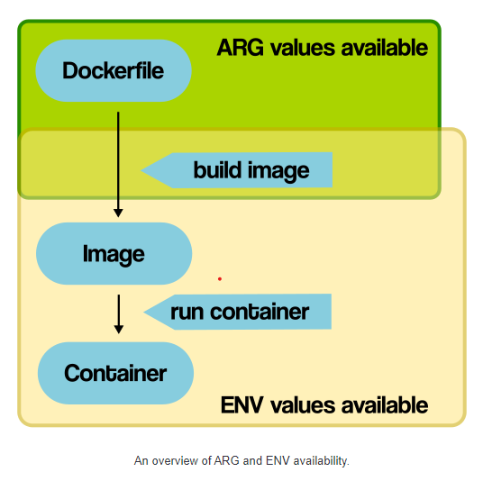
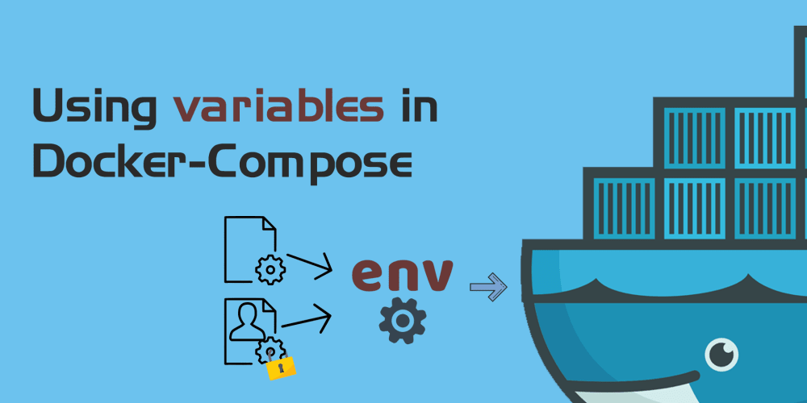

# Environments
- Environment variables
- The .env file

## Environment variables

- Khi tạo một `service` bất kì, thì việc sử dụng các `environment variables` là cần thiết, giúp cho các service khởi tạo và chạy trên `environment` nào sẽ sử dụng đúng `environment variables` đó. 

- Chẳng hạn như config database connection với các thông tin như database name, user, hay thiết lập môi trường làm việc của service đó là `dev`, `test` hay `prod`, hoặc các config khác như port, base url... thì việc dùng các `environment variables` để chỉ định trong các config service sẽ sử dụng variables nào. 

- Trong Docker, `environment variables` cũng cần được set khi chạy service trong docker container. Để định nghĩa `environment variables`:

```sh
docker run -d -t -i -e DB_NAME='foo' \ -e DB_USER_NAME='bar' \-e DB_PASSWORD='hidden' \
```
`-e` : option để định nghĩa environment variables

_các options khác xem decs tại [reference/run](https://docs.docker.com/engine/reference/run/)_


- Đối với cách làm này, lợi ích là giúp cho việc bảo mật các `variables` quan trọng thông qua việc chỉ khai báo nó bằng command. Nhưng command dài, Docker cung cấp các option để chúng ta dễ dàng định nghĩa các `variable` cần thiết. Đó là `arg` và `environment` (với dockerfile thì là ARG và ENV). 



- Tuy nhiên thì có sự khác nhau rất lớn giữa `arg` và `environment` đó chính là `scope` của chúng. `arg` định nghĩa các biến dùng khi build image, trong khi đó `environment` dùng cho lúc khởi chạy container. Thông thường ta sử dụng `ARG` trong `dockerfile` để chỉ định local, test, prod... và `environment` trong `docker-compose`. 

## Using Environment variables in Docker-Compose



Sử dụng environment trong docker-compose, lợi ích lớn nhất là dễ dàng quản lý các environment variables.  Định nghĩa environment variables bằng Docker-Compose như sau:

```yml
version: '3.1'

services:
  db:
    container_name: Mongo-db
    image: mongo:latest
    restart: always
    volumes:
      - ./myData:/data/db
    environment:
      - MONGO_INITDB_DATABASE=MyDatabase
      - MONGODB_USER=Nya
      - MONGODB_PASS=secretpassword
    ports:
      - 27020:27017

```

Ở đây `MONGODB_PASS` được đặt là `secretpassword` nhưng nó chưa thực sự `secret`, khá là risk. Docker cho phép chúng ta không cần chỉ định value cho các environment variables. Điều này rất hữu ích cho việc bảo mật những thông tin quan trọng. Với những gì không cần thiết, chúng ta cứ set value còn những gì quan trọng, chúng ta sẽ giấu đi:

```yml
environment:
    MONGO_INITDB_DATABASE=MyDatabase
    MONGODB_USER
    MONGODB_PASS
```

Với việc setting như thế này, nếu ai có được `docker compose file` cũng không thể connect tới DB vì thiếu thông tin user và password. Lúc này compose sẽ lấy value của các key `MONGODB_USER` và `MONGODB_PASS` từ command line:

```sh
docker run -e MONGODB_USER MONGODB_PASS ...
```

- Với cách làm này, biến `MONGODB_USER` và `MONGODB_PASS` đều phải trùng tên với host variables trên command, nếu không Docker sẽ ko lấy được value của nó. Ngoài ra, Docker cung cấp một syntax đễ dễ dàng chỉ định variables trong compose file hơn, nhìn chuyên nghiệp hơn. Đó là `${VARIABLE_NAME}`. Lúc này config của Docker-Compose như sau:

```yml
environment:
  MONGO_INITDB_DATABASE=MyDatabase
  MONGODB_USER=${USER}
  MONGODB_PASS=${PASS}
```

Với cách config này, ta có thể chỉ định bất cứ host variable nào mà không cần phải sử dụng biến cùng tên nữa. Từ đó tăng tính linh động cho một số config, chẳng hạn như image version.

## The .env file

- Việc sử dụng environment option cũng có các downside, điển hình là config dài dòng, nếu có nhiều Docker-compose file, mình đổi `variables` 1 phát là phải lôi Docker-compose file hết ra để edit.

- Docker cung cấp cho chúng ta một cách setting dễ dàng hơn là sử dụng `.env` file để thay thế cho host variable. Docker compose mặc định sẽ tự động tìm kiếm các key-value pair trong file` .env` ở cùng thư mục với compose file. Ví dụ về `.env` file:

```yml
MONGO_INITDB_DATABASE=MyDatabase
MONGODB_USER=Nya
MONGODB_PASS=secretpassword
KEY=value
```

- Các biến này sẽ được sử dụng trong Docker-Compose file thông qua syntax `${VARIABLE}` như đã đề cập ở trên

- Syntax khi tạo các variables trong `.env` file:

    + Mỗi variable sẽ tương ứng với 1 dòng và phải theo format `KEY=value`. `KEY` không bắt buộc phải là uppercase,  nên ghi uppercase cho trường hợp biến đó là một constant.

    + Sẽ không có space nào giữa `=` và `value`. Nếu có thì dấu space sẽ là một phần của value. Tương tự sẽ không có xử lý đặc biệt nào cho `quote mark - ' ` hay` double quotes - "`. Nó cũng sẽ được tính là một phần của value luôn.

    + Nếu muốn thêm comment thì tạo dòng mới bắt đầu bằng dấu #. Dòng trống sẽ tự động bỏ qua.

- Theo mặc định, Docker-Compose sẽ chỉ đọc thông tin từ file `.env` ở cùng thư mục với compose file. Trong trường hợ ta có nhiều file `environment` như `.env.ci`, `.env.dev`, `.env.prod` hay `db.env`, `microservices.env` thì không thể dùng chung một `.env` file cho nhiều môi trường được. Docker cung cấp option là `env_file` để chỉ định các `file environment` cần sử dụng dùng nó ở command như sau:

```sh
docker-compose --env-file ./config/.env.dev up
```

## Reference

1. [Docker ARG vs ENV](https://vsupalov.com/docker-arg-vs-env/#:~:text=ENV%20is%20for%20future%20running,for%20your%20future%20environment%20variables.)

2. [Using variables in Docker-Compose](https://dev.to/nyagarcia/using-variables-in-docker-compose-11mf)

3. [Declare default environment variables in file](https://docs.docker.com/compose/env-file/)

4. [Environment variables in Compose](https://docs.docker.com/compose/environment-variables/#the-env-file)