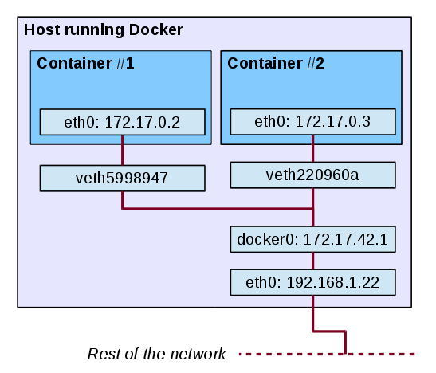
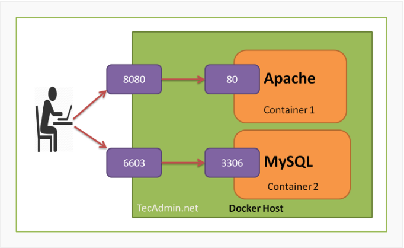

# Network
- Network and Network drivers
- Networking with standalone containers
- Port

## Network

`Docker network` sẽ đảm nhiệm nhiệm vụ kết nối mạng giữa các container với nhau, kết nối giữa container với bên ngoài, cũng như kết nối giữa các cụm (swarm) docker containers. Khi các container có cùng một network, chúng có thể liên lạc với nhau qua `name` của container và `port` của container trên network đó.

### Network drivers

Hệ thống Docker Network là dạng `plugable`, sử dụng `drivers`. Hầu hết các driver được cung cấp mặc định, và các drivers này có thể cung cấp hầu hết các chức năng mà một hệ thống mạng bình thường cần có:

- `bridge`: Đây là driver mạng default của Docker. Nếu không chỉ định driver thì bridge sẽ là driver mạng mặc định khi khởi tạo. Bridge là driver tốt nhất cho việc giao tiếp multiple containers ở một host đơn

- `host`: Dùng khi container cần giao tiếp với host và sử dụng luôn mạng ở host, vì sử dụng mạng của máy chủ đang chạy nên không còn lớp mạng nào giữa container với Docker Host phù hợp khi cần connect từ container ra thẳng ngoài host

- `overlay`: Overlay network tạo một mạng phân tán giữa nhiều máy chủ Docker. Kết nối nhiều Docker daemons với nhau và cho phép các cụm services giao tiếp với nhau. Chúng ta có thể sử dụng overlay network để giao tiếp dễ dàng giữa cụm các services với một container độc lập, hay giữa 2 container với nhau ở khác máy chủ Docker daemons.

- `ipvlan`: Cung cấp toàn quyền kiểm soát đối với cả địa chỉ IPv4 và IPv6. 

- `macvlan`:  Cho phép gán địa chỉ MAC cho container, điều này làm cho mỗi container như là một thiết bị vật lý trong mạng. Docker daemon định tuyến truy cập tới container bởi địa chỉ MAC. Sử dụng driver macvlan là lựa chon tốt khi các ứng dụng khác cần phải connect đến theo địa chỉ vật lý hơn là thông qua các lớp mạng của máy chủ.

- `none`: Với container không cần networking hoặc cần disable đi tất cả mọi networking, chúng ta sẽ chọn driver này.

## Networking with standalone containers

### Communicate Between Docker Containers

- Trên cùng một host, các container có thể communicate với nhau. Thông thường ta dùng địa chỉ IP để network routing các gói tin giữa các máy với nhay. Tuy nhiên, các container được cấp ip động nên nó có thể thay đổi, dẫn đến nhiều khó khăn. Vì vậy, thay vì dùng địa chỉ ip, ta có thể dùng `name` hoặc `id` của các container communicate với nhau.

- Trong trường hợp sử dụng `default bridge network` thì ta khai báo thêm lệnh `--link=name_container`.

- Trong trường hợp sử dụng `user-defined network` thì ta không cần phải link nữa mà sẽ tự config.

### Use the default bridge network



Khi chúng ta cài đặt Docker, những thiết lập sau sẽ được thực hiện:
  - Virtual bridge docker0 sẽ được tạo ra
  - Docker tìm một subnet chưa được dùng trên host và gán một địa chỉ cho docker0

Sau đó, khi chúng ta khởi động một container (với bridge network), một veth (Virtual Ethernet) sẽ được tạo ra nối 1 đầu với docker0 và một đầu sẽ được nối với interface eth0 trên container.

Để liệt kê các network đang có, ta có thể dùng lệnh
```sh
docker network ls
```

```sh
root@adk:/# docker network ls
NETWORK ID          NAME                DRIVER              SCOPE
1d8aa8d520a2        bridge              bridge              local
a8ddedeecca8        host                host                local
ad1c5f949ef2        none                null                local
root@adk:/# 
```

Mặc định khi tạo container mà ta không chỉ định dùng network nào, thì docker sẽ dùng `bridge`. Với `bridge`, Docker sẽ tạo ra một switch ảo. Khi container được tạo ra, interface của container sẽ được gắn vào switch ảo này và kết nối với interface của host.


### User-defined networks

Ngoài việc sử dụng các network mặc định do docker cung cấp. Ta có thể tự định nghĩa ra các dải network phù hợp với công việc của mình, gọi là `User-defined networks`.

Để tạo network, ta dùng lệnh
```sh
docker network create --driver bridge --subnet 192.168.1.0/24 bridgexxx
```
Trong đó:
- **--driver bridge**: Chỉ định dải mạng mới được tạo ra sẽ thuộc kiểu nào: bridge, host, hay none.
- **--subnet**: Chỉ định địa địa chỉ mạng.
- **bridgexxx**: Tên của dải mạng mới.

Khi chạy container chỉ định sử dụng 1 dải mạng đặc biệt, ta dùng lệnh
```sh
docker run --network=bridgexxx -itd --name=container3 busybox
```
Trong đó:
  - **--network=bridgexxx:** Chỉ định ra dải mạng bridgexxx sẽ kết nối với container.

Container nào chạy trên network này đều phải thuộc về cùng một Docker host. Mỗi container trong network có thể communicate với các containers khác trong cùng network.

## Port



- Các kết nối mạng đều được thực hiện thông qua `port`, ở đây có 2 loại `port`: `public-port` và `target-port` sử dụng giao thức `tpc` `udp`. Khi run container, ta cần thiết lập `port` cho nó, để Docker `expose` cái port này ra ngoài public, từ public sẽ access tới cái port này để kết nối tới container.  Cú pháp kiểu:

    ```
    docker run -p public-port:target-port/protocol ... 
    ```

    - `public-port` : cổng public ra ngoài (ví dụ 80, 8080 ...), các kết nối KHÔNG cùng network đến container phải thông qua cổng này.

    - `target-port` : cổng bên trong container, cổng public-port sẽ ánh xạ vào cổng này. Nếu các container cùng network có thể kết nối với nhau thông qua cổng này.

## Reference

1. [Docker - Network](https://docs.docker.com/network/)

2. [Networking with standalone containers](https://docs.docker.com/network/network-tutorial-standalone/)

3. [Docker port](https://docs.docker.com/engine/reference/commandline/port/)

4. [Docker Manage Ports](https://tecadmin.net/tutorial/docker/docker-manage-ports/)