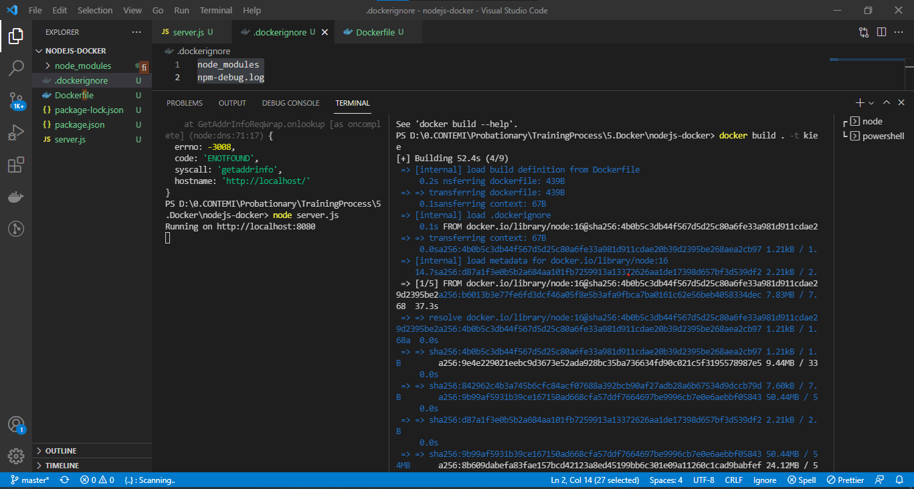
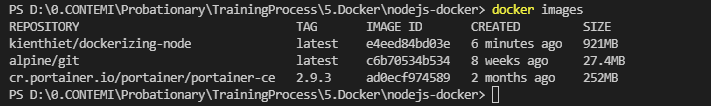
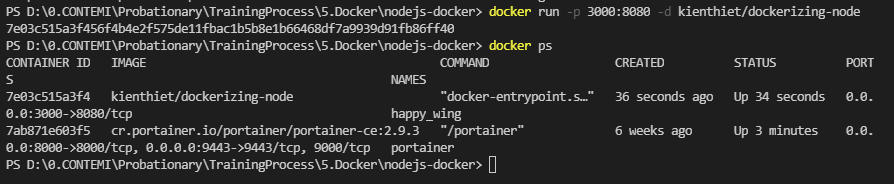
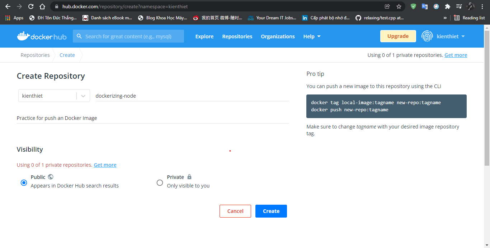
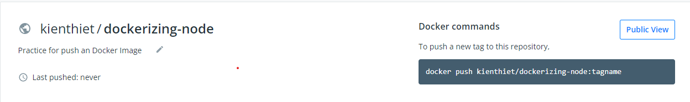
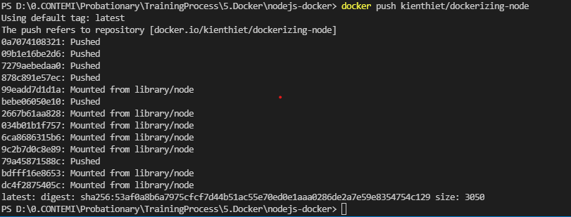
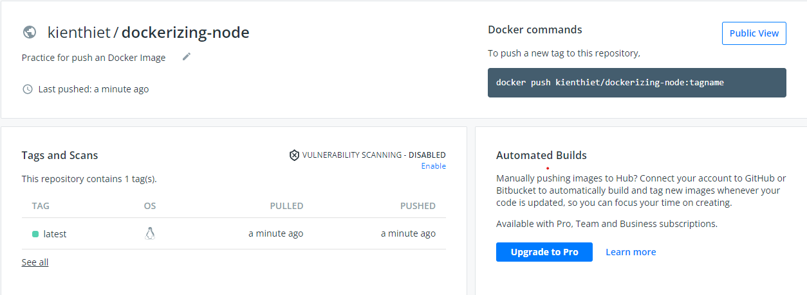

# Practice with Docker
- Image
- Container


Xem Docker version:

``` powershell
docker --version
```

và Docker info:

``` powershell
docker info
```

## Practice with docker images: build, pull, push, tag

### Pull an image
- Đầu tiên, để có `image` nào đó, ta có thể pull về từ [DockerHub](https://hub.docker.com/search?q=&type=image), dùng lệnh:

    ```sh
    docker pull <imagename>:tag
    ```

Nếu không có `tag` thì mặc định là `latest`.

- Tìm kiếm một image từ Docker Hub:

  ```sh
  docker search <imagename> 
  ```

- Sau khi pull image về, xem các image đang có:

    ```sh
    docker images -a
    ```
- Xem chi tiết thông tin về image:
    ```sh
    docker image inspect <imagename>
    ```

- Cách tra cứu cú pháp các command về image:
    ```sh
    docker [command] --help
    ```

### Build an image

Init một NodeJS App với các config sau:

```json title="package.json"
{
  "name": "docker_web_app",
  "version": "1.0.0",
  "description": "Node.js on Docker",
  "author": "First Last <first.last@example.com>",
  "main": "server.js",
  "scripts": {
    "start": "node server.js"
  },
  "dependencies": {
    "express": "^4.16.1"
  }
}
```

``` javascript title="server.js"
'use strict';

const express = require('express');

// Constants
const PORT = 8080;
const HOST = '0.0.0.0';

// App
const app = express();
app.get('/', (req, res) => {
  res.send('Hello World');
});

app.listen(PORT, HOST);
console.log(`Running on http://${HOST}:${PORT}`);
```

``` Dockerfile title="Dockerfile"
FROM node:16

# Create app directory
WORKDIR /usr/src/app

# Install app dependencies
# A wildcard is used to ensure both package.json AND package-lock.json are copied
# where available (npm@5+)
COPY package*.json ./

RUN npm install
# If you are building your code for production
# RUN npm ci --only=production

# Bundle app source
COPY . .

EXPOSE 8080
CMD [ "node", "server.js" ]
```

```txt title=".dockerignore"
node_modules
npm-debug.log
```

- Build NodeJS App này thành Image dựa trên Dockerfile bằng command:

```
docker build . -t <your username>/node-web-app
```

- Docker build Image thành nhiều layers và ghi log ra như sau:



- Dùng lệnh `docker images` để xem image đã build



## Run your image as a Container

### Run the image

Run image mình mới build bằng câu lệnh:

```sh
docker run -p 3000:8080 -d <your-username>/node-web-app
```

+ `-d` là run container trên `detached mode`, container sẽ chạy ngầm và không log output ra terminal

+ `-p` là ánh xạ port 8080 trong Docker ra port 3000 ở localhost

Kết quả:




### exec, stop, start, and name containers
Một số câu lệnh phổ biến để tương tác với container đang chạy:


- `docker exec -it containerid command` : Chạy một lệnh command trên container đang hoạt động

- `docker stop containerid`: Dừng hoạt động một container dựa trên id

- `docker start -i containerid`: Chạy một container

- `docker restart containerid`: Khởi động lại container

- `docker rm containerid`: Xóa container

- `docker logs containerid`: Xem logs của container đang chạy

## Push the Image

Lên DockerHub tạo một Repo mới, đặt tên repo là tên của Image cần push:



Sau khi tạo repo xong thì run command:

```sh
docker push kienthiet/dockerizing-node:tagname
```



Lưu ý là trước khi push phải login vào Docker ở local, nếu không sẽ: `denied: requested access to the resource is denied`. Run lệnh push ở trên, Docker sẽ tiến hành push Image lên DockerHub theo từng layers, output logs như sau:



Có thể lên DockerHub để check:



