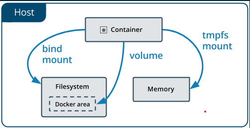
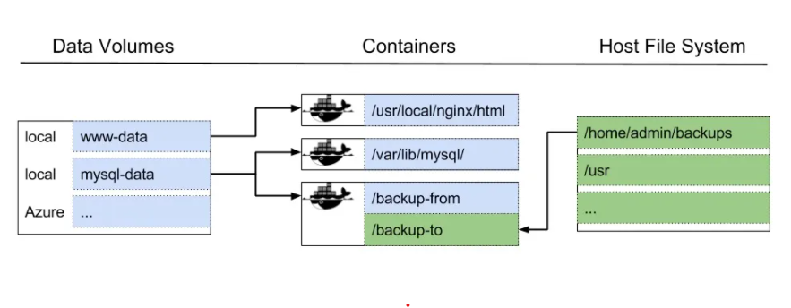

# Volumes, Persistent Data
- Manage data in Docker
- Volumes, Persistent data

## Manage data in Docker
- `Docker` hỗ trợ 3 cách để lưu trữ dữ liệu của Docker container là: `volumes`, `bind mounts` và `tmpfs mounts` (Docker on Linux). `Volumes` thường là best choice

    

- Sự khác biệt giữa `volumes`, `bind mounts` và `tmpfs mounts` chỉ đơn giản là khác nhau về vị trí lưu trữ dữ liệu trên Docker host.
    + `volumes` được lưu trữ như một phần của filesystem trên Docker host và được quản lý bởi Docker (chứa trong folder `/var/lib/docker/volumes` trên Linux). Đây được xem là cách tốt nhất để duy trì dữ liệu trong Docker

    + `bind mounts` cho phép lưu trữ bất cứ đâu trong host system.

    + `tmpfs mounts` cho phép lưu trữ tạm thời dữ liệu vào bộ nhớ của Docker host, không bao giờ ghi vào filesystem của Docker host.

## Docker Volumes, Persistent data

- `Persistence Data` - là một khái niệm trong phát triển ứng dụng đề cập đến vấn đề "Nếu dữ liệu không được lưu trữ khi hệ thống ngưng hoạt động, cho đến khi hệ thống hoạt động lại thì tất cả các dữ liệu phải được khởi tạo và xử lý lại từ đầu". 

- `Volume` trong Docker là một cơ chế được Docker sử dụng để cung cấp khả năng lưu trữ liên tục (`persistent data storage`). Chúng mang lại những lợi ích đáng kể trong quá trình phát triển và triển khai ứng dụng trên Docker.

- Cơ chế duy trì dữ liệu - persistent data trong các services và containers chạy trên Docker bằng `volumes`:

    + Ta có thể tạo volumes với câu lệnh `docker volume create` hoặc tạo volumes trong khi tạo containers, ... 

    + Khi tạo ra volumes, nó sẽ được lưu trữ trong một thư mục trên Docker host. 

    + Khi ta thực hiện `mount volumes` vào `container` thì thư mục này sẽ được mount vào container luôn. `bind mounts` cũng hoạt động tương tự, khác chỗ lưu data thôi.

    + `volumes` có thể được mount vào nhiểu containers cùng một lúc. Khi không có containers nào sử dụng volumes thì volumes vẫn ở trạng thái `cho phép mount` vào containers và không bị xóa một cách tự động.

    + `volumes` hỗ trợ `volume drivers`, do đó ta có thể sử dụng để lưu trữ dữ liệu từ `remote hosts` hoặc `cloud providers`.

- Một số trường hợp sử dụng `volumes`:

    + Chia sẻ dữ liệu với nhiều containers đang chạy. Dữ liệu yêu cầu phải tồn tại kể cả khi dừng hoặc loại bỏ containers.

    + Khi Docker host có cấu trúc filesystem không thống nhất, ổn định, thường xuyên thay đổi.

    + Khi muốn lưu trữ dữ liệu containers trên remote hosts, cloud thay vì Docker host.

    + Khi có nhu cầu sao lưu, backup hoặc migrate dữ liệu tới Docker host khác thì volumes là một sự lựa tốt. Ta cần phải dừng containers sử dụng volumes sau đó thực hiện backup tại đường dẫn `/var/lib/docker/volumes/<volume-name>`

## Reference

1. [Manage data in Docker](https://docs.docker.com/storage/)
2. [Use Volumes](https://docs.docker.com/storage/volumes/)
3. [Manage data in Docker](https://docs.docker.com/storage/)