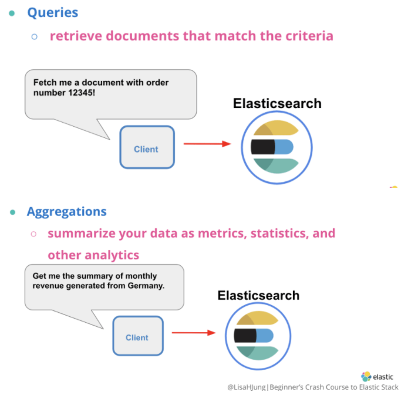
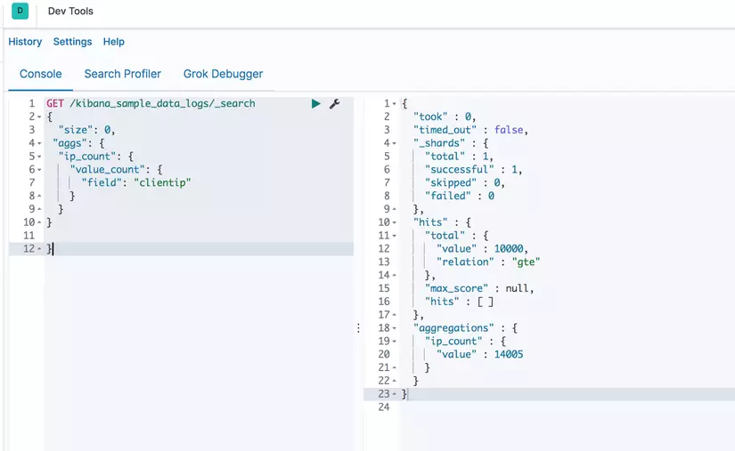
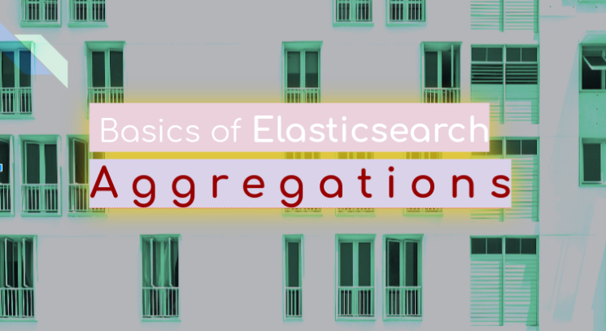
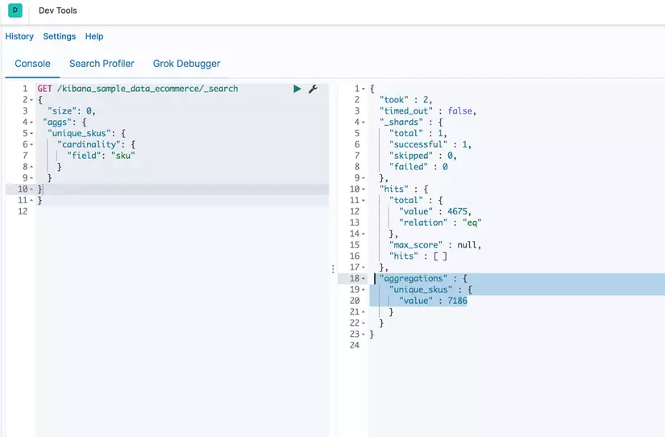
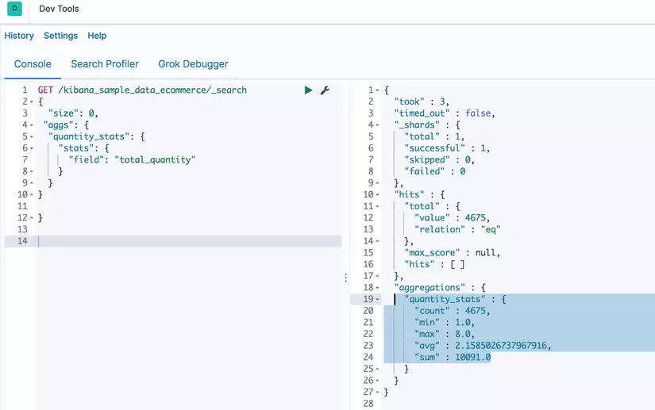
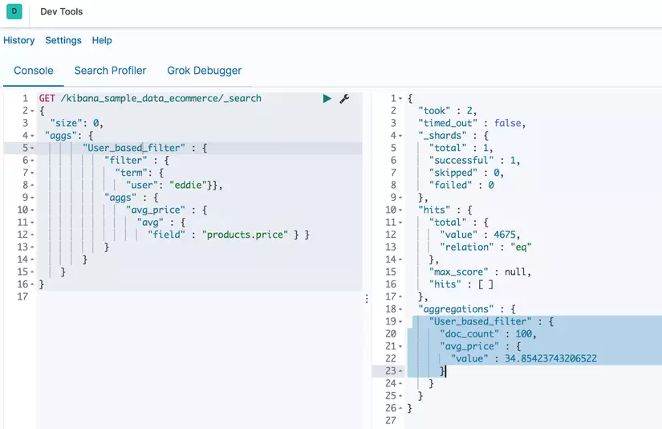
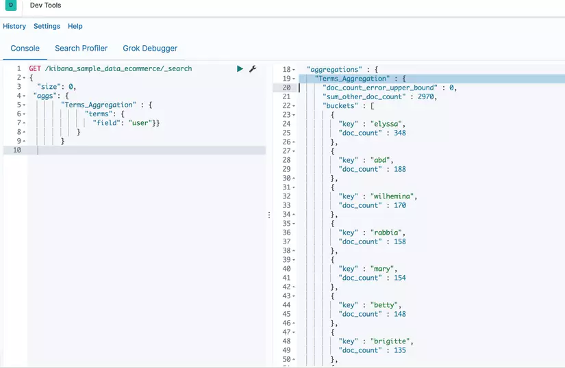
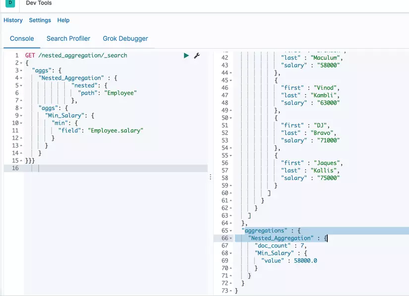

# Aggregation


## Overview

Có hai cách chính để tìm kiếm trong Elasticsearch: 

- `Queries`: Dùng để truy vấn các document phù hợp với các tiêu chí được chỉ định. 

- `Aggregation`: Tổng hợp, trình bày tóm tắt dữ liệu của dưới dạng chỉ số, thống kê và các phân tích khác. 



## Concepts

Elasticsearch định nghĩa [Aggregation](https://www.elastic.co/guide/en/elasticsearch/reference/current/search-aggregations.html) như sau:

???+ info "Aggregation"

    An aggregation summarizes your data as metrics, statistics, or other analytics. Aggregations help you answer questions like:

    - What’s the average load time for my website?
    - Who are my most valuable customers based on transaction volume?
    - What would be considered a large file on my network?
    - How many products are in each product category?

Aggregarions giúp tổng hợp, trình bày tóm tắt dữ liệu, thực hiện các tính toán và thống kê sử dụng một search query. Ta có thể truy xuất dữ liệu mà mình muốn sử dụng phương thức `GET` trong Dev Tools của Kibana UI, CURL hay APIs trong code.

Dưới đây là 2 ví dụ ta có thể sử dụng aggregations:

- Muốn biết trung bình cộng giá của tất cả sản phẩm trong danh mục hàng hóa.

- Kiểm tra xem có bao nhiêu sản phẩm có giá trong khoảng 100$ và giá trong khoảng từ 100$ đến 200$.


## Syntax

Dưới đây là ví dụ về Aggregations syntax:

```json
"aggs": {
    "name_of_aggregation": {
      "type_of_aggregation": {
        "field": "document_field_name"
}
```

Trong đó:
- `aggs`: Cho biết ES sẽ thực hiện truy vấn aggregation.

- `name_of_aggregation`: Tên của aggregation mà mình định nghĩa ở bên dưới

- `type_of_aggregation`: Loại aggregation được sử dụng.

- `field` và `document_field_name`: Một key-value pair cho ES biết tên của field mà ta muốn thực hiện aggregation

Ví dụ:

```json
GET /kibana_sample_data_logs/_search
{ "size": 0, 
 "aggs": {
  "ip_count": {
    "value_count": {
      "field": "clientip" 
                    }
               }
          }
}

```

Truy vấn trên sẽ trả về tổng số `clientip` trong index `kibana_sample_data_logs`:



## Categories

Aggregations được xếp thành 3 loại:

- `Metric aggregations`: tính toán các số liệu, chẳng hạn như tổng hoặc trung bình, từ các field values

- `Bucket aggregations`: Nhóm các documents lại thành từng nhóm, gọi là `buckets` hoặc `bins` dựa trên field values, ranges, hoặc các tiêu chí khác.

- `Pipeline aggregations`: Lấy input từ một aggregations khác thay vì lấy input từ documents hay fields.

Ngoài ra, còn có Matrix aggregations—Những aggregation này làm việc trên nhiều hơn một field và cung cấp kết quả thống kê dựa trên các document thu được từ các trường được sử dụng.


## Common aggregation and example



ES hỗ trợ rất nhiều aggregation, ví dụ với 5 aggregation quan trọng trong Elasticsearch là:

### Cardinality aggregation

Aggregation này là một `single-value` aggregation thuộc loại `Metric aggregations`, sử dụng để tính toán số lượng các giá trị khác nhau của một field cụ thể. Quay lại ví dụ về aggregation syntax ở trên, để tìm xem có bao nhiêu `sku` trong `e-commerce`, ta thực hiện truy vấn:

```json
GET /kibana_sample_data_ecommerce/_search
{
    "size": 0, 
    "aggs": {
        "unique_skus": {
            "cardinality": {
                "field": "sku"
            }
        }
    }
}
```
Kết quả thu được là



### Stats aggregation

Đây là 1 `multi-value` thuộc `Metric aggregations`, tính toán số liệu thống kê từ các giá trị số từ các document tổng hợp được. Số liệu thống kê trả về bao gồm `min`, `max`, `sum`, `count` và `avg`.

Thử kiểm tra số liệu thống kê field `total_quantity` trong ví dụ trên:

```json
GET /kibana_sample_data_ecommerce/_search
{
  "size": 0, 
 "aggs": {
  "quantity_stats": {
    "stats": {
      "field": "total_quantity"
    }
  }
}
}
```

Kết quả là:



### Filter aggregation

Aggregarion này thuộc `Bucket aggregations`, định nghĩa một bucket duy nhất chứa các document thỏa màn điều kiện filter, và có thể thực hiện tính toán số liệu trong bucket này. Ví dụ: ta filter các document có username là `eddie` và tính trung bình cộng giá của các sản phẩm người đó đã mua:

```json
GET /kibana_sample_data_ecommerce/_search
{ "size": 0, 
 "aggs": {
        "User_based_filter" : {
            "filter" : { 
              "term": { 
                "user": "eddie"}},
            "aggs" : {
                "avg_price" : { 
                  "avg" : { 
                    "field" : "products.price" }}
            }
        }
    }
}
```

Kết quả là: 



### Terms aggregation

Thêm một ví dụ về loại `Bucket aggregations` khác, tạo ra các bucket từ các giá trị của field, số lượng bucket là động, mỗi giá trị khác nhau của field được chỉ định sẽ tạo ra 1 bucket.

Trong ví dụ dưới đây, ta sẽ thực hiện terms aggregation trên field `user`. Ở kết quả, ta sẽ có các bucket cho mỗi user, mỗi bucket sẽ chứa số lượng document:

```json
GET /kibana_sample_data_ecommerce/_search
{
  "size": 0, 
 "aggs": {
        "Terms_Aggregation" : {
              "terms": { 
                "field": "user"}}
            }
        }
```

Kết quả là:



### Nested aggregation

Đây là một trong những aggregation quan trọng nhất trong `Bucket Aggregations`. Một Nested Aggregation cho phép tổng hợp một field với nested documents — một field mà có nhiều sub-fields. Một field phải có type là `nested` trong index mapping thì mới sử dụng Nested Aggregation trên field đó được. Với ví dụ nãy giờ, ta phải thêm field có type là `nested`, sau đó thực hiện truy vấn:

```json
GET /nested_aggregation/_search
{
  "aggs": {
    "Nested_Aggregation" : {
              "nested": {
                "path": "Employee"
              }, 
    "aggs": {
      "Min_Salary": {
        "min": {
          "field": "Employee.salary"
        }
      }
    }
}}}
```

Kết quả:



Còn 1 số aggregation hữu ích như: `Date histogram aggregation` sử dụng với các data có type là dates; `Scripted aggregation` sử dụng với scripts; `Top hits aggregation` sử dụng với các document phù hợp nhất; `Range aggregation` sử dụng với tập hợp các giá trị trong một khoảng nhất định. Ngoài ra còn rất nhiều aggregation khác nhưng ít thông dụng hơn, có thể xem chi tiết tại [Aggregations](https://www.elastic.co/guide/en/elasticsearch/reference/current/search-aggregations.html)

## Reference

1. [Aggregations - Elasticsearch document](https://www.elastic.co/guide/en/elasticsearch/reference/current/search-aggregations.html)

2. [A Basic Guide To Elasticsearch Aggregations - ]()

3. [Running aggregations with Elasticsearch and Kibana - dev.to](https://dev.to/elastic/running-aggregations-with-elasticsearch-and-kibana-lni)

4. [Introduction to Elasticsearch Aggregations - faun.pub](https://faun.pub/introduction-to-elasticsearch-aggregations-242ecc48c806)