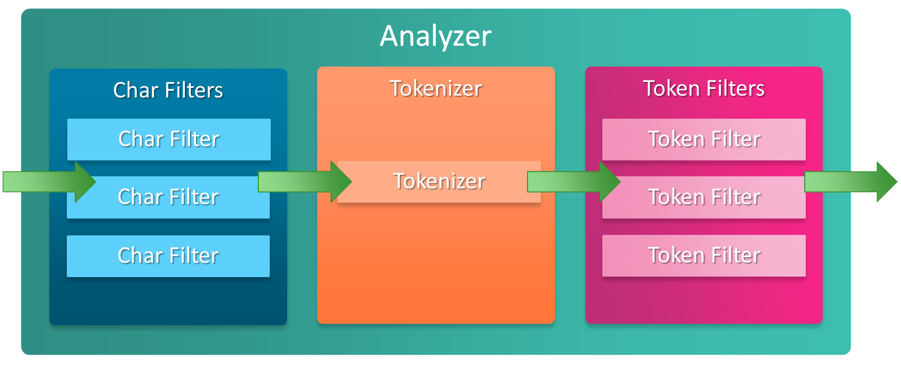

# Analyzer



## Analysis and Analyzers

`Analyzer` là một công cụ xử lý các dữ liệu được gửi lên elasticsearch và xử lý dữ liệu của một số loại query search như `match query`. Về khái niệm `Analysis` hiểu là một process thực hiện các công việc sau:

- Đầu tiên sẽ xử lý tách từ từ một đoạn text đầu vào thành các terms (từ hoặc cụm từ) phù hợp để sử dụng trong việc đánh chỉ mục ngược

- Sau đó thì phân tích, chuẩn hóa các terms này để thu được data mong muốn phục vụ việc tìm kiếm. Nó giống như việc mình muốn ăn bưởi ngoài loại bỏ vỏ, tách từng múi sau khi đã có từng múi rồi thì mình lại phải bóc từng múi và bỏ hạt vậy.

Những công việc kể trên sẽ do `Analyzer` đảm nhiệm thực hiện. 

## A Closer Look at Analyzers

Mỗi một analyzer là sự kết hợp của 3 functions sau: một hoặc nhiều `Character filters` để chuẩn hóa dữ liệu trước khi phân tích, một `Tokenizer` để phân tích dữ liệu và một hoặc nhiều `Token filters` để chuẩn hóa dữ liệu sau khi phân tích.


### Character filters
Có một hoặc nhiều `Character filters` trong Analyzer đóng vai trò xử lý chuỗi, chuẩn hóa dữ liệu trước khi phân tích. Đây là bước đầu tiên của quá trình `analysis`, ở bước này, các ký tự sẽ được chuyển đổi thành dữ liệu cho phù hợp với yêu cầu search.  Quá trình này sẽ xử lý các trường hợp như muốn loại bỏ các `tags` và các `HTML character` trong đoạn text, chuyển các ký tự thành từ có nghĩa như `I love u 2` thành `I love you too`.


### Tokenizer

Các chuỗi sau khi được filter bởi Chracter filters thì sẽ được phân tách bởi một bộ tách từ tokenizer (có thể tự định nghĩa), đơn giản nhất là tách từ theo khoảng trắng hay dấu chấm câu. Sau khi đoạn text đã được xử lý chuyển đổi các ký tự xong, nó sẽ được phân tách thành các `single token`. 

Elasitcsearch cung cấp rất nhiều tokenizers để phục vụ cho đa số các bài toán như `whitespace tokenizer` sẽ tách đoạn text thành các tokens dựa váo các khoảng trắng, hoặc `letter tokenizer` sẽ tách đoạn text thành các token dựa vào whitespace và các ký tự đặc biệt: `sun-asterisk company` sẽ có output là 3 single token: `sun`, `asterisk` và `company`.

### Token filters

Cuối cùng, mỗi term sẽ được đưa qua `Token filters` để filters thêm lần nữa, ví dụ như việc chuyển các ký tự hoa về ký tự thường (lowercase) hay loại bỏ các stop-words - từ xuất hiện nhiều nhưng gần như không ảnh hưởng tới kết quả tìm kiếm.

### Examples

Hình dưới đây sẽ mô tả tổng quan quá trình phân tích của đoạn text `share your experience with NoSql & big data technologies` sử dụng `analyser` gồm một `chararacter filter`, một `tokenizer`, và 3 `token filters`:


- Ở ví dụ trên charater filter đã chuyển đổi ký tự `&` thành từ `and`, vì vậy khi search với từ khóa `and` thì dữ liệu chứa ký tự `&` sẽ được liệt kê ra, một điều khó có thể thực hiện khi search với sql quries.


Một ví dụ khác với các ký tự HTML:


## Build-in Analyzers

Hiện tại elasticsearch cung cấp một số build-in analyzer sau:

### Standard Analyzer

Đây là analyzer mặc định, hoạt động tốt với hầu hết các ngôn ngữ. Ví dụ:

```json
POST _analyze
{
  "analyzer": "standard",
  "text": "The 2 QUICK Brown-Foxes jumped over the lazy dog's bone."
}
```

Kết quả: `[ the, 2, quick, brown, foxes, jumped, over, the, lazy, dog's, bone ]`


### Simple Analyzer

Simple analyzer tách đoạn text thành token khi gặp một ký tự không phải là letter. Nó bao gồm lowercase tokenizer. Ví dụ:

```json
POST _analyze
{
  "analyzer": "simple",
  "text": "The 2 QUICK Brown-Foxes jumped over the lazy dog's bone."
}
```

Kết quả: `[ the, quick, brown, foxes, jumped, over, the, lazy, dog, s, bone ]`

### Whitespace Analyzer

Tách đoạn text thành token dựa vào các whitespace, bao gồm whitespace tokenizer. Ví dụ:

```json
Tách đoạn text thành token dựa vào các whitespace. Nó bao gồm whitespace tokenizer
```

Kết quả: `[ The, 2, QUICK, Brown-Foxes, jumped, over, the, lazy, dog’s, bone. ]`

### Stop Analyzer

Giống với Simple Analyzer, tách đoạn text thành token khi gặp một ký tự không phải là letter nhưng có thêm một tính năng là loại bỏ các token là stopword(a, an, the, sẽ đề cập ở phần sau) nhờ có thêm một token filter là Stop Token Filter

```json
POST my_index/_analyze
{
  "analyzer": "my_stop_analyzer",
  "text": "The 2 QUICK Brown-Foxes jumped over the lazy dog's bone."
}
```

Kết quả: `[ quick, brown, foxes, jumped, lazy, dog, s, bone ]`

### Keyword Analyzer

Nhận bất kỳ đoạn text nào và trả về toàn bộ text đầu vào đó dưới dạng một token duy nhất. Ví dụ:

```
POST _analyze
{
  "analyzer": "keyword",
  "text": "The 2 QUICK Brown-Foxes jumped over the lazy dog's bone."
}
```

### Pattern Analyzer

Tách đoạn text thành token dựa vào biểu thức chính quy (RegEx), pattern mặc định là `W+:` ngoại trừ tất cả non-word characters. Ví dụ:

```json
POST _analyze
{
  "analyzer": "pattern",
  "text": "The 2 QUICK Brown-Foxes jumped over the lazy dog's bone."
}
```

Kết quả: `[ the, 2, quick, brown, foxes, jumped, over, the, lazy, dog, s, bone ]`

### Language Analyzers

Tập hợp các analyzer dành cho các ngôn ngữ khác nhau : arabic, armenian, basque, bengali, brazilian, bulgarian, catalan, cjk, czech, danish, dutch, english, finnish, french, galician, german, greek, hindi, hungarian, indonesian, irish, italian, latvian, lithuanian, norwegian, persian, portuguese, romanian, russian, sorani, spanish, swedish, turkish, thai. Ví dụ với `german analyzer`:

```json
PUT /german_example
{
  "settings": {
    "analysis": {
      "filter": {
        "german_stop": {
          "type":       "stop",
          "stopwords":  "_german_" 
        },
        "german_keywords": {
          "type":       "keyword_marker",
          "keywords":   ["Beispiel"] 
        },
        "german_stemmer": {
          "type":       "stemmer",
          "language":   "light_german"
        }
      },
      "analyzer": {
        "rebuilt_german": {
          "tokenizer":  "standard",
          "filter": [
            "lowercase",
            "german_stop",
            "german_keywords",
            "german_normalization",
            "german_stemmer"
          ]
        }
      }
    }
  }
}
```

### Fingerprint Analyzer

Fingerprint Analyzer sẽ implements thuật toán `fingerprinting algorithm` được sử dụng bởi dự án [OpenRefine](https://github.com/OpenRefine/OpenRefine/wiki/Clustering-In-Depth#fingerprint) để hỗ trợ việc clustering. Input của nó vẫn là text, được chuẩn hóa về chữ thường và loại bỏ các extended characters và các stopword nếu cần, sắp xếp lại, loại bỏ trùng lặp sau đó nối lại thành một single token.

## Reference

1. [Analyzers - elastic document](https://www.elastic.co/guide/en/elasticsearch/reference/6.8/analysis-analyzers.html)

2. [Understanding Analysis in Elasticsearch (Analyzers) - codingexplained.com](https://codingexplained.com/coding/elasticsearch/understanding-analysis-in-elasticsearch-analyzers)

3. [Anatomy of an Analyzer - nidhivichare.tech](https://nidhivichare.tech/blog/anatomy-of-an-analyzer)