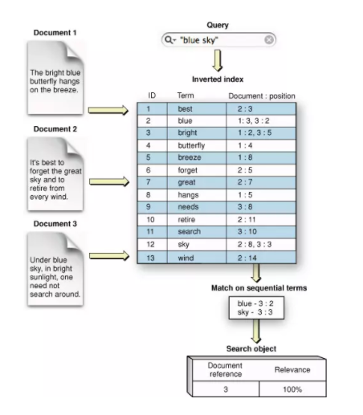
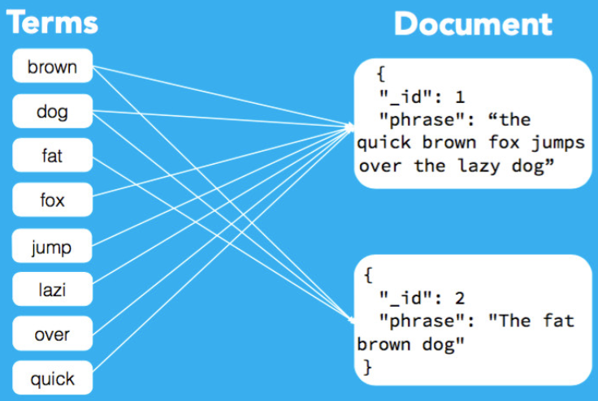
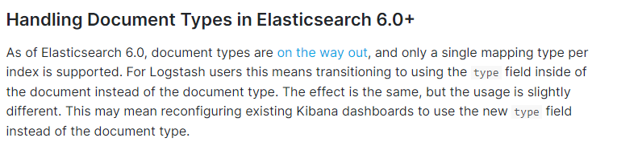
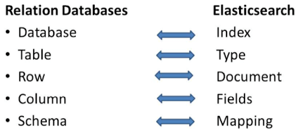

# Index, Type, Document

## Index

### Basic Definition

Theo [Elastic glossary](https://www.elastic.co/guide/en/elastic-stack-glossary/current/terms.html#i-glos) định nghĩa Index như sau:

???+ info "Index"

    1. Collection of JSON documents.
  
    2. To add one or more JSON documents to Elasticsearch. This process is called indexing.


Một Elasticsearch index là một collection các document có liên quan với nhau. ES lưu trữ dữ liệu dưới dạng JSON document. 

Index được định danh bằng tên, tên này sẽ được sử dụng để thực hiện các hoạt động như lập index, tìm kiếm, cập nhật hoặc xóa các document trong index. Một số quy tắc khi đặt tên cho index:

- Chỉ có chữ thường.

- Không chứa các ký tự đặc biệt, dấu phẩy, space. Trước ES v7.0, tên index có thể chứa dấu hai chấm, Trong v7.0+ thì dẹp luôn.

- Không bắt đầu bằng `-`, `_` , `+`

- Không là `.` hoặc `..`

- Không dài hơn 255 bytes. Lưu ý là byte, do vậy các ký tự multi-byte sẽ bị tính vào giới hạn 255 nhanh hơn.

### Inverted index

ES sử dụng cấu trúc dữ liệu được gọi là `Reverse Index` hay `Inverted Index` và được thiết kế để có thể thực hiện full-text search một cách nhanh chóng.

Một Inverted index chứa danh sách từng ký tự đơn duy nhất (unique word) xuất hiện trong bất kỳ một document nào, ứng với mỗi ký tự đó sẽ là một danh sách các document mà từ này xuất hiện (thông qua cơ chế mapping). Inverted index được tạo ra từ document và được lưu trữ trong `Shard` để dùng cho searching document.

Trong quá trình indexing, ES lưu trữ document và build một reverse index cho phép dữ liệu từ document có thể được tìm kiếm trong thời gian thực (near real-time). Lập chỉ mục bắt đầu với index API, sau đó có thể thêm hoặc cập nhật một JSON document trong một index cụ thể.



### ES indexing technique

Nhờ có `indexing technique`, khi lưu trữ document trong ES, nó tạo ra một số `internal data structures` làm cho query perfom tốt hơn. Mỗi document gửi tới ES được lưu trữ qua một thuật toán và sau đó được gửi đến `shard`. ES sẽ cố gắng để phân tán document thông qua các shard này. Khi lưu trữ document, ES tạo ra inverted index như kể trên, map các term/key words xuất hiện trong document này tới chính document đó:



Khi sử dụng `inverted index`, nó có thể tìm kiếm thông qua terms như một binary tree (sử dụng thứ tự chữ cái) làm giảm thời gian tìm kiếm.

## Document

Theo [Elastic glossary](https://www.elastic.co/guide/en/elastic-stack-glossary/current/terms.html#i-glos)

???+ info "Document"
    JSON object containing data stored in Elasticsearch

`Elaticsearch` là một `document oriented database`, nên document là khái niệm cơ bản nhất trong Elaticsearch. `Document` là một `JSON objects` đã được Elasticsearch lập index. Mỗi document tương ứng với một JSON object chứa các key-value pair, trong đó key là tên của các filed hoặc properties, còn value là giá trị tương ứng có thể là strings, numbers, booleans, dates ... Ví dụ về một document:

```json
{
   "_id": 3,
   "_type": ["your document type"],
   "_index": ["your index name"],
   "_source": {
    "age": 28,
    "name": "harry",
    "year": 1999,
   }
}
```

Một điều quan trọng khi lưu trữ document đó là quyết định đâu là cách tốt nhất để lưu trữ chúng, từ đó giúp nâng cao tốc độ truy vấn. Khi thiết kế các giải pháp sử dụng ElasticSearch, ta cần trả lời được câu hỏi tôi sẽ truy vấn document này như thế nào?

Một document có một vài thuộc tính quan trọng như sau:

- Một document chứa các reserved fields, như trong ví dụ trên là `_id`, `_type`, `_index`, `_source` chứa các document metadata - values của data mình cần lưu trữ.

- Document có thể được phân cấp. Có thể hiểu như là Document chứa Document - lồng nhau.

- Document có cấu trúc linh hoạt. Document là `schema-free`, không phụ thuộc vào một database schema được define từ trước, hạn chế tối đa sự ràng buộc. Thay vì sử dụng schema, Elasticsearch sử dụng cơ chế `mapping` để defines các `data types` và `format` của các fields có trong document.

## Type

Từ Elasticsearch 6.0+ khái niệm `Document Type` được loại bỏ và được chuyển sang sử dụng `Type` thay vì `Document Type`, 

<figure markdown>
  
  <figcaption> 
  <a href="https://www.elastic.co/guide/en/logstash/6.0/upgrading-logstash-6.0.html#_when_to_upgrade" target="_blank">Source</a>
  </figcaption>
</figure>

Một `Type` gần giống như 1 Table trong database. Mỗi `type` có 1 danh sách các `Field` được chỉ định cho `Documents` của `type` đó. Có thể nói `type` là một container chứa các document, các documents có cùng kiểu dữ liệu sẽ được chứa trong một type.

Quay lại ví dụ về document trên, trong document có field là `_type`, đây chính là một `Type` và mỗi document sẽ có 1 field `_type` để define cái type of document, sau đó các type này sẽ được map với nhau phục vụ cho việc quản lý, tìm kiếm, phân tích documents.

## Terminology

Để dễ hình dung các khái niệm này trong Elasticsearch, mình reference nó từ Relation Database như sau:



## Reference

1. [Documents and indices](https://www.elastic.co/guide/en/elasticsearch/reference/master/documents-indices.html).

2. [What is an Elasticsearch Index](https://www.elastic.co/blog/what-is-an-elasticsearch-index)

3. [Removal of mapping types](https://www.elastic.co/guide/en/elasticsearch/reference/current/removal-of-types.html)

4. [10 Elasticsearch Concepts](https://logz.io/blog/10-elasticsearch-concepts/)

5. [Document in Elasticsearch](https://opster.com/guides/elasticsearch/glossary/elasticsearch-document/)
