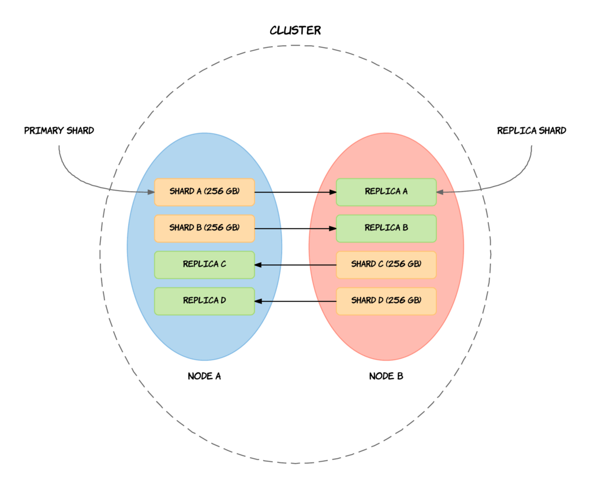
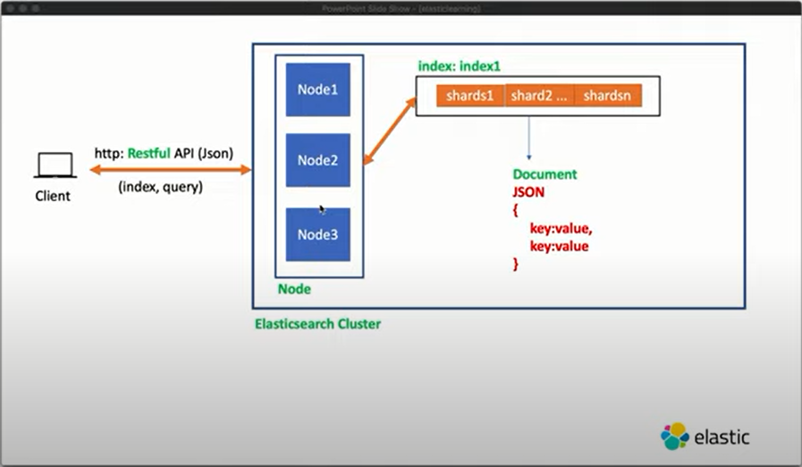
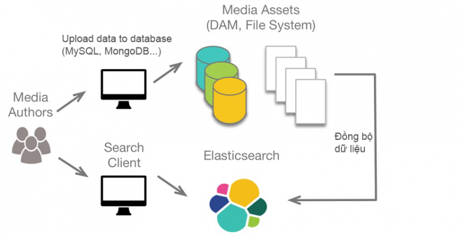
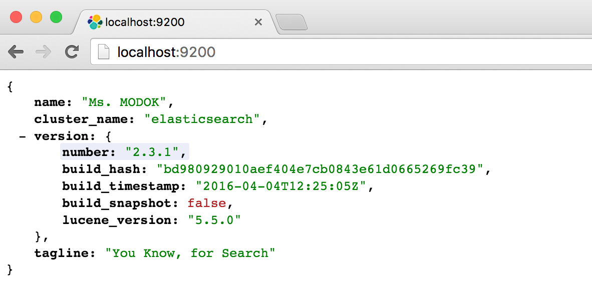
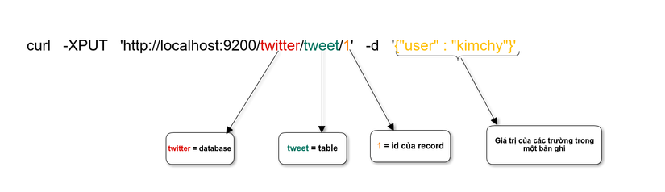

# Overview

##  What is Elasticsearch and related concepts

### Elasticsearch

`Elasticsearch` - ES: là một `search engine` và là một `Distributed Architecture`, có khả năng mở rộng `Designed for Scaling`- lắp thêm node cho nó là nó auto horizontal scalability. Elasticsearch là một open source được phát triển bằng Java và được kế thừa từ `Lucene Apache` - phần mềm tìm kiếm và trả về thông tin (`information retrieval software`) lĩnh vực `full text indexing and searching`.

Tóm lại, Elasticsearch là `document oriented database`,nhiệm vụ của nó chính là store và retrieve document. Trong ES, tất cả các document được hiển thị bằng JSON format. Nếu ta đã từng sử dụng `MongoDB`, nghĩa là ta sẽ quen với `JSON storage service`. Nhưng điều làm cho ES thực sự đặc biệt chính là nhờ vào việc tìm kiếm thông tin cực nhanh và cả khả năng phục hồi thông tin của nó. Sự kết hợp của `storage` và `querying`/`aggregation` service mà mình sẽ tìm hiểu trong các module sau làm cho ES thực sự đặc biệt và khác xa 1 công cụ chỉ lưu trữ, tìm kiếm văn bản thông thường.
### Elastic Stack

Elasticsearch là thành phần cốt lõi của `Elastic Stack`. Elastic Stack là một bộ các công cụ open source để thu thập dữ liệu, làm đa dạng dữ liệu, lưu trữ, phân tích và trực quan hóa dữ liệu. 

`Elastic Stack `thường được gọi là `ELK Stack` - `Elasticsearch`, `Logstash` và `Kibana`. Trong đó `Logstash` đóng vai trò `Tranform - Process` data, `Elasticsearch` đóng vai trò `Search - Analyze - Storage` data,  và `Kibana` là `Visualize & Manage`. Ngoài 3 thành phần này, ELK Stack còn bao gồm một loạt các agent dùng để `Collect` data, gọi chung là `Beats`, thu thập data xong sẽ gửi data đến ELK Stack.

### Basic Architecture of ElasticSearch

#### Cluster

`Cluster` là một tập hợp các `node` - nơi lưu trữ toàn bộ dữ liệu, thực hiện đánh index và search giữa các node. Một cluster được xác định bằng 1 `unique name`. Nếu như các cluster có tên trùng nhau sẽ dẫn tới hiện tượng các node join nhầm cluster. Do vậy nên tên của cluster phải là `unique`. Chẳng hạn: các cluster trên các môi trường `dev`, `staging` và `production` có thể được đặt tên là `logging-dev`, `logging-stage`, và `logging-prod` thay vì để tên giống nhau là `logging`. Việc đặt tên như vậy sẽ giúp tránh được việc Node thuộc môi trường product join nhầm Cluster trên môi trường dev.

#### Node

Mỗi `Node` là 1 server bên trong Cluster, là nơi lưu trữ dữ liệu, tham gia thực hiện việc đánh `index` của cluster, và thực hiện search. Cũng như cluster, mỗi node được xác định bởi 1 `unique name` của cluster đó. Unique Name này mặc định là 1 chuỗi random UUID ( Universally Unique IDentifier, một trình tạo ID duy nhất) và được gán giá trị ngay khi node được start up.

Có 3 loại Node phổ biến là:

- `Master Node`: Kiểm soát Cluster và chịu trách nhiệm, quản lý tất cả các operations trên toàn cluster như thêm, xóa index hay thêm, xóa các node.

- `Data Node`: Lưu trữ dữ liệu và thực hiện các operations liên quan đến dữ liệu như tìm kiếm và tổng hợp.

- `Client Node`: Chuyển tiếp các `cluster requests` tới `master node` và các `data-related requests`  tới các `data nodes`.

Ngoài ra còn có:

- `Ingest Node` hỗ trợ thực hiện hoạt động xử lý các documents trước khi quá trình index bắt đầu.

- `Tribe Node` Hoạt động với chức năng như một Client Node, có khả năng giao tiếp với rất nhiều ES Cluster khác nhau để thực hiện các thao tác tìm kiếm hoặc các behavior liên quan đến dữ liệu.

#### Document

`Document` là 1 đơn vị cơ bản nhất để có thể đánh index. Và cũng có thể coi nó tương tự Rows (hay Record) trong Sql hay Document trong MongoDB. Trong Elasticsearch, Document được lưu dưới dạng JSON.

#### Index

`Index` là 1 nơi chứa các `Document` liên quan tới nhau. Hiểu nôm na `Index` là nơi lưu trữ và thao tác với dữ liệu khi cần. Thay vì index theo từng đơn vị row (document) giống như mysql chẳng hạn, thì nó sẽ biến thành index theo đơn vị `term`. Ví dụ với `Inverted index` là một cấu trúc dữ liệu của Index nhằm mục đích map giữa `term` và các document chứa `term` đó. 

#### Shard

`Shard` là tập con các `documents` của 1 `Index`. Một Index có thể được chia thành nhiều shard. Mỗi Node bao gồm nhiều Shard. Vì thế Shard là đối tượng nhỏ nhất, hoạt động ở mức thấp nhất, đóng vai trò lưu trữ dữ liệu.

Ta gần như không bao giờ làm việc trực tiếp với các Shard vì Elasticsearch đã support toàn bộ việc giao tiếp cũng như tự động thay đổi các Shard khi cần thiết.

Có 2 loại Shard là : 

- `Primary Shard` là nơi lưu trữ dữ liệu và đánh index. Sau khi đánh xong dữ liệu sẽ được ship tới các Replica Shard.
Mặc định của Elasticsearch là mỗi index sẽ có 5 Primary shard và với mỗi Primary shard thì sẽ đi kèm với 1 Replica Shard.

- `Replica Shard`: là nơi lưu trữ dữ liệu nhân bản của Primary Shard. Replica Shard có vai trò đảm bảo tính toàn vẹn của dữ liệu khi Primary Shard xảy ra vấn đề và giúp tăng tốc độ tìm kiếm.

#### Mapping

`Mapping` là quá trình xử lý cách mà các `Document` sẽ được index và lưu trữ như thế nào. `Mapping` giúp chúng ta cùng lúc khởi tạo 1 field & định nghĩa các field đó được index.

#### Type

Một `Type` gần giống như 1 Table trong database. Mỗi `type` có 1 danh sách các `Field` được chỉ định cho `Documents` của `type` đó.
 
#### Field

`Field` tương tự như 1 Column của Table trong database. Trong ES, Field được lưu dươi dạng `key-value pair`. Value có thể là 1 giá trị như string, integer, date, hay có thể là 1 cấu trúc lồng nhau như array hay object dùng để lưu cái type of filed, và mỗi value đó sẽ được gán một key tương ứng.
 

## Why uses it? 

Elasticsearch hoạt động như 1 web server, có khả năng tìm kiếm nhanh chóng (near realtime) thông qua giao thức RESTful, có khả năng phân tích và thống kê dữ liệu, phù hợp với tất cả các loại dữ liệu, bao gồm văn bản, số, không gian địa lý, dữ liệu có cấu trúc và không cấu trúc.

Elasticsearch hoạt động dựa trên các bước cơ bản sau: Đầu tiên, dữ liệu sẽ được gửi đến data center của Elasticsearch, sau đó nó sử dụng Controller để phân đoạn dữ liệu và lưu lại kết quả phân đoạn này cùng với dữ liệu của nó. Tiếp theo các kết quả này sẽ được `ranking` theo các trọng số, sau đó Elasticsearch trả về kết quả cho user dựa trên cái ranking này.

Với bản chất là một database đặc biệt như vậy, điều quan trọng ta cần biết đó là khi nào thì nên sử dụng ElasticSearch? Ta không nên chuyển đổi từ SQL database sang ES. Chúng có những mục đích khác nhau và mỗi cái đều có ưu và nhược điểm riêng. Một số trường hợp nên sử dụng ES như sau:

Tìm kiếm text thông thường - Searching for pure text (textual search)
Tìm kiếm text và dữ liệu có cấu trúc - Searching text and structured data (product search by name + properties)
Tổng hợp dữ liệu - Data aggregation
Tìm kiếm theo tọa độ - Geo Search
Lưu trữ dữ liệu theo dạng JSON - JSON document storage

ES không mạnh trong các thao tác CRUD, nên thường sẽ dùng song song với 1 DB chính. Nguồn dữ liệu mà ES có thể phân tích được lấy từ Database như: MSSQL, MySQL, PostgreSQL, … mà cũng có thể là các bản text, gmail, pdf, ... miễn sao nó là dữ liệu dưới dạng văn bản là được.

Elasticsearch chạy trên server riêng biệt phục vụ việc tìm kiếm, phân tích dữ liệu. ES sẽ listen một port (dưới local default là 9200) đồng thời giao tiếp với các API của app thông qua RESTful, do vậy nên nó không phụ thuộc vào client viết bằng gì, hệ thống hiện tại viết bằng gì. Nên việc tích hợp nó vào hệ thống bạn là dễ dàng, bạn chỉ cần gửi request http lên là nó trả về kết quả.

### Advantage

Một số tính năng đặc trưng, ưu điểm của Elasticsearch:

- `Near Real Time (NRT) search`: Điều đầu tiên là tốc độ. ES có perfomance rất tốt. Nó được xây dựng trên Lucene và khả năng mở rộng truy vấn song song bên trong một cluster rất tốt (spanning queries in parallel inside a cluster). Elasticsearch trả về giá trị rất nhanh, gần như realtime vì chỉ cần search 1 term là có thể trả về các giá trị liên quan tới term đó.

- `Full text search`: Elasticsearch sẽ thực hiện việc phân tách các từ, các câu để map với dữ liệu. Ví dụ đơn giản, muốn tìm kiếm các sinh viên có tên như `Nam`, `Bình`, `An`, ta chỉ cần search `nam binh an` là đã có một list danh sách đủ các sinh viên có tên như trên. Elasticsearch sẽ phân tích điều kiện search vừa nhập, tách từng từ một và sau đó mang từ vừa tách để map với tên sinh viên trong cơ sở dữ liệu.

- `Fuzzy Search`: Hỗ trợ Fuzzy Search, tức là từ khóa tìm kiếm có thể bị sai lỗi chính tả hay không đúng cú pháp thì vẫn có khả năng elasticsearch trả về kết quả tốt.

- `Sorted queries`: ElasticSearch có thể sắp xếp kết quả truy vấn theo `Relevance` (sự liên quan). Theo mặc định, ES sử dụng thuật toán TF/IDF tương tự để tính toán `relevance score` và sort các document theo cái score này để cho ra search results tốt nhất có thể. Sẽ có 1 module tìm hiểu kỹ về phần này.

- `Data Analysis and Management` Có khả năng phân tích dữ liệu, quản lý dữ liệu - `Data Analysis and Management` và có thể tạo ra số liệu thống kê tổng hợp - `Aggregate statistics`.

- `High Availability`: Elasticsearch có thể quản lý, sao chép dữ liệu, nó có nhiều bản sao dữ liệu (replica) trong 1 Cluster, khi một data bị stop, shutdown sẽ có một replica của data đó được active để thay thế cho data bị stop đó liền.

- `Query DSL - Domain Specific Language`: Elasticsearch cung cấp một JSON interface để định nghĩa các truy vấn. Nhờ đó ta có thể viết các truy vấn phức tạp với tốc độ thực hiện nhanh chóng.

- `Schemaless (Schema-Free)`: Các fields trong schema database không cần define trước. Khi lập index cho dữ liệu, Elasticsearch có thể tự động tạo schema khi chạy luôn.

### Disadvantage

ElasticSearch phù hợp trong việc tìm kiếm và tổng hợp data, nhưng nếu bạn đang sở hữu môi trường thường xuyên ghi dữ liệu (`writing operations environment`), ES có thể sẽ không phải lựa chọn tốt nhất.

Nhược điểm của elastic search

- Elasticsearch được thiết kế cho mục đích tìm kiếm và tổng hợp data, vì vậy trong `writing operations environment` - môi trường thường xuyên ghi dữ liệu như CRUD operations thì elasticsearch kém thế hơn so với những database khác như Mongodb, Mysql …. Do vậy người ta ít khi dùng elasticsearch làm database chính, mà thường kết hợp nó với 1 database khác.

- Trong elasticsearch không có khái niệm `database transaction`, tức là nó sẽ không đảm bảo được tính toàn vẹn dữ liệu trong các CRUD operations. Mà đã cần CRUD operations và không dựa vào elasticsearch như nơi lưu trữ dữ liệu chính (primary data storage) thì thôi dùng database driver thông thương luôn chứ dùng Elasticsearch làm gì, nên việc không có database transaction không phải vấn đề lớn trong Elasticsearch. Tóm lại, Elasticsearch không nên dùng làm primary database storage.

- Elasticsearch chỉ thực sự phù hợp và hữu ích khi bạn chỉ sử dụng nó đúng với mục đích search engine. Nếu biến Elasticsearch trở thành một data store và data trong store luôn được cập nhật liên tục thì Elasticsearch sẽ không phải là công cụ phù hợp nữa. Vậy nên, nếu bạn sử dụng Elasticsearch song song với một database thực hiện lưu trữ dữ liệu thì CRUD không còn là vấn đề của Elasticsearch nữa.

&rarr; Sử dụng đúng mục đích, đúng trường hợp mới thấy được Elasticsearch thực sự là công cụ hữu ích.

## Reference

1. [ELK Stack Tutorial - guru99](https://www.guru99.com/elk-stack-tutorial.html)

2. [Understanding Replication in Elasticsearch](https://codingexplained.com/coding/elasticsearch/understanding-replication-in-elasticsearch)

3. [An Overview on Elasticsearch and its usage - towardsdatascience](https://towardsdatascience.com/an-overview-on-elasticsearch-and-its-usage-e26df1d1d24a)

4. [Introduction to ElasticSearch - blog.knoldus](https://blog.knoldus.com/introduction-to-elasticsearch-2/)

5. [Elasticsearch Tutorial - sematext.com](https://sematext.com/guides/elasticsearch/#:~:text=Elasticsearch%20takes%20in%20unstructured%20data,data%20in%20near%20real%20time.)

6. [elk-stack-logging - toidicodedao.com](https://toidicodedao.com/2018/03/20/elk-stack-logging/)