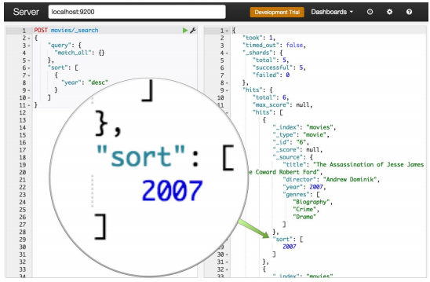

# Queries / Sort

## Concepts

Elasticsearch có thể sắp xếp kết quả truy vấn theo `Relevance` (sự liên quan). Theo mặc định, ES sử dụng thuật toán `TF/IDF` để tính toán `relevance score` và sort các document theo cái score này để cho ra search results tốt nhất có thể. Có hai khái niệm ta sẽ tìm hiểu là:

- `Queries`: Khái niệm Queries trong `database query` là truy vấn thông tin trích xuất từ một database, dùng để thực hiện các thao tác `data manipulation`. Trong Elasticsearch, Queries 
có cách thức hoạt động khác so với database query thông thường, dựa trên `Query DSL` do Elasticsearch cung cấp dựa trên JSON để định nghĩa các Queries, tuy nhiên mục tiêu chung của các Queries này vẫn là thao tác, truy vấn, trích xuất thông tin, dữ liệu.

- `Sort`: Elasticsearch tiến hành sort các document để tiện cho việc Queries và return về search results. ES sort dựa trên các special field như `_score` để sort theo score và `_doc` để theo index.
## Queries


### Lucene Query Syntax

Khác với Queries trong `database query`, Queries trong Elasticsearch sử dụng `Lucene Query Syntax` thay vì `SQL Query Syntax` vì Elasticsearch là một phần của ELK Stack và được xây dựng dựa trên `Lucene`. Biết được syntax và operators của Lucene sẽ giúp ta build các Queries, sử dụng nó trong query string sẽ đơn giản và tiêu chuẩn, xem thêm tại [Lucene Query](https://www.elastic.co/guide/en/kibana/current/lucene-query.html)
### The Query DSL

Elasticsearch định nghĩa [Query DSL](https://www.elastic.co/guide/en/elasticsearch/reference/current/query-dsl.html) như sau:

???+ info "Query DSL"

    Elasticsearch provides a full Query DSL (Domain Specific Language) based on JSON to define queries. Think of the Query DSL as an AST (Abstract Syntax Tree) of queries, consisting of two types of clauses:

    - Leaf query clauses: Leaf query clauses look for a particular value in a particular field, such as the match, term or range queries. These queries can be used by themselves.
    - Compound query clauses: Compound query clauses wrap other leaf or compound queries and are used to combine multiple queries in a logical fashion (such as the bool or dis_max query), or to alter their behaviour (such as the constant_score query).

Theo đó, Elasticsearch cung cấp một bộ `Query DSL` - [Domain Specific Language](https://en.wikipedia.org/wiki/Domain-specific_language) dựa trên JSON để định nghĩa các queries. Có thể coi Query DSL là một `AST` - [Abstract Syntax Tree](https://en.wikipedia.org/wiki/Abstract_syntax_tree) của các queries, nó gồm hai loại mệnh đề:

- `Leaf query clauses`: Những mệnh đề này tìm những giá trị cụ thể của từng field cụ thể. Ví dụ như các truy vấn `match`, `term` và `range`.

- `Compound query clauses`: Những mệnh đề này kết hợp các `leaf query` và các `compound query` để thu được kết quả mong muốn.
### Query context and Filter context

Các `query clauses` kể trên sẽ hoạt động theo các cách khác nhau, tùy thuộc vào nó được sử dụng trong `query context` hay `filter context`.

#### Query context

Một `query clauses` được sử dụng trong `query context` sẽ trả lời câu hỏi **How well does this document match this query clause?**. Bên cạnh việc xác định xem document có phù hợp với truy vấn hay không thì `query clauses` sẽ tính thêm giá trị `_score` - giá trị của `_score` thể hiện mức độ phù hợp của document.

Query context sẽ có hiệu lực khi `query clauses` được truyền vào tham số `query` trong `Search APIs`.

#### Filter context

Trong `filter context`, một `query clauses` trả lời câu hỏi **Does this document match this query clause?**. Câu trả lờichỉ là `yes or no`, giá trị `_score` không được tính.

Filter context sẽ có hiệu lực khi `query clauses` được truyền vào tham số `filter` hay `must_not`.


*ghé đây để xem thêm ví dụ về [Query and Filter context](https://www.elastic.co/guide/en/elasticsearch/reference/6.8/query-filter-context.html)*

### Types of queries

Query Name | Descriptions | Queries in this group
------ | ------ | ------
Compound queries | Một Compound queries có thể bọc các compound queries hoặc leaf queries khác để kết hợp tất cả các kết quả và scores, có thể thay đổi behaviour của chúng hoặc để chuyển từ query context sang filter context | `bool` - default, `boosting`, `constant_score`, `dis_max`, `function_score`
Full text queries | Cho phép bạn tìm kiếm các [analyzed text fields](https://www.elastic.co/guide/en/elasticsearch/reference/current/analysis.html), chẳng hạn như nội dung của email. Việc query string sẽ được xử lý cùng một analyzer với quá trình indexing | `intervals`, `match`, `match_bool_prefix`, `match_phrase`, `match_phrase_prefix`, `multi_match`, `combined_fields`, `query_string`, `simple_query_string`
Geo queries | Queries dựa trên 2 loại geo data types trong Elasticsearch: `geo_point` và `geo_shape` | `geo_bounding_box`, `geo_distance`, `geo_polygon`, `geo_shape`
Shape queries | Queries tương tự như `geo_shape`, dùng cho việc queries các shape objects như virtual worlds, sporting venues, theme parks, và CAD diagrams.  | `shape`
Joining queries | Việc thực hiện các phép join theo SQL-style trong một hệ thống phân tán như Elasticsearch rất tốn kém. Thay vào đó, Elasticsearch cung cấp hai hình thức join được thiết kế theo kiểu scale horizontally, gọi chung là | `nested` và `has_child`/`has_parent`
Match all | Queries đơn giản nhất, phù hợp với tất cả các document, gán cho tất cả các document `_score` là 1,0 | `match_all`, `match_none`
Span queries | Là các `low-level positional queries`, thường được sử dụng để thực hiện các truy vấn cụ thể, chi tiết về các document | `span_containing`, `span_field_masking`, `span_first`, `span_multi`, `span_near`, `span_not`, `span_or`, `span_term`, `span_within`
Term-level queries | Queries dùng để tìm documents dựa trên các `precise values` trong các `structured data` như date ranges, địa chỉ IP, giá, tiền tệ hay mã sản phẩm v.v. Không giống như `full-text queries`, Term-level queries không dùng analyzer. Thay vào đó, term-level queries sẽ thực hiện query theo cụm từ, và Term level queries chỉ thực hiện được trên các field có type là keyword. | `exists`, `fuzzy`, `ids`, `prefix`, `range`, `regexp`, `term`, `terms`, `terms set`, `type`, `wildcard`
Specialized queries | Nhóm này chứa các queries đặc biệt, không xếp vào các groups trên | `distance_feature`, `more_like_this`, `percolate`, `rank_feature`, `script`, `script_score`, `wrapper`, `pinned`

## Sort


### Concepts

Elasticsearch định nghĩa [Sort](https://www.elastic.co/guide/en/elasticsearch/reference/current/sort-search-results.html) như sau:

???+ info "Sort"

    Allows to add one or more sort on specific fields. Each sort can be reversed as well. The sort is defined on a per field level, with a special field name for _score to sort by score, and _doc to sort by index order.

[Sort](https://www.elastic.co/guide/en/elasticsearch/reference/6.8/search-request-sort.html) hay trong ES V7.0+ gọi là [Sort search results](https://www.elastic.co/guide/en/elasticsearch/reference/current/sort-search-results.html) cho phép ta thêm một hoặc nhiều loại sort trên các field cụ thể của document. Sort được xác định trên các field level, với tên field đặc biệt cho `_score` để sắp xếp theo `score` và `_doc` để sắp xếp theo thứ tự lập index.

### Elasticsearch Sorting

Để sort theo mức độ liên quan chúng ta cần biểu thị mức độ liên quan dưới dạng một giá trị. Trong Elasticsearch, sort sẽ dựa trên `relevance score` - biểu thị bằng số floating-point được search results trả về như `_score`, mặc định ES sẽ sort `_score` này theo thứ tự giảm dần. 



#### Sort Values

Trong trường hợp có các search results có cùng `_score`, khi đó các search results này đều phù hợp với truy vấn, khi đó ES sẽ tiến hành sort dựa trên `IDs` để phân biệt chúng hoặc một hay nhiều `Sort Values` mà mình chỉ định. Ngoài ra, khi ta không muốn chỉ sort theo `_score`, ta có thể cho Elasticsearch biết cách sắp xếp results bằng cách thêm `sort property` vào request body. Giá trị của `sort property` này được định nghĩa dưới dạng JSON objects. Ví dụ:

```json
GET /my-index-000001/_search
{
  "sort" : [
    { "post_date" : {"format": "strict_date_optional_time_nanos"}}
  ],
  "query" : {
    "term" : { "user" : "kimchy" }
  }
}
```

#### Sort Order

Ví dụ với dạng đơn giản nhất, một objects trong sort array là một objects có một property duy nhất có tên trùng với field cần sắp xếp và có giá trị là thứ tự sắp xếp, `asc` để sắp xếp tăng dần còn `desc` để sắp xếp giảm dần. Khi đó, một request `Tìm tất cả các phim MỚI NHẤT ra mắt từ năm 2000` - ES sẽ tiến hành search mọi thứ trong index `movie` và sắp xếp kết quả dựa trên thuộc tính `year` theo thứ tự giảm dần.

```json
curl -XPOST "https://localhost:9200/movies/_search" -d'
 {
 "query": {
 "match_all": {}
 },
 "sort": [
 {
 "year": "desc"
       }
    ]
 }'
```
#### Sort mode option 

ElasticSearch hỗ trợ các Sort mode option phổ biến để queries ra được special values như `min`, `max` để tìm `_score` lớn nhất/nhỏ nhất, tương tự với `sum`, `avg`, `median`. Nếu dùng sort mode options thì default là `min`.

Ngoài các cách thức sort kể trên, ES còn hỗ trợ rất nhiều kiểu sort tương ứng với các data types trong Elasticserach như `Sorting numeric fields` để sort các fields có data types là numeric, tương tự với `Sorting within nested objects`, `Geo Distance Sorting`, v.vv. Xem thêm tại [Sort search results](https://www.elastic.co/guide/en/elasticsearch/reference/current/sort-search-results.html)

## Reference

1. [Query DSL - elastic document ](https://www.elastic.co/guide/en/elasticsearch/reference/current/query-dsl.html)

2. [23 Useful Elasticsearch Example Queries - dzone.com](https://dzone.com/articles/23-useful-elasticsearch-example-queries)

3. [Elasticsearch Queries: A Guide to Query DSL - logz.io](https://logz.io/blog/elasticsearch-queries/)

4. [Learn Elasticsearch Sorting - mindmajix.com](https://mindmajix.com/elasticsearch/sort-the-results-using-a-sort-property)

5. [Sort search results - Elasticsearch documents v7.17-current](https://www.elastic.co/guide/en/elasticsearch/reference/current/sort-search-results.html)

6. [Sort - Elasticsearch documents v6.8](https://www.elastic.co/guide/en/elasticsearch/reference/6.8/search-request-sort.html)