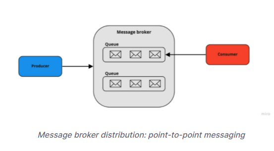

# Message-Brokers
- Overview
- Advantages and Disadvantages of using Message broker
- Use case

## Overview

- `Message broker` - còn gọi là `integration broker` hoặc `interface engine`: Là một mô hình kiến trúc `(architentural pattern`), đóng vai trò là trung gian giữa các ứng dụng với nhau, làm nhiệm vụ kiểm tra, trung chuyển và điều hướng message từ bên gửi đến bên nhận, tối giản hóa giao tiếp giữa các ứng dụng.

- `Message broker` có thể xác nhận, lưu trữ, định tuyến và gửi message đến các `target` thích hợp. Chúng đóng vai trò trung gian giữa các ứng dụng khác, cho phép người gửi đưa ra message mà không cần biết người nhận đang ở đâu, có bao nhiêu người nhận và có đang hoạt động hay không . Điều này tạo điều kiện thuận lợi cho việc tách các quy trình và dịch vụ trong hệ thống.

- `Message Broker pattern sequence diagram`:

    

    + `Service1` và `Service2` không bị phụ thuộc với nhau, giao tiếp trung gian qua Broker nên dù có khác nhau về kiến trúc, công nghệ v.vv thì vẫn giao tiếp được. `Service1` chỉ việc gửi message đến proxy, rồi từ đó proxy sẽ forward message đến `Broker`. Rồi từ đó `Broker` sẽ forward message đến `Service2`.

    + Có thể setup cơ chế bất đồng bộ (`asynchronous`): Đảm bảo các message sẽ được gửi một lần duy nhất, cho phép các hệ thống tiếp tục hoạt động khi gặp tình trạng độ trễ cao hoặc kết nối không liên tục. 

## Message broker models

Message broker cung cấp hai kiểu mô hình phân phối message cơ bản:

- `Point-to-point messaging`: Đây là dạng mô hình phân phối message sử dụng trong hàng đợi `queue`, có mối quan hệ `1-1` giữa người gửi và người nhận. Mỗi message trong `queue` chỉ được gửi đến `một người nhận` và chỉ được `sử dụng một lần`. Dùng trong các trường hợp `giao dịch tài chính`, cả người gửi và người nhận đều cần đảm bảo mỗi giao dịch chỉ được gửi một lần duy nhất.

- `Publish/subscribe messaging`: Mô hình phân phối message này tương tự Pub/Sub trong Redis, `publisher` sẽ xuất bản các message theo dạng `topic` và `subscriber` sẽ đăng ký các message họ cần nhận dựa trên các `topic` này.

- Từ 2 mô hình trên, ta đúc kết lại một `Message Broker` có 4 components:

    + `Producer` - `Publishers` – Nơi gửi message.

    + `Consumer` – `Subscribers` - Nơi nhận message

    + `Queue` - `Topic` – Là một folder trong filesystem. `Message broker` dùng nó để quản lý, phân phối `messages`.

    + `Messages` - Có thể là content trong headers hay metadata. hoặc message body content như binary, JSON, XML, plain text v.vvvv

## Advantages and Disadvantages of using Message broker

### Advantages

- Cung cấp một communication giữa các services mà không cần các services này phải chạy cùng một thời điểm với nhau.

- Cải thiện hiệu suất hệ thống bằng cách xử lý bất đồng bộ. Các tác vụ tiêu tốn nhiều tài nguyên có thể được phân phối cho các quy trình xử lý riêng biệt, tăng tốc độ response của ứng dụng và tăng trải nghiệm người dùng.

- Tăng độ tin cậy bằng cách đảm bảo việc truyền tải message là bảo mật. Ngoài ra Message brokers cung cấp cơ chế `dead-letter mechanism`, trong trường hợp lỗi của người nhận, nó có thể gửi lại message ngay lập tức hoặc sau một thời gian nhất định và cũng hỗ trợ định tuyến các message không được gửi.

### Disadvantages

Tăng độ phức tạp của hệ thống và Debugging trở nên khó khăn hơn. 

## Common Use Case

### Long-running tasks and crucial API

Một số API có các actions  tốn thời gian và tài nguyên mà không yêu cầu response lại kết quả lập tức thì có thể dùng `Message Brokers` như một giải pháp tiếp nhận và quản lý, điều phối các request, response giữa API với Consumer của nó.

### Microservices

Trong thực tế, `Message Brokers` giải quyết được khá nhiều vấn đề cho Microservices.

- `Đảm bảo duration/recovery`: Do message đã được `Message Brokers` lưu lại, khi 1 service đang xử lý nhưng bị crash hoặc lỗi, ta không lo bị mất dữ liệu vì có thể lấy message từ `Message Brokers` ra và chạy lại. Trong 1 hệ thống Microservices sẽ có nhiều Consumer, nếu 1, 2 consumer bị crash cũng không làm sụp toàn hệ thống

- `Phân tách hệ thống`: Giúp phân tách hệ thống thành nhiều service nhỏ hơn, mỗi service chỉ xử lý 1 chức năng nhất định 

- `Hỗ trợ rate limit, batching`: Trong nhiều trường hợp, năng lực xử lý hệ thống có hạn. Với `Message Brokers`, ta có thể dần dần lấy message trong `Message Brokers` ra xử lý mà không sợ tình trạng nhận nhiều message quá bị quá tải.

- `Dễ scaling hệ thống`: Vào giờ cao điểm, nhiều truy vấn, ta có thể tăng số lượng consumer lên để xử lý được nhiều messege hơn. Khi không cần ta có thể giảm lại.

### More

- `Mobile applications` 
- `Transactional systems`
- `Controlling data feeds `
## Reference

1. [Message Brokers - IBM](https://www.ibm.com/cloud/learn/message-brokers)

2. [message-broker - tsh Blog](https://tsh.io/blog/message-broker/)
