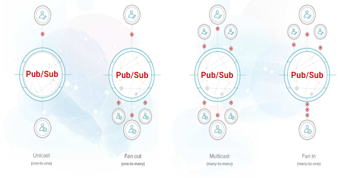
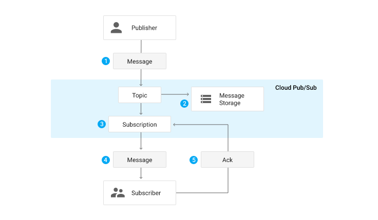
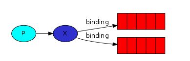
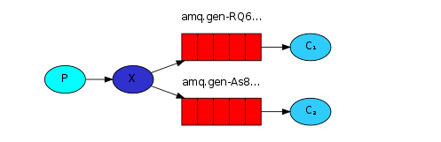

# Publish-Subscriber


Một `message` được gửi tới nhiều `consumer` khác nhau được RabbitMQ phân phối dựa trên `Publish/Subscribe`.

- `Publish/subscribe messaging`: Mô hình phân phối message này tương tự Pub/Sub trong Redis, `Publisher`- `who is the source of data` sẽ xuất bản các message theo dạng `topic` và `Subscriber` - `who is the receiver of data` sẽ đăng ký các message họ cần nhận dựa trên các `topic` này.

## Publishers/Subscribes Relationship



- `One-to-one` hoặc `unicast`: Có thể là mối quan hệ một chiều hoặc hai chiều, ví dụ One-One chat hoặc private chat.

- `One-to-many` hoặc `broadcast`/`fan-out`: Ví dụ Live poll, Radio, v.vv

- `Many-to-many` hoặc `multicast`: Ví dụ như group chat

- `Many-to-one` hoặc `consolidation`/`fan-in`: Ví dụ như Sensor data live poll, audience participation.

## Pub/Sub Message Flow



1. `Publisher` tiến hành tạo một `Topic` tại `Pub/Sub Model` sau đó gửi `messages` tới topic này.

2. Sau đó,  `Message Storage Queue` đảm bảo rằng `published messages` được lưu lại và `depend on` tới `subscribers`, khi nào có `time acknowledgment` thì sẽ tiến hành giải phóng message này khỏi `Message Storage Queue` để `Pub/Sub` gửi đến `Subscriber`.
3. Khi có `time acknowledgment` của một message thì Pub/Sub tiến hành `forwards messages` từ topic đến tất cả subscriptions của message đó.

4. When a subscriber receives a message either by push operation done by Pub/Sub or Subscriber pulling from the service.

4. Message được gửi tới subscriber theo 2 kiểu: Pub/Sub push cái message tới subscriber hoặc subscriber tự pull cái message đó về.

5. Nhận được message rồi thì subscriber gửi một flags `acknowledgment` đến Pub/Sub để Pub/Sub biết rằng message đã được nhận. Khi đó nó sẽ remove cái `acknowledged message` khỏi Message Storage Queue.

## Example

Trong ví dụ về Publish-Subscriber này, ta sẽ xây dựng một hệ thống log đơn giản gồm có 2 thành phần:

- Một chương trình sẽ phát sinh ra log
- Một chương trình để nhận log và in nó ra màn hình.

Tại một thời điểm, chúng ta sẽ tạo ra log và dùng một chương trình để tiếp nhận và ghi ra disk, một máy khác để lấy lại những log và hiển thị nó ra màn hình.

Các bản tin log sẽ được gửi đến tất cả các `consumer`.

## Exchange
Trong ví dụ này, ta dùng `fanout exchange`
``` py
channel.exchange_declare(exchange='logs', type='fanout')
```

Với `fanout`, khi một `message` được gửi đi, nó sẽ đẩy đến tất cả các `queue` hiện có.

``` py
channel.basic_publish(exchange='logs', routing_key='', body=message)
```

## Temporary queues

Các `worker` làm việc với nhau qua cùng một `queue`, vì thế việc đặt tên cho `queue` rất quan trọng, nó giúp chúng ta định hình được công việc mà chúng xử lý.

Trong một số trường hợp , chúng ta muốn lắng nghe tất cả các log `message` hãy làm theo các bước sau:

Đầu tiên, mỗi khi kết nối tới RabbitMQ, chúng ta cần phải làm mới các `queue` và tạo ra một `queue` với tên ngẫu nhiên. Để tạo ra một hàng đợi tạm thời (temporary queues), chúng ta sử dụng code như sau:

``` py
result = channel.queue_declare()
```

Khi thực thi, RabbitMQ sẽ tạo ra 1 `queue` có tên ngẫu nhiên giống như `amq.gen-JzTY20BRgKO-HjmUJj0wLg`

Sau đó, mỗi lần ngắt kết nối `queue` sẽ bị xóa với tùy chọn `exclusive`:

``` py
result = channel.queue_declare(exclusive=True)
```

## Bindings




Ở phần trên, chúng ta đã tạo ra một `exchange` kiểu `fanout` và một `queue`. Bây giờ, chúng ta cần phải "chỉ" cho `exchange` biết phải gửi `message` cho `queue` như thế nào bằng cách dùng `binding`.

``` py
channel.queue_bind(exchange='logs', queue=result.method.queue)
```
Kết quả là implement mô hình `Publish-Subscriber` theo sơ đồ sau:



Chạy chương trình:
```
python emit_log.py
```


Kết quả ghi log:

```
sudo rabbitmqctl list_bindings
# => Listing bindings ...
# => logs    exchange        amq.gen-JzTY20BRgKO-HjmUJj0wLg  queue           []
# => logs    exchange        amq.gen-vso0PVvyiRIL2WoV3i48Yg  queue           []
# => ...done.
```

## Source code

- [emit_log.py](https://github.com/rabbitmq/rabbitmq-tutorials/blob/master/python/emit_log.py)

- [receive_logs.py](https://github.com/rabbitmq/rabbitmq-tutorials/blob/master/python/receive_logs.py)

## Reference

1. [rabbitmq - tutorial-three-python](https://www.rabbitmq.com/tutorials/tutorial-three-python.html)

