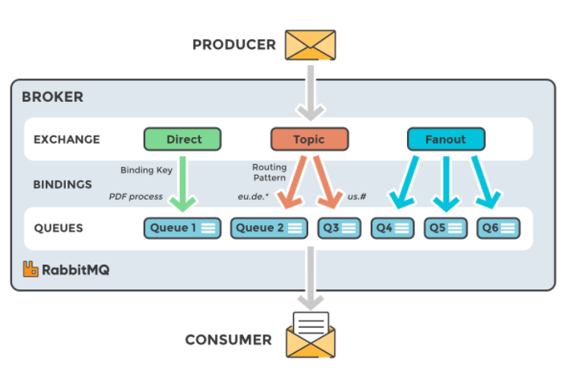
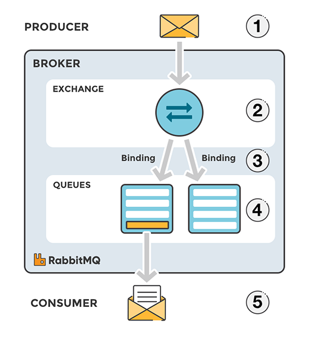

# RabbitMQ
- Overview
- Features
- Message flow in RabbitMQ
- Types of Exchanges

## Overview

- `RabbitMQ` là một distributed `Message broker`, có các đặc trưng như `fast`, `scalable`, và `durable`. RabbitMQ sử dụng giao thức  `AMQP - Advanced Message Queue Protocol`-  một giao thức có dây (wire-protocol), có khả năng biểu diễn các message phù hợp với định dạng dữ liệu, vai trò giao thức trung gian cho việc truyền các gói tin trong Application Layer của mô hình OSI.

- `RabbitMQ` đóng vai trò như một phần mềm trung gian trong việc  trao đổi dữ liệu giữa các `process`, `application`, `system` hoặc `server` với nhau. RabbitMQ sẽ nhận `message` đến từ các thành phần khác nhau trong hệ thống, lưu trữ message an toàn rồi sau đó gửi message đến target. RabbitMQ có thể chạy trên nhiều OS, Cloud và cung cấp một loạt các công cụ dành cho nhà phát triển với hầu hết các ngôn ngữ phổ biến.

- Đây là một architecture cơ bản của message queue.:

    

    + `Producer`: là ứng dụng client, tạo message và publish tới `broker`

    + `Broker` - RabbitMQ: nhận message từ `Producer`, message được đưa vào `Exchange` để định tuyến nó đến 0 hoặc nhiều `Queue` dựa trên các ràng buộc (`binding`) và các khóa định tuyến (`routing key`).

    + `Consumer`: là ứng dụng client khác, kết nối đến `queue`, `subscribe` và `consume` message.

## Features

- `Transparency`: Một `Producer` không cần phải biết `Consumer`. Nó chỉ việc gửi `message` đến các `queue` trong `Message broker`. `Consumer` chỉ việc đăng ký nhận message từ các queue này.

- `Many Client`: Vì `Producer` giao tiếp với `Consumer` trung gian qua `Message broker` nên dù `Producer` và `Consumer` có khác biệt nhau về ngôn ngữ thì giao tiếp này vẫn ok. Hiện nay `RabbitMQ` đã hỗ trợ rất nhiều ngôn ngữ khác nhau.

- `Asynchronous`: `Producer` không cần biết khi nào `message` đến được `Consumer` hay khi nào `message` được `Consumer` xử lý xong. Đối với `Producer`, việc push `message` đến `Message broker `là xong việc của nó. `Consumer` sẽ pull cái `message` về khi nó cần hoặc được RabbitMQ gửi cho nó tại một thời điểm cụ thể nào đó, gọi là `time acknowledgment`. Đặc điểm này có thể được tận dụng để xây dựng các hệ thống lưu trữ và xử lý log.

- `Flexible Routing`: `message` được routing thông qua `Exchange` trước khi đến `Queue`. `RabbitMQ` cung cấp một số loại `Exchange` thường dùng và ta cũng có thể định nghĩa riêng Exhange để phù hợp với hệ thống của mình.

- `Lightweight`:  Nhẹ, một `single instance` của RabbitMQ chỉ chiếm khoảng 40MB RAM.

- `Multiple message protocol`: AMQP, MQTT, STOMP, HTTP.

- `Cluster`: Ta có thể gom nhiều `RabbitMQ instance` vào một `Cluster`. Một q được định nghĩa trên một `instance`, khi đó đều có thể truy xuất từ các `instance` còn lại. Có thể tận dụng để làm `load balancing`.

- `High availibilty`: Đặc trưng nhất của một Message Broker

- `Reliability`: Có cơ chế `ACK` như của mô hình client-server để đảm bảo message được nhận bởi Consumer đã được xử lý, và lưu trữ (persistence) `message`.

- `Extensibility`: Cung cấp hệ thống plugin linh hoạt, dễ dàng tích hợp các plugin của third party. Ví dụ: plugin lưu message vào cơ sở dữ liệu.

- `Cloud`: Dễ dàng triển khai với hạ tầng hiện có hoặc Cloud.

- `Management & Monitoring`: cung cấp HTTP API, command-line tool và UI để quản lý và giám sát.

- `Tools support`: Hoạt động với các công cụ CI/CD và có thể triển khai với BOSH, Chef, Docker và Puppet.

## Related concepts
Ngoài các khái niệm đã đề cập như `AMQP`, `Producer`, `Consumer`, `Queue`, `Message`, ta còn có một số khái niệm cần biết trước khi tìm hiểu qua cơ chế hoạt động của RabbitMQ:

- `Connection`: Một kết nối TCP giữa ứng dụng và RabbitMQ broker.

- `Channel`: Một kết nối ảo trong một Connection. Việc publishing hoặc consuming message từ một queue đều được thực hiện trên channel.

- `Exchange`: Là nơi nhận message được publish từ Producer và đẩy message vào Queue dựa vào quy tắc của từng loại Exchange. Để nhận được message, queue phải được nằm (binding) trong ít nhất 1 Exchange.

- `Binding`: là quy tắc (rule) mà Exchange sử dụng để định tuyến Message đến Queue. Đảm nhận nhiệm vụ liên kết giữa Exchange và Queue.

- `Routing key`: Một key mà Exchange dựa vào đó để quyết định cách để định tuyến message đến queue. Có thể hiểu nôm na, Routing key là địa chỉ dành cho message.

- `User`: Để có thể truy cập vào RabbitMQ, chúng ta phải có username và password. Trong RabbitMQ, mỗi user được chỉ định với một quyền hạn nào đó. User có thể được phân quyền đặc biệt cho một Vhost nào đó.

- `Virtual host/Vhost`: Cung cấp những cách riêng biệt để các ứng dụng dùng chung một RabbitMQ instance. Những user khác nhau có thể có các quyền khác nhau đối với vhost khác nhau. Queue và Exchange có thể được tạo, vì vậy chúng chỉ tồn tại trong một vhost.

## Message flow in RabbitMQ

1. Producer gửi message đến Broker và message được push thẳng vào Exchange.

2. Sau khi Exchange nhận Message, nó chịu trách nhiệm định tuyến message. Exchange sẽ chịu trách nhiệm về các thuộc tính của Message, ví dụ `routing key`, `type of Exchange`.

3. Việc binding phải được tạo từ Exchange đến Queue (hàng đợi). Trong trường hợp này, ta sẽ có hai binding đến hai hàng đợi khác nhau từ một Exchange. Exchange sẽ định tuyến Message vào các hàng đợi dựa trên thuộc tính của của từng Message.

4. Các Message nằm ở hàng đợi đến khi chúng được xử lý bởi một Consumer.

5. Consumer xử lý Message nhận từ Queue.

## Types of Exchanges

Có 4 loại Exchange: `Direct`, `Fanout`, `Topic`, `Headers`. Việc lựa chọn các `exchange type` khác nhau sẽ dẫn đến các xử lý khác nhau của message broker với message nhận được từ producer. Exchange sẽ được binding đến một số Queue nhất định.

- `Direct Exchange`: Tên mặc định là Empty string - Default Exchange hoặc `amq.direct`. Định tuyến message đến Queue dựa vào routing key. Thường được sử dụng cho việc định tuyến tin nhắn unicast-đơn hướng (mặc dù nó có thể sử dụng cho định tuyến multicast-đa hướng) và hữu ích khi muốn phân biệt các thông báo được publish cho cùng một exchange bằng cách sử dụng một mã định danh chuỗi đơn giản.

- `Fanout Exchange` - `amq.fanout`: Fanout exchange định tuyến message (copy message) tới tất cả queue mà nó được bind, với bất kể một routing key nào. Giả sử, nếu nó N queue được bind bởi một Fanout exchange, khi một message mới published, exchange sẽ định tuyến message đó tới tất cả N queues. Fanout exchange được sử dụng cho định tuyến message broadcast. 

- `Topic Exchange` - (Publish/Subscribe): Topic exchange định tuyến message tới một hoặc nhiều queue dựa trên sự trùng khớp giữa routing key và pattern. Topic exchange thường sử dụng để thực hiện định tuyến thông điệp multicast.

- `Headers Exchange`: Header exchange được thiết kế để định tuyến với nhiều thuộc tính, để dàng thực hiện dưới dạng header của message hơn là routing key. Header exchange bỏ đi routing key mà thay vào đó định tuyến dựa trên header của message. Headers Exchange rất giống với Topic Exchange, nhưng nó định tuyến dựa trên các giá trị header thay vì routing key.

Ngoài `Exchange type`, Exchange còn định nghĩa một số thuộc tính:

- `Name`: tên Exchange.
- `Durability`: thời gian tồn tại khi broker restart
- `Auto-delete`: Exchange sẽ bị xóa khi không còn Queue binding từ nó nữa
- `Arguments`: Các tham số không bắt buộc, được sử dụng bởi các plugin và các tính năng dành riêng cho broker.

## Reference

1. [AMQP concepts](https://www.rabbitmq.com/tutorials/amqp-concepts.html)

2. [RabbitMQ - features](https://www.rabbitmq.com/features.html)

3. [RabbitMQ for beginners](https://www.cloudamqp.com/blog/part1-rabbitmq-for-beginners-what-is-rabbitmq.html)

4. [RabbitMQ Overview](https://docs.informatica.com/integration-cloud/cloud-application-integration/current-version/rabbitmq-connector-guide/introduction-to-rabbitmq-connector/rabbitmq-overview.html#:~:text=RabbitMQ%20is%20a%20distributed%20message,the%20messages%20to%20different%20queues.)