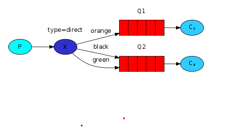
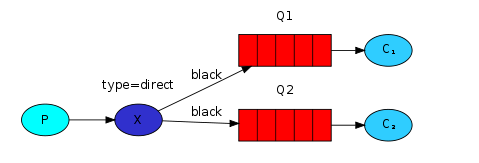

# Routing

## Bindings

Trong các bài trước, chúng ta đã đề cập và sử dụng đến `binding` với dòng code:

```python
channel.queue_bind(exchange=exchange_name, queue=queue_name)
```

`Binding` là một mối quan hệ giữa `exchange` với `queue`. Nó được hiểu đơn giản là một `queue` lắng nghe các `message` từ một `exchange` nào đó.

Các `binding` có thể được bổ sung thêm tham số `routing_key`. Để tránh rối rắm với tham số `basic_punlish`, chúng ta sẽ gọi nó là một khóa `binding`. Để tạo nó, chúng ta sử dụng code:

```python
channel.queue_bind(exchange=exchange_name, queue=queue_name, routing_key='black')
```

Việc sử dụng một khóa `binding` cũng phụ thuộc phần lớn vào type của `exchange` đang dùng. Với kiểu `fanout`, chúng sẽ không để tâm đến chuyện này (binding keys).

## Direct exchange

Với ví dụ ở phần trước, chúng ta đã xây dựng một hệ thống thu thập log của *producer* và gửi đến toàn bộ các *consumer* có trong hệ thống. Chúng ta muốn mở rộng hệ thống này với tính năng lọc một cách chặt chẽ hơn. Ví dụ, chúng ta muốn script này chỉ nhận những cảnh báo những trường hợp xấu nhất và ghi chúng.

Chúng ta đã sử dụng `exchange` kiểu `fanout`, chúng không có tính linh hoạt để làm những yêu cầu trên.

Bây giờ, chúng ta sử dụng `driect` `exchange` để giải quyết vấn đề trên. Cơ chế làm việc của `driect` khá đơn giản, một `message` sẽ đi tới các `queue` có `binding key` trùng hoặc giống với `routing key` của `message` nhất.

Để nắm rõ hơn, chúng ta hãy để ý vào hình sau:



Quan sát thấy, ta có một `exchange` tên `x` với 2 hướng vào 2 `queue` khác nhau. Hướng thứ nhất, chúng ta thấy có một `binding key` tên là `orange`. Hướng thứ 2, chúng ta thấy có 2 `binding key`, một tên là `black` một là `green`.

Như vậy, một `message` được gửi tới `exchange` với *routing key* là `orange` được điều hướng đến `queue` `Q1`. Các `message` với *routing key* là `black` hoặc *green* sẽ được điều hướng tới `Q2`. Còn lại, các `message` khác sẽ bị loại bỏ.

## Multiple bindings



Ở trường hợp này, chúng ta thêm 1 *binding key* là  `black` vào giữa `x` và `Q1`. Chúng ta thấy nó không khác gì với kiểu `fanout` khi mà *routing key* đều điều hướng đến các `queue`.

## Emitting logs

Chúng ta sẽ sử dụng ví dụ trên vào hệ thống log của những bài trước. Thay vì sử dụng `fanout`, chúng ta sẽ gửi các `message` tới `direct` `exchange`. Chúng ta sẽ sử dụng thêm `routing` key quá trình gửi nghiêm ngặt hơn.

Tạo trước một `exchange`:

```python
channel.exchange_declare(exchange='direct_logs', type='direct')
```

Sau đó, các `message` đã sẵn sàng để gửi:

```python
channel.basic_publish(exchange='direct_logs', routing_key=severity, body=message)
```

Để dễ hiểu và đơn giản hóa, chúng ta sẽ chia `severity` thành 3 loại `info`, `warning` và `error`.

## Subscribing

Việc nhận các `message` cũng giống như các bài trước. Với một ngoại lệ, chúng ta sẽ tạo mới một `binding`.

```python
result = channel.queue_declare(exclusive=True)
queue_name = result.method.queue

for severity in severities:
    channel.queue_bind(exchange='direct_logs', queue=queue_name, routing_key=severity)
```

Output:

```
python emit_log_direct.py error "Run. Run. Or it will explode."
# => [x] Sent 'error':'Run. Run. Or it will explode.'
```

Kết quả đạt được ở đây là Consumer/Producer chỉ gửi/nhận đúng Message ở Queue mà nó binding.

## Source code

- [emit_log_direct.py](https://github.com/rabbitmq/rabbitmq-tutorials/blob/master/python/emit_log_direct.py)

- [receive_logs_direct.py](https://github.com/rabbitmq/rabbitmq-tutorials/blob/master/python/receive_logs_direct.py)

## Reference

1. [RabbitMQ - tutorial-four-python](https://www.rabbitmq.com/tutorials/tutorial-four-python.html)