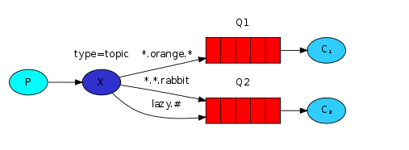
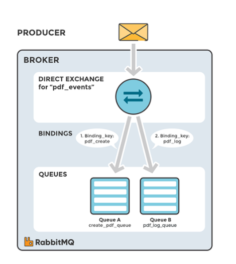
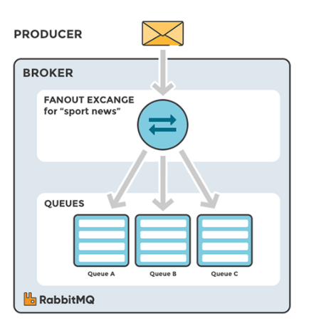
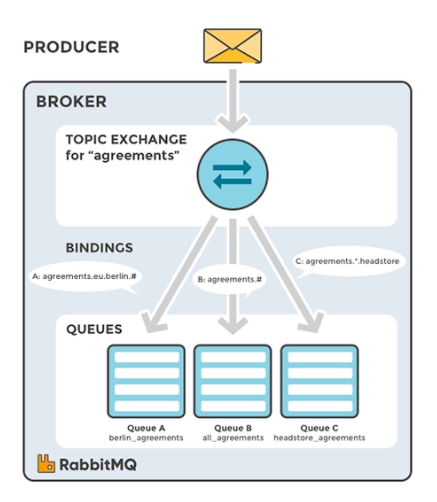
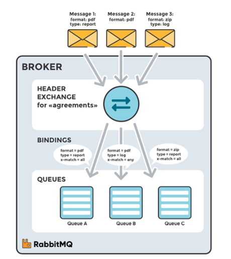

# Topics, Exchange, Channel

## Topics

Trong các bài trước, chúng ta đã cải tiến thêm một số tính năng mới cho hệ thống log. Chúng ta không chỉ dùng `exchange` kiểu `fanout` để gửi `message` cho tất cả các *consume* mà thay vào đó có thể dùng `driect`, nó có thể cho chúng ta chọn lựa những log cần thiết, quan trọng.

Như ta thấy, `driect` có khá nhiều ưu điểm. Nhưng mặc dù vậy nhưng `driect` cũng có mặt hạn chế là không thể điều hướng các `message` với nhiều điều kiện khác nhau.

Trong hệ thống log, chúng ta không chỉ thu thập những các log có độ cảnh báo cao (info/warn/crit...) mà còn phải điều hướng các log khác liên quan tới hệ thống (auth/cron/kern...).

Vì thế, chúng ta cần phải linh hoạt chọn lọc từ những `message` về `cron` bên trong `kern`. Để giải quyết vấn đề này, chúng ta cần tìm hiểu về một `exchange` khá hay là `topic`.

### Topic exchange

Các `message` được gửi đến `Topic exchange` không bị bó buộc vào `routing_key*` - nó bao gồm một chuỗi các từ được chứa thuộc tính gợi nhớ, chọn lọc phân định bởi dấu (.) và có độ dài không quá 255 byte. Ví dụ: `"stock.usd.nyse"`, `"nyse.vmw"`, `"quick.orange.rabbit"`

`Binding key` cũng phải sử dụng cú pháp tương tự với `exchange`. Về lý thuyết, `topic` `exchange` hoạt động giống như `driect`, có nghĩa là nó sẽ so sánh các `routing key` với `binding key` nếu thấy giống nó sẽ gửi `message` đi. Có 2 trường hợp đặc biệt sau:

- `*` (start): Được thay thế cho 1 từ
- `#` (hash): Được thay thế cho từ rỗng hoặc nhiều từ phía trước/sau nó

Để dễ hình dung chúng ta cùng xem sơ đồ sau:


topics

Ở ví dụ trên, chúng ta sẽ gửi `message` tới tất cả các `animals`. `message` được gửi đi với `routing key` có chứa 3 từ (vì có 2 dấu chấm).  Phân tích cú pháp của `routing key` ta thấy có 3 trường như sau: `<celerity>.<colour>.<species>`.

Quay trở về ví dụ ở hình, chúng ta thấy `Q1` sẽ nhận các `message` có `routing key` là `*.orange.*`. Tương tự vậy, `Q2` sẽ nhận các `message` chứa `*.*.rabbit` và `lazy.#`. Chúng ta có thể diễn dải bằng lời văn như sau:

- `Q1` sẽ nhận toàn bộ các động vật màu cam `*.organe.*`
- `Q2` sẽ lắng nghe toàn bộ những gì về Rabbit có 3 trường `*.*.rabbit` và tất cả những gì bắt đầu về `lazy.#`

Ví dụ:

- `quick.orange.rabbit`: cả 2
- `lazy.orange.elephant`: cả 2
- `quick.orange.fox`: `Q1`
- `lazy.brown.fox`: `Q2`
- `lazy.pink.rabbit`: `Q2`
- `quick.brown.fox`: Bỏ qua

Với các `message` có *routing_key* 4 trường như `quick.orange.male.rabbit` sẽ bị loại bỏ vì không có rule nào phù hợp. Nhưng với `lazy.orange.male.rabbit` thì không, nó phù hợp với rule `lazy.#` ở `Q2`.

### Putting it all together

Chúng ta sẽ sử dụng *topic* với `routing_key` có 2 trường `<facility>.<severity>`. Giống như code ở các bài trước, chúng ta sửa lại 1 chút `emit_log_topic.py`:

```python
#!/usr/bin/env python
import pika
import sys

connection = pika.BlockingConnection(pika.ConnectionParameters(
        host='localhost'))
channel = connection.channel()

channel.exchange_declare(exchange='topic_logs', type='topic')

routing_key = sys.argv[1] if len(sys.argv) > 2 else 'anonymous.info'
message = ' '.join(sys.argv[2:]) or 'Hello World!'
channel.basic_publish(exchange='topic_logs', routing_key=routing_key, body=message)
print(" [x] Sent %r:%r" % (routing_key, message))
connection.close()
```

Code của `receive_logs_topic.py`

```python
#!/usr/bin/env python
import pika
import sys

connection = pika.BlockingConnection(pika.ConnectionParameters(
        host='localhost'))
channel = connection.channel()

channel.exchange_declare(exchange='topic_logs',
                         type='topic')

result = channel.queue_declare(exclusive=True)
queue_name = result.method.queue

binding_keys = sys.argv[1:]
if not binding_keys:
    sys.stderr.write("Usage: %s [binding_key]...\n" % sys.argv[0])
    sys.exit(1)

for binding_key in binding_keys:
    channel.queue_bind(exchange='topic_logs', queue=queue_name, routing_key=binding_key)

print(' [*] Waiting for logs. To exit press CTRL+C')

def callback(ch, method, properties, body):
    print(" [x] %r:%r" % (method.routing_key, body))

channel.basic_consume(callback, queue=queue_name, no_ack=True)

channel.start_consuming()
```

Để gửi tất cả các log:

```bash
python receive_logs_topic.py "#"
```

Để nhận tất cả các log từ "kern"

```bash
python receive_logs_topic.py "kern.*"
```

Nếu muốn nhận các log "critial":

```bash
python receive_logs_topic.py "*.critical"
```

Nhận log từ nhiều `binding`: 

```bash
python receive_logs_topic.py "kern.*" "*.critical"
```

Nhận các log với `routing_key` là `kern.critial`:

```bash
python emit_log_topic.py "kern.critical" "A critical kernel error"
```

### Source

- [emit_log_topic.py](https://github.com/rabbitmq/rabbitmq-tutorials/blob/master/python/emit_log_topic.py)
- [receive_logs_topic.py](https://github.com/rabbitmq/rabbitmq-tutorials/blob/master/python/receive_logs_topic.py)


## Exchange
Như mình đã đề cập ở module `RabbitMQ`, có 4 loại Exchange: `Direct`, `Fanout`, `Topic`, `Headers`. Việc lựa chọn các `exchange type` khác nhau sẽ dẫn đến các xử lý khác nhau của message broker với message nhận được từ producer. Exchange sẽ được binding đến một số Queue nhất định.

Ngoài 4 ông exchange trên còn có thêm `Dead Letter Exchange`, dùng để catch các message không thể gửi được, trong trường hợp nếu không tìm thấy queue phù hợp cho message, message sẽ tự động bị hủy.

### Direct Exchange

`Direct Exchange` - trao đổi trực tiếp: Dùng để định tuyến message đến Queue dựa vào routing key. Thường được sử dụng cho việc định tuyến message unicast-đơn hướng (mặc dù nó có thể sử dụng cho định tuyến multicast-đa hướng). Các bước định tuyến message:

- Một queue được ràng buộc với một direct exchange bởi một routing key K.
- Khi có một message mới với routing key R đến direct exchange. Message sẽ được chuyển tới queue đó nếu R=K.

Một Exchange không xác định tên (empty ttring), đây là loại Default Exchange, một dạng đặc biệt của là Direct Exchange. Default Exchange được liên kết ngầm định với mọi Queue với khóa định tuyến bằng với tên Queue.

Direct Exchange hữu ích khi muốn phân biệt các thông báo được publish cho cùng một exchange bằng cách sử dụng một mã định danh chuỗi đơn giản.



Ví dụ, nếu Queue được gắn với một exchange có binding key là `pdf_create`, message được đẩy vào exchange với routing key là `pdf_create` sẽ được đưa vào Queue này.

### Fanout Exchange

`Fanout Exchange` dùng để định tuyến message (copy message) tới tất cả queue mà nó được bind, với bất kể một routing key nào. Giả sử, nếu nó N queue được bind bởi một Fanout exchange, khi một message mới published, exchange sẽ định tuyến message đó tới tất cả N queues. Fanout exchange được sử dụng cho định tuyến message broadcast.



`Fanout Exchange` hữu ích với trường hợp ta cần một dữ liệu được gửi tới nhiều ứng dụng khác nhau với cùng một message nhưng cách xử lý ở ứng dụng là khác nhau.

### Topic Exchange

`Topic Exchange` định tuyến message tới một hoặc nhiều queue dựa trên sự trùng khớp giữa routing key và pattern. Topic exchange thường sử dụng để thực hiện định tuyến thông điệp multicast. Ví dụ một vài trường hợp sử dụng:

- Phân phối dữ liệu liên quan đến vị trí địa lý cụ thể.

- Xử lý tác vụ nền được thực hiện bởi nhiều workers, mỗi công việc có khả năng xử lý các nhóm tác vụ cụ thể.

- Cập nhật tin tức liên quan đến một category hoặc gắn tag.

- Điều phối các dịch vụ của các loại khác nhau trong cloud.



Một topic exchange sẽ sử dụng wildcard để gắn routing key với một routing pattern khai báo trong binding. Consumer có thể đăng ký những topic mà nó quan tâm.

### Header Exchange

`Header Exchange` được thiết kế để định tuyến với nhiều thuộc tính, để dàng thực hiện dưới dạng header của message hơn là routing key. Header exchange bỏ đi routing key mà thay vào đó định tuyến dựa trên header của message. Trường hợp này, broker cần một hoặc nhiều thông tin từ application developer, cụ thể là, nên quan tâm đến những message với tiêu đề nào phù hợp hoặc tất cả chúng.

Headers Exchange rất giống với Topic Exchange, nhưng nó định tuyến dựa trên các giá trị header thay vì routing key.

Một Message được coi là phù hợp nếu giá trị của header bằng với giá trị được chỉ định khi ràng buộc.



## Channel

### Notes

`Connection`: Một kết nối TCP giữa ứng dụng và RabbitMQ broker.
`Channel`: Một kết nối ảo trong một Connection. Việc publishing hoặc consuming message từ một queue đều được thực hiện trên channel.

- Channel đại diện cho một phần logic của application logic, mỗi Channel thường tồn tại trên một thread riêng.

- Thông thường, tất cả các Channel do application mở ra sẽ chia sẻ một kết nối duy nhất - chúng là các session hoạt động dựa trên Connection.

- Hầu hết các hoạt động của giao thức AMQP diễn ra qua các Channel.

- Channel hoạt động ở Application layer trong mô hình OSI

- `Channels are designed to be transient` - Các Channel được thiết kế để dùng tạm thời. Vì chúng chỉ là tạm thời, nên application không nên gộp các Channel lại với nhau.

- Server sử dụng một integer number để định danh cho Channel, dùng để phân biệt Channel nào đang ở session nào, có các Connection gì.

- `Channel Lifecycle`

    -` Opening Channels`: Các application mở một Channel ngay sau khi mở Connection thành công. Giống như các Connection, các Channel có thể tồn tại lâu dài, không cần phải mở một Channel cho mỗi hoạt động của application, làm như vậy sẽ rất kém hiệu quả, Channel thường được dùng cho một `network roundtrip`.

    - `Closing Channels`: Khi một Channel không còn cần thiết nữa, nó sẽ được đóng lại.

- `Maximum Number of Channels per Connection`: Số lượng Channel tối đa có thể mở đồng thời trên một Connection do client và server set tại thời điểm kết nối. Và giá trị có thể dùng để định cấu hình cho cả RabbitMQ.


## Reference

1. [RabbitMQ - tutorial-five-python](https://www.rabbitmq.com/tutorials/tutorial-five-python.html)
2. [RabbitMQ Exchanges, routing keys and bindings](https://www.cloudamqp.com/blog/part4-rabbitmq-for-beginners-exchanges-routing-keys-bindings.html)
3. [RabbitMQ - Channel](https://www.rabbitmq.com/channels.html)