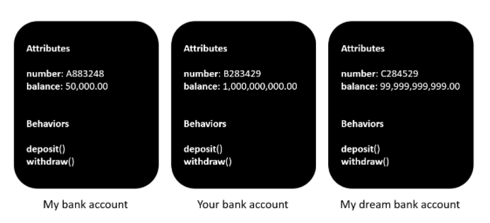
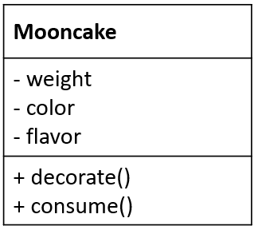
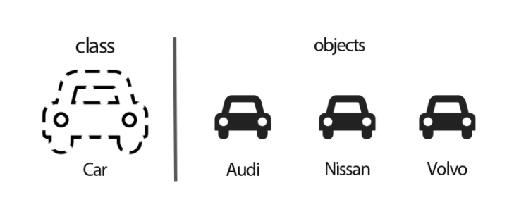
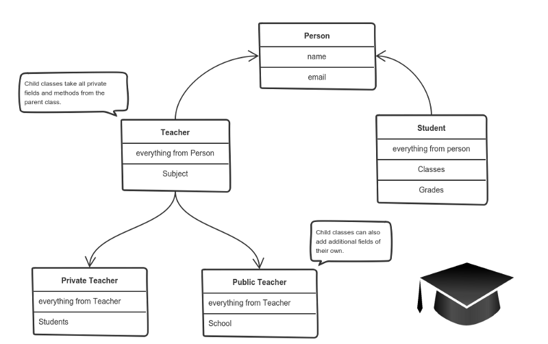
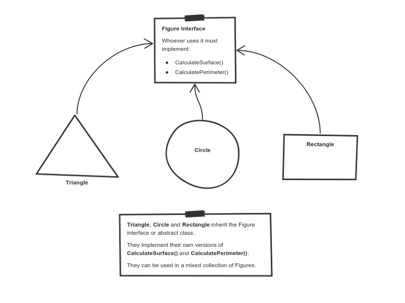

# Object Oriented Programing 
- `Four Principles`: 
    + `Inheritance`: Concepts, Features, Types of Inheritance, Example
    + `Encapsulation`: Concepts, Features, Access modifier, Example
    + `Polymorphism`: Concepts, Features, `Overloading vs. Overriding`, Example
    + `Abstraction` : Concepts, Features, Types of Abstraction, Example
- `Objects` and `Classes`, `Properties` and `Methods`
- `Constructor` and `Destructor` 
- `SOLID` / `DRY`


## Objects and Classes, Properties and Methods

- `Objects`: được hiểu như là 1 thực thể, một đối tượng. Trong OOP mọi thứ định nghĩa được qua 3 khái niệm `Identity`, `Attributes` và `Behaviours` thì đều là Objects.




- `Classes`: Tập hợp một hoặc nhiều các objects có các đặc trương tương tự nhau. Trong OOP, một class bao gồm 3 components là: `Name`, `Attributes` và `Behaviours`



_Objects vs. Classes_

`Class là một khuôn mẫu còn object là một thể hiện cụ thể dựa trên khuôn mẫu đó.`



- Ví dụ khi nói đến xe otô thì `class` chính khuôn mẫu của cái xe với các đặc trưng như có 4 bánh và có thiết kế tương tự như hình vẽ. Còn `object` là các chiếc xe otô được xây dựng dựa trên khuôn mẫu đó.

- Trong OOP, một object bao gồm 2 thành phần: Properties và Methods:
    + `Properties`: là những thông tin, đặc điểm của object. Ví dụ: xe oto sẽ có tên, kiểu dáng, màu sắc, 2 bô hay n bô v.vv &rarr; Phản ánh tính chất của object.

    + `Methods`: là những thao tác, hành động mà object đó có thể thực hiện. Ví dụ: xe lamborghini thể đạt tốc độ 254km/h, có thể chạy đua với thời gian v.vvv &rarr; Phản ánh hành vi của object.


## Four Principles


### Inheritance

#### Concepts

`Inheritance` là quá trình mà một `class` `kế thừa` các thuộc tính của một `class` khác. Các thuộc tính đó có thể là một `method` hoặc một `field` nào đó. Class được kế thừa được gọi chung là `parent class`, còn class kế thừa sẽ được gọi chung là `children class`.


#### Features

- `Tăng khả năng tái sử dụng`. Khi một class kế thừa class khác, nó có thể truy cập tất cả các chức năng của class mà nó kế thừa. 

- Khi code được tái sử dụng, sẽ giúp giảm chi phí phát triển và bảo trì, việc kiểm tra và gỡ lỗi sẽ thực hiện với code của parent class, chứ không cần kiểm tra từng children class.

- Hạn chế sự dư thừa code và hỗ trợ khả năng mở rộng code.

#### Types of Inheritance:

- `Single Inheritance`: Trường hợp một class chỉ được kế thừa từ một class duy nhất, tức là một `children class` chỉ có một `parent class`.

- `Multiple Inheritance`: Trường hợp một class có thể kế thừa từ nhiều hơn một class khác, đồng nghĩa với việc một `children class` có thể có nhiều hơn một `parent class`.

- `Multi-Level Inheritance`: Trường hợp class A kế thừa từ class B, xong class B kế thừa class C

- `Hierarchical Inheritance`: Trường hợp có nhiều `children class` được kế thừa từ một `parent class` duy nhất.

- `Hybrid Inheritance`/`Virtual Inheritance`: Trường hợp kế thừa được kết hợp bởi nhiều hơn một loại kế thừa mình kể ở trên.

#### Example


_A private teacher is a type of teacher. And any teacher is a type of Person._

### Encapsulation

#### Concepts

`Encapsulation` là việc `đóng gói` tất cả thông tin, dữ liệu, `method` vào bên trong một `object`. Sau đó, khi một `object` được khởi tạo từ `class`, thì dữ liệu và `method` đã được đóng gói trong `object` đó. Khi sử dụng, ta chỉ cần gọi tên method chứ không cần truy cập đến dữ liệu bên trong.

#### Features

- `Tính linh hoạt`: Code được đóng gói sẽ linh hoạt, dễ sửa đổi hơn là những đoạn code độc lập.

- `Khả năng tái sử dụng`: Code đã đóng gói có thể được tái sử dụng trong một hoặc nhiều ứng dụng. 

- `Khả năng bảo tr`ì: Code được đóng gói trong những phần riêng biệt, như là `class`, `method`, `interface`,… Do đó, việc thay đổi, cập nhật một phần của ứng dụng không ảnh hưởng đến những phần còn lại. Điều này giúp giảm công sức và tiết kiệm thời gian cho các ông dev.

- `Khả năng kiểm thử`: Testing tiết kiệm được thời gian và công sức hơn trong việc test 1 class chứa toàn bộ thông tin của class đó thay vì kiếm từng method của class để test.

- `Che giấu dữ liệu`: Khi sử dụng method, dev chỉ cần biết method đó nhận parameter gì, return gì mà không cần quan tâm nhiều đến logic bên trong.

#### Access modifier in Encapsulation

- `Private`: Chỉ truy cập được `method` trong `class` khai báo nó.
- `Public`: Có thể truy cập tới `method` từ các `class` khác
- `Protected`: Chỉ truy cập được  `method` khi `class` này kế thừa `class` khai báo `method` đó

#### Example


_You can feed the cat. But you can’t directly change how hungry the cat is._

### Polymorphism

#### Concepts

`Polymorphism` là việc một biến, một hàm hoặc một phương thức có thể tồn tại ở nhiều dạng khác nhau. Tức là chúng có thể cùng một tên nhưng chức năng thực sự của chúng lại khác nhau.

`Polymorphism` thường được dùng trong trường hợp một children class cần dùng các method của parent class và bổ sung thêm cho một moethod khác. Hay khi một class cần có nhiều method có cùng tên nhau nhưng khác parameter.

#### Features

- Tái sử dụng.
- Có thể dùng một tên duy nhất để lưu trữ biến của nhiều kiểu dữ liệu khác nhau (float, double, long, int,…).

#### Overloading vs. Overriding

`Polymorphism` gồm có hai loại: `Runtime Polymorphism` và `Compile Time Polymorphism`. Theo đó, Polymorphism cho phép một phương thức thực thi những behavior khác nhau theo hai hướng: sử dụng phương thức ghi đè (`method overriding`) hoặc phương thức nạp chồng (`method overloading`).

- `Overloading` là một kĩ thuật cho phép trong cùng một class có thể có nhiều phương thức cùng tên nhưng khác nhau về số lượng tham số hoặc kiểu dữ liệu tham số. 

- `Overriding` được sử dụng trong trường hợp lớp con kế thừa từ lớp cha và muốn định nghĩa lại một phương thức đã có mặt ở lớp cha. Một lớp cha thông thường có thể có nhiều lớp con kế thừa, tuy nhiên phương thức ở lớp cha có thể phù hợp với lớp con này nhưng không phù hợp với lớp con khác, do đó lớp con cần ghi đè lại phương thức đó cho phù hợp.


| Overloading |	Overriding |
| ---------- | --------- |
| Thể hiện đa hình tại compile time	| Thể hiện đa hình tại runtime |
| Thêm hành vi cho phương thức | Thay đổi hành vi hiện tại của phương thức |
|Có thể khác nhau về số lượng và kiểu dữ liệu của tham số	Số lượng và liểu dữ liệu của tham số phải giống nhau |
| Xảy ra trong cùng một class | Xảy ra ở 2 class có quan hệ kế thừa |



_Triangle, Circle, and Rectangle now can be used in the same collection_

### Abstraction

#### Concepts
`Abstraction` là việc `trừu tượng hóa` một objects bằng cách chọn ra các thuộc tính, phương thức của objects cần thiết và bỏ đi những thuộc tính, phương thức không cần thiết. 

Có thể xem Abstraction là một phần mở rộng của `Encapsulation`. Thông qua Abstraction, ta có thể ẩn tất cả dữ liệu hoặc quy trình không liên quan của ứng dụng. Đối với người dùng, đó chỉ là những chi tiết không cần thiết. Từ đó, ta có thể để giảm độ phức tạp và tăng hiệu quả sử dụng của phần mềm.

#### Features

- Xây dựng một interface đơn giản, dễ hiểu dễ sử dụng cho các objects.

- Code phức tạp bị ẩn đi.

- Nâng cao vấn đề bảo mật, bảo vệ dữ liệu không bị lộ ra ngoài.

- Việc bảo trì phần mềm dễ dàng hơn.

#### Types of Abstraction:  

- `Data Abstraction`: Khi dữ liệu của object không hiển thị ra bên ngoài, thì đó gọi là trừu tượng hóa dữ liệu. Nếu cần, ta có thể cấp quyền truy cập vào dữ liệu của object bằng nhiều cách. Thông thường sử dụng một số phương thức như `get`, `set`.

- `Process Abstraction`: Khi không cần cung cấp chi tiết về tất cả các chức năng khác nhau của một object hay các logic bên trong nó, ta có thể ẩn việc triển khai này đi dùng Abstraction, gọi là trừu tượng hóa quy trình.

#### Example


_Cell phones are complex. But using them is simple._

## Constructor / Destructor


### Constructor

- Constructor là một hàm dùng để `khởi tạo`, cấp phát bộ nhớ cho một object. Constructor thông thường sẽ có các đặc điểm như được gọi khi có một object được tạo, trùng với tên class, không có kiểu dữ liệu trả về.

- Types:
    + `Parameterized constructors`:

    ```java
    class Example {
        public:
        Example();
        Example(int a, int b);  // Parameterized constructor.

        private:
        int x_;
        int y_;
        };
    ```

    + `Default constructors`

    ```java
    class Student {
        public:
        Student(int a = 0, int b = 0);  // Default constructor.

        int a;
        int b;
    };
    ```

    + `Copy constructors`

    + `Conversion constructors`

    + `Move constructors`

### Destructor

- `Destructor` ngược lại với Constructor, nó được dùng để xoá một object. Destructor cũng có các đặc điểm như được gọi tự động khi một đối object thoát khỏi Scope của class, hay một chức năng, chương trình kết thúc Chương trình kết thúc hay gọi tới toán tử delete để xóa một object v.vv, nói chung là được gọi trước khi bộ nhớ của đối tượng được giải phóng. 

- Mục đích chính của nó là giải phóng các tài nguyên, bộ nhớ mà objects có được trong thời gian tồn tại của nó và hủy việc tham chiếu từ object đó đến các object khác. 

## SOLID / DRY
### SOLID 


`SOLID` là viết tắt của 5 chữ cái đầu trong 5 nguyên tắc thiết kế hướng đối tượng, giúp cho developer viết ra những đoạn code dễ đọc, dễ hiểu, dễ maintain, được đưa ra bởi Bob Martin và Michael Feathers:

- **S**ingle responsibility priciple - `SRP`: Một class chỉ nên giữ 1 trách nhiệm duy nhất 
(Chỉ có thể sửa đổi class với 1 lý do duy nhất)

- **O**pen/Closed principle - `OCP`: Có thể thoải mái mở rộng 1 class, nhưng không được sửa đổi bên trong class đó (open for extension but closed for modification).

- **L**iskov substitution principe - `LSP`: Trong một chương trình, các object của class con có thể thay thế class cha mà không làm thay đổi tính đúng đắn của chương trình.

- **I**nterface segregation principle - `ISP`: Thay vì dùng 1 interface lớn, ta nên tách thành nhiều interface nhỏ, với nhiều mục đích cụ thể.

- **D**ependency inversion principle - `DIP`: Có hai ý
    1. Các module cấp cao không nên phụ thuộc vào các modules cấp thấp. Cả 2 nên phụ thuộc vào abstraction.
    2. Interface (abstraction) không nên phụ thuộc vào chi tiết, mà ngược lại.( Các class giao tiếp với nhau thông qua interface, 
không phải thông qua implementation.)

### DRY 


`DRY = Don’t Repeat Yourself`

- Nguyên tắc này khuyên ta `đừng có viết lặp đi lặp lại bất kỳ một đoạn code nào` mà `hãy đóng gói nó thành phương thức riêng` và `cho phép kế thừa lại đoạn code này`. Đến khi cần thì chỉ cần gọi tên phương thức đó ra xài. 

- Đừng lặp lại code ở đây là không lặp lại các đoạn code giống nhau, các method thực hiện chức năng như nhau, cố gắng gom chúng lại 1 cách gọn gàng và có thể dùng lại khi cần.


## Reference
1. [How to explain object-oriented programming concepts to a 6-year-old](https://www.freecodecamp.org/news/object-oriented-programming-concepts-21bb035f7260/)

2. [The four basics of object-oriented programming](https://www.indeed.com/career-advice/career-development/what-is-object-oriented-programming#:~:text=Object%2Doriented%20programming%20has%20four,abstraction%2C%20inheritance%2C%20and%20polymorphism.)

3. [Object Oriented Programming With A Real-World Scenario](https://www.c-sharpcorner.com/UploadFile/cda5ba/object-oriented-programming-with-real-world-scenario/)

4. [wiki - Constructor](https://en.wikipedia.org/wiki/Constructor_(object-oriented_programming))

5. [wiki - Destructor](https://en.wikipedia.org/wiki/Destructor_(computer_programming))

6. [SOLID: The First 5 Principles of Object Oriented Design](https://www.digitalocean.com/community/conceptual_articles/s-o-l-i-d-the-first-five-principles-of-object-oriented-design)

7. [wiki - DRY](https://en.wikipedia.org/wiki/Don%27t_repeat_yourself)

8. [Object-Oriented Programming: Objects, Classes & Methods](https://study.com/academy/lesson/oop-object-oriented-programming-objects-classes-interfaces.html)