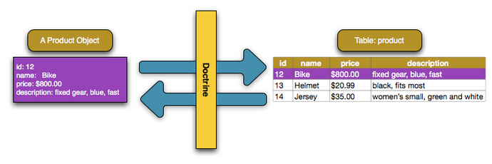

# Doctrine ORM


## Overview

`Doctrine ORM` là một object-relational mapper (ORM) cho `PHP 7.1+`. Nó sử dụng `Data Mapper pattern` làm trọng tâm với mục đích là tách biệt hoàn toàn domain hay business logic của ứng dụng khỏi hệ thống quản lý relational database.



`Doctrine ORM` thường được sử dụng với mục đích đơn giản hóa việc translation giữa các database objects và  `PHP object`. Do đó, trường hợp sử dụng chính cho Doctrine là các ứng dụng sử dụng mô hình lập trình hướng đối tượng. Đối với các ứng dụng không chủ yếu hoạt động với các objects thì việc sử dụng Doctrine ORM không phù hợp lắm.

## Doctrine ORM Packages

Tùy vào mục đích sử dụng ORM của ứng dụng và mong muốn làm cho mọi thứ dễ bảo trì, dễ tách rời hơn thì Doctrine ORM  được chia làm 3 Packages chính:

- `Common package`: Chứa các components có thể tái sử dụng cao, không phụ thuộc vào các packages còn lại. Root namespace của package này là `Doctrine\Common`.

- `DBAL package` (includes Common): Chứa một `enhanced database abstraction layer`. Mục đích của layer này là cung cấp một `single API` làm cầu nối cho các nhà cung cấp RDBMS, bỏ qua hầu hết sự khác biệt chúng giúp ta có thể sử dụng nhiều nhà cung cấp RDBMS mà không phải thay đổi source code quá nhiều. Root namespace của package này là `Doctrine\DBAL`.

- `ORM package` (includes DBAL + Common): Chứa `object-relational mapping toolkit`, toolkit này hỗ trợ tính 
bền vững, minh bạch trong các relational giữa các PHP objects. Root namespace của package này là `Doctrine\ORM`.

## Installation
### Get started

Đầu tiên, ta tạo một project có cấu trúc như sau:

```sh 
mkdir -p my-project/public_html
mkdir -p my-project/entities
mkdir -p my-project/config
mkdir -p my-project/data

touch my-project/public_html/index.php
touch my-project/bootstrap.php
touch my-project/entities/User.php
touch my-project/config/cli-config.php
```

Trong đó:

- `public_html` - folder chứa các public web content. Ví dụ như index.php hay bất cứ images/JS/CSS files.

- `entities` - folder chứa các doctrine entities.

- `data` - folder chứa các tệp dữ liệu 

- `bootstrap.php` - file chứa initialization code, sử dụng bởi file `index.php`.

- `cli-config.php` - File chứa các config để ta sử dụng Doctrine CLI tools.

### Install Doctrine

Install Doctrine bằng Composer:

```sh
cd my-project
composer require doctrine/orm
```

## Connection

Với ví dụ này, tệp `bootstrap.php` như dưới đây cho Doctrine biết loại cơ sở dữ liệu mà ta đang sử dụng, như SQLite hay có thể là MySQL hoặc PostgreSQL, v.v..; và chi tiết các kết nối liên quan.

```php title="bootstrap.php"
<?php

// include the composer autoloader for autoloading packages
require_once(__DIR__ . '/vendor/autoload.php');

// set up an autoloader for loading classes that aren't in /vendor
// $classDirs is an array of all folders to load from
$classDirs = array(
    __DIR__,
    __DIR__ . '/entities',
);

new \iRAP\Autoloader\Autoloader($classDirs);

function getEntityManager() : \Doctrine\ORM\EntityManager
{
    $entityManager = null;

    if ($entityManager === null)
    {
        $paths = array(__DIR__ . '/entities');
        $config = \Doctrine\ORM\Tools\Setup::createAnnotationMetadataConfiguration($paths);

        # set up configuration parameters for doctrine.
        # Make sure you have installed the php7.0-sqlite package.
        $connectionParams = array(
            'driver' => 'pdo_sqlite',
            'path'   => __DIR__ . '/data/my-database.db',
        );

        $entityManager = \Doctrine\ORM\EntityManager::create($connectionParams, $config);
    }

    return $entityManager;
}
```
Điểm chính ta cần quan tâm là `getEntityManager` chứa các biến cấu hình cần thiết cho cơ sở dữ liệu và thiết lập một entity manager. Nếu sử dụng Postgres, có thể thay `connectionParams` như sau:

```php
$connectionParams = array(
    'driver'         => 'pdo_pgsql',
    'user'           => 'user1',
    'password'       => 'my-awesome-password',
    'host'           => 'postgresql.mydomain.com',
    'port'           => 5432,
    'dbname'         => 'myDbName',
    'charset'        => 'UTF-8',
);
```

## Entities

### Entity - Column - Primary key

`Entities` là các `PHP Objects` được xác định qua nhiều requests bằng `unique identifier` hoặc `primary key`. Một Entity sẽ được biểu diễn như một `class` và không cần extend bất cứ `abstract base class` hay `interface` nào. Một `entity class` không được là `final` hoặc `contain final` methods.

Một entity sẽ chứa nhiều `properties`. Một property tồn tại như là một `instance variable` của `entity` đó, được lưu, truy xuất từ database thông qua khả năng ánh xạ dữ liệu của Doctrine.

Dưới đây là ví dụ về việc tạo một User Entity:

```php title="UserEntity.php"
<?php

/**
 * @Entity @Table(name="user")
 **/

class User
{
    /** @Id @Column(type="integer") @GeneratedValue **/
    protected $id;

    /** @Column(type="string") **/
    protected $name;

    /** @Column(type="string") **/
    protected $email;


    public function __construct(string $name, sring $email)
    {
        $this->name = $name;
        $this->email = $email;
    }


    # Accessors
    public function getId() : int { return $this->id; }
    public function getName() : string { return $this->name; }
    public function getEmail() : string { return $this->email; }
}

```

Trong đó có các `annotations` - một khái niệm mình sẽ nói kỹ hơn trong module `Decorator-Anotation`, ở đây có thể hiểu các `annotations` này giúp cho Doctrine xác định được cách ánh xạ Entity, property sang database. Đối với ví dụ trên, User Entity tương ướng với User Table trong database, và có 3 properties là `$id`, `$name` và `$email` tương ứng với 3 column của User Table. Hàm `__construct` dùng để khai báo 2 properties là `$name` và `$email` sẽ chứa data liên quan đến name, email của user, còn `$id` này là `primary key` của User Table, có kiểu là integer. Ngoài ra, trong User Entity còn có các `Accessors` để định nghĩa các CRUD Operations.

### Entities restrictions

Mặc dù nói `Entities` trong Doctrine ORM là các `PHP Objects` được thể hiện qua các Class nhưng các Entities này trong Doctrine ORM có những hạn chế, quy quy định cụ thể về Entities như sau:

- Một Entity class không được là final hoặc chứa final methods.

- Tất cả persistent properties/field của bất cứ entity class nào đều phải là private hoặc protected, nếu không tinh năng `lazy-loading` có thể sẽ không hoạt động đúng được.

- Một entity class không được implement cái hàm `__clone` hoặc `__wakeup` ( _xem thêm tại [Implementing Wakeup or Clone](https://www.doctrine-project.org/projects/doctrine-orm/en/2.8/cookbook/implementing-wakeup-or-clone.html)_). Có thể dùng [Serializable](https://www.php.net/manual/en/class.serializable.php) để thay thế

- Bất kỳ 2 entity classes nào trong 1 hệ thống phân cấp các class kế thừa nhau ( kể cả trực tiếp hay gián tiếp) không được có một `mapped property` có cùng một tên. Nghĩa là nếu class B kế thừa từ class A thì tất cả property được ánh xạ tới database từ class B không được trùng tên với property đã được ánh xạ tới database từ class A.

- Một entity không thể sử dụng hàm `func_get_args()` để implement các variable parameters. Các `generated proxies` không hỗ trợ sử dụng hàm này vì lý do hiệu suất.

- Hàm `constructor` của một entity chỉ được gọi khi ta tạo một instance mới với từ khóa `new`.

- Các Entities hỗ trợ kế thừa (inheritance), liên kết đa hình (polymorphic associations) và truy vấn đa hình (polymorphic queries). Cả hai kiểu class là `abstract class` và `concrete class` đều có thể là các entity. 

- Một `entity class` có thể extend từ các `entity classes` khác và kể cả `non-entity classes`. Mặt khác các `non-entity classes` có thể extend các entity classes.

### Entity states

Trong Entity sẽ có các `entity instance`, các `entity instance` này có thể được mô tả cho Doctrine hiểu thông qua các keywords `NEW`, `MANAGED`, `DETACHED` hay `REMOVED`:

- `NEW`: Một `NEW` entity instance mới được khởi tạo bằng `new` operator, chưa có `persistent identity`, và chưa associated với `EntityManager` hay `UnitOfWork`.

- `MANAGED`: entity instance đã được quản lý, đã có `persistent identity` và đã được associated với `EntityManager` và `UnitOfWork`.

- `DETACHED`: entity instance không còn `persistent identity` nữa nhưng vẫn được associated với `EntityManager` và `UnitOfWork`.

- `REMOVED`: entity instance không còn `persistent identity`, vẫn được associated với `EntityManager`, nhưng sẽ bị xóa sau khi transaction commit.

## Transactional write-behind

`EntityManager` là một class, Doctrine dùng nó như một API trung tâm để các Entities truy cập vào các chức năng do Doctrine ORM cung cấp, từ đó Doctrine sẽ quản lý life cycle, quereis, transactions v.vv của tất cả các Entities

Bên trong một `EntityManager` sẽ sử dụng `UnitOfWork`, đây là một implementation điển hình của [the Unit of Work pattern](https://martinfowler.com/eaaCatalog/unitOfWork.html) - một pattern trong Database transactions dùng để quản lý danh sách các objects bị ảnh hưởng bởi một transaction, điều phối việc ghi ra các thay đổi, giải quyết các `concurrency problems`. Trong Doctrine ORM, `UnitOfWork` sẽ lên kế hoạch và theo dõi tất cả những việc cần phải thực hiện trong lần gọi `flush` của `EntityManager`. Ta sẽ không tương tác trực tiếp với `UnitOfWork` mà thay vào đó là `EntityManager#flush()`.


Một `EntityManager` và `UnitOfWork` cơ bản sẽ sử dụng một `strategy pattern` gọi là `transactional write-behind` để trì hoãn việc thực thi các câu lệnh SQL, mục đích là để thực thi chúng theo cách hiệu quả nhất có thể và thực thi vào cuối tracsaction để tất cả các `write lock` nhanh chóng được giải phóng. 
Doctrine như một công cụ để đồng bộ hóa các `in-memory objects` với `database` trong các units of work. 


Thông thường trong một transaction sẽ là làm việc với các objects, thực thi các `Accessors` như bình thường và khi hoàn tất một transaction, ta sử dụng `EntityManager#flush ()` để thực hiện transaction commit.

## Accessors

Tương tự như TypeORM, với Doctrine ta có thể perform CRUD operations thông qua việc sử dụng `EntityManager` và `Repository`. Quay lại ví dụ trên, các operations, hay trong Doctrine gọi là `Accessors` sẽ được định nghĩa trong các function như sau:

```php
# Accessors
public function getId() : int { return $this->id; }
public function getName() : string { return $this->name; }
public function getEmail() : string { return $this->email; }
```

Các Accessors như trên tương ứng với việc lấy data từ database, ví dụ với trường hợp cần fetch all User thông qua primary key, tức là `$id` như sau:

```php title="index.php"
<?php

require_once(__DIR__ . '/../bootstrap.php');

// create a user
$entityManager = getEntityManager();
$user = new User("Programster", "programster@programster.org");
$entityManager->persist($user);
$entityManager->flush();

echo "Created User with ID " . $user->getId();

// List all users:
$users = $entityManager->getRepository("User")->findAll();
print "Users: " . print_r($users, true);
```

Với file `index.php` này, Doctrine sẽ dùng `getEntityManager` để `persist` một user có các params tương ứng như name, email sau đó flush vào EntityManager để tạo mới một User Entity. Để truy vấn tới User Entity này, ta có thể dùng primary key của nó thông qua `getId` accessors, lúc này Doctrine sẽ truy xuất tới Repository chứa tất cả User vào execute hàm findAll() để tìm, kết quả trả về là danh sách toàn bộ User mình đang có. Ví dụ mình execute file `index.php` này 4 lần, kết quả sẽ như sau:

```s
Created User with ID 4
Users: Array
(
    [0] => User Object
        (
            [id:protected] => 1
            [name:protected] => Programster
            [email:protected] => programster@programster.org
        )

    [1] => User Object
        (
            [id:protected] => 2
            [name:protected] => Programster
            [email:protected] => programster@programster.org
        )

    [2] => User Object
        (
            [id:protected] => 3
            [name:protected] => Programster
            [email:protected] => programster@programster.org
        )

    [3] => User Object
        (
            [id:protected] => 4
            [name:protected] => Programster
            [email:protected] => programster@programster.org
        )

)
```

## Relationships/Associations

Doctrine ORM hỗ trợ đủ 4 Relationships trong database tương tự như TypeORM, gồm có `one-to-one`, `many-to-one` , `one-to-many`và  `many-to-many`. Lấy ví dụ với `Category` và `Product` entities trong `many-to-one relationship` - Nhiều `Product` thuộc một `Category`:

```php title="Category.php"
// src/Acme/StoreBundle/Entity/Category.php
// ...
use Doctrine\Common\Collections\ArrayCollection;

class Category
{
    // ...

    /**
     * @ORM\OneToMany(targetEntity="Product", mappedBy="category")
     */
    protected $products;

    public function __construct()
    {
        $this->products = new ArrayCollection();
    }
}
```

```php title="Product.php"
// src/Acme/StoreBundle/Entity/Product.php
// ...

class Product
{
    // ...

    /**
     * @ORM\ManyToOne(targetEntity="Category", inversedBy="products")
     * @ORM\JoinColumn(name="category_id", referencedColumnName="id")
     */
    protected $category;
}
```
`$category` property trên `Product` class announce cho Doctrine biết rằng related class của `Product` là `Category` và nó phải lưu trữ id của category record trên field là `category_id` nằm trên Product Table của database.


Sau khi đã thiết lập relationships giữa `Product` và `Category`, trong Doctrine gọi đây là `associated objects`. Để fetch cái `associated objects` này, đầu tiên fetch một `$product` object sau đó truy cập tới các related Category từ object này:

```php title="getCategory.php"
public function showAction($id)
{
    $product = $this->getDoctrine()
        ->getRepository('AcmeStoreBundle:Product')
        ->find($id);

    $categoryName = $product->getCategory()->getName();

    // ...
}
```


## Reference

1. [Getting Started with Doctrine - Doctrine Documentation](https://www.doctrine-project.org/projects/doctrine-orm/en/2.8/tutorials/getting-started.html)

2. [Getting Started With Doctrine ORM - blog.programster](https://blog.programster.org/getting-started-with-doctrine-orm)

3. [PHP - Doctrine ORM Good Practices and Tricks](https://blog.programster.org/php-doctrine-orm-good-practices-and-tricks)

4. [Architecture - Doctrine Documentation](https://www.doctrine-project.org/projects/doctrine-orm/en/2.8/reference/architecture.html)

5. [5 Doctrine ORM Performance Traps You Should Avoid - tideways](https://tideways.com/profiler/blog/5-doctrine-orm-performance-traps-you-should-avoid)

6. [Let’s Look Under the Hood of Doctrine 2](https://stfalcon.com/en/blog/post/doctrine2-ORM-architecture)