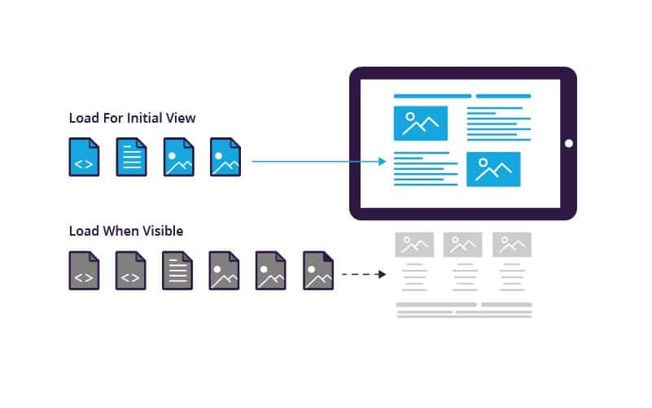

# Lazy Loading / Eager loading


## Concepts

### Lazy Loading

`Lazy Loading` là một  kĩ thuật tối ưu khi làm web, dùng để xác định các resources nào `non-blocking` hay `non-critical` và chỉ load chúng khi thực sự cần. Hay nói cách khác, kỹ thuật này cho phép load ngay các resources cần thiết để phục vụ người dùng và trì hoãn việc load các resources0 còn lại không cần thiết, chỉ đến khi cần thì mới load.



Dưới góc nhìn từ Database - ORM thì `Lazy-Load` có thể hiểu là khi load một Entity từ Database, thay vì load toàn bộ thông tin của Entity thì ta chỉ cần load những thông tin nào cần thiết và hoãn lại việc load các thông tin khác, khi nào cần thì mới load tụi nó ra. Hoặc với các Entity có relationships với nhau trong một Relational Database, chẳng hạn table `User` chứa thông tin định danh cho User và `UserDetails` chứa các thông tin của User đó. Thay vì phải load cả 2 table `User` và `UserDetails` thì `Lazy-Load` sẽ hoãn lại việc load `UserDetails` vì chưa thực sự cần thiết, chỉ load trước `User` thôi và `UserDetails` sẽ chỉ được load ra khi mình công khai gọi tới nó.

### Eager loading


Để minh họa cho `N + 1 Query`, xét một model `Author` có quan hệ 1-N với `Book` như sau:

```php
<?php

namespace App;

use Illuminate\Database\Eloquent\Model;

class Book extends Model
{
    /**
     * Get the author that wrote the book.
     */
    public function author()
    {
        return $this->belongsTo('App\Author');
    }
}

```
Khi cần lấy tất cả các cuốn sách và tên tác giả của các cuốn sách đó:

```php
$books = App\Book::all();

foreach ($books as $book) {
    echo $book->author->name;
}
```

`foreach` sẽ thực hiện 1 truy vấn để truy xuất tất cả các sách trên table `Book`, sau đó thực hiện tiếp một truy vấn khác cho mỗi cuốn sách để truy xuất tác giả trên table `Author`. Vấn đề ở đây là nếu dữ liệu của chúng ta có N cuốn sách cộng thêm một lần query tới Author để lấy tên tác giả nữa là N+1, thì tốc độ truy vấn sẽ rất lâu và khiến cho người dùng khó chịu khi phải chờ đợi. `Eager Loading` sinh ra là để giải quyết vấn đề này.

Chúng ta có thể giảm số lượng truy vấn xuống chỉ còn 2 truy vấn bằng việc sử dụng `Eager Loading`. Khi truy vấn, ta cần thể chỉ định những relations nào sẽ được `eager loaded`, trong ví dụ này ta sử dụng phương thức with():

```php
$books = App\Book::with('author')->get();

foreach ($books as $book) {
    echo $book->author->name;
}
```
Đối với thao tác này, chỉ có hai truy vấn sẽ được thực hiện:

```
select * from books

select * from authors where id in (1, 2, 3, 4, 5, ...)
```

`Eager-Load` được chia làm 3 loại:

- `preload`: Thực hiện từng câu query riêng biệt.

- `eager_load`: Thực hiện gộp thành một câu query duy nhất bằng LEFT OUTER

- `includes`: Vừa có thể thực hiện từng câu query riêng biệt giống `preload`, vừa có thể thực hiện gộp nhiều câu queries giống `eager_load` nếu có references.

### Summary

_Tóm lại:_

- `Eager loading` hay `Lazy Loading` đều là cách giảm thiểu số lượng query đến database. Sử dụng khi các relationships giữa các table trong database không quá nhiều.

- Sử dụng `Eager loading` khi ta chắc chắn sẽ sử dụng các `entity A, B, C` liên quan với `entity main` ở nhiều nơi và nhiều lần.

- Sử dụng `Lazy loading` khi ta chắc chắn chỉ cần dùng một `entity main` là đủ, chưa cần gấp các `entity A, B, C` liên quan.

## Eager and Lazy Relations - TypeORM

### Eager relations

Trong TypeORM, `Eager relations` là việc `loaded automatically` sau mỗi lần load các entities từ database. Ví dụ:

```typescript title="Category.ts"
import {Entity, PrimaryGeneratedColumn, Column, ManyToMany} from "typeorm";
import {Question} from "./Question";

@Entity()
export class Category {
    
    @PrimaryGeneratedColumn()
    id: number;
    
    @Column()
    name: string;
    
    @ManyToMany(type => Question, question => question.categories)
    questions: Question[];
    
}
```

```typescript title="Question.ts"
import {Entity, PrimaryGeneratedColumn, Column, ManyToMany, JoinTable} from "typeorm";
import {Category} from "./Category";

@Entity()
export class Question {
    
    @PrimaryGeneratedColumn()
    id: number;
    
    @Column()
    title: string;
    
    @Column()
    text: string;
    
    @ManyToMany(type => Category, category => category.questions, {
        eager: true
    })
    @JoinTable()
    categories: Category[];
    
}
```

Sau khi ta cấu hình hai entities `Question` và `Category` như trên, khi ta load Questions ta sẽ không cần phải chỉ định việc load các `join` hay `specify relations` giữa hai entities này, chúng sẽ tự động load theo luôn, dùng cho các trường hợp Query dữ liệu từ 2 entities này

```typescript title="Eager.ts"
const questionRepository = connection.getRepository(Question);

// questions will be loaded with its categories
const questions = await questionRepository.find();
```

`Eager relations` chỉ hoạt động khi ta sử dụng phương thức `find()`. Nếu ta sử dụng `QueryBuilder`, `Eager relations` sẽ bị vô hiệu hóa và phải sử dụng `leftJoinAndSelect` để load. `Eager relations` chỉ có thể được sử dụng cho một bên của relations.

### Lazy relations

Các Entities trong `lazy relations` sẽ được load sau khi ta truy cập tới. Các `lazy relations` như vậy phải có kiểu `Promise` - tức là ta lưu trữ giá trị sẽ được load này trong Promise, và khi truy cập thì ta sẽ gọi tới Promise này để lấy resolve. Quay trở lại với ví dụ `Category` và `Question` trên:

```typescript title="Category.ts"
import {Entity, PrimaryGeneratedColumn, Column, ManyToMany} from "typeorm";
import {Question} from "./Question";

@Entity()
export class Category {
    
    @PrimaryGeneratedColumn()
    id: number;
    
    @Column()
    name: string;
    
    @ManyToMany(type => Question, question => question.categories)
    questions: Promise<Question[]>;
    
}
```

```typescript title="Question.ts"
import {Entity, PrimaryGeneratedColumn, Column, ManyToMany, JoinTable} from "typeorm";
import {Category} from "./Category";

@Entity()
export class Question {
    
    @PrimaryGeneratedColumn()
    id: number;
    
    @Column()
    title: string;
    
    @Column()
    text: string;
    
    @ManyToMany(type => Category, category => category.questions)
    @JoinTable()
    categories: Promise<Category[]>;
    
}
```

`categories` là một `Promise`. Khi đó ta implement Lazy Loading như sau:

```typescript title="Lazy.ts"
const category1 = new Category();
category1.name = "animals";
await connection.manager.save(category1);

const category2 = new Category();
category2.name = "zoo";
await connection.manager.save(category2);

const question = new Question();
question.categories = Promise.resolve([category1, category2]);
await connection.manager.save(question);

// Example how to load objects inside lazy relations
const question = await connection.getRepository(Question).findOne(1);
const categories = await question.categories;
// you'll have all question's categories inside "categories" variable now

```
## Reference

1. [Eager and Lazy Relations - typeorm](https://orkhan.gitbook.io/typeorm/docs/eager-and-lazy-relations)

2. [ORM Lazy Loading Pitfalls](http://gorodinski.com/blog/2012/06/16/orm-lazy-loading-pitfalls/)

3. [SOLVING THE N+1 PROBLEM IN ORMS - thecodingmachine](https://thecodingmachine.io/solving-n-plus-1-problem-in-orms)

4. [Lazy Loading vs. Eager Loading](https://www.imperva.com/learn/performance/lazy-loading/)