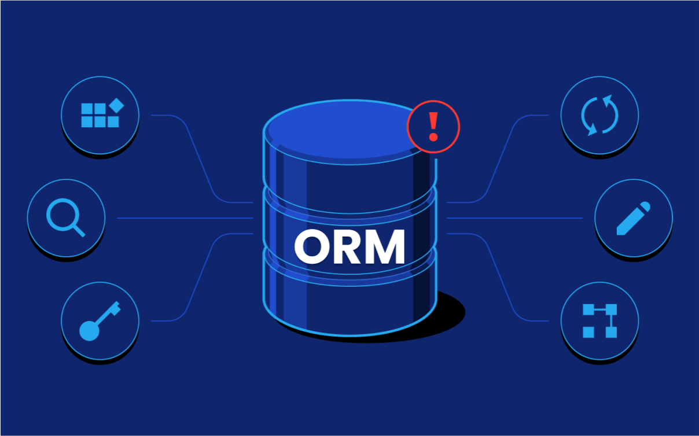

# ORM

## Concepts

ORM hay O/R mapping là tên viết tắt của Object Relational Mapping. ORM là một kỹ thuật  chuyển đổi các dữ liệu trong RDBM sang các đối tượng tương thích bằng lập trình hướng đối tượng (OOP). Cụ thể hơn, ORM sẽ ánh xạ các dữ liệu trong database sang một lớp (class) nhất định được declare trong source code. Bằng cách đó sẽ khiến cho việc kiến trúc, quản lí và duy trì những vấn đề liên quan đến cơ sở dữ liệu trở nên đơn giản hơn.

