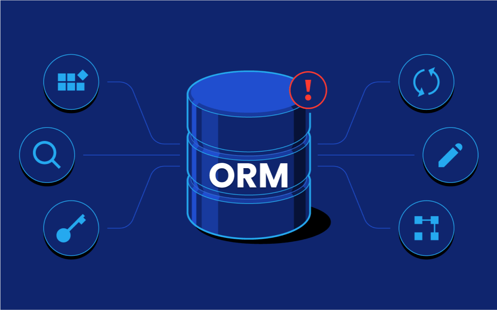
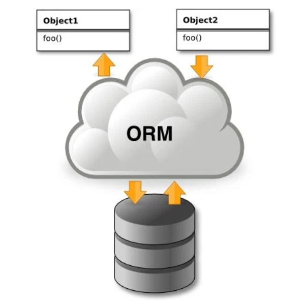
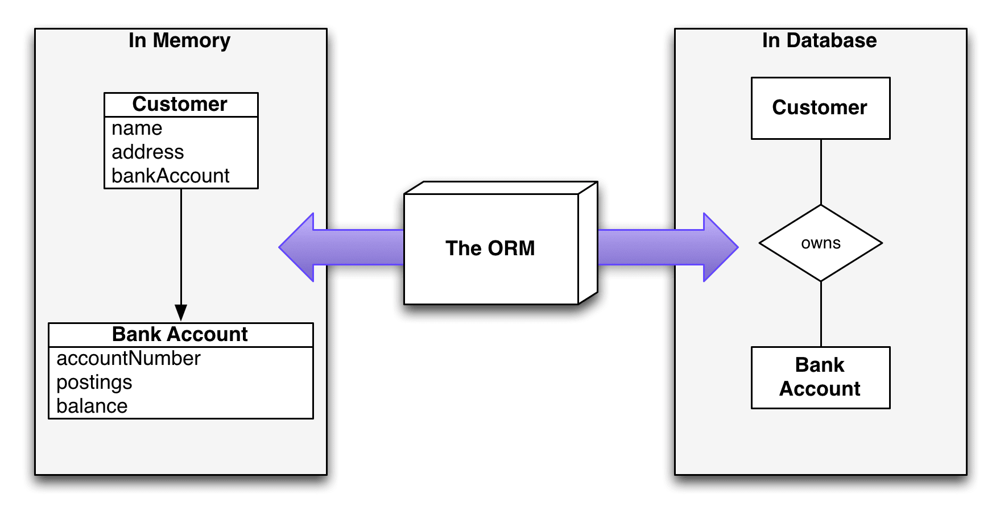
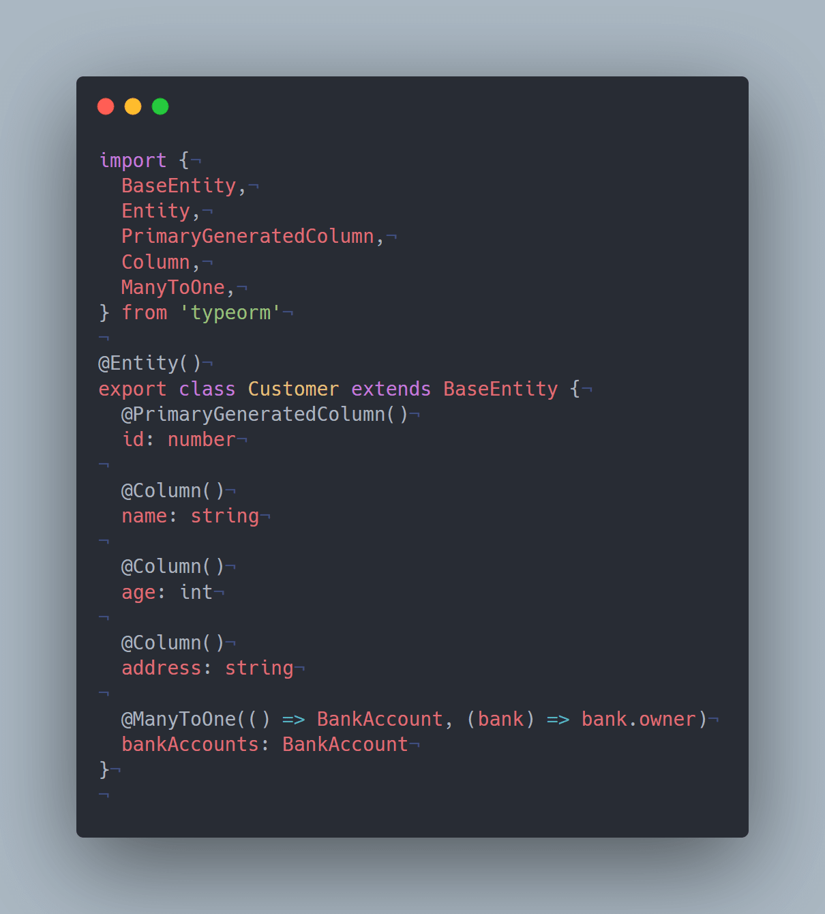

# Overview

- What is an ORM?
- How does ORM work?
- ORM Architechtural Pattern




## What is an ORM?
- `ORM` hay `O/R mapping` là viết tắt của `Object Relational Mapping`. ORM là một kỹ thuật chuyển đổi các dữ liệu trong RDBM sang các đối tượng tương thích bằng lập trình hướng đối tượng (OOP). Cụ thể, ORM sẽ ánh xạ các dữ liệu trong database sang một lớp (class) nhất định được declare trong source code. Bằng cách đó sẽ khiến cho việc `kiến trúc`, `quản lí` và `duy trì` những vấn đề liên quan đến cơ sở dữ liệu trở nên đơn giản hơn.

- `ORM framework` tạo ra một layer nằm ở giữa ngôn ngữ lập trình và database, có thể sử dụng được bên trong các ngôn ngữ lập trình hướng đối tượng, từ đó nó có thể sử dụng chính ngôn ngữ lập trình đó để thao tác với database mà không cần viết các câu lệnh SQL dài dòng. Các object class sẽ tương ứng với các table trong database, và các object instance sẽ tương ứng với các record trong các table đó.



**Upside**

Some of the main benefits of using ORM includes:

It speeds up the development by eliminating repetitive usage of SQL code
It reduces development time a lot
It overcomes all the vendor spicific SQL differences because it knows how to convert to vendor SQL code
It can be used with both relational databases like mysql, oracle, postgresql, maria db and nosql like mongodb
It abstracts things like caching and indexing
It can catch general issues like input validations

- Tuân thủ nguyên tắc `DRY`, viết code theo mô hình MVC, tập trung hóa code lại một chỗ, việc chỉnh sửa, maintain, reuse code sẽ dễ dàng hơn.

- Rất nhiều thứ liên quan tới việc xử lí dữ liệu được thực hiện `tự động`

- Tận dụng ưu điểm của OOP

- Giảm số lượng dòng code và tăng hiệu quả lập trình ORM cho phép lập trình viên có thể tập trung vào các business logic hơn là viết các câu query phức tạp tới database, nhờ đó thu gọn được code và tăng hiệu quả làm việc.

- Query Interface đa dạng, giải quyết được hầu hết các trường hợp có thể xảy ra tương ứng với những câu lệnh SQL phức tạp.

- ORM quản lý hiệu quả mối liên hệ giữa các dữ liệu. Các object liên quan đều được load một cách tự động khi một query được dịch sang câu lệnh SQL tương ứng.

- ORM hỗ trợ xử lý đồng thời, cho phép nhiều user có thể update một tập hợp các data cùng một lúc.

- Caching Object được cache lại, giảm thiểu thời gian load trên database.

- Nhiều sự thay đổi của object đều có thể đưa vào chung trong 1 transaction, nhờ đó chúng có thể đồng thời được commit hay rollback. Nhiều transaction có thể chạy cùng một lúc nhưng mỗi transaction đều độc lập với các transaction khác.

**Downside**

- Với mỗi framework sẽ có 1 thư viện ORM khác nhau, tốn thời gian để tiếp cận. Và vì chúng là thư viện nên app sẽ phải import thêm 1 thư viện nữa vào project.

- Performance ổn đối với các truy vấn thông thường. Tuy nhiên đối với một số thao tác như insert hàng loạt, sửa xoá ... dùng Raw SQL sẽ cho performance tốt hơn.

- Tăng xử lý ORM framework tạo ra một layer giữa ngôn ngữ lập trình và database, giúp giảm sự phức tạp trong lập trình và tăng tốc độ phát triển. Tuy nhiên điều này cũng làm tăng thêm các xử lý trong ứng dụng. Sử dụng ORM sẽ tiêu tốn nhiều dữ liệu và tài nguyên CPU hơn.


## How does ORM work?

Lấy ví dụ dưới đây để thấy được cách ORM ánh xạ một object từ source code sang database:



Giả sử mình có hai bảng `Customer` và `BankAccount`. Một `Customer` có thể có nhiều `BankAccount` nhưng một `BankAccount` chỉ có thể có một `Customer` duy nhất (quan hệ ManyToOne). Nếu sử dụng database, chúng ta sẻ phải viết các query để tạo bảng `Customer` và `BankAccount` kèm theo đó là các fields của chúng. Sau đó cứ mỗi lần cần lấy ra, truy vấn hay tìm kiếm các giá trị của bảng đó, chúng ta sẽ lại cần viết query để các làm việc đó, như `"SELECT ___ FROM ___" (SQL)`

ORM sẽ giải quyết các vấn đề này bằng việc thay thế việc viết query thông thường thành các schema dưới dạng class. Ở đây mình có Customer với các trường như name, age, address và bankAccounts thì tương ứng mình sẽ có lớp như sau:



Với việc thể hiện các entities trong Database thành từng class như thế trong code, các class này cũng sẽ có một số method dùng để trả về dữ liệu hay tìm kiếm dữ liệu. Ví dụ, query lấy một số field của Customer theo id:

```
let customer = await Customer.findById([10]);
```

## ORM Architechtural Pattern

ORM có một số mẫu kiến trúc - `architectural pattern` chủ đạo được áp dụng để triển khai vào quá trình phát triển ORM. Theo Martin Fowler trong quyển sách Patterns of Enterprise Application Architecture (2003), đề xuất đến hai pattern chủ đạo và cốt lõi để tạo thành ORM là `Active Record` và `Data Mapper`:

**1. Active Record Pattern**
- Trong `Active record pattern` các row trong relational database được map 1-1 thành các object.

- Cụ thể, kỹ thuật này sẽ sử dụng `object wraps` một row trong table/view, đóng gói `quyền` truy cập cơ sở dữ liệu và cả `logic` trên dữ liệu đó và định nghĩa một object bao gồm cả `data` và `behavior` của dữ liệu đó. Active Record sử dụng cách tiếp cận rõ ràng, minh bạch, đưa logic thao tác dữ liệu vào object domain, nhờ đó các ông dev dễ dàng đọc hiểu được logic, behavior của object.

- Một số ORM theo Active Record pattern phổ biến như: `ActiveRecord`, `TypeORM`, `Sequelize`, `Eloquent`, `Prisma`.

**2. Data Mapper Pattern**

- `Data Mapper` là 1 `layer mapper` đưa dữ liệu qua lại giữa object và Database mà vẫn giữ được tính độc lập giữa chúng. Tức là có layer giữ cho dữ liệu được lưu trong bộ nhớ máy và trong cơ sở dữ liệu độc lập với nhau.

- Một số ORM theo Data Mapper Pattern: `Hibernate`, `TypeORM`, `SQLALchemy`, `MikroORM`, `Doctrine 2`

## Reference

1. [Understanding Object-Relational Mapping: Pros, Cons, and Types](https://www.altexsoft.com/blog/object-relational-mapping/)

2. [Object-Relational Mapping (ORM)](https://softuni.org/dev-concepts/object-relational-mapping-orm/)