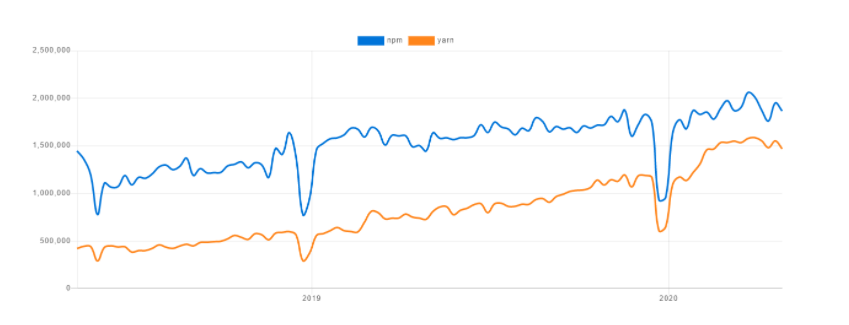

# NPM
- Overview

- Install/remove library package 

- Package version constrains & package.lock

## Overview

- `npm - Node Package Manager` là một công cụ quản lý các library, package cho NodeJs.

- `npx` là một công cụ giúp bạn execute các package từ [npm registry](`https://www.npmjs.com/`) một cách đơn giản và nhanh chóng.


- `nvm` là một `package tool` quản lý các `version` của Nodejs.

- `Package` là:

    + a) Một thư mục chứa chương trình được mô tả bằng tệp `package.json`
    + b) Một `tarball gzipped` chứa (a)
    + c) Một url phân giải thành (b)
    + d) Một `<name>@<version>` được xuất bản trên `npm registry` với (c)
    + e) Một  `<name>@<tag>` trỏ đến (d)
    + f) Một `<name>` giống (e), default tag là `latest`
    + g) Một `<git remote url>` phân giải thành (a)

### npm components and use case

- `npm` bao gồm ba thành phần riêng biệt:
    + [npm website](https://npmjs.com/): dùng để discover packages, thiết lập profiles cá nhân hay tổ chức để quản lý quyền truy cập vào các public/private packages.
    + [npm Command Line Interface](https://docs.npmjs.com/cli/v8/commands/npm): nơi các dev tương tác với npm
    + [npm registry](https://docs.npmjs.com/cli/v8/using-npm/registry): public database cho `JavaScript software` và `meta-information` của npm.

- Sử dụng `npm` trong các trường hợp cần:
    + Quản lý packages cho NodeJS app
    + Tải xuống đúng cách các `standalone tools`
    + Run packages mà không cần download bằng `npx`.


### npm vs yarn

- Một vài thiếu sót của npm:

    + `Queued install`: npm down các dependencies từ registry của nó theo cơ chế queue (FIFO), tốn nhiều thời gian.

    + `Single registry`: Có duy nhất 1 npm registry.

    + `Security`: npm cho phép các packages chạy code trong quá trình download.

    + `Offline`: Không hỗ trợ cài đặt offline

    + `Conflict` giữa các version của packages, dependencies. Có thể khắc phục bằng `npm shrinkwrap` để tạo lockfile `npm-shrinkwrap.json` &rarr; chỉ update version khi tồn tại lock file.

- `yarn` - Yet Another Resource Negotiator - `Node Package Manager`, có thể coi là CLI client hỗ trợ việc down các dependencies:

    + Cho phép download các package từ NpmJS hoặc Bower

    + Download các dependencies song song với nhau, không chờ đợi như npm.

    + Nếu đã cài 1 package trước đó, `yarn` sẽ tạo một clone trong bộ nhớ cached để hỗ trợ việc cài đặt offline.

    + `lock` chính xác duy nhất một version của packages đã cài vào file `yarn.lock` &rarr; luôn tạo và update `yarn.lock `



[_source_](https://afteracademy.com/blog/npm-vs-yarn)

- `npm` vs. `yarn`:

    + Installation procedure: `npm` được cài đặt chung với `Node` còn `yarn` được cài bằng `yarnpkg` hoặc `npm` với command:
    ```
    npm install yarn --global
    ```

    + The lock file

    + Output log:

        + `npm` : Log hết `stack trace` của các câu lệnh `npm` &rarr; Log dài, đọc mệt.

        + `yarn`: `clean`, ngắn gọn và trình bày theo kiểu tree &rarr; đọc log dễ hiểu và dễ phân biệt

    + Installing global dependencies:
        + `npm`:
        ```
        npm install -g package_name@version_number
        ```
        + `yarn`:
        ```
        yarn global add package_name@version_number
        ```

        &rarr; _Cú pháp commands thay đổi khi xài `yarn` so với `npm`, vẫn có vài `commands same`_

    + The ‘why’ command:
        + `npm` chưa tích hợp tính năng "why".
        + `yarn` đi kèm với một lệnh "why" cho biết lý do tại sao có một dependency trong dự án.

    + Fetching packages:
        + `npm`: fetch các dependencies từ `npm registry` trong mỗi lần `npm install`.
        + `yarn`: lưu trữ locally các dependenciesc và fetch từ local trong mỗi lần `yarn add`.

## Install/remove library package

- [CLI commands](https://docs.npmjs.com/cli/v8/commands)


- `scope`: Tất cả các `package` đều có name, ngoài ra một số có thêm `scope`. `scope` kèm trong tên `package`:

    ```
    @somescope/somepackagename
    ```

    `scope` là một cách nhóm các `package` có liên quan lại với nhau, có thể gom lại chung 1 scope:

    ```
    @ant-design/icons 
    ```
- `Local install` (default)): tải package vào folder `./node_modules` tại root. Cần dùng khi mình `require()` hay `import()` package vô project của mình.

- `Global install` (with `-g`) : tải package vào `/usr/local` hoặc bất cứ nơi nào Node được cài đặt. Dùng khi mình cần run cái package bằng command line.


### Install a package

```powershell
npm install (with no args, in package dir)
npm install [<@scope>/]<name>
npm install [<@scope>/]<name>@<tag>
npm install [<@scope>/]<name>@<version>
npm install [<@scope>/]<name>@<version range>
npm install <alias>@npm:<name>
npm install <git-host>:<git-user>/<repo-name>
npm install <git repo url>
npm install <tarball file>
npm install <tarball url>
npm install <folder>

aliases: npm i, npm add
common options: [-P|--save-prod|-D|--save-dev|-O|--save-optional|--save-peer] [-E|--save-exact] [-B|--save-bundle] [--no-save] [--dry-run]
```

Lệnh này cài đặt một `package` và được quản lý bởi: `npm-cowrap.json`, `package-lock.json` hoặc `yarn.lock`.

#### Description
_folder_

- ` npm install <folder>`: Cài đặt package dựa trên thư mục chứa package đó.

_tarball file_

- `npm install <tarball file>`: Cài đặt package dựa trên `tarball file`: `.tar`, `.tar.gz`, hoặc `.tgz`. Ví dụ:
```
npm install ./package.tgz
```
- `npm install <tarball url>`: tương tự như trên nhưng là link tới url của file tarball file để down về

```
npm install https://github.com/indexzero/forever/tarball/v0.5.6
```

_scope_

- `npm install [<@scope>/]<name>`: Cài package theo scope và tên package, version và tag mặc định là `latest`

```
npm install @myorg/privatepackage
```

- `npm install [<@scope>/]<name>@<tag>` và `npm install [<@scope>/]<name>@<version>`: Tương tự trên, nhưng down chính xác tag hay version của package

_alias_

- `npm install <alias>@npm:<name>`: alias là biệt danh của package, được named trong dự án từ những package của `npm registry` tuân theo [validate-npm-package-name](https://www.npmjs.com/package/validate-npm-package-name#naming-rules). Ví dụ:

```
npm install my-react@npm:react
npm install jquery2@npm:jquery@2
npm install jquery3@npm:jquery@3
npm install npa@npm:npm-package-arg
```
_git_

- `npm install <git remote url>`: Cài đặt package từ git bằng `git remote url`, syntax của `git remote url`:

```
<protocol>://[<user>[:<password>]@]<hostname>[:<port>][:][/]<path>[#<commit-ish> | #semver:<semver>]
```

Ví dụ:
```
npm install git+ssh://git@github.com:npm/cli.git#v1.0.27
npm install git+ssh://git@github.com:npm/cli#pull/273
npm install git+ssh://git@github.com:npm/cli#semver:^5.0
npm install git+https://isaacs@github.com/npm/cli.git
npm install git://github.com/npm/cli.git#v1.0.27
GIT_SSH_COMMAND='ssh -i ~/.ssh/custom_ident' npm install git+ssh://git@github.com:npm/cli.git
```

- Đơn giản hơn, có thể dùng `npm install <githubname>/<githubrepo>[#<commit-ish>]` hoặc `npm install github:<githubname>/<githubrepo>[#<commit-ish>]`. Ví dụ:

```
npm install mygithubuser/myproject
npm install github:mygithubuser/myproject
```

- Ngoài ra, ta có thể tải package với git bằng id của commit theo kiểu `npm install gist:[<githubname>/]<gistID>[#<commit-ish>|#semver:<semver>]` hoặc bằng gitlab `npm install gitlab:<gitlabname>/<gitlabrepo>[#<commit-ish>]`, bitbucket `npm install bitbucket:<bitbucketname>/<bitbucketrepo>[#<commit-ish>]`

#### Configuration
Xem full tại: [using-npm/config](https://docs.npmjs.com/cli/v8/using-npm/config), dưới đây là 3 Configuration phổ biến nhất:

- `save`:
    + Default: true
    + Type: boolean

Lưu các `packages` đã cài đặt vào `package.json` dưới dạng json object `dependencies`. Được sử dụng để lưu packages cần thiết để ứng dụng chạy.

- `save-dev`:
    + Default: false
    + Type: boolean

Lưu các `packages` đã cài đặt vào `package.json` dưới dạng json object `devDependencies`. Được sử dụng để lưu packages cho mục đích phát triển.

- `global`
    + Default: false
    + Type: Boolean

Cài các package ở `global` thay vì `local`


### Remove a package
```
npm uninstall [<@scope>/]<pkg>[@<version>]... [-S|--save|--no-save]

aliases: remove, rm, r, un, unlink
```

- Thao tác này sẽ gỡ cài đặt package, xóa luôn các objects: `dependencies`, `devDependencies`, `optionalDependencies`, và `peerDependencies` trong `package.json`, `npm-shrinkwrap.json` và `package-lock.json`.

- Có thể sử dụng Configuration: `no-save` để ngăn việc npm xóa các json object trên.

## Package version constrains & package.lock

- `npm` đưa ra một số ràng buộc về `Package version`, gọi là [semantic versioning rules](https://semver.org/) (? - V6, V7, npm V8 đọc docs ko thấy) mà bất cứ NodeJS Dev nào cũng should know. Mỗi khi `package` có các cập nhật quan trọng, thì nên xuất bản phiên bản mới của `package`, `Package version` được cập nhật trong tệp `package.json`.
Việc đặt `Package version` tuân theo `semantic versioning rules` giúp các ông dev khác - user của cái `package` hiểu được mức độ thay đổi trong một phiên bản nhất định của `package` và điều chỉnh mã của riêng ổng nếu cần.

- `semantic versioning rules` cơ bản:
    + `First release`: `1.0.0` 
    + `Patch release`: `1.0.1`
    + `Minor release`: `1.1.0`
    + `Major release`:  `2.0.0`


[_source_](https://bytearcher.com/goodies/semantic-versioning-cheatsheet/)

- `version specificity`:

| Value      | Description |
| ----------- | ----------- |
| `~version` |  Approximately equivalent to version, cách tính: [npm semver - Tilde Ranges](https://github.com/npm/node-semver#tilde-ranges-123-12-1)  |
| `^version` |  Compatible with version, cách tính: [npm semver - Caret Ranges](https://github.com/npm/node-semver#caret-ranges-123-025-004)  |
| `version` |  version cụ thể  |
| `>version` hoặc `>=version` |  version thấp nhất |
| `<version` hoặc `<=version` |  version cao nhất |
| `1.2.x` |  version từ `1.2.0` tới `1.2.9` |
| `*` |  version nào cũng hảo |
| `latest` |  latest release |


- `package-lock.json` được tạo tự động từ npm ^5.x.x với mục đích theo dõi chính xác `Package version` của mọi package được cài đặt để nodejs app có thể tái tạo lại chính xác 100% `node_modules`.

- `package-lock.json` giải quyết một vấn đề rất cụ thể mà `package.json` chưa được giải quyết được: Trong `package.json`, ta có thể đặt `Package version` sử dụng `semantic versioning rules`, từ đó dẫn tới trường hợp _Cài đặt các dependencies từ cùng một file package.json nhưng lại dẫn đến 2 phiên bản cài đặt khác nhau._ 
    
```json
"express": {
    "version": "4.15.4",
    "resolved": "https://registry.npmjs.org/express/-/express-4.15.4.tgz",
    "integrity": "sha1-Ay4iU0ic+PzgJma+yj0R7XotrtE=",
    "requires": {
    "accepts": "1.3.3",
    "array-flatten": "1.1.1",
    "content-disposition": "0.5.2",
    "content-type": "1.0.2",
    "cookie": "0.3.1",
    "cookie-signature": "1.0.6",
    "debug": "2.6.8",
    "depd": "1.1.1",
    "encodeurl": "1.0.1",
    "escape-html": "1.0.3",
    "etag": "1.8.0",
    "finalhandler": "1.0.4",
    "fresh": "0.5.0",
    "merge-descriptors": "1.0.1",
    "methods": "1.1.2",
    "on-finished": "2.3.0",
    "parseurl": "1.3.1",
    "path-to-regexp": "0.1.7",
    "proxy-addr": "1.1.5",
    "qs": "6.5.0",
    "range-parser": "1.2.0",
    "send": "0.15.4",
    "serve-static": "1.12.4",
    "setprototypeof": "1.0.3",
    "statuses": "1.3.1",
    "type-is": "1.6.15",
    "utils-merge": "1.0.0",
    "vary": "1.1.1"
    }
},
```

&rarr; package-lock.json chỉ định rõ `version`, `location`, mã băm `integrity` cho mỗi module và từng `dependencies` của nó, từ đó giúp cho việc clone của `node_modules` được tạo ra sẽ luôn giống nhau cho dù ta cài đặt nodejs app vào bất cứ lúc nào.


## Reference

1. [Difference between npx and npm](https://stackoverflow.com/questions/50605219/difference-between-npx-and-npm)

2. [Difference between npm and yarn](https://www.geeksforgeeks.org/difference-between-npm-and-yarn/)

3. [npm vs yarn](https://afteracademy.com/blog/npm-vs-yarn)

4. [Semantic versioning cheatsheet](https://bytearcher.com/goodies/semantic-versioning-cheatsheet/)
