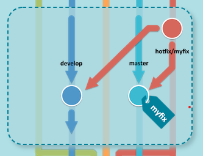

# Source Version Control (Git)
- Concepts: repository, registry, ssh
- File states, workflow, .gitignore and .gitkeep
- Basic commands: clone, checkout, add, commit, push, pull, merge, revert, reset, log… Using git features on PHPStorm
- Git flow

## Concepts
### Repository

`Repository` là nơi chứa và ghi lại `states` của thư mục và file. `states` lưu lại các thông tin, lịch sử thay đổi của thư mục và file.

- `GIT Repository` được phân thành 2 loại là `remote repository` và `local repository`.

    + `Remote repository`: Là repository để chia sẻ giữa nhiều người và git đặt trên server chuyên dụng của nó.
    + `Local repository`: Là repository trên máy local.

### Registry

- `Registry` hoạt động như một kho chứa chung, public hoặc private, cho nhiều `repository`. Thường dùng chung cho 1 tổ chức, có thể publish và share packages, có thể dễ dàng sử dụng như một phần `dependency` trong các dự án.

- GitHub Packages

    

- GitLab Container Registry

    


### SSH

- `SSH` là một giao thức tương tác giữa client-server có sử dụng cơ chế mã hoá mạnh mẽ nhằm  bảo vệ tính toàn vẹn và bảo mật thông tin liên lạc, ngăn chặn các hiện tượng đánh cắp thông tin trên đường truyền. Thường dùng như một phương pháp để đăng nhập từ xa an toàn từ máy tính này sang máy tính khác.

- `GIT SSH`: Bảo mật các kết nối của local với server và không phải nhập mật khẩu github hoặc gitlab mỗi lần pull hoặc push code. 

- Cơ chế xác thực của GIT SSH : Dùng Public/Private key cryptography
    + `Public Key` - là một file text - nó lại lưu ở phía `Git Server SSH`, nó dùng để khi `Client` gửi `Private Key` (file lưu ở Client) lên để xác thực thì tiến hành verify giữa `Private Key` và `Public Key` này. Nếu cặp key này đúng ( key pair được gen từ `ssh-keygen`) thì kết nối giữa client - git server là an toàn.
    + `Private Key` - là một file text - dùng để xác thực sự phù hợp của `Private Key` và `Public Key`. Client muốn kết nối với `Git Server`, thay vì nhập mật khẩu thì client gửi `Private Key` qua SSH.

- Tạo GIT SSH Key dùng `ssh-keygen` của `OpenSSH`

1. Mở terminate (trên Linux, macOS hoặc cmd trên Windows) rồi gõ

```
$ ssh-keygen -t rsa -b 4096 -C "your_email@example.com"
```

Đầu tiên nó hỏi nhập thư mục sẽ lưu key sinh ra, hãy nhập `thư mục` - `tên file` muốn lưu hoặc `nhấn Enter` để sử dụng đường dẫn nó gợi ý (~/.ssh/id_rsa). 

Sau đó nó yêu cầu nhập `passphase`, có thể nhấn Enter để rỗng. Cuối cùng nó sinh ra hai file key có tên `id_rsa` và `id_rsa.pub` ở thư mục đã nhập trên.


2. Start `ssh-agent`

Win &rarr; Services &rarr; OpenSSH Authentication Agent &rarr; Automatic (Delayed Start). Xong gõ 

```
$ start-ssh-agent
```


[refer](https://stackoverflow.com/questions/18683092/how-to-run-ssh-add-on-windows/40720527#40720527)

3. Adding new SSH key to GitHub account:

[refer](https://docs.github.com/en/authentication/connecting-to-github-with-ssh/adding-a-new-ssh-key-to-your-github-account)

4. Testing SSH connection

```
ssh -T git@github.com
```


[Hoặc](https://github.com/settings/keys)


## File states, workflow, .gitignore and .gitkeep

- File states: File có 2 states là `tracked` và `untracked`. Dưới đây là File status lifecycle

    

    + `Untracked state`: Files đang ở local directory, chưa được thêm vào `github repository index`. File khi này ở `untracked state`
    
    + `Unmodified state`: Files đã được thêm `github repository index` bằng lệnh `$git add file-name`. File khi này ở `tracked state`
    
    + `Modified state` : Khi Files được `tracked` trước đó có các thay đổi, chỉnh sửa nhưng không thực hiện việc `commit the changes.`

    + `Staged state` : Khi Files được `commit` và sẵn sàng `push` vào `git repository`.


- Workflow

Một basic git workflow:

1. `git clone...` hoặc `git pull ...`
2. `git add...`
3. `git commit -m ...`
4. `git push...`


- `.gitignore`: Liệt kê những file mà mình không mong muốn push lên git. Sử dụng các patterns:

    + Sử dụng `# `để comment và có thể để cách dòng cho dễ đọc.

    + Tên file cần ignore: `example.exe`

    + Cả thư mục: `example_folder/`

    + Sử dụng dấu `* `để ignore các file có cùng định dạng. Ví dụ như bạn muốn ignore tất cả các file .xml trong project: `*.xml`. 

    + Còn nếu dùng `config/*.xml` thì nó chỉ ignore cho các file `config/abc.xml` mà không ignore cho các file` config/sub/abc.xml`

    + Sử dụng `**` để ignore cho các thư mục không cần định rõ tên. Ví dụ: `**/foo ` nó sẽ ignore cho tất cả file hoặc thư mục có tên là foo ở mọi nơi trong project.

    + Sử dụng kiểu `folder/**` để ignore cho tất cả các file bên trong thư mục.

- `.gitkeep`: 
    + Git không cho push các thư mục trống. Nếu ta cố gắng push một thư mục không có gì trong đó, mặc dù nó sẽ tồn tại trên máy local nhưng lại không được push lên git repo.

    + Một phương pháp phổ biến, được tiêu chuẩn hóa (ko phải tính năng của Git) để giải quyết vấn đề này là tạo một file `.gitkeep` (hoặc tên gì cũng đc) vào các thư mục trống sau đó push bình thường. 

## Basic commands
### Cấu hình và khởi tạo Repo
- Đổi tên/email người dùng
```
git config --global user.name newname
```
```
git config --global user.email newmail@domain.com
```

- Khởi tạo một Local Repository mới
```
git init
```
- Khởi tạo một Remote Repository mới ở Git Server

```
git init --bare
```

### Làm việc với Local Repo
_git status_
- `git status` xem trạng thái của Repo
- `git status -s` xem trạng thái của Repo ngắn gọn
- `git clone path` clone một Repository có địa chỉ là path

_git add_
- `git add` cập nhật `file state` vào staged
- `git add filename` thêm file vào staged
- `git add *.c` thêm file có phần mở rộng .c
- `git add -A` thêm mọi thứ có sự thay đổi (thêm file mới, xóa file, thay đổi nội dung ...)
- `git add .` thêm mọi thứ trừ xóa file
- `git add -` thêm mọi thứ trừ file mới

_git commit_

- `git commit -m "commit msg ..."` commit mới
- `git commit --amend -m "commit msg ..."` commit + cập nhật vào commit cuối

_git log_

- `git log` xem lịch sử commit
- `git log -4` xem lịch sử 4 commit
- `git log -4 -p` xem lịch sử 4 commit + chi tiết thay đổi
- `git log --oneline` hay `git log --pretty=oneline` hiển thị log trực quan trên 1 dòng

_git diff_

- `git diff` Xem sự khác biệt giữa thư mục làm việc và staged
- `git diff --staged` Xem sự khác biệt giữa staged và commit cuối

_git rm, git reset, git clean_
- `git rm filename` xóa file
- `git reset HEAD filename` hủy thay đổi của file
- `git clean -d -fx .` Xóa các file không được tracked, dùng khi muốn xóa bỏ nhanh các file không được tracked

_git checkout_

- `git checkout <branchname>` chuyển sang branchname để code
- `git checkout -b <branchname> ` tạo mới branchname và chuyển sang branchname để code

### Làm việc với Remote Repo
_git remote_

- `git remote` xem list các Remote
- `git remote add name_remote addr_remote` thêm một Remote vào Local
- `git remote show name_remote` xem thông tin về Remote
- `git remote rename abc xyz` đổi tên Remote

_git pull, git fetch_

- `git pull <remote> <branch>` tải xuống nội dung từ Remote repository mà không làm thay đổi trạng thái của Local repository

- `git fetch <remote> <branch>`: tải xuống nội dung và cố gắng thay đổi trạng thái của Local repository cho phù hợp với nội dung đó

### Làm việc với Tag

- `git tag` xem danh sách tag
- `git tag -a tagname -m "tag msg"` tạo tag cho commit hiện tại
- `git tag -a tagname -m "tag msg" hash` tạo tag cho commit cũ
- `git show tagname` xem thông tin về commit có tagname
- `git push origin tagname` cập nhật lên remote tất cả tagname
- `git push origin --tags` cập nhận lên remote tất cả tag
- `git checkout tagname` xem về phiên bản commit có tagname
- `git checkout -b newbranchname tagname` tạo nhánh mới từ phiên bản tagname
- `git push --delete origin tagname` xóa tag ở remote
- `git tag -d tagname` xóa tag ở local

### Làm việc với branch

- `git branch` liệt kê các branch

- `git branch -v` liệt kê các branch + commit cuối
- `git branch --merged` các branch gộp vào branch đang checkin
- `git branch --no-merged` các branch không gộp vào branch đang checkin
- `git branch branchname` tạo branch mới
- `git checkout -b branchname` tạo branch mới, khi đang đứng ở một snapshot cũ
- `git checkout branchname` chuyển branch
- `git merge branchname` gộp branch với branch hiện tại
- `git base branchname` gộp branch với branch hiện tại
- `git mergetool` công cụ trực quan xử lý xung đột merge
- `git branch -d branchname` xóa branch

## Git flow

`Git Flow` là tên gọi của 1 tool (command) hỗ trợ branch model gọi là `A successful Git branching model` do ông Vincent Driessen đề xuất ra. Người ta thường gọi đó là model hay tool, và trong `git-flow` có 5 kiểu `branch` với mỗi vai trò khác nhau:

- `master`: là branch tồn tại xuyên suốt quá vòng đời của phần mềm được tạo mặc định trong Git khi ta tạo repository.

- `develop`: là nơi các develop phát triển chính branch luôn tồn tại song song với master

- `feature`: là nhánh được tách từ develop nhằm mục đích xây dựng các tính năng riêng mà không phụ thuộc vào nhau

- `release`: là nhánh tách từ develop để kiểm tra và fix bug chuẩn bị cho việc ra mắt sản phẩm

- `hotfix`: là nhánh tách từ master để fix gấp những bug còn tồn đọng mà trên release chưa xử lý hết 


### Git-flow extensions


__Develop__

1. Initialize

```
git flow init
```

__Features__

2. Start a new feature

```
git flow feature start MYFEATURE
```


3. Finish up a feature

```
git flow feature finish MYFEATURE
```


4. Publish a feature
```
git flow feature publish MYFEATURE
```

5. Getting a published feature

```
git flow feature pull origin MYFEATURE
```
__Release__

6. Start a release

```
git flow release start RELEASE
```


7. Publish a release

```
git flow release publish RELEASE
```

8. Finish up a release

```
git flow release finish RELEASE
```


__Hotfixes__

10. Start a Hotfix

```
git flow hotfix start VERSION [BASENAME]
```


11. Finish up a Hotfix

```
git flow hotfix finish VERSION
```



## Reference

1. [git-ssh](https://www.atlassian.com/git/tutorials/git-ssh)
2. [4 GIT’S FILE STATUS LIFECYCLE](https://codetej.in/4-gits-file-status-lifecycle/)
3. [File Status Lifecycle in Git](https://shitalmule04.github.io/file-status-lifecycle-in-git.html)

4. [Git commands](https://www.atlassian.com/git/glossary)

5. [35+ Git Commands List Every Programmer Should Know](https://www.loginradius.com/blog/async/git-commands/)

6. [git-flow cheatsheet](https://danielkummer.github.io/git-flow-cheatsheet/)