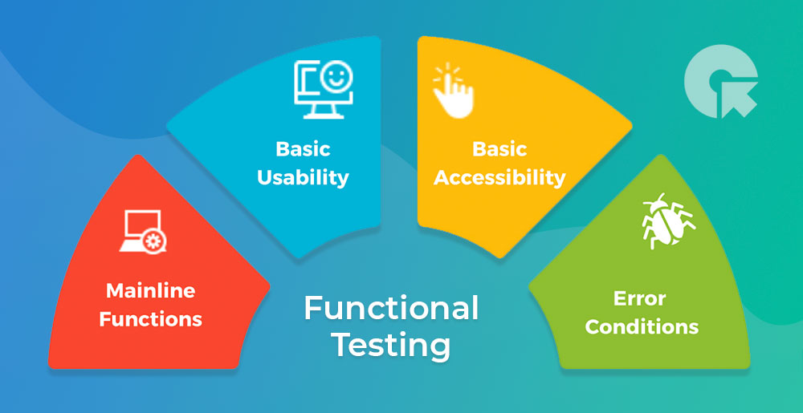
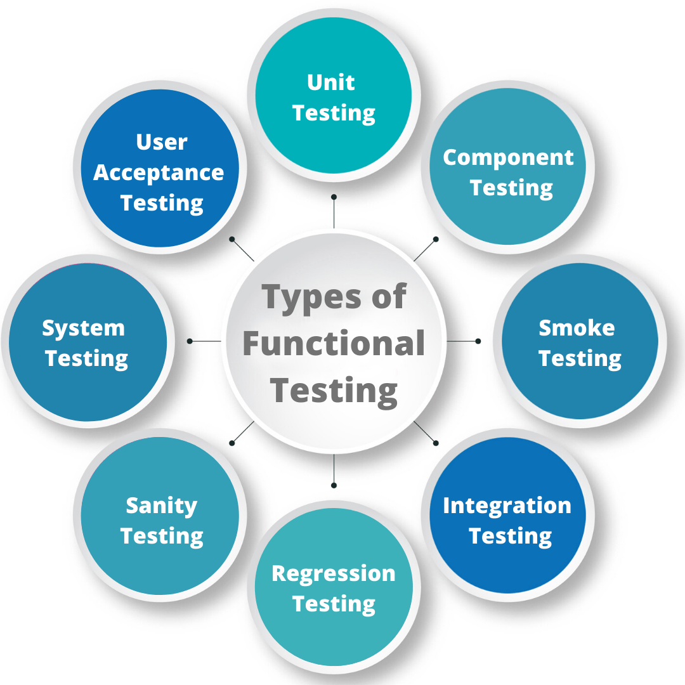
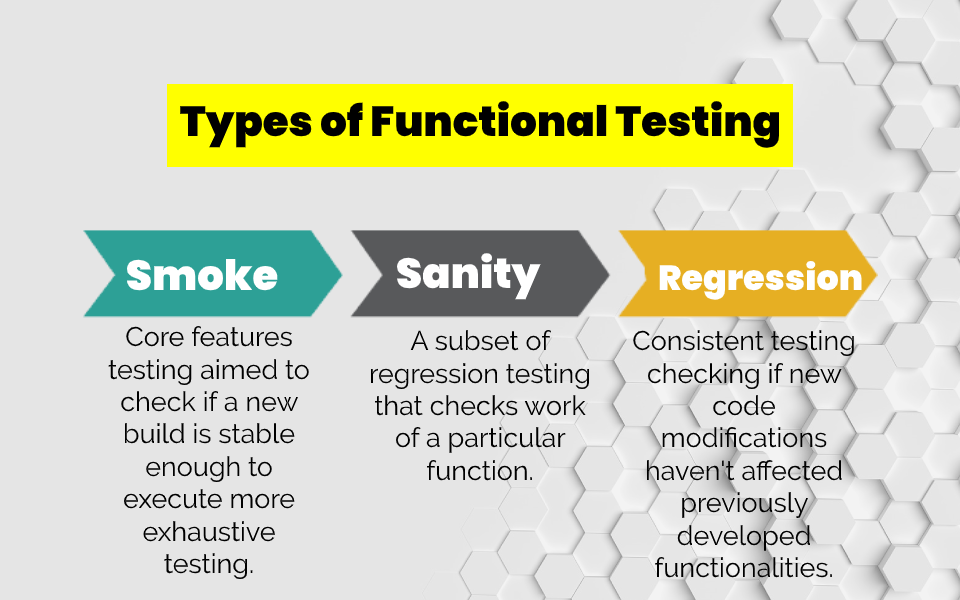
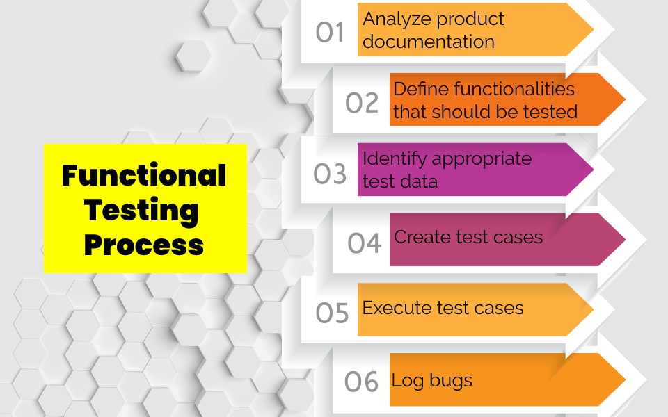

# Functional Testing

## Functional Testing and Related Concepts

`Software Testing` (kiểm thử phần mềm) được chia thành 2 loại: `Functional Testing` và `Non-Functional Testing`. Mỗi loại sẽ tương ứng với một nhiệm vụ khác nhau. Nói ngắn gọn thì `Non-Functional Testing` (kiểm thử phi chức năng) là loại kiểm tra với những mặt phi chức năng của một ứng dụng, phần mềm. Phi chức năng đó có thể là giao diện, trình bày, khả năng sử dụng, tính bảo mật, ... 

Còn `Functional Testing` (kiểm thử chức năng) là loại testing các chức năng phần mềm hoặc ứng dụng đang trong giai đoạn thử nghiệm. Việc lập test case, xác định input, output để define một functional test sẽ dựa vào đặc tả của ứng dụng/phần mềm hoặc hệ thống đang thử nghiệm theo yêu cầu của khách hàng, thông qua các tài liệu gọi chung là `Requirement Specification` nhờ đó việc testing ứng dụng chính xác với nhu cầu kiểm thử của phần mềm hơn.

Thông thường Functional Testing sẽ được test theo kỹ thuật [black box testing](https://en.wikipedia.org/wiki/Black-box_testing). Một Functional được test sẽ dựa trên document, một bộ test case đã được chuẩn bị trước đó. Phần mềm sẽ được kiểm thử trong môi trường thực tế nhằm đưa ra `Actual Result` xem liệu có sát nhất với kết quả mong đợi của khách hàng hay không. Nó được thực hiện thủ công và tương đối hiệu quả trong việc phát hiện lỗi sai của phần mềm. Ngoài ra còn 2 `Box Technique Testing` nữa là  `white box testing` và `gray box testing`, xem thêm tại [securitybox.vn](https://securitybox.vn/1897/phan-biet-black-box-test-white-box-test-va-grey-box-test/) hoặc [geeksforgeeks.org](https://www.geeksforgeeks.org/difference-between-black-box-vs-white-vs-grey-box-testing/)

## Benefits of Functional Testing

Functional Testing còn đem lại khá nhiều lợi ích:

- Tránh việc kiểm thử dư thừa với các chức năng không cần thiết

- Đảm bảo rằng customer hay end-user thực sự hài lòng với ứng dụng.

- Đảm bảo tất cả yêu cầu của ứng dụng đã được đáp ứng.

- Đảm bảo tất cả functions của ứng dụng hoạt động bình thường, không có bugs.

- Đảm bảo security và safety của ứng dụng

- Góp phần cải thiện chất lượng của sản phẩm

- Giảm rủi ro, tổn thất liên quan đến sản phẩm, phần mềm.

Functional Testing đảm bảo được nhiều thứ như trên nhưng việc pass Functional Testing chưa là tất cả. Trong kiểm thử phần mềm có nhiều quy trình, mỗi quy trình lại có một nhiệm vụ khác nhau. Tóm lại Functional Testing, nó sẽ làm phần đánh giá độ phù hợp của phần mềm với các đặc tả yêu cầu của end-user, đánh giá về các behavior của phần mềm mà end-user có thể tương tác và liệu end-user có hài lòng với version này của ứng dụng hay chưa. 

## Types of Functional Testing

Ngoài `Unit testing` thuộc Functional Testing đã nói kỹ ở module trước, thì có 3 loại phổ biến của functional testing là bao gồm:

- `Smoke Testing`: Được thực hiện trước khi thử nghiệm hệ thống trên môi trường thực tế. Mmục đích của Smoke Testing là kiểm tra các chức năng quan trọng có hoạt động ổn định không, sau đó mới quyết định có thử nghiệm rộng rãi hơn các chức năng khác không. Bước này sẽ giúp tiết kiệm khá nhiều thời gian cài đặt bản build mới. Đồng thời, Smoke Testing cũng sẽ giúp giảm thử nghiệm thêm khi các chức năng quan trọng không hoạt động. Có thể nói, Smoke Testing chính là loại kiểm tra tổng quát ban đầu.

- `Sanity Testing`: Loại thử nghiệm vào một chức năng cụ thể, một lỗi (bug) nào đó được fix để kiểm xem chức năng đó liệu có hoạt động tốt hay không. Ngoài ra, Sanity Testing cũng giúp xem xét các vấn đề khác do thay đổi những thành phần liên quan.

- `Regression Testing`: Được thực hiện khi bản build phần mềm đã fix những bugs trong lần test ban đầu. Nó cũng giúp xác minh xem các bug đã thực sự được fix hay chưa và kiểm tra toàn bộ phần mềm có hoạt động tốt với những thay đổi đó không.

Ngoài 3 loại phổ biến như trên, Functional Testing còn có

- `Integration Testing`: Giúp kiểm tra phần mềm có hoạt động đúng hay không khi các thành phần được tích hợp với nhau.

- `Components Testing`: Test xem các components trên UI có đúng với design chưa, work với backend đúng như specification chưa.

- `User Acceptance Testing`: Thông thường, end-user sẽ được cung cấp phiên bản dùng thử, đây là cách để kiểm tra xem phần mềm có hoạt động đúng theo yêu cầu thực tế hay không, end-user có dễ xài ứng dụng hay không và đánh giá độ hài lòng của end-user trước khi ra mắt chính thức sản phẩm.

- `System Testing`: Kiểm tra lại toàn bộ hệ thống sau khi tích hợp, nhằm đảm bảo hệ thống đáp ứng các yêu cầu đã đề ra.

## Functional Testing process

Thông thường kiểm thử chức năng sẽ tiến hành theo 6 bước sau:

1. `Analyze product documentation`: Phân tích các product documentation để xác định các functional mà phần mềm dự kiến sẽ test

2. `Define functionalities`: Lên kế hoạt test bằng việc định nghĩa functional nào sẽ được test như thế nào.

3. `Identify appropriate test data`: Xác định data set cho input cũng như output dựa trên các thông số kỹ thuật của functional được đặc tả trong Requirement Specification.

4. `Create test cases`: Viết các test case dựa trên kết quả từ 3 bước trên

5. `Execute test cases`: Thực thi các test case

6. `Analyze the test results`:  So sánh kết quả đầu ra chuẩn bị ở bước 3 và kết quả thực tế và dựa vào nhu cầu của khách hàng để đánh giá xem kết quả ở bước 5 có phù hợp hay không. Nếu không phù hợp thì log bugs để dev fix.

## Reference

1. [8 Functional Testing Types Explained With Examples - novateus.com](https://novateus.com/blog/8-functional-testing-types-explained-with-examples/)

2. [What is Functional Testing? Complete Guide With Types, Tools, and Techniques - deviqa.com](https://www.deviqa.com/blog/what-is-functional-testing-complete-guide-with-types-tools-and-techniques/)

3. [What is Functional Testing? Types & Examples (Complete Tutorial) - guru99.com](https://www.guru99.com/functional-testing.html)

4. [Functional Testing Types and its Benefits - xenonstack.com](https://www.xenonstack.com/insights/what-is-functional-testing)