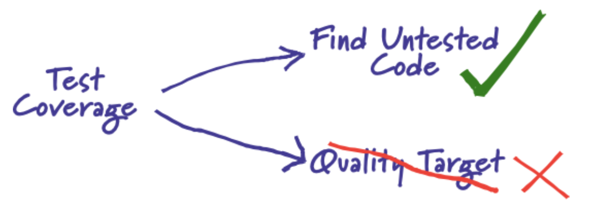
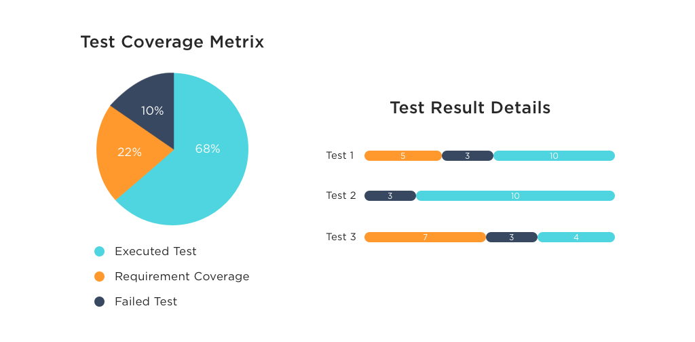
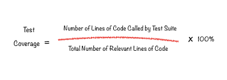
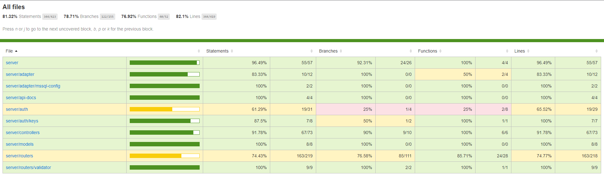

# Test Coverage

## Concepts

`Test coverage` là một kỹ thuật `black-box testing` xác định xem các test case có thực sự coverage - bao phủ gần như toàn bộ source code của ứng dụng hay không và bao nhiêu scripts được thực hiện khi chạy các test case đó. Ví dụ có 10 cái unit cần test và 100 test case được tạo ra để test cho 10 cái unit này. Nếu 100 test case này chỉ test toàn bộ code của 90% trong 10 cái unit, còn 10% code của các unit không test được thì coverage là 90%. Các con số phần trăm này gọi là `Test coverage metrics` và dựa trên số liệu, thống kê này, ta có thể tạo thêm các test case bổ sung cho các unit còn lại chưa được test và đánh giá mức độ bao phủ của test suite đang áp dụng cho dự án.

Có một concept tương tự với `Test coverage` là `Code Coverage`, đều là các kỹ thuật đo lường cho phép ta đánh giá chất lượng source code trong ứng dụng của mình. Dưới đây là một số điểm khác biệt quan trọng giữa `Test coverage` và `Code Coverage`:

Parameters | Code Coverage	| Test Coverage
---- | ---- | ----
Definition | Code coverage kiểm tra các application code được thực thi lúc ứng dụng đang chạy. | Test coverage kiểm tra sự tổng thể của test-plan.
Goal | Tạo ra `Code coverage metrics` giúp cả team giám sát các automated tests. | Tạo ra `Test coverage metrics` cung cấp chi tiết về mức độ bao phủ của việc viết test cho ứng dụng.
Subtypes | `statement coverage`, `condition coverage`, `branch coverage`, `loop coverage`, `FSM coverage`. | Không có subtype method.

Tóm lại:

???+ info "Test Coverage"

    Test Coverage is “What are we testing and How much are we testing?”

## Benefits of Test Coverage

- Phát hiện những khu vực của một requirement không được thực hiện bởi `set of test cases`, từ đó giúp ta tạo các test case bổ sung để tăng mức độ phù hợp của `set of test cases` với phần mềm.

- Xác định thước đo định lượng về test coverage, là một phương pháp gián tiếp để quality check cho phần mềm

- Phát hiện các test case vô nghĩa, không hỗ trợ cho việc increase coverage

- Đảm bảo `quality of the test` cho phần mềm

- Ngăn chặn [Defect leakage](https://www.guru99.com/defect-management-process.html) - `Defect` trong kiểm thử phần mềm là một biến thể hoặc sai lệch của phần mềm so với yêu cầu ban đầu của end-user hoặc business requirements 

## Types of Test Coverage

Test coverage sẽ được evaluated dựa trên các [types of testing](https://www.browserstack.com/guide/types-of-testing), tuy nhiên nó còn phụ thuộc vào các business priorities, của organization và của testing team. Ví dụ: các ứng dụng web `user-centric` - lấy user làm trung tâm thì sẽ ưu tiên các `UI/UX tests` hơn các functional tests. Ngược lại, các ứng dụng tài chính sẽ ưu tiên `system testing` và `security testing` hơn các types of testing khác. Dưới đây là một vài `test coverage mechanisms`:

- `Unit Testing`

- `Functional Testing`

- `Acceptance Testing`

- `Integration Testing`

Kết quả của Test coverage sẽ khác nhau tùy thuộc vào level mà tests được performed ở trên. Ngoài ra thì nó cũng phụ thuộc vào  type of software dùng để kiểm thử phần mềm. Các chỉ số của Test coverage metrics về cho điện thoại di động cũng sẽ khác với các chỉ số của Test coverage metrics trên web. Dưới đây là một số loại test coverage phổ biến:

- `Features Coverage`: Các test cases tạo ra tập trung vào maximum coverage cho `product features`. 

- `Risk Coverage`: Các `product requirement document` cần đề cập đến những rủi ro liên quan đến dự án và Risk Coverage sẽ cố gắng bao phủ tất cả các risk test của dự án để giảm thiểu những rủi ro này. 

- `Requirements Coverage`:  Các test cases tạo ra tập trung vào maximum coverage cho `product requirements` dựa vào các `requirement documents`. 

## Formula to calculate Test Coverage

Các tool để test coverage đều dựa trên công thức dưới đây để tạo ra `Test coverage metrics`:

- Bước 1: Tổng số X dòng code trong Test Suite của ứng dụng 

- Bước 2: Tổng số Y dòng code được Test Suite áp dụng để test, thường là source code của system component hay một service đang trong giai đoạn kiểm thử.

- Bước 3: Lấy X chi Y nhân 100% để ra được số phần trăm coverage của Test Suite.

Ví dụ tổng số dòng code trong một system component là 500 lines và số dòng code được thực thi trên tất cả các test case hiện có là 50, thì phạm test coverage là `(50 / 500) * 100 = 10%`
 
## Example

Một Test Coverage Metris sẽ được report kiểu:

Ví dụ trên là một Coverage Reporter trong MERN app dùng `nyc` trên `Mocha and Chai`, `nyc` sẽ gen ra một Coverage Reporter dưới dạng static web sau khi run test từ Mocha & Chai, sau đó mình lấy static web này deploy lên GitHub Pages, xem tại: [*https://smoothkt4951.github.io/KT-Ecommerce/*](https://smoothkt4951.github.io/KT-Ecommerce/)

## Reference

1. [WHAT IS TEST COVERAGE? - testmatick.com](https://testmatick.com/what-is-test-coverage)

2. [Why Test Coverage is an Important part of Software Testing? - simform.com](https://www.simform.com/blog/test-coverage/)

3. [Code Coverage vs Test Coverage : A Detailed Guide - browserstack.com](https://www.browserstack.com/guide/code-coverage-vs-test-coverage)

4. [Test Coverage Techniques: The Top Ones You Need - testim.io](https://www.testim.io/blog/test-coverage-techniques/)

5. [Test Coverage in Software Testing - guru99.com](https://www.guru99.com/test-coverage-in-software-testing.html)