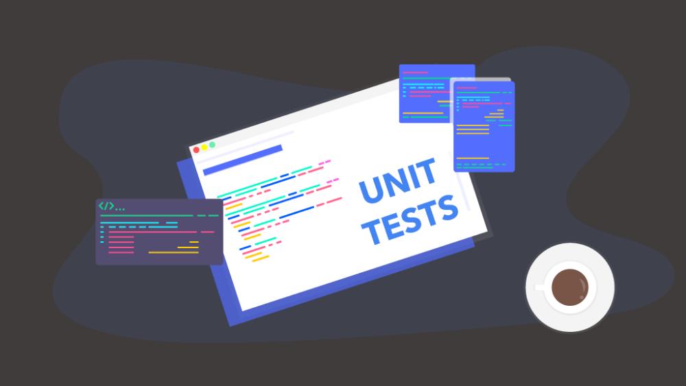
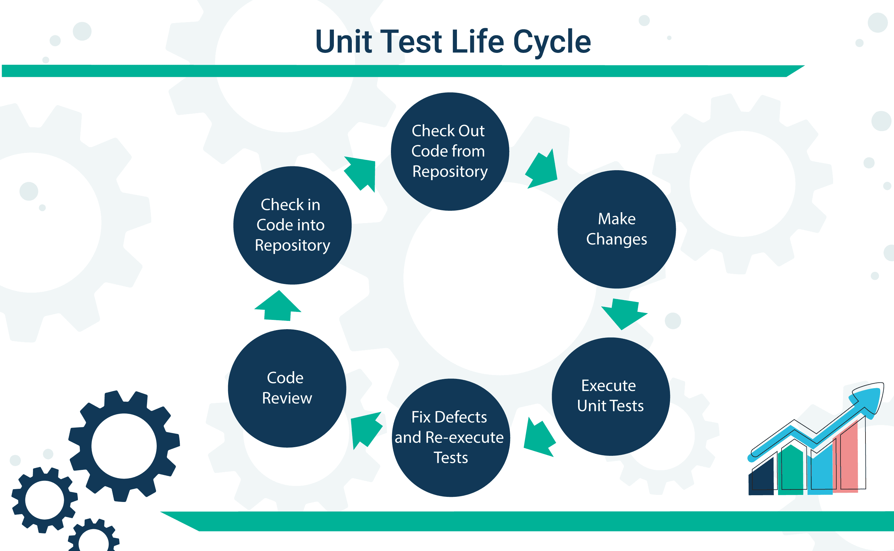
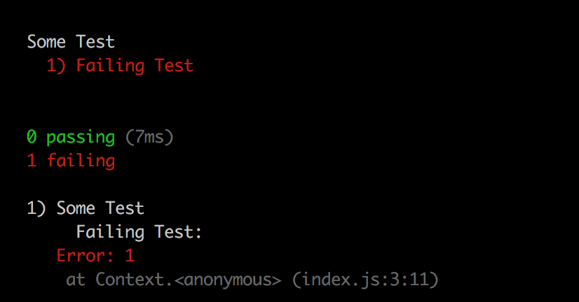
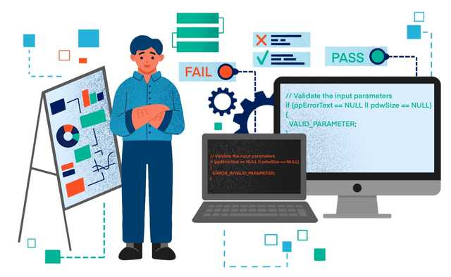

# Unit Testing

## Unit Test and Related concepts

`Unit Test` là một loại kiểm thử phần mềm, trong đó các unit hay thành phần riêng lẻ của phần mềm sẽ được tiến hành kiểm thử. Unit Test được thực hiện trong quá trình phát triển ứng dụng. Mục tiêu của Unit Test là cô lập một phần code và xác minh tính chính xác của unit đó.

Một Unit là một thành phần của phần mềm, đơn vị nhỏ nhất mà ta có thể test được như các `Function`, `Procedure`, `Class`, hoặc `Method`. Vì Unit được chọn để kiểm tra thường có kích thước nhỏ và chức năng hoạt động đơn giản, chúng ta không khó khăn gì trong việc tổ chức, kiểm tra, ghi nhận và phân tích kết quả kiểm tra nên việc phát hiện lỗi sẽ dễ dàng xác định nguyên nhân và khắc phục cũng tương đối dễ dàng vì chỉ khoanh vùng trong một Unit đang test.

Mỗi Unit Test sẽ gửi một message và test xem cái response nhận được có đúng với mong muốn hay không, bao gồm các kết quả trả về và cả các thông báo lỗi, ngoại lệ. 

Các scripts Unit Test hoạt động liên tục hoặc định kỳ để thăm dò và phát hiện các lỗi kỹ thuật trong suốt quá trình phát triển. Unit Test có các đặc điểm sau:

- Đóng vai trò như những người sử dụng đầu tiên của hệ thống.

- Có giá trị khi chúng make sure là các logic trong unit của app mình đang chạy đúng, hoặc có thể phát hiện các vấn đề tiềm ẩn, lỗi kỹ thuật v.v.

Khi làm việc với Unit test chúng ta cần biết vài khái niệm liên quan sau:

- `Assertion`: Là một phát biểu, mô tả các công việc testing cần tiến hành, ví dụ: `AreEqual()`, `IsTrue()`, `IsNotNull()` v.v Mỗi một Unit test sẽ gồm nhiều `assertion` để test cái output, tính chính xác của các lỗi ngoại lệ và các vấn đề phức tạp khác như: 
    + Sự tồn tại của một object 
    + Các giá trị có vượt ra ngoài giới hạn hay không 
    + Thứ tự thực hiện của các luồng logic, dữ liệu trong unit đang được test.

- `Test Point`: Là một đơn vị kiểm tra nhỏ nhất, chỉ chứa một `assertion` duy nhất nhằm khẳng định tính đúng đắn của một chi tiết trong scripts nào đó.

- `Test Case`: Là một tập hợp các `test point` nhằm kiểm tra một đặc điểm chức năng cụ thể, chẳng hạn như toàn bộ giai đoạn user nhập dữ liệu, gửi đến server, server reponse về cho user và ghi dữ liệu vào database.

- `Test Suite`: Là một tập hợp các `test case` định nghĩa cho từng module hoặc sub systems.

- `Regression Testing`/ `Automated Testing`: Là phương pháp kiểm thử tự động sử dụng một phần mềm đặc biệt như `LambdaTest`, `TestComplete`, `Selenium` được thiết kế riêng cho việc kiểm thử tự động này. Cùng một loại dữ liệu testing giống nhau nhưng được tiến hành nhiều lần lặp lại tự động nhằm ngăn chặn việc lặp lại các lỗi cũ. Kết hợp Regression Testing với Unit Testing sẽ đảm bảo các scripts mới thêm vào source code vẫn đáp ứng yêu cầu và source code cũ sẽ không bị ảnh hưởng.

## Unit Test Life Cycle

Hình trên mô tả Life Cycle của một unit test, sau khi kết thúc một Life Cycle, UT sẽ có 2 status cơ bản:

## Why is unit testing important?

Công việc viết Unit Test có thể mất nhiều thời gian hơn code rất nhiều nhưng lại có lợi ích sau:

- Tạo ra môi trường lý tưởng để kiểm tra bất kỳ đoạn code nào, có khả năng thăm dò và phát hiện lỗi chính xác, duy trì sự ổn định của toàn bộ PM và giúp tiết kiệm thời gian so với công việc gỡ rối truyền thống.

- Phát hiện các thuật toán thực thi không hiệu quả, các thủ tục chạy vượt quá giới hạn thời gian.

- Phát hiện các vấn đề về thiết kế, xử lý hệ thống, thậm chí các mô hình thiết kế.

- Phát hiện các lỗi nghiêm trọng có thể xảy ra trong những tình huống rất hẹp.

- Tạo safety area cho các block code: Bất kỳ sự thay đổi nào cũng có thể tác động đến hàng rào này và thông báo những nguy hiểm tiềm tàng.

## Reference

1. [What is unit testing? - blog.autify.com](https://blog.autify.com/what-is-unit-testing)

2. [Unit Testing Tutorial: What is, Types, Tools & Test EXAMPLE - guru99.com](https://www.guru99.com/unit-testing-guide.html)
