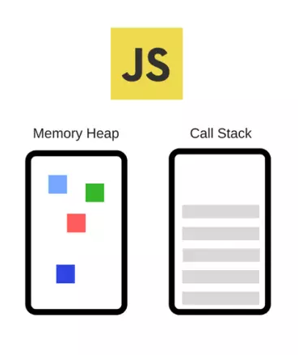
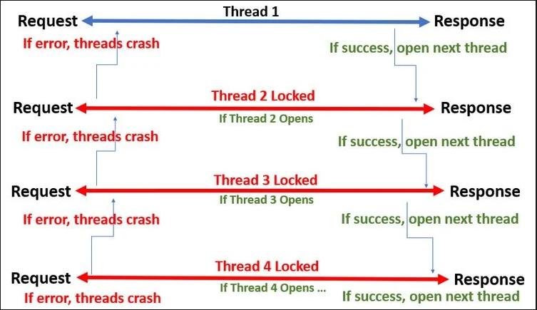
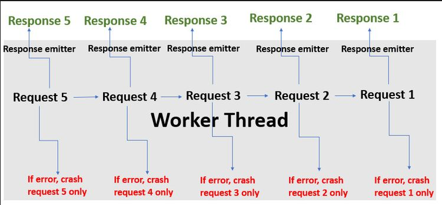

# Programming
- Processes and threads
- Error handling
- Async programming
- Memory management


## Processes and threads
### Concepts

- `program`: tồn tại trong bộ nhớ hoặc ở trạng thái nghỉ, `program` có thể là một tập lệnh dựa trên văn bản (tệp DOS, tập lệnh Windows Powershell, tập lệnh bash shell, Javascript, v.v.) hoặc tập lệnh thực thi dựa trên nhị phân (.exe).

- `process`:  Là một `program` được nạp vào bộ nhớ để bộ xử lý, thực thi. (_loaded into the memory to be executed by the processor._)

- `thread`: Là đơn vị thực thi tối thiểu của các đoạn mã do hệ điều hành quản lý. Trong hệ điều hành, một `process` có thể được chia thành các  `thread`.

### Process vs. Thread


| Comparison Basis     | Process | Thread |
| ----------- | ----------- | ----------- |
| Definition |  Là một `program` đang được thực thi| Là một `process` được chia nhỏ, có thể được quản lý độc lập bởi `schedular` |
| Context switching time | Đòi hỏi nhiều thời gian hơn để chuyển đổi context vì chúng nặng hơn | Yêu cầu ít thời gian hơn để chuyển đổi context vì chúng nhẹ hơn |
| Memory Sharing | Hoàn toàn độc lập và không chia sẻ bộ nhớ | Có thể chia sẻ một số bộ nhớ với các `thread` ngang hàng của nó. |
| Communication | Đòi hỏi nhiều thời gian hơn | Yêu cầu ít thời gian hơn |
| Blocked | Trong một nhóm `process` ngang cấp, nếu một `process` bị block, các `process` còn lại có thể tiếp tục thực thi. | Nếu một `thread` bị block, tất cả các `thread` ngang hàng của nó cũng bị block. |
| Resource Consumption | Yêu cầu nhiều tài nguyên hơn | Cần ít tài nguyên hơn |
| Dependency | Các `process` độc lập với nhau | `thread` là các phần của một `process` và do đó chúng phụ thuộc vào `process` |
| Data and Code sharing | Có data và code segment độc lập | Một `thread` chia sẻ data segment, code segment, file, v.v... với các `thread` ngang hàng |
| Treatment by OS | Tất cả các `process` khác nhau được hệ điều hành xử lý riêng biệt. | Tất cả các `thread` ngang hàng nhau được hệ điều hành coi như một tác vụ duy nhất. |
| Time for creation | Tạo tốn nhiều thời gian hơn | Tạo tốn ít thời gian hơn |
| Time for termination | Cần nhiều thời gian hơn để kết thúc | Cần ít thời gian hơn để kết thúc |

## Error handling

## Concepts

- Khi một `process` thực thi bị thất bại thì `program` sẽ bị `error`. Và  quá trình đi từ dự đoán, phát hiện và giải quyết các `error` này, giúp cho các `process` thực thi thành công được gọi là `Error handling`.

- Quá trình `Error handling` bao gồm phần cứng và phần mềm. Việc xử lý lỗi thường được phát hiện bằng việc trả về các `Error code` hoặc các `Error message` cụ thể. 

- Trong quá trình Runtime của `program`, có thể xảy ra tình trạng lỗi qua các `exception events`, dẫn tới `error`: dữ liệu không hợp lệ, không tìm thấy file, tràn bộ nhớ v.v. Và để xử lý tình trạng này, người ta dùng kỹ thuật `Exception Handling` - một kỹ thuật xử lý các `Runtime Error`, `Exception Events`. Kỹ thuật này giúp duy trì các `process` chạy theo đúng nghĩa của nó, nếu có lỗi thì sẽ `catch` các `Error code` hoặc các `Error message` cụ thể. 
### Error handling in Nodejs


```
Errors in Node.js are handled through exceptions.
```

- Một `exception` được tạo bằng cách sử dụng từ khóa `throw`: 
```js
throw value
```
- Sau khi JavaScript thực thi dòng này, chương trình tạm dừng và lỗi được gửi tới `exception handler` - một câu lệnh `try/catch`:

```js
try {
  //lines of code
} catch (e) {}

```


- Trong Node.js, không throw `strings`, mà là throw `Error objects`:
```js
throw new Error('Ran out of coffee')
```
hoặc 
```js
class NotEnoughCoffeeError extends Error {
  //...
}
throw new NotEnoughCoffeeError()
```

- `Error handling` trong NodeJS với `async/await`:
```js
async function someFunction() {
  try {
    await someOtherFunction()
  } catch (err) {
    console.error(err.message)
  }
}

```
## Async programming
### Concepts


- `Javascript Engine`:  `V8 Javascript Engine` - optimized version,  bao gồm hai thành phần chính:
    
    
    + `Call Stack`: stack chứa các lời gọi hàm khi code được thực thi.
    + `Memory Heap`: Cấp phát bộ nhớ cho các `process`

- `Event Loop` và `Callback Queue`: Bên cạnh `Javascript Engine`, browser còn cung cấp các `Node APIs`, một `Event Loop` và một `Callback Queue`. Chúng chạy trên các `thread` riêng và được browser kiểm soát đồng thời (`concurrency`). 
    + Các hàm `async callback` sẽ được thêm vào `Callback Queue`. 
    + Nhiệm vụ của `Event Loop` là đợi đến khi `Call Stack` rỗng, và quay lại kiểm tra trong `Callback Queue` có gì không, nếu có thì lấy lần lượt chúng đẩy vào trong `Call Stack` để chạy tiếp.


### Synchronous vs. Asynchronous Programming

- `Asynchronous programming`: Về bản chất, nó thực hiện các request đồng thời, ngay cả khi chúng ở các chức năng khác nhau. Một single thread sẽ được handle multiple-requests trong `event-loop`. Vì vậy, việc một request bị reject sẽ không ảnh hưởng đến request khác.NodeJS cho phép thực hiện lập trình bất đồng bộ. Khi bất đồng bộ thực thi tất cả dòng code cùng một lúc.

- `Synchronous programming`: Tải tài nguyên một cách đơn lẻ và tuần tự, như vậy khi 1 tài nguyên trong hệ thống `có phân cấp` không tải được, thì những tài nguyên bên dưới nó sẽ không tải được luôn. Với NodeJS, ở chế độ đồng bộ thực thi từng dòng và tiến hành thực thi dòng tiếp theo khi dòng hiện tại đã thực thi xong.


***Synchronous***

- Tải tài nguyên một cách đơn lẻ và tuần tự, khi một tài nguyên trong hệ thống có phân cấp không tải được, thì những tài nguyên bên dưới nó sẽ không response.

- Các request sẽ được hoạt động đồng bộ với giao thức đa luồng.

- Mỗi `thread` sẽ xử lý 1 request riêng biệt, độc lập. Vì vậy, mỗi thread sẽ có 1 khoảng thời gian `execution` và `loads completely` trước khi thực hiện `event` tiếp theo. Do đó, việc `execution` và `loads completely` trong một thread sẽ `block` các thread khác, các thread khác phải đợi thread trước nó done rồi mới tới lượt `execution` và `loads completely`.



- Lập trình đồng bộ đảm bảo rằng phía client sẽ nhận được response từ request đầu tiên trước khi thực hiện request tiếp theo (FIFS). Điều này có thể dẫn đến sự chậm trễ không cần thiết và ảnh hưởng xấu đến UX.

***Asynchronous***

- Trong Asynchronous Programming, một apps sẽ serve các request và response bằng cách sử dụng giao thức non-blocking I/O. 

- Khác với lập trình đồng bộ, một chương trình không đồng bộ không thực hiện các actions một cách tuần tự, thứ bậc. Vì vậy, chương trình sẽ không đợi thực hiện một request trước khi trả lời một request khác.

- Về bản chất, nó thực hiện các request đồng thời, ngay cả khi chúng ở các chức năng khác nhau. Từ đó mang lại hiệu quả là một ứng dụng được phát triển bằng Asynchronous Programming sẽ chỉ tải toàn bộ nội dung của nó một lần.

- Một single thread xử lý nhiều request trong một `event loop`. Vì vậy, việc một request không thành công sẽ không ảnh hưởng đến request kia.



- Vì asynchronous loading theo kiểu non-blocking, nên các ứng dụng web hoạt động theo nguyên tắc này có thể trở thành các single-page applications.

### Asynchronous programming in NodeJs

- Một chương trình được thực thi bất đồng bộ đem lại trải nghiệm, tốc độ xử lý tốt hơn, tuy nhiên chính vì sự bất nguyên tắc, không có thứ tự thực hiện như vậy nên việc quản lý các tiến trình trở nên phức tạp và khó khăn hơn, xét ví dụ dưới đây:

```js
const fs = require('fs');
let content;
try {
  content = fs.readFileSync('file.md', 'utf-8');
} catch (err) {
  console.log(err);
}
console.log(content);

```

- Vấn đề ở đây là các `thread` sẽ bị block khi `fs.readFileSync()` đang thực thi, thực thi xong thì mới chạy tới các `thread` khác, tốn perfomance, thời gian. VD nếu có lỗi trong quá trình đọc file, phải đợi đến khi đọc file xong mới log ra được lỗi.

- Cách giải quyết ở đây là sử dụng `callback` truyền vào `fs.readFileSync()`:

```js
const fs = require('fs');

console.log('start reading a file...');

fs.readFile('file.md', 'utf-8', function (err, content) {
  if (err) {
    console.log('error happened during reading the file')
    return console.log(err)
  }
  console.log(content)
});

console.log('end of the file');
```

- Với ví dụ này, Ta có thể dùng `Promise` để đọc nhiều file:

```js
const fs = require('fs');

function readMultipleFile(file) {
  return new Promise((resolve, reject) => {
    fs.readFile(file, (err, content) => {
      if (err) {
        return reject(err);
      }
      resolve(content);
    });
  });
}

Promise.all([readMultipleFile("file1"), readFile("file2"), readFile("file3")])
  .then((content) => console.log(content))
  .catch((err) => console.log(err));
```

- Việc dùng `callback` hay `Promise` như trên có thể dẫn tới hiện tượng [callback hell](https://tutorialzine.com/media/2017/07/callback-hell.jpg) và `Promise chain`. Và tính năng `Async/Await` trong Javascript ra đời để giải quyết tình trạng trên, giúp chúng ta làm việc với các hàm bất đồng bộ ngắn gọn và dễ hiểu hơn. 

- `Async/Await` được xây dựng trên `Promise` và tương thích với tất cả các `Promise` dựa trên API, trong đó:
    + `Async` - khai báo một hàm bất đồng bộ kiểu 
        ```js 
        async function someName(){...})
        ```

        + Tự động biến đổi một hàm thông thường thành một `Promise`.
        + Khi gọi tới hàm `async` nó sẽ xử lý mọi thứ và được trả về kết quả trong hàm của nó.
        + `Async` cho phép sử dụng `Await`.

    + Await - tạm dừng việc thực hiện các hàm async.
        ```js
        const result = await someAsyncCall (){...}
        ``` 

        + Khi được đặt trước một `Promise`, nó sẽ đợi cho đến khi `Promise` kết thúc và trả về kết quả.
        + `Await` chỉ làm việc với `Promise`, nó không hoạt động với `callback`.
        + `Await` chỉ có thể được sử dụng bên trong các function `async`.

```js
const fs = require('fs');
const readFileAsync = async function (file){
    try {
        let content = await fs.readFile(file);
        return content;
    } catch (error) {
        return error;
    }
}

const contents = await Promise.all([readFileAsync("file1"), readFileAsync("file2"), readFileAsync("file3")]);
console.log(contents);
```

## Memory management

### Concepts and Memory life cycle

- Mọi ứng dụng đều cần bộ nhớ để hoạt động bình thường. `Memory management` - `Quản lý bộ nhớ` là quá trình phân phối dynamically các `memory chunks` cho `programs` khi chúng cần và giải phóng để thằng khác xài khi `programs` không còn cần bộ nhớ đó nữa. Việc quản lý bộ nhớ ở Application-level có thể là thủ công hoặc tự động.

- Các ngôn ngữ bậc thấp như C, quản lý bộ nhớ thủ công như `malloc()` và `free()`. Việc quản lý bộ nhớ thủ công có thể gây ra một số lỗi lớn cho ứng dụng, chẳng hạn việc bộ nhớ bị rò rỉ khi không gian bộ nhớ đã sử dụng không bao giờ được giải phóng.

- Trong JavaScript hay NodeJs đều hỗ trợ `garbage collector` - trình thu gom rác, tự động cấp phát bộ nhớ khi các đối tượng được tạo và giải phóng nó khi chúng không được sử dụng nữa.

- `Memory life cycle`: Bất kể ngôn ngữ lập trình gì, `Memory life cycle` luôn giống nhau:

  + Phân bổ bộ nhớ cho `process`
  + `process` sử dụng bộ nhớ được cấp phát (đọc, ghi)
  + Giải phóng bộ nhớ được cấp phát khi `process` không cần thiết nữa.

### Memory management with Garbage Collection 
- `Garbage collection`: Là cơ chế thu dọn và xóa sổ những object/giá trị không còn được dùng tới, trả lại bộ nhớ để dùng cho việc khác. `GC` của V8 là một [Generational Garbage Collector](https://www.memorymanagement.org/glossary/g.html#term-generational-garbage-collection). Trong quá trình thực thi, các giá trị (biến, object,...) được tạo ra nằm trong `Memory Heap`. V8 chia `Memory Heap` ra làm nhiều khu vực, trong đó có hai khu vực chính là `new-space`- chứa các đối tượng nhỏ, có vòng đời ngắn và `old-space` - chứa các thành phần sống dai hơn, bự hơn.


**Cơ chế hoạt động:**

- Khi chúng ta khai báo một giá trị mới, giá trị này sẽ được cấp phát nằm rải rác trong khu vực `new-space`, khu vực này có một kích thước nhất định, thường là rất nhỏ (khoảng 1MB đến 8MB, tùy vào cách hoạt động của ứng dụng). Việc khai báo như thế này tạo ra nhiều khoảng trống không thể sử dụng được trong bộ nhớ.

- Khi `new-space` đầy, thì thuật toán `scavenge` sẽ được kích hoạt để dọn dẹp các vùng nhớ "chết", giải phóng mặt bằng, có thể sẽ gom góp các vùng nhớ rời rạc lại gần nhau cho hợp lý. Vì `new-space` rất nhỏ, nên `scavenge` được kích hoạt rất thường xuyên. 

- Trong quá triển khai `scavenge`, nếu các vùng nhớ nào còn trụ lại được sau 2 chu kỳ, thì được đưa lên (promote) khu vực `old-space`, nơi mà có sức chứa lên đến hàng trăm megabytes, và là nơi mà thuật toán` mark-sweep` hoặc `mark-compact` hoạt động, với chu kỳ dài hơn, ít thường xuyên hơn.

Tóm lại, cơ chế GC trên đều hoạt động thông qua hai bước chính là:

- Bước đánh dấu: thuật toán sẽ duyệt qua tất cả các giá trị có trong khu vực bộ nhớ mà nó quản lý, bước duyệt này dùng `depth-first search`, tìm gặp và đánh dấu.

- Bước xử lý: sau quá trình duyệt, tất cả những giá trị chưa được đánh dấu, sẽ bị coi là đã "chết", và sẽ bị xóa bỏ, trả lại bộ nhớ trống (sweep), hoặc gom góp lại để lấy lại các khoảng trống trong bộ nhớ không sử dụng được (compact).

### Avoid Memory leaks
- Lý do chính của `memory leaks` trong các ngôn ngữ có cơ chế `garbage collection` là các có các `unwanted references` - là một vùng nhớ được trỏ đến mà lại không được sử dụng trong ứng dụng nhưng vì lý do nào đó mà nó vẫn được giữ lại trong hệ thống. Khi số lượng `unwanted references` nhiều, free memory không đủ để cung cấp sẽ dấn đến hượng tượng `memory leaks`.

- Trong JS, những `unwanted references` này thường là các variables nằm đâu đó trong code và nó không được sử dụng đến nhưng lại chiếm một phần của bộ nhớ. Có 3 loại `memory leaks` trong JS:

1. `Global variable`: Javascript có một cơ chế là đặt biến mà không cần khai báo. Ví dụ:
  ```js
  a = "value";
  ```
- Khi một biến được khai báo như trên thì JS sẽ tự động gán nó vào global object (window trên browser). Nếu như biến này chỉ hoạt động trên phạm vi `global scope` thì cũng không có sự khác biệt cho lắm. Tuy nhiên, nếu nó được định nghĩa trong một hàm thì đó lại là chuyện khác. Ví dụ:
```js
function foo(){
  bar = "đây là biến toàn cục ẩn"
}
```

- Nếu khai báo `bar` trong phạm vi của hàm `foo()` mà lại không sử dụng `var` để khai báo thì biến `bar` sẽ được tạo với `global scope`. Khi đó tuy là chỉ khi gọi hàm `foo()` thì mới cần dùng tới biến `bar`, tuy nhiên là `global scope` nên lúc nào ông `bar` cũng chiếm 1 phần bộ nhớ, và đây là một ví dụ điển hình về `memory leaks`.

2. `Callback` và `timer` bị lãng quên
một ví dụ dẫn đến memory leak khi sử dụng setInterval
```js
var data = getData();
setInterval(function(){
  var node = document.getElementById("Node");
  if(node){
    node.innerHTML = JSON.stringify(someResource));
  }
}, 1000);

```
- `Timer` bị treo tức khi `timer` tham chiếu đến các node hoặc dữ liệu mà không còn được sử dụng nữa. Ở ví dụ trên, nếu như `node` bị xóa ở một lúc nào đấy thì toàn bộ đoạn code xử lý trong hàm `callback` của `interval` sẽ không cần đến nữa. Tuy nhiên, trường hợp node bị xóa trong khi interval vẫn còn hoạt động thì các vùng nhớ được sử dụng trong hàm callback của interval cũng không được giải phóng (muốn giải phóng cần dừng interval lại). Tiếp đó, các object từ bên ngoài mà được hàm callback của interval tham chiếu đến cũng không thể được giải phóng vì vẫn có thể được gọi thông qua hàm callback kia. Trường hợp này cũng dấn đến `memory leaks`.

3. Tham chiếu tới các DOM đã bị xóa

- Khi cần lưu DOM vào một số cấu trúc dữ liệu như mảng hoặc object trong JS code để làm một loạt các tác vụ nào đó. 

- Ví dụ update dữ liệu của một vài DOM element nào đó, ta cần lưu các element này vào một mảng, object trong JS. 

- Nếu ta update xong ta xóa các DOM element cũ đi, khi đó node con (element) còn tham chiếu đến node cha (array, object) nên nó sẽ được GC coi là vẫn được tham chiếu và bỏ qua nó, từ đó có thể dẫn đến `memory leaks`. Nên cẩn thận khi tham chiếu đến các DOM.


4. Closures

- `Closures` là hàm nằm trong `scope` của một hàm khác có thể tham chiếu tới các biến của hàm bao nó.
- Khi một scope được tạo ra cho các closures mà có cùng scope cha, chúng sẽ cùng chia sẻ scope đó. Mặc dù scope con không được gọi đến nhưng vì nó có tham chiếu đến scope cha nên nó sẽ được GC coi là vẫn đang hoạt động, từ đó có thể dẫn đến `memory leaks`.
## Reference 

1. [program-process-and-thread](https://wentzwu.com/2020/02/23/program-process-and-thread/)

2. [Difference between Process and Thread](https://www.geeksforgeeks.org/difference-between-process-and-thread/)

3. [Error handling in Nodejs](https://nodejs.dev/learn/error-handling-in-nodejs)

4. [Synchronous vs. Asynchronous Programming](https://www.makeuseof.com/synchronous-asynchronous-programming-different/)

5. [Node Hero – Understanding Async Programming in Node.js](https://blog.risingstack.com/node-hero-async-programming-in-node-js/#asynchronousprogramminginnodejs)

6. [Memory Management Glossary](https://www.memorymanagement.org/glossary/g.html)

7. [4 Types of Memory Leaks in JavaScript and How to Get Rid Of Them](https://auth0.com/blog/four-types-of-leaks-in-your-javascript-code-and-how-to-get-rid-of-them/)
8. [Memory Management](https://developer.mozilla.org/en-US/docs/Web/JavaScript/Memory_Management)