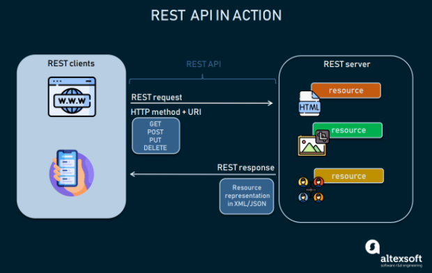

# RESTful
- Concept
- Methods and Api design best practice
- Api document (Swagger)

## Concepts

- `Web services`
    + Là phương thức giao tiếp giữa hai thiết bị qua Internet
    + Là một module phần mềm được thiết kế để thực hiện một nhóm các tác vụ nhất định.
    + Là tập hợp các tiêu chuẩn hoặc giao thức để trao đổi thông tin giữa hai thiết bị, ứng dụng với nhau.

- `API - Application Programming Interface`
    + Là các phương thức, giao thức kết nối với các ứng dụng với nhau.
    + Cung cấp khả năng truy xuất, trao đổi dữ liệu giữa các ứng dụng.

- `REST - REpresentational State Transfer`
    + Là 1 kiểu kiến trúc lập trình, định nghĩa các quy tắc để thiết kế web service chú trọng vào `resource` 
    + Hoạt động theo mô hình `Client - Server`.
    + Sử dụng `HTTP Protocol`, `REST` gửi HTTP request/response đến một URL để trao đổi, xử lý dữ liệu.
    + Mọi thứ trong `REST` đều được coi là `resource` và được định danh thông qua URI, và có thể được biểu diễn thông qua dạng văn bản, XML, JSON v.v
    + `RESTful` là những ứng dụng mà có sử dụng kiến trúc `REST`

- `RESTful Web services` và `RESTful API`:

    + `RESTful API` là một API tuân thủ `REST architecture`. `RESTful Web services` là một `Web services` tuân thủ `REST architecture`.
    
    + `REST` thường được triển khai bằng `Web tech`, nên có thể hiểu về `RESTful API` là một loại của `Web services`.

### REST API paradigm




+  `client-app ` hoặc `software`, gọi chung là `REST Client`: Chạy trên thiết bị của user và initiates cho sự giao tiếp, trao đổi dữ liệu giữa `REST Client` với `REST Server`.

+ `REST Server`: Cung cấp một `API` với vai trò là một phương tiện để user truy cập vào dữ liệu hoặc các tính năng của nó.

+ `resource`: Là bất kỳ phần nội dung, dữ liệu nào mà server có thể cung cấp cho client.


Để có quyền truy cập vào `resource`, `REST Client` sẽ gửi một `HTTP request` tới `REST Server`.  Sau đó `REST Server` tạo `HTTP response` với `resource` được mã hóa.

Cả hai loại `REST messages` như trên đề mang tính `self-descriptive`, nghĩa là một `REST messages` sẽ chúng chứa thông tin về cách xử lý và diễn giải cho `REST messages` đó.

- `REST messages structure`

___REST Request___


- `HTTP method`: Mô tả những actions, methods gì sẽ được thực hiện với một `resource`.

- `Endpoint`: chứa `Uniform Resource Identifier - URI`cho biết vị trí và cách truy cập resource trên Internet. Loại URI phổ biến nhất là `Unique Resource Location - URL`, đóng vai trò như một địa chỉ web hoàn chỉnh.

- `Headers`: Chứa thông tin liên quan đến client và server

- `Body`: Chứa thông tin cần gửi đến server 

___REST Response___


Server không gửi chính xác resource được request mà là `representation` bản đại diện của nó - một mô tả mà phía client có thể đọc được về `state` hiện tại của nó. Cùng một resource có thể được biểu diễn ở các định dạng khác nhau, nhưng những định dạng phổ biến nhất là XML và JSON.

## Methods and Api design best practice

### 1. REST guiding principles

Các nguyên tắc hướng dẫn về REST được đề ra bởi Fielding:

- `Client–server` : Bằng cách tách các vấn đề của `user interface` khỏi các vấn đề của việc lưu trữ dữ liệu, việc áp dụng mô hình `Client–server` sẽ cải thiện tính linh động của `user interface` và cải thiện khả năng mở rộng của app.

- `Stateless`:
    + Mỗi request từ client đến server phải chứa toàn bộ các thông tin cần thiết để server có thể hiểu request và không lưu context nào trên server mà sẽ được ở local. 
    + `Visibility` - chỉ cần nhìn vào 1 request để hiểu được bản chất đầy đủ của nó, 
    
    `Reliability`: Là stateless nên nhiệm vụ khôi phục dữ liệu sau các lỗi trở nên đơn giản hơn rất nhiều.
    
   + `Scalability` - Server không phải lưu trữ trạng thái giữa các request, không phải quản lý việc sử dụng tài nguyên giữa các request &rarr; cho phép máy chủ nhanh chóng giải phóng tài nguyên và đơn giản hóa hơn nữa việc triển khai.

- `Cacheable` – Thông tin response về client sẽ được đánh dấu là có thể được cache hay không. Nếu response là có thể được cache thì client sẽ được quyền tái sử dụng các dữ liệu response đó cho các lần sử dụng tiếp theo.

- `Uniform interface` –  REST được định nghĩa bởi 4 ràng buộc về interface:
    + `URI` - Định danh resource 
    + `Resource method`: Các thao tác trên resource, được tiến hành thông qua các đại diện (representations)
    + Hệ thống `message` mang tính tự mô tả
    + `Hypermedia` sẽ là engine của application state

- `Layered system` – Cho phép kiến trúc được cấu thành bởi các lớp phân cấp trong đó mỗi thành phần sẽ không thể tương tác với các lớp khác ngoài lớp mà chúng đang tương tác trực tiếp.

- `Code on demand` (optional) – REST cho phép chức năng của client được mở rộng thông qua việc download và thực hiện code dạng applet hoặc scripts khiến client trở nên đơn giản hơn thông qua việc giảm số lượng các tính năng cần được phát triển trước.

Như vậy ta thấy `REST` bản thân nó là 1 `architectural style` và nếu ta design một API hay Web Service mà không tuân thủ những guiding principles như trên thì nó không phải là `REST`. Ngược lại nếu nó tuân thủ 6 guiding principles như trên thì nó được gọi là `RESTful`.

### 2. Richardson Maturity Model

Chung một câu hỏi về mức độ tuân thủ của thiết kế cho các tiêu chuẩn của REST, `Leonard Richardson` đã tiến hành phân tích hàng trăm mẫu thiết kế `web service` và chia chúng thành `4 categories` dựa trên mức độ tuân tuân thủ REST. Mô hình này được đặt theo tên ông : `Richardson Maturity Model`


Richardson sử dụng 3 thành tố (`factors`) để quyết định mức độ trưởng thành của một service trong việc tuân thủ REST :

1. URI
2. HTTP
3. HATEOAS (Hypertext As The Engine Of Application State)

Ngoài ra còn có 1 `factors` số 0 là POX Swamp -  (Plain Old XML Swamp)


&rarr; Các service, api càng sử dụng nhiều các thành tố này thì chúng càng được coi là trưởng thành.


### 3. Practice
- Accept and respond with JSON: 
    ```js
    app.use(bodyParser.json());
    ```

- Sử dụng nouns thay vì verbs cho endpoint paths: `/user`

-  CRUD operations:
    + GET: /users 
    + POST: /user
    + PATCH: /user/:id
    + DELETE: /user/:id
- Handle errors, và return standard status codes


##  Api document (Swagger)

### Overview

- `API Document` là một dạng tài liệu kỹ thuật, bao gồm các hướng dẫn về cách sử dụng hiệu quả và tích hợp cho một API. Nó phải ngắn gọn nhưng chứa đủ tất cả các thông tin để làm việc với API, như các thông tin chi tiết về các `function`, `class`, `return type`, các `argument`,... được đặc tả bởi các hướng dẫn và ví dụ.

- `API Document` có thể được thực hiện bằng cách sử dụng các công cụ tạo, chỉnh sửa nội dung và trình soạn thảo văn bản thông thường. Tuy nhiên việc sử dụng các công cụ dành riêng cho việc định nghĩa `API Document` giống như `OpenAPI`/`Swagger Specification` hay `Postman` sẽ tự động hóa quá trình xử lý `API Document`, giúp các team dễ dàng hơn trong việc tạo và chỉnh sửa `API Document`.

- Vai trò của `API Document`:
    + Nâng cao sự chấp nhận của người dùng: Nếu `API Docs` đủ tốt, khách hàng sẽ nhanh chóng thấy được hiệu quả khi dùng API, thu hút được khách hàng.
    
    + Nâng cao nhận thức: Nhờ có `API Docs` khách hàng có thể dùng API  nhanh và hiệu quả, họ sẽ trở thành khách hàng thân thiết, tăng Network effect.

    + Hỗ trợ cho team dev trong việc triển khai API.

    + Giúp API trở nên dễ hiểu hơn và được nhiều người biết đến

    + Tiết kiệm chi phí và thời gian trong việc hỗ trợ sử dụng, phát triển API

    + Dễ bảo trì hơn: Khách hàng và team dev dễ dàng hiểu và nhanh chóng phát hiện nếu có lỗi, giúp bảo trì nhanh hơn.

## Swagger Tools

[_Explore Swagger Tools_](https://swagger.io/tools/)

- `Swagger` là 1 open source dùng để phát triển, thiết kế, xây dựng và làm tài liệu cho các hệ thống `RESTfull Web Service`. 

- Demo của [Swagger](https://petstore.swagger.io/)

- `Swagger` cung cấp các công cụ hỗ trợ việc tạo `API Docs`: `Swagger UI`, `Swagger Editor`,` Swagger Codegen`, `Swagger Hub`, `Swagger Inspector`. Trong đó 3 công cụ đầu tiên là open source, `Swagger Hub` và `Swagger Inspector` là những công cụ cao cấp hơn và sẽ phải trả phí.

- Cấu trúc cơ bản của `Swagger Specification`: [editor.swagger.io](https://editor.swagger.io). Và được config với cú pháp `yaml file`:

1. `info`: Mỗi `OpenAPI Specifications` sẽ bắt đầu với từ khóa khai báo phiên bản (VD: `openapi`: "1.0.0" hay `swagger`: "2.0"). Phiên bản này sẽ định nghĩa toàn bộ cấu trúc của API. Còn phần `info` sẽ chứa những thông tin của API như: `title`, `desscription` (optional), `version`.
    ```yaml
    swagger: "2.0"
    info:
    description: "This is a sample server Petstore server.  You can find out more about     Swagger at [http://swagger.io](http://swagger.io) or on [irc.freenode.net, #swagger](http://swagger.io/irc/).      For this sample, you can use the api key `special-key` to test the authorization     filters."
    version: "1.0.0"
    title: "Swagger Petstore"
    termsOfService: "http://swagger.io/terms/"
    contact:
        email: "apiteam@swagger.io"
    license:
        name: "Apache 2.0"
        url: "http://www.apache.org/licenses/LICENSE-2.0.html"
    ```

2. `host`: domain của host

    ```yaml
    host: "petstore.swagger.io"
    ```

3. `basePath`: Đường dẫn gốc đến thư mục API của project

    ```yaml
    basePath: "/v2"
    ```

4. `tags`: Định nghĩa những cái tags, có thể sử dụng để gom những API trong cùng một controllers về một nhóm.

    ```yaml
    tags:
    - name: "pet"
    description: "Everything about your Pets"
    externalDocs:
        description: "Find out more"
        url: "http://swagger.io"
    - name: "store"
    description: "Access to Petstore orders"
    - name: "user"
    description: "Operations about user"
    externalDocs:
        description: "Find out more about our store"
        url: "http://swagger.io"
    ```
5. `paths`: Đây là phần trọng tâm của `API Docs`. Phần này sẽ định nghĩa những paths trong API cũng như phương thức, tham số trong API:

    + Path trong API (VD: /user/{userId}).
    + Phương thức của API (VD: GET, POST, DELETE, PUT …).
    + `summary` là phần mô tả tóm tắt của API.
    + `parameters`: sẽ là những tham số truyền vào API. 
    + `response` là phần trả về của server. Có thể định nghĩa những `HTTP Status code`: 200, 404, 500 … với những mô tả cho từng trường hợp.

    ```yaml
    paths:
        /pet:
            post:
            tags:
            - "pet"
            summary: "Add a new pet to the store"
            description: ""
            operationId: "addPet"
            consumes:
            - "application/json"
            - "application/xml"
            produces:
            - "application/xml"
            - "application/json"
            parameters:
            - in: "body"
                name: "body"
                description: "Pet object that needs to be added to the store"
                required: true
                schema:
                $ref: "#/definitions/Pet"
            responses:
                "405":
                description: "Invalid input"
            security:
            - petstore_auth:
                - "write:pets"
                - "read:pets"
    ```
* Các `parameters` có khá nhiều khai báo sau từ khóa `in`:

    + `in: body` : tạo cho người dùng một input-text area mà ở đó người ta có thể nhập data body request vào (sử dụng cho methods PATH/ PUT).
    + `in: formData` : tạo cho người dùng những input đã định trước mà người ta sẽ nhập data request theo từng field đã định sẵn vào (sử dụng cho methods PATH/ PUT).
    + `in: path` : tạo cho người dùng một input nhập vào giá trị khai báo trong routes, thường là id.
    + `in: query` : tạo cho người dùng một input nhập vào giá trị theo các field định sẵn để gửi những query request (sử dụng trong methods GET).
    + `in: header` : khai báo những giá trị trong header của request mà bạn cần truyền lên.

6. `securityDefinitions`: Authentication mà APIs sử dụng để ủy quyền truy cập tài nguyên.

    ```yaml
    securityDefinitions:
    petstore_auth:
        type: "oauth2"
        authorizationUrl: "http://petstore.swagger.io/oauth/dialog"
        flow: "implicit"
        scopes:
        write:pets: "modify pets in your account"
        read:pets: "read your pets"
    api_key:
        type: "apiKey"
        name: "api_key"
        in: "header"
    ```
7. `definitions`: Định nghĩa các model sử dụng bởi APIs, bao gồm:

    + Tham số đầu tiên là tên của Model.
    + Tiếp đó sẽ là phần kiểu (type) định dạng (object).
    + Sau đó là phần thuộc tính (properties) của Model này

    ```yaml
    definitions:
        User:
            type: "object"
            properties:
            id:
                type: "integer"
                format: "int64"
            username:
                type: "string"
            firstName:
                type: "string"
            lastName:
                type: "string"
            email:
                type: "string"
            password:
                type: "string"
            phone:
                type: "string"
            userStatus:
                type: "integer"
                format: "int32"
                description: "User Status"
    ```
## Reference

1. [Concepts of RESTful JSON web services](https://www.ibm.com/docs/en/cics-ts/5.2?topic=services-concepts-restful-json-web)

2. [REST API: Key Concepts, Best Practices, and Benefits](https://www.altexsoft.com/blog/rest-api-design/)

3. [REST & Richardson Maturity Model](https://tech.miichisoft.net/rest-api-rmm/)

4. [The REST Architecture](https://www.baeldung.com/cs/rest-architecture)

5. [REST best practices: what makes an API RESTful](https://www.altexsoft.com/blog/rest-api-design/)

6. [Best practices for REST API design](https://stackoverflow.blog/2020/03/02/best-practices-for-rest-api-design/)

7. [How To Perform CRUD Operations with Mongoose and MongoDB Atlas](https://www.digitalocean.com/community/tutorials/nodejs-crud-operations-mongoose-mongodb-atlas)